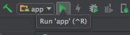
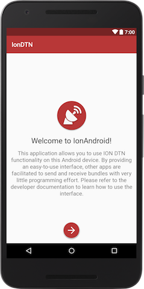
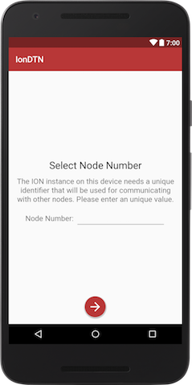
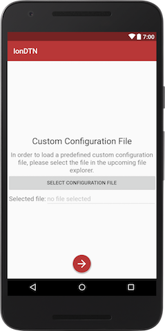
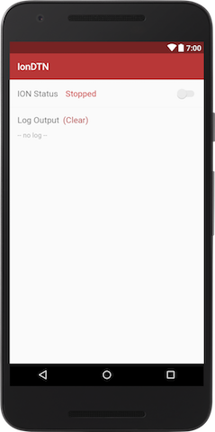
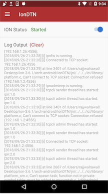
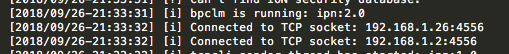
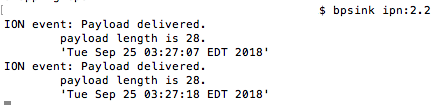
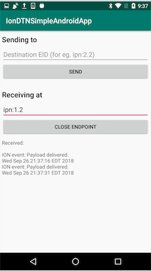

# IonDTNAndroidStarter
A starting point for user to get started with android development using IonDTN (A DTN provider application for Android)


## Requirements
- Linux-based machine
- Download and Install Interplanetary Overlay Network (ION) software distribution pre-installed in the development machine. Download the following files from [ion-dtn].
    - Download "ion-3.6.1.tar.gz" and extract contents to *<path>*
    - Download "ion-android-3.6.1.tar.gz" and extract the contents of folder "ion-android-3.6.1" to *<path>/ion-3.6.1/arch-android*
- go to *<path>* and run *./configure*. If you are on macOS you will need to make some changes by running following commands:
    - 	sudo sysctl -w kern.sysv.shmmax=10485760
    - 	sudo sysctl -w kern.sysv.shmseg=32
    - 	sudo sysctl -w kern.sysv.shmall=32768 
    - 	sudo sysctl -w net.inet.udp.maxdgram=32000
- Finally, run *sudo make install* to install the packages.
- Download and install [Android Studio].
- Download and unzip the working, older version of [NDK]. Android NDK, Revision 17c (June 2018) has been working fine. Find your own local Android SDK location; you can check the location of the SDK directory itself via

*Android Studio -> Preferences... -> Appearance & Behavior -> System Settings -> Android SDK -> Android SDK Location* field near the top of the panel.

Go to that location and there will be a folder called "ndk-bundle". Replace the contents of this folder with the extracted content of the older version of NDK which you just downloaded.


## Steps to deploy the application

### IonDTN Installation

- Open the IonDTN project located in arch_android directory of the ION-DTN archive in Android Studio. Due to Android Studio's feature detection, it will ask you for permission to install all required SDKs and NDKs. Please install all these packages, connect your Android device and then proceed by pressing the Run 'app' icon in the toolbar:

Android Studio will build the app, install it on your device and open it.
You should be greeted by the following screen of the application setup:


### Edit configuration files
The following changes are required in [android_node.rc] and [pc_node.rc] respectively. Make the changes as instructed below and save android_node.rc in android device and pc_node.rc in your machine. 

Here, **<android_node_ip>** and **<pc_node_ip>** is the ip addresses of your android device and PC respectively.
```
    # FIXME the IP address has to be changed to your network structure
    a induct tcp <android_node_ip>:4556 tcpcli

    # FIXME the IP address has to be changed to your network structure
    a outduct tcp <android_node_ip>:4556 tcpclo

    # FIXME the IP address has to be changed to your network structure
    a outduct tcp <pc_node_ip>:4556 tcpclo

    s
    ## end bpadmin

    ## begin ipnadmin
    # FIXME the IP address has to be changed to your network structure
    a plan 1 tcp/<android_node_ip>:4556
    # FIXME the IP address has to be changed to your network structure
    a plan 2 tcp/<pc_node_ip>:4556
    ## end ipnadmin
```
```
    # FIXME the IP address has to be changed to your network structure
    a induct tcp <pc_node_ip>:4556 tcpcli

    # FIXME the IP address has to be changed to your network structure
    a outduct tcp <pc_node_ip>:4556 tcpclo

    # FIXME the IP address has to be changed to your network structure
    a outduct tcp <android_node_ip>:4556 tcpclo

    s
    ## end bpadmin

    ## begin ipnadmin
    # FIXME the IP address has to be changed to your network structure
    a plan 1 tcp/<android_node_ip>:4556
    # FIXME the IP address has to be changed to your network structure
    a plan 2 tcp/<pc_node_ip>:4556
```
### IonDTN setup
Now we have to configure the app and the underlying ION-DTN instance.

- First, we have to select a node number:

Just choose "1" in order to ensure compatibility with the configuration file used in all subsequent steps.

- After pressing the arrow button, you have to select one of the two setup options:


- For our project, please choose "Setup configuration based on file" and proceed by taping on the arrow button.

- Depending on the Android version of your device and your security settings, you might be asked to give IonDTN the permission to access the devices external memory (which is the the memory that is accessible by the user and all other applications). Grant the permission and tap the arrow button to proceed.


- In the upcoming dialog you have to select an appropriate configuration file. For the purpose of our project, select the modified android_node.rc.

- If the setup succeeded (i.e. the configuration file was consistent), you will see the following screen:


IonDTN Setup is now complete. Click on the button to leave setup and you will be redirected to the main status screen of the application.



### Forming the test topology
The topology for our test is as follows:


To form the test topology as described above:
- Run the IonDTN provider application using modified android_node.rc
- Run an Ion instance on the machine using the modified pc_node.rc. Run this command:

    ```ionstart -I <path to the modified pc_node.rc>```


> **Look for the log message like below in log output of IonDTN provider application and ion.log file at the path where you started Ion instance in machine. Only this will ensure that toplogy has been successfully constructed.**
   - IonDTN provider application log:

   

   - Ion instance ion.log:

   

> In this context 192.168.1.2 is machine ip and 192.168.1.26 is the ip of the android device.

### Testing the application
> **Please make sure to start the IonDTN before continuing in order to use it with IonDTNSimpleAndroidApp.**
> **Coming to this section means you have succesfully deployed the testing topology.**

#### Sending bundles from node 1 to node 2:
- Open the **IonDTNSimpleAndroidApp** located at source directory using Android Studio. If it asks you for permission to install all required SDKs and NDKs, please install those packages. Run the app in your android device.
- Run ```bpsink ipn:2.2``` on the terminal. Your PC (node 2) will begin listening on the sink-EID with the endpoint_number 2 on service_number 2.
- In the running application, in the section Sending to, type in ```ipn:2.2``` as you did in terminal. Press send. You should be able to see the timestamp of android device (node 1) on the terminal like this:



> Note: You have an option to use ```ipn:2.1``` or ```ipn:2.2``` as a sink-EID but it needs to be same on both PC and android device for sucessfull data transmission.


#### Sending bundles from node 2 to node 1:
- Go to the running application, in the section Receiving at, type in ```ipn:1.2```. Your PC (node 1) will begin listening on the sink-EID with the endpoint_number 1 on service_number 2.

- Open another terminal and run ```echo `date` | bpsource ipn:1.2```. You should be able to see the timestamp of PC (node 2) on the terminal like this:



> Note: You have an option to use ```ipn:1.1``` or ```ipn:1.2``` as a sink-EID but it needs to be same on both PC and android device for sucessfull data transmission.
    
## Congratulations IonDTNSimpleAndroidApp is complete!


[Android Studio]: https://developer.android.com/studio/
[NDK]: https://developer.android.com/ndk/downloads/older_releases
[ion-dtn]: https://sourceforge.net/projects/ion-dtn/files/
[android_node.rc]: ./resources/code/android_node.rc
[pc_node.rc]: ./resources/code/pc_node.rc
