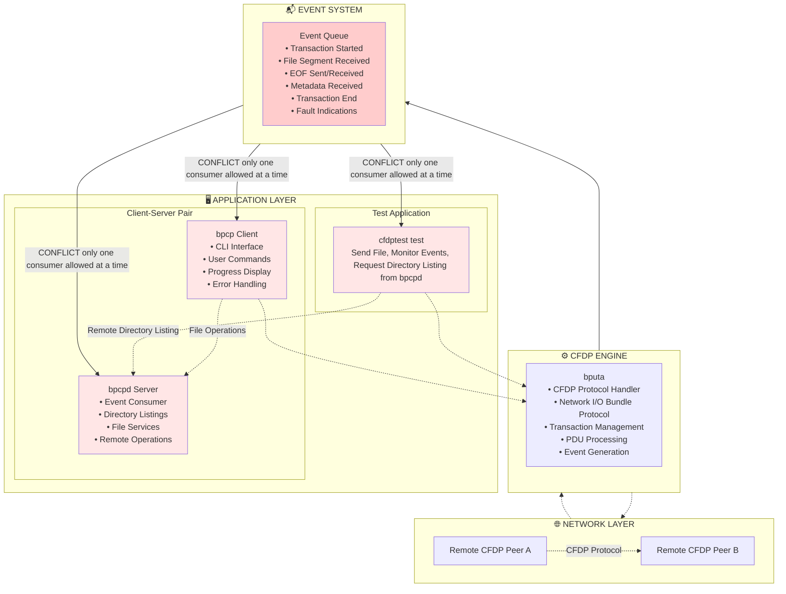
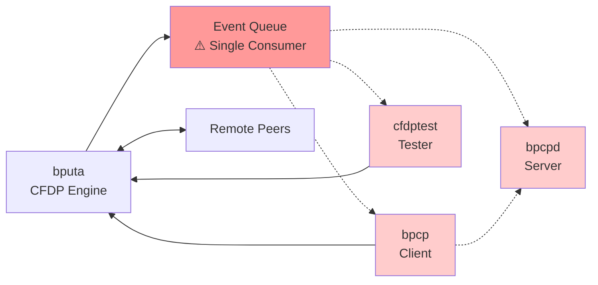
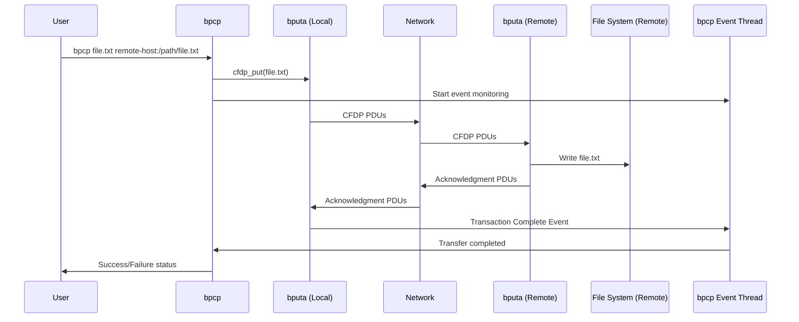
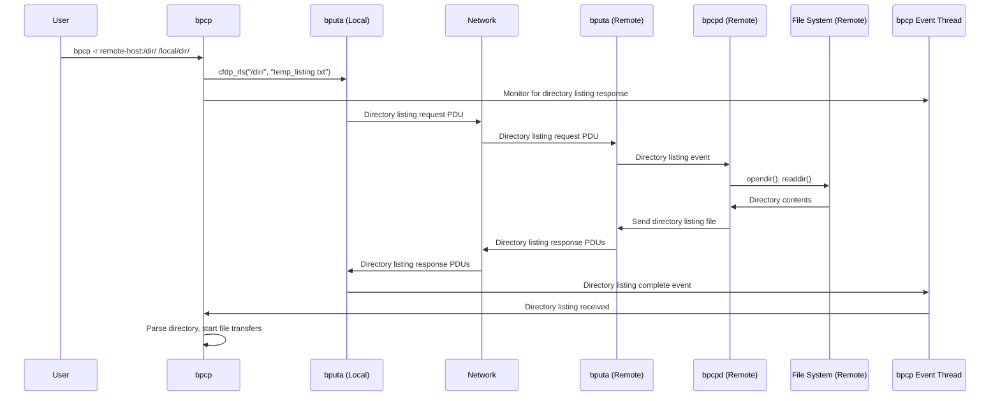
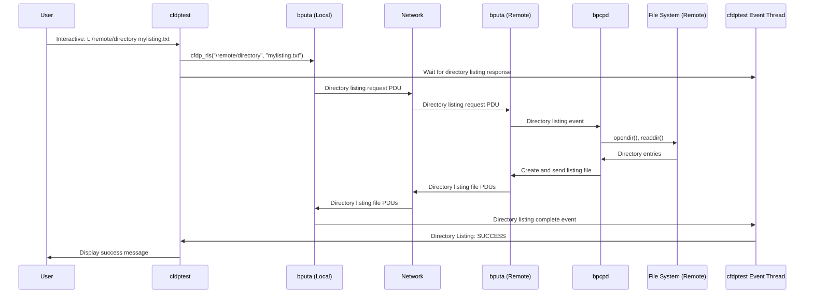

# ION CFDP SW Architecture & Event Definitions

## SW Architecture

### Basic Components

ION implement CFDP's core network engine in `bputa`, which handles all CFDP protocol processing, PDU handling, transaction state management, and network I/O. This engine is designed to be efficient and responsive to incoming CFDP traffic.

`bputa` has two threads, one receives network packets quickly and queues them for processing, while the other processes these packets and manages transaction state. This design ensures that incoming PDUs are handled promptly without blocking.

The CFDP engine generates events for significant occurrences, such as transaction starts, file segment receptions, EOFs, metadata receptions, transaction completions, and fault indications. These events are placed in a global event queue.

The event queue is designed to have only one consumer at a time to prevent conflicts. Applications like `bpcp`, `bpcpd`, and `cfdptest` (CFDP test utility) can all events from this queue so they must not run simultaneously on a host to avoid conflicts.

Currently, `bpcp` and `bpcpd` operate in a client-server model, where `bpcp` initiates file transfers and get remote directory listing through `bpcpd`.

### Consideration for Implementing CFDP Applications

For most typical CFDP file transfer, file store, and transaction control operations, `bpcp` and `cfdptest` are sufficient.

For a number of more complex operations, such as recursive file copying and remote directory listing, the `bpcpd` daemon is introduced as a prototype to demonstrate how to separately handle user requests that may either slow down CFDP engine performance or are extensions that require a more complex series of steps to complete.

For example, the core CFDP engine `bputa` is designed not to handle incoming remote directory listing requests. Although such capability exists as part of CFDP directory operation API, the `bputa` engine does not process request directly. Instead, it reports the event to applications such as the `bpcpd` service daemon to handle separately.

Another example is recursive copying, which requires listing the files in a directory and invoke file transfer for each file. This is best carried out in a service daemon, as demonstrated by `bpcpd`.

The user should be aware of the limitation of the event queue only supporting a single consumer as they design their own CFDP applications. If their requirements are complex and involve many simultaneous requests and services to be handled, it is best to implement a unified service daemon that consumes the event queue and controls the processing of user requests to the core CFDP engine. If their operation is very simple and controlled, then direct interaction with the CFDP engine is sufficient.

### High-level Diagrams

Here is a high-level architecture diagram of the CFDP software components and their interactions:




### COMPONENT RELATIONSHIPS



### INTERACTION PATTERNS

#### Normal File Copy:


Bpcp Directory Listing:


Cfdptest Remote Directory Listing (similar to BPCP case):



## CFDP Event Types

- **0**: CfdpNoEvent (internal interrupt, not relevant to user)
- **1**: CfdpTransactionInd (transaction started)
- **2**: CfdpEofSentInd (EOF sent)
- **3**: CfdpTransactionFinishedInd (transaction finished)
- **4**: CfdpMetadataRecvInd (metadata received)
- **5**: CfdpFileSegmentRecvInd (file data segment received)
- **6**: CfdpEofRecvInd (EOF received)
- **7**: CfdpSuspendedInd (suspended)
- **8**: CfdpResumedInd (resumed)
- **9**: CfdpReportInd (transaction report)
- **10**: CfdpFaultInd (fault)
- **11**: CfdpAbandonedInd (abandoned)

---

The following is a list (non-exhaustive) of CFDP events and state information available through the `cfdptest` test utility or using `cfdp_get_event()` API.

## Field Meanings by Event Type

### **Event 1: CfdpTransactionInd (Transaction Started)**
**Occurs:** When sender initiates a file transfer

| Field | Typical Values | Meaning |
|-------|----------------|---------|
| **Condition** | `0` (CfdpNoError) | Transaction setup successful |
| **Progress** | `0` bytes | No data sent yet |

---

### **Event 2: CfdpEofSentInd (EOF Sent)**
**Occurs:** When sender finishes transmitting all file data

| Field | Typical Values | Meaning |
|-------|----------------|---------|
| **Condition** | `0` (CfdpNoError) | File data transmission completed successfully |
| **Progress** | File size | All file data has been transmitted (at least once) |

**Key Insight:** This event means "I sent everything" but doesn't guarantee receiver got it.

---

### **Event 3: CfdpTransactionFinishedInd (Transaction Finished)**
**Occurs:** When transaction completes (most important event for diagnostics)

#### **Closure-Requested Mode (closureLatency > 0):**

When closure latency is non-zero, the sender waits for a Finished PDU from the receiver. The transaction completes when the Finished PDU is received within the closure latency period, or when the closure latency timeout occurs.

| Condition | DeliveryCode | FileStatus | Meaning |
|-----------|--------------|------------|---------|
| **0** (NoError) | **0** (Complete) | **2** (Retained) | **SUCCESS** - Finish PDU received (sender), file delivered/received and saved (receiver) |
| **0** (NoError) | **0** (Complete) | **0** (Discarded) | File delivered (sender) but receiver discarded it (checksum/policy issue) |
| **0** (NoError) | **1** (Incomplete) | **3** (Unreported) | Finish PDU received (sender) but receiver reports problems |
| **10** (CheckLimitReached) | **1** (Incomplete) | **3** (Unreported) | **TIMEOUT** - Finish PDU never received (sender) |
| **5** (ChecksumFailure) | **1** (Incomplete) | **0** (Discarded) | Receiver detected file corruption (receiver) |
| **15** (CancelRequested) | **1** (Incomplete) | **3** (Unreported) | User cancelled transaction (sender/receiver) |

#### **Unacknowledged Mode (closureLatency = 0):**

When closure latency is zero, the sender does not wait for acknowledgment. The transaction completes immediately after EOF is sent.

| Condition | DeliveryCode | FileStatus | Meaning |
|-----------|--------------|------------|---------|
| **0** (NoError) | **1** (Incomplete) | **3** (Unreported) | **NORMAL (sender side)** - File sent successfully, no confirmation expected at sender side |
| **0** (NoError) | **0** (Complete) | **2** (Retained) | **SUCCESS (receiver side)** - File sent successfully, file saved |
| **15** (CancelRequested) | **1** (Incomplete) | **3** (Unreported) | ❌ User cancelled transaction |

**Key Insight:** Only `condition=0` + `deliveryCode=0` + `fileStatus=2` means guaranteed success!

**Terminology Note:** Both modes operate within CFDP Class 1 (Unacknowledged) service class per the CFDP Blue Book. The "closure-requested" terminology refers to ION's optional closure latency feature that adds acknowledgment behavior within the unacknowledged service class. This should not be confused with CFDP Class 2 (Acknowledged) service, which ION does not implement.

---

### **Event 4: CfdpMetadataRecvInd (Metadata Received)**
**Occurs:** When receiver gets file transfer metadata (receiver side)

| Field | Typical Values | Meaning |
|-------|----------------|---------|
| **Condition** | `0` (CfdpNoError) | Metadata processed successfully |
| **Progress** | `0` bytes | No file data received yet |

---

### **Event 5: CfdpFileSegmentRecvInd (File Data Received)**
**Occurs:** Periodically as receiver gets file data chunks

| Field | Typical Values | Meaning |
|-------|----------------|---------|
| **Condition** | `0` (CfdpNoError) | Data segment received and processed |
| **Progress** | Increasing | Bytes received so far |

---

### **Event 6: CfdpEofRecvInd (EOF Received)**
**Occurs:** When receiver gets EOF PDU (receiver side)

| Field | Possible Values | Meaning |
|-------|----------------|---------|
| **Condition** | `0` (CfdpNoError) | EOF received, checking file completeness |
| **Condition** | `5` (ChecksumFailure) | File corruption detected |
| **Condition** | `9` (InvalidFileStructure) | File structure problems |
| **Progress** | Expected file size | Total bytes that should have been received |

---

### **Event 7: CfdpSuspendedInd (Suspended)**
**Occurs:** When transaction is paused

| Field | Typical Values | Meaning |
|-------|----------------|---------|
| **Condition** | `14` (SuspendRequested) | User/system requested suspension |
| **DeliveryCode** | `1` (Incomplete) | Transfer paused |
| **FileStatus** | `3` (Unreported) | Transfer incomplete |
| **Progress** | Current bytes | Progress when suspended |

---

### **Event 8: CfdpResumedInd (Resumed)**
**Occurs:** When suspended transaction restarts

| Field | Typical Values | Meaning |
|-------|----------------|---------|
| **Condition** | `0` (CfdpNoError) | Resume successful |
| **DeliveryCode** | `1` (Incomplete) | Transfer continuing |
| **FileStatus** | `3` (Unreported) | Transfer still in progress |
| **Progress** | Resume point | Bytes completed when resumed |

---

### **Event 9: CfdpReportInd (Transaction Report)**
**Occurs:** When user requests transaction status

| Field | Meaning |
|-------|---------|
| **Condition** | Current transaction condition |
| **Progress** | Current progress |

**Key Insight:** This is a snapshot of current transaction state, not an event-triggered change.

---

### **Event 10: CfdpFaultInd (Fault)**
**Occurs:** When recoverable errors occur

| Condition | Meaning |
|-----------|---------|
| **1** (AckLimitReached) | Too many retransmissions |
| **4** (FilestoreRejection) | Receiver rejected file operation |
| **5** (ChecksumFailure) | Data corruption detected |
| **6** (FileSizeError) | File size mismatch |
| **8** (InactivityDetected) | No progress for too long |

**DeliveryCode/FileStatus:** Reflect current state when fault occurred.

---

### **Event 11: CfdpAbandonedInd (Abandoned)**
**Occurs:** When transaction cannot recover from faults

| Field | Typical Values | Meaning |
|-------|----------------|---------|
| **Condition** | Various fault codes | The fault that caused abandonment |
| **DeliveryCode** | `1` (Incomplete) | Transfer failed |
| **FileStatus** | `0` (Discarded) or `3` (Unreported) | File not delivered |
| **Progress** | Last known progress | How much was completed before failure |

---

## Condition Code Reference

| Code | Name | Meaning |
|------|------|---------|
| **0** | CfdpNoError | Success/Normal operation |
| **1** | CfdpAckLimitReached | Too many ACK retries |
| **2** | CfdpKeepaliveLimitReached | Keepalive timeout |
| **3** | CfdpInvalidTransmissionMode | Wrong CFDP mode |
| **4** | CfdpFilestoreRejection | File operation rejected |
| **5** | CfdpChecksumFailure | Data corruption |
| **6** | CfdpFileSizeError | File size mismatch |
| **7** | CfdpNakLimitReached | Too many NAKs |
| **8** | CfdpInactivityDetected | No activity timeout |
| **9** | CfdpInvalidFileStructure | Malformed file |
| **10** | CfdpCheckLimitReached | **Finish PDU timeout** |
| **11** | CfdpUnsupportedChecksumType | Unknown checksum |
| **14** | CfdpSuspendRequested | User suspension |
| **15** | CfdpCancelRequested | User cancellation |

## DeliveryCode Reference

| Code | Name | Meaning |
|------|------|---------|
| **0** | CfdpDataComplete | All data successfully delivered |
| **1** | CfdpDataIncomplete | Data missing/incomplete/in-progress |

## FileStatus Reference

| Code | Name | Meaning |
|------|------|---------|
| **0** | CfdpFileDiscarded | File was discarded (error/policy) |
| **1** | CfdpFileRejected | File delivery was rejected |
| **2** | CfdpFileRetained | File successfully stored |
| **3** | CfdpFileStatusUnreported | Status unknown/not available |

---

## Finished (FIN) PDU Behavior in Closure-Requested Mode

### When FIN Messages Are Sent

In closure-requested mode (when `closureLatency > 0`), the receiver sends a **Finished (FIN) PDU** back to the sender when the file transfer reaches completion. The FIN message is sent when the transaction reaches the `completeInFdu()` function AND the `closureRequested` flag is true.

**Required Conditions for Normal (Success) FIN:**
1. **Metadata received** - The Metadata PDU has been received from the sender
2. **EOF received** - The EOF (End-of-File) PDU has been received
3. **All file data received** - `bytesReceived >= fileSize` (no missing data segments)
4. **Checksum verification passes** - The computed checksum matches the EOF checksum (or NullChecksum is used)

**Code Reference:** `cfdp/library/libcfdpP.c:2878-2885`

### FIN Sent With Error Conditions

The FIN PDU is sent **even when errors occur**, as long as the transaction reaches the completion phase. The FIN PDU includes the error condition code to inform the sender of the outcome.

**Error Conditions That Trigger FIN (when fault handler = `CfdpCancel`):**

| Condition Code | Condition Name | When It Occurs | Code Reference |
|---------------|----------------|----------------|----------------|
| **5** | `CfdpChecksumFailure` | Checksum verification fails | libcfdpP.c:3899 |
| **4** | `CfdpFilestoreRejection` | Filestore operations fail | libcfdpP.c:3955 |
| **6** | `CfdpFileSizeError` | Received data exceeds declared file size | libcfdpP.c:4114, 4939 |
| **11** | `CfdpUnsupportedChecksumType` | Checksum type not supported | libcfdpP.c:5034 |
| **3** | `CfdpInvalidTransmissionMode` | Transmission mode mismatch | libcfdpP.c:5372 |
| **9** | `CfdpInvalidFileStructure` | File structure invalid | libcfdp.c:1381 |
| **15** | `CfdpCancelRequested` | User cancellation | libcfdp.c:1693 |

### FIN PDU Contents

The Finished PDU contains a status byte with the following fields:

```
Bits 7-4: Condition Code (error/success)
Bit 2:    Delivery Code (0=Complete, 1=Incomplete)
Bits 1-0: File Status (0=Discarded, 1=Rejected, 2=Retained, 3=Unreported)
```

**Code Reference:** `cfdp/library/libcfdpP.c:2518-2521`

### When FIN is NOT Sent

FIN will NOT be sent if the fault handler is configured as:

| Handler | Behavior | Result |
|---------|----------|--------|
| **`CfdpAbandon`** | Transaction abandoned | Sends `CfdpAbandonedInd` event instead, no FIN PDU |
| **`CfdpSuspend`** | Transaction suspended | Transaction paused, no completion |
| **`CfdpIgnore`** | Fault ignored | Transaction continues, FIN sent later if completes |

**Fault Handler Configuration:**
- Fault handlers can be set per-transaction or globally via `cfdpadmin`
- Default handlers are defined in the CFDP database
- The handler determines how each fault condition is processed

### Key Takeaway

The FIN message is sent **unconditionally** whenever:
- `completeInFdu()` is called
- `closureRequested` flag is true
- **Regardless of whether the condition represents success or error**

The error condition code is embedded in the FIN PDU to inform the sender of the actual outcome. This allows the sender to receive definitive notification about transaction completion, even in error cases.

---

# cfdptest Utility Enhancements

## Transaction Tracking and Summary Display

The `cfdptest` utility provides enhanced transaction tracking with detailed event history and outcome determination.

### New Commands

- **`v`** - Toggle verbose mode. When enabled, automatically displays detailed transaction summary upon completion.

- **`s [transactionId]`** - Show transaction summary
  - Without arguments: displays summary table of all tracked transactions
  - With transaction ID (e.g., `s 1.5`): displays detailed event history and status for specific transaction

- **`w`** - View active transactions from CFDP engine (replaces old `v` command)

### Transaction Summary Display

When verbose mode is enabled or when using `s <transactionId>`, cfdptest shows detailed transaction information including:

- Transaction ID, file names, start/end times, duration
- Mode: Closure-Requested or Unacknowledged
- Complete event history with timestamps
- Final outcome: SUCCESS, TIMEOUT, CHECKSUM FAILURE, CANCELLED, etc.

**Example:**
```
=== TRANSACTION SUMMARY ===
Transaction: 1.5
File: testfile.txt -> /remote/path/testfile.txt
Start Time: 2025-10-27 14:23:40
End Time: 2025-10-27 14:23:45
Duration: 00:00:05
Mode: Closure-Requested
File Size: 1024 bytes

Event History:
  2025-10-27 14:23:40 - Event 1: Transaction started (0 bytes)
  2025-10-27 14:23:41 - Event 2: EOF sent (1024 bytes)
  2025-10-27 14:23:45 - Event 3: Transaction finished (1024 bytes)

Final Status:
  Condition: NoError (0)
  Delivery: Complete (0)
  File Status: Retained (2)
  OUTCOME: SUCCESS
===========================
```

### All Transactions Summary Table

The `s` command without arguments displays a summary table of all tracked transactions:

```
=== ALL TRANSACTIONS SUMMARY ===
Current Time: 2025-10-28 08:48:43

Completed Transactions (1):
Transaction          Mode      File                      Completed    Duration     Outcome
----------------------------------------------------------------------------------------
1.1                  ClosReq   testfile.txt              08:46:21     00:00:05     SUCCESS

Summary Statistics:
  Total Transactions: 1
  Active: 0
  Successful: 1
  Failed: 0
  Total Bytes Transferred: 1024
  Average Duration: 00:00:05
================================
```

### Filestore Response Display

Filestore responses now show labeled action and status codes:
```
FilestoreResp action=1 status=0 'testfile20' '' ''
```

Where:
- **action**: Filestore action code (0=CreateFile, 1=DeleteFile, 2=RenameFile, etc.)
- **status**: Status code per CFDP Table 5-18 (0=Successful, 1-15=various errors)

### Transaction Tracking Features

- Tracks up to 100 simultaneous transactions
- Stores up to 50 events per transaction
- Uses full 16-byte Transaction ID for uniqueness (prevents collisions)
- Automatic cleanup of old completed transactions (>1 hour)
- Handles transaction number wraparound and entity reboots

### Command-Line Options

```bash
# Start cfdptest in verbose mode
cfdptest -v

# Or use environment variable
CFDP_EVENT_DETAIL=1 cfdptest

# Interactive mode (default)
cfdptest

# Scripted mode
cfdptest script.txt
```

### Terminology Update (2025-10-28)

Updated terminology throughout codebase and documentation to align with CFDP specification:

**OLD:** "Acknowledged mode" / "Unacknowledged mode"
**NEW:** "Closure-Requested mode" / "Unacknowledged mode"

The term "closure-requested" more accurately describes the behavior where the sender requests and waits for closure confirmation (Finished PDU) from the receiver via the closure latency parameter. This avoids confusion with CFDP Class 2 (Acknowledged) service, which ION does not implement.
