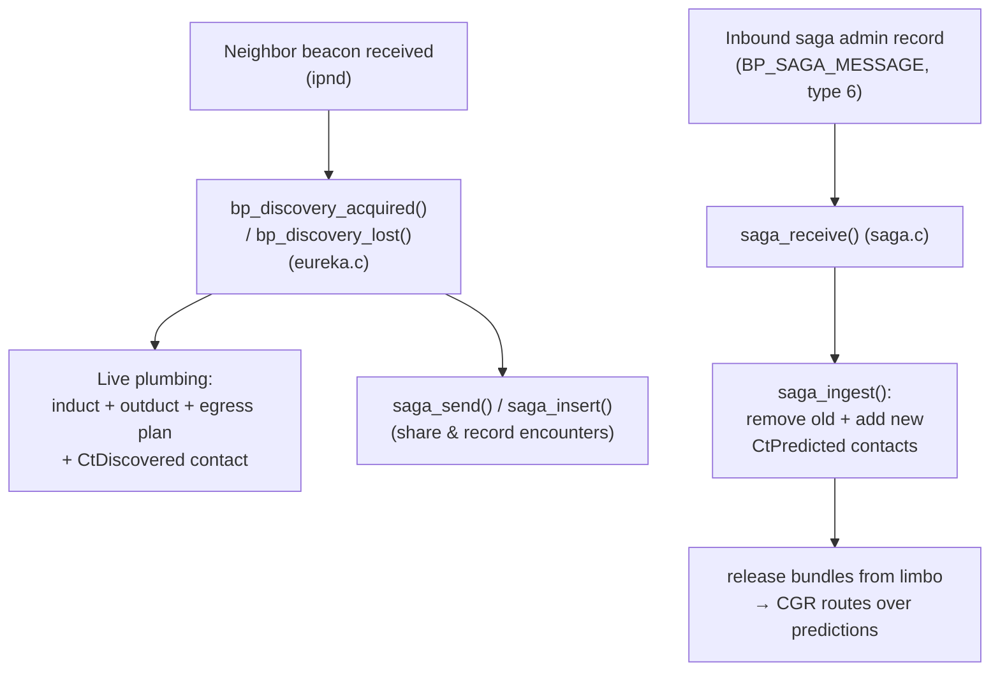

# Contact Discovery with `ipnd` (Opportunistic Ducts, Contacts, and Prediction)

## Overview

Most ION deployments use a **static contact plan**: the operator declares, ahead
of time, which nodes will be in contact and when (`ionadmin` contacts/ranges) and
which convergence-layer (CL) ducts and egress plans carry traffic to each
neighbor (`bpadmin` inducts/outducts/plans). This works for scheduled links
(e.g. deep-space passes with predictable geometry).

For **opportunistic** networks — mobile assets, ad-hoc IP links, nodes that meet
unpredictably — ION can instead *discover* neighbors at run time and wire up the
plumbing automatically. Three pieces cooperate:

| Component | Role | Source |
|---|---|---|
| **`ipnd`** | IP Neighbor Discovery daemon. Sends/receives beacons; reports neighbors appearing and disappearing. | `bpv7/ipnd/` (man page `ipnd`) |
| **eureka** | The "live contact" layer. On a discovery event, creates/destroys the **induct, outduct, egress plan, and a discovered contact**. | `bpv7/library/eureka.c` |
| **saga** | The "history → prediction" layer. Records **encounters** and regenerates **predicted contacts** from that history. | `bpv7/saga/` |

The chain is:

!!! note "Does `ipnd` use the eureka/saga APIs?"
    Yes. `ipnd` is the *only* stock driver of the eureka discovery API: when it
    processes a neighbor's beacon it calls `bp_discover_contact(...)` →
    `bp_discovery_acquired()` / `bp_discovery_lost()` in `eureka.c`, which in turn
    drive saga. (There is no `dnac` component in ION.)

---

## Specification basis and status

ION's `ipnd` implements the IETF/IRTF **"DTN IP Neighbor Discovery (IPND)"**
Internet-Draft (`draft-irtf-dtnrg-ipnd`, November 2012 revision; the source cites
it directly in `bpv7/ipnd/helper.c`). It emits beacon **version 4** and accepts
versions 2 and 4, using the draft's service-block TLV data types.

!!! warning "IPND is experimental — it never became an RFC"
    The IPND draft was an IRTF DTN Research Group work item that **expired without
    ever being published as an RFC** (unlike Bundle Protocol v7 itself, which is
    RFC 9171, or BPSec, RFC 9172). Treat ION's `ipnd` as an **experimental /
    reference implementation** of an unratified protocol, not a standards-track,
    actively-maintained one. Do not assume interoperability with other IPND
    implementations, and pin critical links with static configuration.

**Where the lasting value is.** The important, reusable part of this subsystem is
*not* the beacon wire format — it is the pair of **neighbor-discovery
contact-management APIs** that `ipnd` exercises:

- **eureka** — `bp_discovery_acquired()` / `bp_discovery_lost()`: given only a
  neighbor's EID, CL protocol, and socket, ION creates or tears down the induct,
  outduct, egress plan, and discovered contact automatically.
- **saga** — encounter history and predicted-contact generation
  (`saga_insert` / `saga_receive` / `saga_ingest`).

`ipnd` is just *one* front-end that decides *when* a neighbor is up or down. Any
other source of that signal — a different discovery protocol, a radio's
link-state indication, an SDN/orbit-propagator controller, a GPS-triggered
rendezvous, or your own daemon — can drive the **same** eureka/saga APIs and get
identical automatic duct/plan/contact management. Read this document as much for
those APIs as for `ipnd` itself: if you are building opportunistic-contact
support on ION, that is the integration surface to target.

!!! tip "Worked example / template"
    The ION source tree includes a small, customizable example of exactly this:
    **`demos/l2-neighbor-discovery/`** (`l2discd`) discovers neighbors over raw
    Ethernet/Wi-Fi broadcast frames — a deliberately simple custom format, *not*
    IPND — and drives the same `bp_discovery_acquired()` / `bp_discovery_lost()`
    calls to create ducts/plans/contacts for the TCP and UDP CLs. It is meant to
    be forked as a starting point for your own discovery mechanism; see its
    `README.md` and `run-demo.sh`.

---

## The two layers

### eureka — live ducts, plans, and *discovered* contacts

`eureka.c` reacts to a neighbor appearing or disappearing **right now**. It
manipulates the running BP database exactly as an operator would with `bpadmin`,
but programmatically and only in volatile state (see
[Persistence](#persistence-and-scope) below).

### saga — encounter history and *predicted* contacts

`saga.c` maintains a **saga**: "the history of all discovered contacts between
nodes within some region over the past N days" (default 30). From that history it
computes **predicted contacts** — opportunistic contacts CGR can route over even
though nobody scheduled them. Prediction runs with a *confidence* value derived
from how regularly a given node-pair has met.

Two contact *types* are involved (see `rfx`/`ionadmin`):

- **`CtDiscovered`** — a real, live contact created by eureka the moment a
  neighbor is discovered (and removed when it is lost).
- **`CtPredicted`** — an inferred future contact created by saga from accumulated
  history.

---

## What happens when a neighbor is **discovered**

`ipnd` → `bp_discovery_acquired()` → `discoveryAcquired()` in `eureka.c`.

### Precedence: managed configuration always wins

Before creating anything, eureka checks whether you already manage this neighbor,
and **backs off** if so. You will see one of these notices in `ion.log`:

- `[?] Not a new discovery` — already discovered.
- `[?] Neighbor is managed; no discovery` — you defined an egress plan for this
  EID in `.bprc`.
- `[?] Outduct is managed; no discovery` — you defined this outduct in `.bprc`.

!!! tip "Static config and discovery coexist"
    Discovery only fills in neighbors you have **not** configured yourself. Any
    plan or outduct you declare statically takes precedence, so you can pin
    critical links and let discovery handle the rest.

### The plumbing eureka builds

For a genuinely new neighbor it performs the following, per CL protocol:

| Created | eureka call | Equivalent `bpadmin` command | Scope |
|---|---|---|---|
| CL protocol (if absent) | `addProtocol` | `a protocol <name> ...` | once per protocol |
| **Induct** | `addInduct("0.0.0.0:<port>", <cli>)` + `bpStartInduct` | `a induct <proto> 0.0.0.0:<port> <cli>` | **one, shared, per protocol** |
| Discovered contact *(ipn EIDs only)* | `noteContactAcquired()` → `rfx_insert_contact(... CtDiscovered ...)` | `a contact ... ` (discovered) | per neighbor |
| **Outduct** | `addOutduct(<proto>, <ip:port>, <clo>, maxPayload)` + `bpStartOutduct` | `a outduct <proto> <ip:port> <clo>` | **one per neighbor** |
| **Egress plan** | `addPlan(<eid>, rate)` + `attachPlanDuct(<eid>, <outduct>)` + `bpStartPlan` | `a plan <eid>` + `a planduct <eid> <proto> <ip:port>` | per neighbor |
| Discovery record | `addDiscovery(<eid>)` | — | per neighbor |

Protocol defaults (from `discoveryAcquired()`):

| CL protocol | Induct daemon | Outduct daemon | Port | Max payload |
|---|---|---|---|---|
| `tcp` | `tcpcli` | *(none; tcpcli is bidirectional)* | BP TCP default (4556) | 0 (unlimited) |
| `udp` | `udpcli` | `udpclo` | BP UDP default | 65000 |

!!! important "The induct is shared; the outduct is per-neighbor"
    ION opens **one listening induct per CL protocol** (`0.0.0.0:<port>`), created
    on the first discovery that uses that protocol. It then opens **one outduct
    plus one egress plan per discovered neighbor**, pointing at that neighbor's
    `IP:port`. This is the single most common point of confusion: you will see
    exactly one `udpcli`/`tcpcli` induct no matter how many neighbors appear, but
    one `udpclo`/tcp outduct and one plan for each.

### The contact for CGR

For **ipn-scheme** neighbors, eureka also inserts a `CtDiscovered` contact
(`noteContactAcquired()`) so that Contact Graph Routing can consider the link,
regardless of the outduct protocol, and calls `saga_send()` to share the local
encounter history with the region (as a `BP_SAGA_MESSAGE` admin record). Non-ipn
(e.g. `dtn`-scheme) neighbors get the duct + plan but no CGR contact.

---

## What happens when a neighbor is **lost**

`ipnd` → `bp_discovery_lost()` → `discoveryLost()` in `eureka.c`, which reverses
the setup:

1. `bpStopPlan(<eid>)` then `removePlan(<eid>)` — removing the plan automatically
   detaches its ducts.
2. `bpStopOutduct(...)` then `removeOutduct(...)`.
3. For ipn EIDs, `noteContactLost()` — this is where the completed **encounter**
   is written into the saga via `saga_insert(startOfContact, now, ...)`, and the
   `CtDiscovered` contact is removed.
4. `deleteDiscovery(<eid>)`.

The shared listening induct is **not** torn down on neighbor loss; it persists
for the life of the daemon.

---

## How predicted (opportunistic) contacts get added/removed

This is the saga half, and its trigger is easy to miss:

- **Encounters are recorded** in two ways: locally, when your node loses a
  discovered neighbor (`noteContactLost()` → `saga_insert()`), and remotely, when
  a peer's saga message arrives (`saga_receive()` → `saga_insert()` per
  encounter).
- **Predicted contacts are (re)generated** only inside `saga_ingest()`, whose
  **sole caller is `saga_receive()`**. `saga_ingest()`:
    1. `removePredictedContacts()` — deletes every `CtPredicted` contact in the
       region (`rfx_remove_contact`).
    2. `predictContacts()` — recomputes them from the accumulated history and
       inserts each as a `CtPredicted` contact with a confidence value
       (`rfx_insert_contact`).
    3. releases bundles from **limbo** so CGR can immediately route over the new
       predictions.

!!! note "Prediction updates on *received* saga messages"
    A node's own locally-recorded encounters do not, by themselves, regenerate its
    predicted contacts — regeneration fires on the inbound `saga_receive()` path.
    Predictions therefore update as saga messages circulate among region members.

---

## Persistence and scope

- Everything eureka/saga create at run time lives in the **volatile** BP/ION
  database only. It is **not** written back to your `.bprc`/`.ionrc` files.
- Discovered ducts, plans, and contacts exist only while the relationship (and
  `ipnd`) is active; predicted contacts exist until the next `saga_ingest()`
  recomputes them or they age out of the history window.
- Discovered/predicted state is per **region**; a node only processes saga
  messages for regions of which it is a member.

---

## Enabling it

1. Configure and run the `ipnd` daemon (beacon interval, listening address, and
   advertised CL services). See the **`ipnd`** man page for the configuration-file
   syntax.
2. Do **not** statically configure plans/outducts for the neighbors you want
   discovered — leave them unmanaged so eureka can create them (managed entries
   are skipped by design).
3. Ensure the CL protocol you advertise (`tcp`/`udp`) matches what `ipnd`
   beacons, and that firewalls allow the listening induct port.
4. For CGR over discovered/predicted contacts, use **ipn-scheme** EIDs (only
   ipn-scheme discoveries create contacts).

## Troubleshooting

| Symptom | Likely cause |
|---|---|
| Neighbor discovered but no outduct/plan created | The EID/outduct is statically **managed** — look for `... is managed; no discovery` in `ion.log`. |
| Only one induct despite many neighbors | Expected: the induct is **shared per protocol**; outducts/plans are per neighbor. |
| No predicted contacts appear | Prediction runs on **received** saga messages (`saga_receive` → `saga_ingest`); confirm saga admin records are flowing and the node is a member of the region. |
| Discovered neighbor not routable via CGR | Non-ipn scheme — only ipn-scheme discoveries insert a `CtDiscovered` contact. |

## See also

- `ipnd` man page — daemon configuration and beacon format.
- **`demos/l2-neighbor-discovery/`** (in the ION source tree) — `l2discd`, a
  standalone, customizable example that drives the eureka discovery API from
  Layer-2 (Ethernet/Wi-Fi) beacons instead of `ipnd`; includes a two-node demo.
- [Contact Graph Events and LTP](Contact-Graph-Events-and-LTP.md) — how contacts
  drive routing and rate management.
- [Bundle Forwarding Disposition (Prospect/Limbo/Abandon)](topics/bundle-forwarding-disposition.md)
  — what "limbo" means and why saga releases bundles from it.
