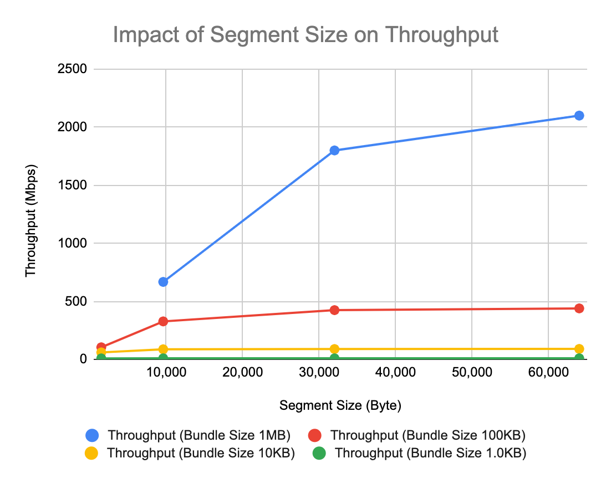

# ION Deployment Guide

**Version 4.1.3**

_Jay Gao, Jet Propulsion Laboratory, California Institute of
Technology_

_Sky DeBaun, Jet Propulsion Laboratory, California Institute of
Technology_

**Document Change Log**

| Ver No. | Date      | Description                      | Note                    |
| ------- | --------- | -------------------------------- | ----------------------- |
| V4.1.3  | 11/6/2023 | Add LTP Performance Test         | Converted to markd down |
| V4.1.2  | 1/5/2023  | Added notes on SDR file and CGRM |                         |

## Overview

The effort required to deploy the Interplanetary Overlay Network (ION)
software in an operational setting may vary widely depending on the
scope of the deployment and the degree to which the required ION
functionality coincides with the capability provided by default in the
software as distributed. This effort will be expended in two general
phases: initial ***infusion*** and ongoing ***operation***.

## Infusion

Even in the best case, some minimal degree of configuration will be
required. Many elements of ION behavior are managed at run time by
decisions recorded in ION's protocol state databases, as populated by a
variety of administration utility programs. Others are managed at
compile time by means of compiler command-line switches selected when
the software is built. These compile-time configuration options are
described in the ***Configuration*** section below.

In some cases, mission-specific behavior that goes beyond the options
built into ION must be enabled during ION deployment. The intent of the
ION design is to minimize -- to eliminate, if possible -- any need to
modify ION source code in order to enable mission-specific behavior. Two
general strategies are adopted for this purpose.

First, ION includes a number of conditionally defined functions that can
be cleanly replaced with mission-specific alternative source code by
setting a compiler command-line switch at build time. Setting such a
switch causes the mission-specific source code, written in C, to be
simply included within the standard ION source code at the time of
compilation.

Second, more generally it is always possible to add new application
executables, new startup/shutdown/monitor/control utilities or scripts,
and even entirely new route computation systems, BP convergence-layer
adapters, and/or LTP link service adapters without ever altering the
distributed ION source code. A few rough guidelines for making these
kinds of modifications are described in the ***Adaptation*** section
below.

Finally, in rare cases it may be necessary to execute ION in an
operating-system environment to which it has not yet been ported.
Guidance for porting ION to new platforms will be provided in a future
edition of this Deployment Guide.

## Operation

On an ongoing basis, an ION deployment may require reconfiguration from
time to time and/or may require troubleshooting to resolve performance
or stability problems. Some suggestions for reconfiguration and
troubleshooting procedures are offered in the ***Operation*** section
below.

## Configuration

### Configuring the "ici" module

Declaring values for the following variables, by setting parameters that
are provided to the C compiler (for example, --DFSWSOURCE or
--DSM_SEMBASEKEY=0xff13), will alter the functionality of ION as noted
below.

`PRIVATE_SYMTAB`

This option causes ION to be built for VxWorks 5.4 or RTEMS with
reliance on a small private local symbol table that is accessed by means
of a function named sm_FindFunction. Both the table and the function
definition are, by default, provided by the symtab.c source file, which
is automatically included within the platform_sm.c source when this
option is set. The table provides the address of the top-level function
to be executed when a task for the indicated symbol (name) is to be
spawned, together with the priority at which that task is to execute and
the amount of stack space to be allocated to that task.

PRIVATE_SYMTAB is defined by default for RTEMS but not for VxWorks 5.4.

Absent this option, ION on VxWorks 5.4 must successfully execute the
VxWorks symFindByName function in order to spawn a new task. For this
purpose the entire VxWorks symbol table for the compiled image must be
included in the image, and task priority and stack space allocation must
be explicitly specified when tasks are spawned.

`FSWLOGGER`

This option causes the standard ION logging function, which simply
writes all ION status messages to a file named ion.log in the current
working directory, to be replaced (by #include) with code in the source
file fswlogger.c. A file of this name must be in the inclusion path for
the compiler, as defined by --Ixxxx compiler option parameters.

`FSWCLOCK`

This option causes the invocation of the standard time function within
getUTCTime (in ion.c) to be replaced (by #include) with code in the
source file fswutc.c, which might for example invoke a mission-specific
function to read a value from the spacecraft clock. A file of this name
must be in the inclusion path for the compiler.

`FSWWDNAME`

This option causes the invocation of the standard getcwd function within
cfdpInit (in libcfdpP.c) to be replaced (by #include) with code in the
source file wdname.c, which must in some way cause the mission-specific
value of current working directory name to be copied into
cfdpdbBuf.workingDirectoryName. A file of this name must be in the
inclusion path for the compiler.

`FSWSYMTAB`

If the PRIVATE_SYMTAB option is also set, then the FSWSYMTAB option
causes the code in source file mysymtab.c to be included in
platform_sm.c in place of the default symbol table access implementation
in symtab.c. A file named mysymtab.c must be in the inclusion path for
the compiler.

`FSWSOURCE`

This option simply causes FSWLOGGER, FSWCLOCK, FSWWDNAME, and FSWSYMTAB
all to be set.

`GDSLOGGER`

This option causes the standard ION logging function, which simply
writes all ION status messages to a file named ion.log in the current
working directory, to be replaced (by #include) with code in the source
file gdslogger.c. A file of this name must be in the inclusion path for
the compiler, as defined by --Ixxxx compiler option parameters.

`GDSSOURCE`

This option simply causes GDSLOGGER to be set.

`TRACKRFXEVENTS`

This option causes user-written code, in a file named rfxtracker.c, to
be executed every time the **rfxclock** daemon dispatches a schedule RFX
event such as the start or end of a transmission contact. A file of this
name must be in the inclusion path for the compiler, as defined by
--Ixxxx compiler option parameters.

`ION_OPS_ALLOC=*xx*`

This option specifies the percentage of the total non-volatile storage
space allocated to ION that is reserved for protocol operational state
information, i.e., is not available for the storage of bundles or LTP
segments. The default value is 40.

`ION_SDR_MARGIN=*xx*`

This option specifies the percentage of the total non-volatile storage
space allocated to ION that is reserved simply as margin, for
contingency use. The default value is 20.

The sum of ION_OPS_ALLOC and ION_SDR_MARGIN defines the amount of
non-volatile storage space that is sequestered at the time ION
operations are initiated: for purposes of congestion forecasting and
prevention of resource oversubscription, this sum is subtracted from the
total size of the SDR "heap" to determine the maximum volume of space
available for bundles and LTP segments. Data reception and origination
activities fail whenever they would cause the total amount of data store
space occupied by bundles and segments to exceed this limit.

`HEAP_PTRS`

This is an optimization option for the SDR non-volatile data management
system: when set, it enables the value of any variable in the SDR heap
to be accessed directly by means of a pointer into the dynamic memory
that is used as the data store storage medium, rather than by reading
the variable into a location in local stack memory. Note that this
option must **not** be enabled if the data store is configured for file
storage only, i.e., if the SDR_IN_DRAM flag was set to zero at the time
the data store was created by calling sdr_load_profile. See the
ionconfig(5) man page in Appendix A for more information.

`NO_SDR_TRACE`

This option causes non-volatile storage utilization tracing functions to
be omitted from ION when the SDR system is built. It disables a useful
debugging option but reduces the size of the executable software.

`NO_PSM_TRACE`

This option causes memory utilization tracing functions to be omitted
from ION when the PSM system is built. It disables a useful debugging
option but reduces the size of the executable software.

`IN_FLIGHT`

This option controls the behavior of ION when an unrecoverable error is
encountered.

If it is set, then when an unrecoverable error is encountered the status
message "Unrecoverable SDR error" is logged and the SDR non-volatile
storage management system is globally disabled: the current data store
access transaction is ended and (provided transaction reversibility is
enabled) rolled back, and all ION tasks terminate.

Otherwise, the ION task that encountered the error is simply aborted,
causing a core dump to be produced to support debugging.

`SM_SEMKEY=0x*XXXX*`

This option overrides the default value (0xee01) of the identifying
"key" used in creating and locating the global ION shared-memory system
mutex.

`SVR4_SHM`

This option causes ION to be built using svr4 shared memory as the
pervasive shared-memory management mechanism. svr4 shared memory is
selected by default when ION is built for any platform other than MinGW
(for which File Mapping objects are used), VxWorks 5.4, or RTEMS. (For
the latter two operating systems all memory is shared anyway, due to the
absence of a protected-memory mode.)

`POSIX1B_SEMAPHORES`

This option causes ION to be built using POSIX semaphores as the
pervasive semaphore mechanism. POSIX semaphores are selected by default
when ION is built for RTEMS but are otherwise not used or supported;
this option enables the default to be overridden.

`SVR4_SEMAPHORES`

This option causes ION to be built using svr4 semaphores as the
pervasive semaphore mechanism. svr4 semaphores are selected by default
when ION is built for any platform other than MinGW (for which Windows
event objects are used), VxWorks 5.4 (for which VxWorks native
semaphores are the default choice), or RTEMS (for which POSIX semaphores
are the default choice).

`SM_SEMBASEKEY=0x*XXXX*`

This option overrides the default value (0xee02) of the identifying
"key" used in creating and locating the global ION shared-memory
semaphore database, in the event that svr4 semaphores are used.

`SEMMNI=*xxx*`

This option declares to ION the total number of svr4 semaphore sets
provided by the operating system, in the event that svr4 semaphores are
used. It overrides the default value, which is 128. (Changing this value
typically entails rebuilding the O/S kernel.)

`SEMMSL=*xxx*`

This option declares to ION the maximum number of semaphores in each
svr4 semaphore set, in the event that svr4 semaphores are used. It
overrides the default value, which is 250. (Changing this value
typically entails rebuilding the O/S kernel.)

`SEMMNS=*xxx*`

This option declares to ION the total number of svr4 semaphores that the
operating system can support; the maximum possible value is SEMMNI x
SEMMSL. It overrides the default value, which is 32000. (Changing this
value typically entails rebuilding the O/S kernel.)

Note that this option is also supported in the MinGW (Windows) port of
ION, with the same default value; changing this value does **not**
involve an operating system modification.

`ION_NO_DNS`

This option causes the implementation of a number of Internet socket I/O
operations to be omitted for ION. This prevents ION software from being
able to operate over Internet connections, but it prevents link errors
when ION is loaded on a spacecraft where the operating system does not
include support for these functions.

`ERRMSGS_BUFSIZE=*xxxx*`

This option set the size of the buffer in which ION status messages are
constructed prior to logging. The default value is 4 KB.

`SPACE_ORDER=*x*`

This option declares the word size of the computer on which the compiled
ION software will be running: it is the base-2 log of the number of
bytes in an address. The default value is 2, i.e., the size of an
address is 2^2^ = 4 bytes. For a 64-bit machine, SPACE_ORDER must be
declared to be 3, i.e., the size of an address is 2^3^ = 8 bytes.

`NO_SDRMGT`

This option enables the SDR system to be used as a data access
transaction system only, without doing any dynamic management of
non-volatile data. With the NO_SDRMGT option set, the SDR system library
can (and in fact must) be built from the sdrxn.c source file alone.

`DOS_PATH_DELIMITER`

This option causes ION_PATH_DELIMITER to be set to '\\' (backslash), for
use in the construction of path names. The default value of
ION_PATH_DELIMITER is '/' (forward slash, as is used in Unix-like
operating systems).

### Configuring the "ltp" module

Declaring values for the following variables, by setting parameters that
are provided to the C compiler (for example, --DUDP_MULTISEND, will
alter the functionality of LTP as noted below.

`UDP_MULTISEND`

The UDP_MULTISEND option can improve LTP performance by sharply reducing
system call overhead: multiple LTP segments encapsulated in UDP
datagrams may be transmitted with a single sendmmsg() call rather than
multiple sendmsg() calls. This reduces the cost of sending LTP blocks in
small segments, which in turn can limit IP fragmentation for LTP
traffic.

Note that sendmmsg() has no built-in rate control and offers no
opportunity to exercise the rate control algorithm that minimizes UDP
congestion loss in non-MULTISEND LTP. In order to achieve similar
reduction in UDP congestion loss, a node that receives data sent by
sendmmsg() may need to be configured for larger socket buffers. The
sysctl operating system utility may be used for this purpose, setting
new values for net.core.rmem_max and \_default and net.core.wmem_max and
\_default.

Note also that not all operating systems support the sendmmsg() system
call. ION currently enables UDP_MULTISEND only for flavors of Linux
other than bionic.

`MULTISEND_SEGMENT_SIZE`

By default, ION LTP in UDP_MULTISEND mode will always limit LTP segment
size to 1450 so that every segment may be encapsulated in an IP packet
whose size does not exceed the standard Ethernet frame size. For
networks in which the MTU is known to be larger, this parameter may be
overridden at compile time.

`MULTISEND_BATCH_LIMIT`

By default, the maximum number of UDP datagrams that ION LTP in
UDP_MULTISEND mode will send in a single sendmmsg() call is
automatically computed as the block aggregation size threshold divided
by the maximum segment size; that is, normally the amount of data sent
per sendmmsg() call is about one LTP block. This parameter may be
overridden at compile time.

`MULTIRECV_BUFFER_COUNT`

In UDP_MULTISEND mode, ION LTP will also use recvmmsg() to receive
multiple LTP segments (encapsulated in UDP datagrams) in a single system
call. By default, 127 segment reception buffers (each one large enough
to receive a single LTP segment of maximum size) are reserved for this
purpose. This parameter may be overridden at compile time.

### Configuring the "bp" module

Declaring values for the following variables, by setting parameters that
are provided to the C compiler (for example, --DION_NOSTATS or
--DBRSTERM=60), will alter the functionality of BP as noted below.

`TargetFFS`

Setting this option adapts BP for use with the TargetFFS flash file
system on the VxWorks operating system. TargetFFS apparently locks one
or more system semaphores so long as a file is kept open. When a BP task
keeps a file open for a sustained interval, subsequent file system
access may cause a high-priority non-BP task to attempt to lock the
affected semaphore and therefore block; in this event, the priority of
the BP task may automatically be elevated by the inversion safety
mechanisms of VxWorks. This "priority inheritance" can result in
preferential scheduling for the BP task -- which does not need it -- at
the expense of normally higher-priority tasks, and can thereby introduce
runtime anomalies. BP tasks should therefore close files immediately
after each access when running on a VxWorks platform that uses the
TargetFFS flash file system. The TargetFFS compile-time option ensures
that they do so.

`MULTIDUCTS`

It is possible for multiple outducts to be attached to a single egress
plan, enabling some bundles to be forwarded to a neighboring node using
one outduct while others are forwarded using another. Selection of the
outduct to use for the forwarding of a given bundle is a function of the
bpclm "convergence-layer manager" daemon; each of a given node's egress
plans is managed by a single bpclm task. The default outduct selection
algorithm exercised by bpclm can be overridden by means of the
MULTIDUCTS compile-time configuration option. Setting the -DMULTIDUCTS
switch causes the standard outduct configuration logic in the
outductSelected() function of bpclm.c to be replaced (by #include) with
code in the source file named `selectcla.c`. A file of this name must be
in the inclusion path for the compiler, as defined by --Ixxxx compiler
option parameters.

The implementation of outductSelected() in ION bpv7 implementation
differs somewhat from that in the bpv6 implementation. The content of a
very simple `selectcla.c` file for a node deploying bpv7 might look like
this:

```c
if (bundle-\>destination.ssp.ipn.serviceNbr == 99)
{
    if (strcmp(protocol-\>name, "bssp") == 0)
    {
        return 1; /\* Use a BSSP outduct for this bundle. \*/
    }
}
```

Note that any element of the state of the bundle may be used to select
an outduct based on any element of the state of the outduct. The intent
is for ION to be able to accommodate virtually any mission-defined
algorithm for selecting among communication channels between
topologically adjacent BP nodes.

`BRSTERM=*xx*`

This option sets the maximum number of seconds by which the current time
at the BRS server may exceed the time tag in a BRS authentication
message from a client; if this interval is exceeded, the authentication
message is presumed to be a replay attack and is rejected. Small values
of BRSTERM are safer than large ones, but they require that clocks be
more closely synchronized. The default value is 5.

`ION_NOSTATS`

Setting this option prevents the logging of bundle processing statistics
in status messages.

`KEEPALIVE_PERIOD=*xx*`

This option sets the number of seconds between transmission of
keep-alive messages over any TCP or BRS convergence-layer protocol
connection. The default value is 15.

`ION_BANDWIDTH_RESERVED`

Setting this option overrides strict priority order in bundle
transmission, which is the default. Instead, bandwidth is shared between
the priority-1 and priority-0 queues on a 2:1 ratio whenever there is no
priority-2 traffic.

### Configuring the "ams" module

Defining the following macros, by setting parameters that are provided
to the C compiler (for example, -DNOEXPAT or --DAMS_INDUSTRIAL), will
alter the functionality of AMS as noted below.

`NOEXPAT`

Setting this option adapts AMS to expect MIB information to be presented
to it in "amsrc" syntax (see the amsrc(5) man page) rather than in XML
syntax (as described in the amsxml(5) man page), normally because the
expat XML interpretation system is not installed. Note that the default
syntax for AMS MIB information is now amsrc syntax so the -DNOEXPAT
switch is rarely needed.

`AMS_INDUSTRIAL`

Setting this option adapts AMS to an "industrial" rather than
safety-critical model for memory management. By default, the memory
acquired for message transmission and reception buffers in AMS is
allocated from limited ION working memory, which is fixed at ION
start-up time; this limits the rate at which AMS messages may be
originated and acquired. When --DAMS_INDUSTRIAL is set at compile time,
the memory acquired for message transmission and reception buffers in
AMS is allocated from system memory, using the familiar malloc() and
free() functions; this enables much higher message traffic rates on
machines with abundant system memory where flight software constraints
on dynamic system memory allocation are not applicable.

### Configuring the "cfdp" module

Defining the following macro, by setting a parameter that is provided to
the C compiler (i.e., --DTargetFFS), will alter the functionality of
CFDP as noted below.

`TargetFFS`

Setting this option adapts CFDP for use with the TargetFFS flash file
system on the VxWorks operating system. TargetFFS apparently locks one
or more system semaphores so long as a file is kept open. When a CFDP
task keeps a file open for a sustained interval, subsequent file system
access may cause a high-priority non-CFDP task to attempt to lock the
affected semaphore and therefore block; in this event, the priority of
the CFDP task may automatically be elevated by the inversion safety
mechanisms of VxWorks. This "priority inheritance" can result in
preferential scheduling for the CFDP task -- which does not need it --
at the expense of normally higher-priority tasks, and can thereby
introduce runtime anomalies. CFDP tasks should therefore close files
immediately after each access when running on a VxWorks platform that
uses the TargetFFS flash file system. The TargetFFS compile-time option
assures that they do so.

### Initialization

ION requires several runtime configuration settings to be defined at the
time a node is initialized. Most notable are the settings for the Admin
functions of ION. ION provides a variety of administration utilities
including ionadmin, ionsecadmin, ltpadmin, bsspadmin, bpadmin, ipnadmin,
and cfdpadmin. Each of the corresponding modules that is to be used at
runtime will need to be configured. The commands that perform these
configuration tasks are normally presented to the admin utility in an
admin configuration file.

In the Linux environment, two different styles of configuration files
are possible. Both styles are accepted by the "ionstart" program that
installs as part of the official release, an AWK program. The first
style requires that all configuration commands for all in-use admins
will be stored in one file. This single file is sectioned off internally
to separate the commands of each admin. The ionstart program accepts
this single configuration file's name as a parameter, parses this file
looking for sectioned-off areas for each possible admin function, and
then uses the commands within these sections to configure the
corresponding modules.

The other style requires that each admin will have its own distinct
configuration file. The ionstart program consumes these files as guided
by command line switches and parameters identifying each configuration
file.

### Runtime Parameters

Some ION configuration parameters are declared only at node
initialization time; they cannot later be revised. In particular, the
ionadmin "1" (the numeral one) initialization command must be executed
just once, before any other configuration command is processed. The
first parameter to this command is required and is a numeric value that
indicates the node number of the DTN node being configured. The second
parameter to this command is optional; if present, it must provide the
full pathname of a local file of immutable configuration parameter
values:

```
wmKey (integer)
wmSize (integer)
wmAddress (integer)
sdrName (string)

sdrWmSize (integer)
# bit pattern in integer form, e.g., 3 for 00000011
configFlags 3
heapWords (integer)
heapKey (integer)
pathName (string)
```

This path name should NOT be enclosed in any type of quotation marks.
The file is a text file with 2 fields per line; lines are processed in
sequence. The first field on each line holds one of the parameter
identifier text strings as shown above. The second field holds the value
that will be placed into the identified parameter. Make sure that the
data type specified in the second field matches the type expected.

For documentation on these parameters, see the ionconfig(5) man page.

#### configFlags

The `configFlags` entry controls several features of the `Simple Data Recorder (SDR)`.  There are several flags of interest:

```c
#define SDR_IN_DRAM     1       /*  Write to & read from memory.  */
#define SDR_IN_FILE     2       /*  Write file; read file if nec. */
#define SDR_REVERSIBLE  4       /*  Transactions may be reversed. */
```

SDR_IN_DRAM is required for normal ION operation and should virtually
always be specified.

When SDR_REVERSIBLE is specified, SDR transactions that fail (e.g., due
to memory allocation failure) are rolled back, allowing transactions to
fail gracefully without corrupting the ION databases.  If the flag is
not supplied, failed transactions will cause an immediate task failure
and, where supported, a core dump.  This feature is intended only as an
aid to debugging; in operations ION should normally be configured with
reversible transactions.  When transaction reversibility is enabled, ION
creates & manages a log file in the directory named by "pathName"
which must be writable by ION and which tracks the SDR changes and
supports rollback to the last consistent state.  The filesystem for this
directory should be high-performance; a ramdisk is usually ideal.  The
maximum size of the logfile is dependent upon the largest transaction in
the SDR, and is therefore of a size on the same order of magnitude as
the largest bundle. NOTE that if the directory named by "pathname" does
not exist then transaction reversibility will be disabled automatically;
a message to this effect will be written to the ION log file.

When `SDR_IN_FILE` is specified, ION creates a file in the "pathName"
directory, which is maintained as a copy of the SDR heap in DRAM;
whenever the SDR heap in memory is modified, the changes are also
written to the sdr heap file.  Thus the heap file is always the same
size as the in-memory heap. Again, if the directory named by "pathname"
does not exist then retention of the ION SDR heap in a file will be
disabled automatically; a message to this effect will be written to the
ION log file. NOTE that

1. The use of `SDR_IN_FILE` may have the adverse effect of slowing down
   all SDR transactions, which can significantly impact transmission,
   relay, and reception speed of ION. Users should conduct performance
   testing to ensure that keeping SDR in file can still achieve the
   operational performance expected.
2. The advantage of a `SDR_IN_FILE` option is that in the case of ION
   shutdown due to power reset where the state of SDR is **not
   corrupted**, it is possible to start ION with the SDR file and
   resume data transfer operations such as LTP transaction. However, if
   ION shuts down due to an internal error, then it is not recommended
   to keep the SDR file when restarting ION, as the SDR state is not
   certain to be without corruption.
3. As a general rule, please always remove or move the SDR file away
   from the specified path between operations. It should only be left
   in place, if users are intentionally attempting to resume
   interrupted operations just prior to ION shutdown.

#### Allocating Working Memory

When ION stores a bundle, it typically holds part of the bundle part in
memory (heap) as determined by the maxheap parameter in bprc. The
default value is about 650 bytes. The rest of the payload is placed into
file reference. Also a bundle, before transmission, kept its header and
extensions inside a data structure for quick look up and manipulations;
the bundle is serialized into a chunk of octet according to the standard
just prior to transmission. Therefore, when a bundle is stored in an ION
node, part of its footprint is in the 'heap' and part of it is in the
'working memory.'

Test shows that leaving the maxHeap parameter to its default value, a
bundle uses about 1.5KB of space in heap and about 100-150 Byte in
working memory. Adding a 200% margin, we recommend that following
relationship between `heapWords` and `wmSize`:

```
wmSize = 3 x heapWords x 8 x 0.4 / 10
```

where 3 is the margin, 8 is the number of octets per word, 0.4 accounts
for the fact that inbound and outbound heap space is only 40% of the
heap, and 10 accounts for the empirically estimated 10:1 ratio between heap and working memory footprints per bundle.

Many ION runtime configuration parameters can be declared at node
initialization and later revised dynamically, either by passing
supplementary configuration files to the admin utilities or by
exercising the admin utilities in interactive mode.

For documentation on the admin commands, see the man pages. The man page
names are in the form of `<xxx>rc`, where `<xxx>` gets replaced by the specific
module name (bp, dtn2, ion, ionsec, ipn, ltp, bssp, cfdp). The
directories in which to find these files are: ./ici/doc/pod5,
./ltp/doc/pod5, ./bssp/doc/pod5, ./bp/doc/pod5, and ./cfdp/doc/pod5.

### Multi-node Operation

Normally the instantiation of ION on a given computer establishes a
single ION node on that computer, for which hard-coded values of wmKey
and sdrName (see ionconfig(5)) are used in common by all executables to
assure that all elements of the system operate within the same state
space. For some purposes, however, it may be desirable to establish
multiple ION nodes on a single workstation. (For example, constructing
an entire self-contained DTN network on a single machine may simplify
some kinds of regression testing.) ION supports this configuration
option as follows:

- Multi-node operation on a given computer is enabled if and only if
  the environment variable `ION_NODE_LIST_DIR` is defined in the
  environment of every participating ION process. Moreover, the value
  assigned to this variable must be the same text string in the
  environments of all participating ION processes. That value must be
  the name (preferably, fully qualified) of the directory in which the
  ION multi-node database file "ion_nodes" will reside.
- The definition of `ION_NODE_LIST_DIR` makes it possible to establish
  up to one ION node per directory rather than just one ION node on
  the computer. When **ionadmin** is used to establish a node, the
  ionInitialize() function will get that node's wmKey and sdrName from
  the .ionconfig file, use them to allocate working memory and create
  the SDR data store, and then write a line to the ion_nodes file
  noting the nodeNbr, wmKey, sdrName, and wdName for the node it just
  initialized. wdName is the current working directory in which
  **ionadmin** was running at the time it called ionInitialize(); it
  is the directory within which the node resides.
- This makes it easy to connect all the node\'s daemon processes --
  running within the same current working directory -- to the correct
  working memory partition and SDR data store: the ionAttach()
  function simply searches the ion_nodes file for a line whose wdName
  matches the current working directory of the process that is trying
  to attach, then uses that line\'s wmKey and sdrName to link up.
- It is also possible to initiate a process from within a directory
  other than the one in which the node resides. To do so, define the
  additional environment variable ION_NODE_WDNAME in the shell from
  which the new process is to be initiated. When ionAttach() is called
  it will first try to get "current working directory" (for ION
  attachment purposes **only**) from that environment variable; only
  if ION_NODE_WDNAME is undefined will it use the actual cwd that it
  gets from calling igetcwd().
- When running multiple ION instances, the first ION instance must have the largest sdr working memory specified by `sdrWmSize` or default. If any later ION instance launched with `sdrWmSize` exceeding the first ION instance, it will result in crash upon launch. It is further recommended that all ION instances running simultaneously on a single host should set their `sdrWmSize` the same.

### Shutdown

Included in the root directory of the ION distribution is a bash script
named **ionstop**. This script executes each of the "admin" utilities
and instructs each subsystem to exit, by supplying the dummy command
file name ".". Once all of the utilities have exited, the script calls
another script named **killm** (likewise located in the root directory
of ion-open-source). The **killm** script first tries to kill all ION
processes by name, then tries to destroy all of the shared-memory
resources allocated to ION at the time the node was created.

There are also many "local" versions of ionstop script, stored in test
subdirectories out of which one or multiple ION instances were launched
on the same host. These local versions of ionstop script differ from the
ionstop script in the root directory in that it usually contains (a)
additional, customized scripts to clean up test artifacts such as
ion.log, sdr file, received test files, and temporarily acquisition
files for LTP and BP that remained after a test is completed and (b) it
generally does not execute kilim, which will kill all ION processes, not
just the ones related to the ION instance being terminated.

If you invoke the ionstop script that is part of the ION root directory,
it does not clean up test artifacts or other products created during
operation and if it detects that there are multiple ION instances
running in the same host, it will NOT execute killm. In that case, the
user is advised to always check that all processes are terminated
properly and that the shared memory is cleared appropriately.

When running ionstop, various administrative programs will process a
dummy command file "." that signals shutdown. It will first check the
value of the environment variable `ION_NODE_WDNAME`, defined in the
current shell, to determine which instance of ION must be taken down.
The ION instance that was shutdown does not depend on the current
directory the shell is in. Therefore it is possible to use either the
ionstop script provided in ION's root directory or a local, customized
version to shutdown an individual ION instance.

If you are having trouble shutting an ION node down, see the notes on
"Destroying a Node" later in this Guide.

It has been pointed out that if you are running ION in a Docker
container inside a Kubernetes pod, the system is likely to assign
process ID 1 to one of the ION processes at startup; since process 1
cannot be killed, the **ionstop** script can't complete and your node
will not be cleanly destroyed. One solution seems to be to use[dumb-init](https://engineeringblog.yelp.com/2016/01/dumb-init-an-init-for-docker.html) for the docker container.

To make this work, you may have to override your entry point in the
manifest file used by the Kubectl "apply" command.

### Example Configuration Files

#### ION Node Number Cross-reference

When you define a DTN node, you do so using ionadmin and its Initialize
command (using the token '1'). This node is then referenced by its node
number throughout the rest of the configuration file.

```bash
## begin ionadmin  
1   1  /home/spwdev/cstl/ion-configs/23/badajoz/3node-udp-ltp/badajoz.ionconfig
s

a  contact  +1  +86400    25    25  50000000
a  contact  +1  +84600    25   101  50000000
a  contact  +1  +84600    25     1  50000000

a  contact  +1  +86400   101    25  50000000
a  contact  +1  +86400   101   101  50000000
a  contact  +1  +86400   101     1  50000000

a  contact  +1  +86400     1    25  50000000
a  contact  +1  +86400     1   101  50000000
a  contact  +1  +86400     1     1  50000000


a  range  +1  +86400    25    25  1
a  range  +1  +86400    25   101  10
a  range  +1  +86400    25     1  10

a  range  +1  +86400   101    25  10
a  range  +1  +86400   101   101  1
a  range  +1  +86400   101     1  10

a  range  +1  +86400     1    25  10
a  range  +1  +86400     1   101  10
a  range  +1  +86400     1     1  1

m  production   50000000
m  consumption  50000000

## end ionadmin
##########################################################################
## begin ltpadmin  
1  32

a  span   25  1  1  1400  1400  1  'udplso 192.168.1.25:1113 1000000000'
a  span  101  1  1  1400  1400  1  'udplso 192.168.1.101:1113 1000000000'
a  span    1  1  1  1400  1400  1  'udplso 192.168.1.1:1113 1000000000'

s  'udplsi 192.168.1.1:1113'

## end ltpadmin  
##########################################################################
## begin bpadmin  
1

a  scheme  ipn  'ipnfw'    'ipnadminep'

a  endpoint  ipn:1.0  q
a  endpoint  ipn:1.1  q
a  endpoint  ipn:1.2  q

a  protocol  ltp  1400  100
a  protocol  tcp  1400  100

a  outduct  ltp   25              ltpclo
a  outduct  ltp  101              ltpclo
a  outduct  ltp    1              ltpclo

a  induct   ltp   1              ltpcli

s
## end bpadmin
##########################################################################
##  begin  ipnadmin

a  plan   25  ltp/25
a  plan  101  ltp/101
a  plan    1  ltp/1

## end  ipnadmin  
```

#### IPN Parameters Cross-reference

The "ipn" scheme for URI formation is generally used to form the
endpoint IDs of endpoints in an ION deployment. Any transmission using
endpoints formed in the "ipn" scheme will have endpoints IDs of this
form:

`ipn:nodenumber.servicenumber`

The Add Scheme command on line 51 below specifies that the "ipn"
endpoint naming scheme is supported; the names of three endpoints formed
in this scheme are shown in lines 53 thru 55.

The two remaining parameters on this command are used to define the
software functions that will act as data forwarder and administrative
data receiver.

#### The bpadmin Add Scheme command

`a scheme scheme_name forwarder_command admin_app_command`

The add scheme command. This command declares an endpoint naming
_scheme_ for use in endpoint IDs, which are structured as URIs:
*scheme_name*:*scheme-specific_part*. *forwarder_command* will be
executed when the scheme is started on this node, to initiate operation
of a forwarding daemon for this scheme. *admin_app_command* will also be
executed when the scheme is started on this node, to initiate operation
of a daemon that opens an administrative endpoint identified within this
scheme so that it can receive and process custody signals and bundle
status reports.

Starting at line 71, the egress plans are defined. These determine the
outducts by which data are sent to nodes that are topologically adjacent
to the current node in the DTN-based network.

#### The ipnadmin Add Plan command

`a plan node_nbr default_duct_expression`

The add plan command. This command establishes an egress plan for the
bundles that must be transmitted to the neighboring node identified by
node_nbr. Each duct expression is a string of the form

`protocol_name outduct_name`

signifying that the bundle is to be queued for transmission via the
indicated convergence layer protocol outduct.

#### LTP Parameters Cross-reference

The ltpadmin utility allows the features of the LTP protocol to become
available. For details of the LTP protocol, see RFC 5325.

The first command that must be issued to ltpadmin is the Initialize
command (see line number 38 below, the command token is the '1' (one)).
The sole parameter passed to this command is *est_max_export_sessions*.

#### The ltpadmin Initialize command

This command uses *est_max_export_sessions* to configure the hash table
it will use to manage access to export transmission sessions that are
currently in progress. (For optimum performance,
*est_max_export_sessions* should normally equal or exceed the summation
of *max_export_sessions* over all spans as discussed below.)

Appropriate values for this parameter and for the parameters configuring
each _span_ of potential LTP data exchange between the local LTP and
neighboring engines are non-trivial to determine. See the ION LTP
configuration spreadsheet and accompanying documentation for details.

\- Essentially, the "max export sessions" must be \>= the total number
of export sessions on all the spans. If it is expected that new spans
will be added during an ION session, then max export sessions figure
should be large enough to cover the maximum \# of sessions possible.

\- Next to be defined are the Spans. They define the interconnection
between two LTP engines. There are many parameters associated with the
Spans.

#### The ltpadmin Add Span command

`a span peer_engine_nbr max_export_sessions max_import_sessions max_segment_size aggregation_size_threshold aggregation_time_limit 'LSO_command' [queuing_latency]`

The "add span" command. This command declares that a span of potential
LTP data interchange exists between the local LTP engine and the
indicated (neighboring) LTP engine.

The *max_segment_size* and the *aggregation_size_threshold* are
expressed as numbers of bytes of data. *max_segment_size* limits the
size of each of the segments into which each outbound data block will be
divided; typically this limit will be the maximum number of bytes that
can be encapsulated within a single transmission frame of the underlying
link service. *max_segment_size* specifies the largest LTP segment that
this span will produce.

*aggregation_size_threshold* limits the number of LTP service data units
(e.g., bundles) that can be aggregated into a single block: when the sum
of the sizes of all service data units aggregated into a block exceeds
this limit, aggregation into this block must cease and the block must be
segmented and transmitted. When numerous small bundles are outbound,
they are aggregated into a block of at least this size instead of being
sent individually.

*aggregation_time_limit* alternatively limits the number of seconds that
any single export session block for this span will await aggregation
before it is segmented and transmitted, regardless of size. The
aggregation time limit prevents undue delay before the transmission of
data during periods of low activity. When a small number of small
bundles are outbound, they are collected until this time limit is met,
whereupon the aggregated quantity is sent as a single, larger block.

*max_export_sessions* constitutes the size of the local LTP engine's
retransmission _window_ for this span. The retransmission windows of
the spans impose flow control on LTP transmission, preventing the
allocation of all available space in the ION node's data store to LTP
transmission sessions.

The *max_import_sessions* parameter is simply the neighboring engine's
own value for the corresponding export session parameter.

*LSO_command* is script text that will be executed when LTP is started
on this node, to initiate operation of a link service output task for
this span. Note that *peer_engine_nbr* will automatically be appended to
*LSO_command* by ltpadmin before the command is executed, so only the
link-service-specific portion of the command should be provided in the
*LSO_command* string itself.

*queuing_latency* is the estimated number of seconds that we expect to
lapse between reception of a segment at this node and transmission of an
acknowledging segment, due to processing delay in the node. (See the 'm
ownqtime' command below.) The default value is 1.

If *queuing_latency* is a negative number, the absolute value of this
number is used as the actual queuing latency and **session purging** is
enabled; otherwise session purging is disabled. If session purging is
enabled for a span then at the end of any period of transmission over
this span all of the span's export sessions that are currently in
progress are automatically canceled. Notionally this forces
re-forwarding of the DTN bundles in each session's block, to avoid
having to wait for the restart of transmission on this span before those
bundles can be successfully transmitted.

Additional notes:

\- A "session block" is filled by outbound bundles until its aggregation
size threshold is reached, or its aggregation time limit is reached,
whereupon it is output as a series of segments (of size bounded by
*max_segment_size*). This series of segments is reliably transferred via
a LTP protocol session with the remote node, one session per block. By
adjusting the size of the session block, the rate of arrival of response
segments from the remote node can be controlled. Assuming a bundle rate
sufficient to fill the session block, a large session block size means a
lot of LTP segments per session (good for a high-rate return, low-rate
forward link situation). A small session block size means the number of
segments per session is smaller and the LTP protocol will complete the
block transfer more quickly because the number of segment retries is
generally smaller.

\- A good starting point for a configuration is to set the aggregation
size threshold to the number of bytes that will typically be transmitted
in one second, so that blocks are typically clocked out about once per
second. The maximum number of export sessions then should be at least
the total number of seconds in the round-trip time for traffic on this
LTP span, to prevent transmission from being blocked due to inability to
start another session while waiting for the LTP acknowledgment that can
end one of the current sessions.

\- The multiplicity of session blocks permits bundles to stream; while
one session block is being transmitted, a second can be filled (and
itself transmitted) before the first is completed. By increasing the
number of blocks, high latency links can be filled to capacity (provided
there is adequate bandwidth available in the return direction for the
LTP acknowledgments). But it is desirable to reduce the
max_export_sessions to a value where "most" of the sessions are employed
because each session allocates an increment of buffer memory from the
SDR whether it is used or not.

\- When a session block is transmitted, it is emitted as a series of
back-to-back LTP segments that are simply queued for transmission; LTP
does not meter segment issuance in any way. The underlying link layer is
expected to pop segments from the queue and transmit them at the current
rate as indicated in the contact plan. The udplso task does limit the
task's rate of segment transmission over UDP/IP to the transmission rate
declared in the contact plan, reducing the incidence of UDP congestion
loss.

\- Note that an LTP session can only be concluded (enabling space
occupied by the block to be recycled) when all segments have been
successfully received -- or retransmission limits have been reached and
the session is canceled. High bit error rates on the link correlate to
high rates of data loss when segments are large and/or blocks comprise
large numbers of segments; this typically results in larger numbers of
NACK/retransmit cycles, retarding session completion. When bit error
rates are high, LTP performance can be improved by reducing segment size
and/or aggregation size threshold.

#### The ltpadmin Start command

`s 'LSI command'`

This command starts link service output tasks for all LTP spans (to
remote engines) from the local LTP engine, and it starts the link
service input task for the local engine.

The sole command on line number 44 below starts two main operations
within LTP. The first of these operations starts all of the link service
output tasks, the ones defined for each LTP span (see the *LSO_command*
parameter of the Add Span command). In this example, each task
instantiates the same function (named 'udplso'). Each 'udplso' needs a
destination for its transmissions and these are defined as hostname or
IP Address (192.168.1.1) and port number (nominally 1113, the
pre-defined default port number for all LTP traffic).

The second operation started by this command is to instantiate the link
service input task. In this instance, the task is named "udplsi". It is
through this task that all LTP input traffic will be received. Similar
to the output tasks, the input task also needs definition of the
interface on which LTP traffic will arrive, namely hostname or IP
address (192.168.1.1) and port number (1113). If it is necessary for
udplsi to listen on multiple network interfaces simultaneously, \'udplsi
0.0.0.0\[:port\]\' can be invoked. This instructs udplsi to listen to
the UDP broadcast address, which aggregates traffic from all available
network interfaces, including localhost.

Once the LTP engine has been defined, initialized and started, we need a
definition as to how data gets routed to the Convergence Layer Adaptors.
Defining a protocol via bpadmin is the first step in that process.

#### The bpadmin Add Protocol command

`a protocol protocol_name payload_bytes_per_frame overhead_bytes_per_frame`

The "add protocol" command. This command establishes access to the named
convergence layer protocol at the local node. As noted earlier, the
*payload_bytes_per_frame* and *overhead_bytes_per_frame* arguments were
previously used in calculating the estimated transmission capacity
consumption of each bundle, to aid in route computation and congestion
forecasting; in later versions of ION they are not needed and may be
omitted.

Once the protocol has been defined, it can be used to define ducts, both
inducts and outducts, as seen in lines 76 thru 80 below. The Add "duct"
commands associate a protocol (in this case, LTP) with individual node
numbers (in this case, 25, 101 and 1) and a task designed to handle the
appropriate Convergence Layer output operations. A similar scenario
applies for the induct where the LTP protocol and node number 13 get
connected with "ltpcli" as the input Convergence Layer function.

#### The bpadmin Add Outduct and Add Induct commands

`a outduct protocol_name duct_name 'CLO_command' [max_payload_length]`

The "add outduct" command. This command establishes a _duct_ for
transmission of bundles via the indicated CL protocol. The duct's data
transmission structure is serviced by the _outduct_ task whose
operation is initiated by *CLO_command* at the time the duct is started.
*max_payload_length*, if specified, causes ION to fragment bundles
issued via this outduct (as necessary) to ensure that all such bundles
have payloads that are no larger than *max_payload_length*.

`a induct protocol_name duct_name 'CLI_command'`

The "add induct" command. This command establishes a _duct_ for
reception of bundles via the indicated CL protocol. The duct's data
acquisition structure is used and populated by the _induct_ task whose
operation is initiated by *CLI_command* at the time the duct is started.

> ***Note*** that *only a single induct is needed for all bundle
> reception via any single protocol at any single node*, and in fact ION
> may operate poorly if multiple inducts are established for any single
> protocol. For any induct whose duct name includes an IP address, use
> IP address 0.0.0.0 (INADDR_ANY) if the machine on which the node
> resides is multihomed and you want the node to be reachable via all of
> the machine's network interfaces.

Once all of this has been defined, the last piece needed is the egress
plan \-- namely how do packets get transmitted to DTN nodes that are the
local node's "neighbors" in the topology of the network.

As you can see from line numbers 6 thru 29, the only network neighbor to
node 1 is node 101. Node 25 has not been defined (because the commands
in lines 8, 14, 21 and 27 have been commented). In line numbers 15 and
16, we see that the only destinations for data beginning at node 1 are
nodes 101 and 1 (a loopback as such). Therefore, in order to get data
from node 1 to node 25, our only choice is to send data to node 101. Out
best hope of reaching node 25 is that the configurations for node 101
define a connection to node 25 (either a one-hop direct connection, or
more multi-hop assumptions). This is where egress plans come into play.

On line numbers 87 thru 89, this configuration defines the only choices
that can be made regarding destinations. For a destination of node 25,
which is not a neighbor, all node 1 can do is pass the data to its only
neighbor, namely node 101; the "exit" command enables this operation.
For destinations of nodes 101 and 1, the scenario is pretty simple.

#### The ipnadmin Add Exit command

`a exit first_node_nbr last_node_nbr gateway_endpoint_ID`

The "add exit" command. This command establishes an "exit" for static
routing. An exit is an association of some defined routing behavior with
some range of node numbers identifying a set of nodes. Whenever a bundle
is to be forwarded to a node whose number is in the exit's node number
range **and** it has not been possible to compute a dynamic route to
that node from the contact schedules that have been provided to the
local node **and** that node is not a neighbor to which the bundle can
be directly transmitted, BP will forward the bundle to the gateway node
associated with this exit.

#### The ipnadmin Add Plan command

`a plan node_nbr duct_expression [nominal_data_rate]`

The "add plan" command. This command establishes an egress plan for the
bundles that must be transmitted to the neighboring node identified by
*node_nbr*.

Each duct expression is a string of the form

`protocol_name outduct_name`

signifying that the bundle is to be queued for transmission via the
indicated convergence layer protocol outduct.

The duct expression used in these examples has "ltp" being the protocol
name and 101 and 1 being the outduct names.

#### ipnadmin's "plan" commands have been superseded by bpadmin

**As of ION 4.1.0,** bprc's "plan" and "planduct" commands supersede and
generalize the egress plan commands documented in the ipnrc(5) and
dtn2rc(5) man pages, which are [retained for backward
compatibility]. The syntax of the egress plan commands
consumed by bpadmin is DIFFERENT from that of the commands consumed by
ipnadmin and dtn2admin. Please see the man page for bprc (5) for
details.

### Bundle-in-Bundle Encapsulation

For some purposes it may be helpful to encapsulate a bundle inside
another bundle -- that is, to let the serialized representation of a
bundle be part of the payload of another bundle. This mechanism is
called "Bundle-in-Bundle Encapsulation" (BIBE) and is defined in
Internet Draft *draft-burleigh-dtn-bibect-00.txt* (which will likely be
renamed at some point and ideally will become an IETF standards-track
Request For Comments in due course).

#### Introduction to BIBE

By way of overview, here is an excerpt from that document:

> Each BP node that conforms to the BIBE specification provides a BIBE
> convergence-layer adapter (CLA) that is implemented within the
> administrative element of the BP node's application agent. Like any
> convergence-layer adapter, the BIBE CLA provides:

- A transmission service that sends an outbound bundle (from the
  bundle protocol agent) to a peer CLA. In the case of BIBE, the
  sending CLA and receiving peer CLA are both BP nodes.
- A reception service that delivers to the bundle protocol agent an
  inbound bundle that was sent by a peer CLA (itself a BP node) via
  the BIBE convergence layer protocol.

> The BIBE CLA performs these services by:

- Encapsulating outbound bundles in BIBE protocol data units, which
  take the form of Bundle Protocol administrative records as described
  later.
- Requesting that the bundle protocol agent transmit bundles whose
  payloads are BIBE protocol data units.
- Taking delivery of BIBE protocol data units that are the payloads of
  bundles received by the bundle protocol agent.
- Delivering to the bundle protocol agent the bundles that are
  encapsulated in delivered BIBE protocol data units.

> Bundle-in-bundle encapsulation may have broad utility, but the
> principal motivating use case is the deployment of "cross domain
> solutions" in secure communications. Under some circumstances a
> bundle may arrive at a node that is on the frontier of a region of
> network topology in which augmented security is required, from which
> the bundle must egress at some other designated node. In that case,
> the bundle may be encapsulated within a bundle to which the requisite
> additional BP Security (BPSEC) extension block(s) can be attached,
> whose source is the point of entry into the insecure region (the
> "security source") and whose destination is the point of egress from
> the insecure region (the "security destination").
>
> Note that:

- If the payload of the encapsulating bundle is protected by a Bundle
  Confidentiality Block (BCB), then the source and destination of the
  encapsulated bundle are encrypted, providing defense against traffic
  analysis that BPSEC alone cannot offer.
- Bundles whose payloads are BIBE protocol data units may themselves
  be forwarded via a BIBE convergence-layer adapter, enabling nested
  bundle encapsulation to arbitrary depth as required by security
  policy.
- Moreover, in the event that no single point of egress from an
  insecure region of network topology can be determined at the moment
  a bundle is to be encapsulated, multiple copies of the bundle may be
  encapsulated individually and forwarded to all candidate points of
  egress.

> The protocol includes a mechanism for recovery from loss of an
> encapsulating bundle, called "custody transfer". This mechanism is
> adapted from the custody transfer procedures described in the
> experimental Bundle Protocol specification developed by the
> Delay-Tolerant Networking Research group of the Internet Research Task
> Force and documented in RFC 5050. Custody transfer is a convention by
> which the loss or corruption of BIBE encapsulating bundles can be
> mitigated by the exchange of other bundles, which are termed "custody
> signals".

BIBE is implemented in ION, but configuring ION nodes to employ BIBE is
not as simple as one might think. That is because BIBE functions as both
a BP application and a convergence-layer adapter; coercing the Bundle
Protocol to function in both capacities, offering services to itself at
two different layers of the protocol stack, requires careful
configuration.

#### Configuring BIBE in ION

Like any convergence-layer protocol, BIBE is used to copy a bundle from
one BP node (the sending node) to another node (the receiving node),
over one segment of the end-to-end path from the bundle's source node to
its destination node. Somewhat confusingly, in BIBE the copying of the
bundle is accomplished by issuing a second encapsulating bundle, which
has its own source node and destination node:

- The source node of the encapsulating bundle accepts a bundle from
  the sending node (which, in ION, is always the same node),
  encapsulates that original bundle in the encapsulating bundle, and
  forwards the encapsulating bundle.
- The destination endpoint of the encapsulating bundle receives the
  encapsulating bundle, extracts the original bundle from the
  encapsulating bundle, and conveys the original bundle to the
  receiving node (which may be the same node or some other node).

Each pair of sending and receiving nodes can be thought of as a "tunnel"
which requires specific configuration. These tunnels constitute the
communication relationships that must be implemented as "outducts" in
ION.

#### BCLAs

While the node IDs of the source and destination nodes of encapsulating
bundles are necessary parameters for BIBE transmission, they are not
sufficient: encapsulating bundles are characterized by quality of
service, lifetime, etc., just like other bundles. For this purpose we
use an additional BIBE administration utility program -- **bibeadmin**
-- that consumes a file of .**bprc** commands; these commands add,
revise, and delete BIBE convergence layer adapter objects (*bclas*) that
are managed in a BIBE database. For example:

`a bcla ipn:3.0 20 20 300 2 128`

This command adds a bcla identified by "ipn:3.0" -- the ID of the
destination node of all encapsulating bundles formed according to this
bcla -- which asserts that the expected latency for each encapsulating
bundle to reach this destination node is 20 seconds, the expected
latency for a responding custody signal bundle is likewise 20 seconds,
the encapsulating bundle's time-to-live is 300 seconds, its class of
service is 2 (expedited), and its ordinal sub-priority is 128.

Note that other configuration elements may also be implicitly associated
with this bcla. For example, BPSEC security rules may map this BIBE
source/destination node pair to security block configurations that will
pertain to all encapsulating bundles formed according to this bcla.

#### Ducts

Since BIBE is a convergence-layer protocol, each BIBE tunnel must be
configured by means of BP administration (**bpadmin**) using .**bprc**
commands; BIBE must be added as a protocol, the local node must be added
as the BIBE induct, and each supported BIBE tunnel must be added as a
BIBE outduct. For example:

```text
a protocol bibe
a induct bibe \* ''
a outduct bibe ipn:4.0 'bibeclo ipn:3.0'
```

The "a outduct" command states that the BIBE outduct (tunnel) identified
by node ID "ipn:4.0" (the receiving node) is serviced by a BIBE
convergence-layer output daemon operating according to the bcla
identified by "ipn:3.0" as described above. The destination node ipn:3.0
is responsible for forwarding each extracted (encapsulated) bundle to
the receiving node ipn:4.0. The sending node and the source node of the
encapsulating bundles are both, implicitly, the local node.

Note that for most convergence-layer adapters the node ID of the
receiving node for a given outduct is implicit; for example, an stcp
outduct explicitly identifies only the socket address of the receiving
node's socket -- that is, the convergence-layer protocol endpoint ID --
not the node ID of the receiving node. BIBE differs only in that the
convergence-layer protocol endpoint ID is, explicitly, the node ID of
the receiving node, simply because BP is being used as the
convergence-layer protocol.

#### Plans

In order to cause bundles to be conveyed to a specified receiving node
via a BIBE outduct, that outduct must be associated with that node in an
egress plan. For example, in the .ipnrc file:

```text
a plan ipn:4.0 bibe/ipn:4.0
a plan ipn:3.0 stcp/91.7.31.134:4546
```

The first command asserts that all bundles destined for node "ipn:4.0"
are to be forwarded using BIBE outduct "ipn:4.0". The second asserts
that all bundles destined for node "ipn:3.0" (here, all BIBE
encapsulating bundles formed according to the bcla identified by
"ipn:3.0") are to be forwarded using the stcp outduct connected to TCP
socket "91.7.31.134:4546".

#### Contacts

Finally, in order for data to flow to receiving node ipn:4.0 via the
bibe/ipn:4.0 outduct, a contact object must be added to the contact plan
enabling the transmissions:

`a contact +0 +1000000000 2 4 100000`

This command states that data flow from node 2 (here, the local node) to
node 4 (the receiving node) is continuously enabled, but the rate of
transmission is limited to 100,000 bytes per second.

#### Overrides

Under some circumstances, successful forwarding of BIBE bundles requires
that outduct overrides be applied. See the biberc(5) man page for
details.

## Adaptations

### Error Logging

ION contains a flexible system that allows its code to display errors in
several different ways. At the core of this system is a typedef that
defines a data type named "Logger" (with upper case "L") that is a
function variable that accepts a character pointer (string) parameter
and returns a value of type void.

**typedef** **void** (**\*** Logger)(**char** **\***);

In ION, there is one variable defined to be of this type. Its identifier
is "logger" (with lower case "L") and it is initialized to a value of
"logToStdout". The function "logToStdout" is defined and its contents
cause the string parameter to be printed to the stdout device.
Therefore, any call to the function variable "logger" will have same
effects as a call to the function "logToStdout".

However, remember that "logger" is a variable and is allowed to change
its value to that of other functions that accept string parameters and
return void. This is how ION allows for flexibility in logging errors.

At startup, ION makes a call to "ionRedirectMemos". This function makes
a call to "setLogger" which eventually changes the value of the "logger"
variable. The new value of the variable named "logger" is
"writeMemoToIonLog". This function writes strings to a file named
"ion.log".

It is through this mechanism that any calls to the functions
"writeMemo", "writeMemoNote" or "writeErrMemo" eventually pass their
parameters to the function "writeMemoToIonLog". This is how the
Linux-based ION's operate.

Check out the FSWLOGGER macro option as documented in section 2.1.1 of
the Design Guide.

### Memory Allocation

*What types of memory does ION use and how is memory
allocated/controlled?*

For an introductory description of the memory resources used by ION, see
Section 1.5 of the ION Design and Operation guide entitled "Resource
Management in ION".

Section 1.5 of the Design and Operation guide makes reference to
parameters called "wmSize" and "heapWords". Discussion on these and all
of the parameters can be found in this document under the section
entitled "Runtime Parameters".

ION allocates its large blocks of memory via calls to malloc. Should the
need ever arise to place these large blocks of memory at known, fixed
addresses, it would be possible to modify the function memalign, in the
file platform.c. A better approach would be to create a shared-memory
segment for each pre-allocated memory block (possibly using ION's
sm_ShmAttach() function to do this) and pass the applicable
shared-memory key values to ION at startup, in the "heapKey" and/or
"wmKey" runtime parameters.

Any code that references the function "sm_ShmAttach" will be looking to
acquire some block of memory. These would include the Space Management
Trace features and standalone programs such as "file2sm", "sm2file" and
"smlistsh".

## Testing & Known Issues

### Factors Affecting LTP Testing Over UDP

Terrestrial testing of LTP during the prototype and initial system integration phases often relies on using the UDP protocol because it is readily available on most terrestrial computing systems. ION's udplso and udplsi programs provide the basic capability to flow LTP traffic between two hosts on the internet. To increase the fidelity of LTP testing, short of directly utilizing actual radio systems, customized software or hardware can be added to the data path. This addition aims to introduce longer delays and data corruption/loss in a controlled manner.

However, testing LTP over UDP can yield unpredictable results due to several factors. Understanding these factors is essential for accurate analysis and troubleshooting:

#### UDP's Inherent Unreliability

UDP lacks a built-in mechanism for retransmitting lost packets. Consequently, the rate at which packets are lost can fluctuate significantly. This inherent unreliability of UDP may affect the performance and reliability tests of LTP, as LTP relies on UDP for transport.

#### Kernel Buffering and IP Fragment Reassembly

  The ability of the operating system kernel to buffer and reassemble IP fragments plays a critical role, especially if an LTP segment exceeds the Maximum Transmission Unit (MTU) size. The efficiency of this process can vary based on:

  - The default configuration of the kernel's IP protocol stack.
  - The rate at which UDP traffic is injected by the user.
  - Differences in these aspects can introduce variability in test outcomes, as they affect how well the underlying system can handle large LTP segments transmitted over UDP.

#### External Factors: Link Simulator 

External testing tools, either customized software or WAN emulators, are often used to simulate network conditions or impairments but may also impact the fidelity of testing by exaggerating the delay differences between different traffic streams, including UDP fragments, when improperly configured, and further complicate the interpretation of LTP performance results over UDP.


## Operation

ION is generally optimized for continuous operational use rather than
research. In practice, this means that a lot more attention, both in the
code and in the documentation, has been paid to the care and feeding of
an existing ION-based network than to the problem of setting up a new
network in the first place. (The unspoken expectation is that you're
only going to do it once anyway.)

Unfortunately this can make ION somewhat painful for new users to work
with. The notes in this section are aimed at reducing this pain, at
least a little.

### "Wrong profile for this SDR"

ION is based on shared access to a common data store in memory (and/or
in a file), and the objects in that data store are intended to persist
across multiple restarts of network activity in a continuously
operational network. That's okay for Space Station operations, but it's
not helpful while you're still struggling to get the network running in
the first place. For this purpose you are probably creating and
destroying one or more nodes repetitively.

A key concept:

> Each time you run the standard **ionstart** script provided with ION,
> you are creating a new network from scratch. To minimize confusion, be
> sure to clear out the old data store first.

If you don't wipe out the old system before trying to start the new one,
then either you will pick up where you left off in testing the old
system (and any endpoints, ducts, etc. you try to add will be rejected
as duplicates) or -- in the event that you have changed something
fundamental in the configuration, or are using an entirely different
configuration file -- you'll see the "Wrong profile for this SDR"
message and won't be able to continue at all.

### Destroying a node

In most cases the **ionstop** script should terminate the node for you.
Invoke it once for every node of your network. To verify that you're
starting from a clean slate, run the **ipcs** command after **ionstop**:
the list of Semaphore Arrays should be empty. If it's not, you've got
one or more leftover processes from the previous network still running;
use **ps ax** to find them and **kill -9** to get rid of them. The
process names to look for are:

- Most names that start with "ion", "bp", "brs", "stcp", "dgr", "ltp",
  "cfdp", or "ams".
- udplsi, udpcli, tcpcli, rfxclock.

Then run the **killm** script again to make sure the node's
shared-memory resources have been released; run **ipcs** again to
verify, and review your leftover processes again if those resources
still haven't been released.

An additional wrinkle: if you configure ION to manage your ION data
store in a file as well as (or instead of) managing it in shared memory,
then in addition to calling **killm** to destroy the semaphores and the
copy of the data store that resides in shared memory, you also need to
delete the data store file; this destroys the copy of the data store
that resides in the file system. If the data store isn't deleted, then
when you restart ION using your standard configuration file the
file-system copy of the data store will automatically be reloaded into
shared memory and all the config file commands that create new schemes,
endpoints, etc. will fail, because they're still in the data store that
you were using before.

Another habit that can be helpful: whenever you restart ION from
scratch, delete all the ion.log files in all of the directories in which
you're configuring your ION nodes. This isn't mandatory -- ION will
happily append new log messages to existing log files, and the messages
are time-tagged anyway, so it's always possible to work out what
happened when. But starting fresh with new log files removes a lot of
clutter so that it's easy to see exactly what's happening in this
particular iteration of your network research. ION will create new log
files automatically if they don't exist; if there's something
particularly interesting in the log from a prior system, copy that log
file with a different name so you can come back to it if you need to.

### "No such directory; disabling heap residence in file..."

This message just means that the directory whose name you've provided as
the value of *pathName* in the ION configuration file does not exist,
and therefore the ION operations that rely on being able to write files
in that directory are disabled. It's strictly informative; nearly
everything in ION will work just fine even if this message is printed
every time you run.

But if you do care about transaction reversibility, for example, or if
you just want to get rid of the annoying message, simply create the
directory that is named in *pathName* (it can be any path name you like)
and make sure it's world-writable. The ionconfig(5) man page discusses
this parameter and others that affect the fundamental character of the
system you're configuring.

### "Can't find ION security database"

These messages are just warnings, but they are annoying. We're still
struggling to work out a way to support bundle security protocol as
fully and readily as possible but still let people run ION without it,
if they want, without too much hassle.

For now, the best answer might be to insert the following lines into
each host.rc file immediately after the "##end ionadmin" line. They
should create an empty ION security database on each host, which should
shut down all those warnings:

```text
## begin ionsecadmin
1
## end ionsecadmin
```

### Clock sync

Several key elements of ION (notably LTP transmission and bundle
expiration) rely on the clocks of all nodes in the network being
synchronized to within a few seconds. NTP is a good way to accomplish
this, if you've got access to an NTP server. If you can't get your
clocks synchronized, stick to the TCP or UDP convergence-layer adapters,
don't count on using contact graph routing, and use long lifetimes on
all bundles to prevent premature bundle expiration.

### Node numbers

In ION we always use the same numeric value for LTP (and BSSP) engine
number and BP node number -- and for CFDP entity number and AMS
continuum number as well. The idea is that a given ION node has a single
identifying number, which by convention we use wherever a protocol
endpoint identifier is needed for any local protocol agent. This is not
a DTN or CCSDS requirement, but it doesn't violate any of the protocol
specifications and it does marginally simplify both implementation and
configuration.

### Duct names

The bprc(5) man page explains the general format of the commands for
adding convergence-layer inducts and outducts, but it doesn't provide
the syntax for duct names, since duct name syntax is different for
different CL protocols. Here's a summary of duct name syntax for the CL
protocols supported as of ION 3.6.1:

- LTP and BSSP: the duct name is simply the engine number, which in
  ION is always the same as the BP node number. E.g., "9". The induct
  name is the number of the local node. One outduct is needed for each
  node to which bundles will be sent by the indicated protocol
  (including the local node, if you want to do BP loopback
  transmission), naming the corresponding induct of the receiving
  node.
- BRSS (bundle relay service -- server): the induct name format is
  *hostname*\[:*portnbr*\], where *portnbr* defaults to 80 if omitted.
  Whenever possible, it's best to use the host's IP address in
  dotted-string form ("109.32.19.6") as its "hostname". (Where host
  names are resolved by reference to /etc/hosts rather than DNS, the
  name of a given host may be known by a variety of different names on
  different peer hosts. This can introduce baffling connectivity
  problems.) The induct name identifies the local node's machine. All
  BRSS outducts are created automatically upon acceptance of
  connections from clients, never added by bpadmin.
- BRSC (bundle relay service -- client): the induct and sole outduct
  have the same name, of the form *hostname*\[:*portnbr*\]\_*nodenbr*,
  where *hostname*\[:*portnbr*\] is the BRS server's induct name and
  *nodenbr* is the local node's BP node number. Port number defaults
  to 80 if omitted.
- All other Internet-based CL protocols (udp, tcp, stcp): induct and
  outduct names are of the form *hostname*\[:*portnbr*\]. Port number
  defaults to 4556 if omitted. One outduct is needed for each node to
  which bundles will be sent, naming the induct of the receiving node.

### Config file pitfalls to watch for

Here are some other points to bear in mind as you debug your ION node
configuration:

- The ranges between all pairs of neighboring nodes are required for
  the correct operation of contact graph routing. The canonical form
  of a range expression is "from" the smaller node number "to" the
  larger node number, and this form implies that the range in the
  opposite direction is the same (as one would normally expect). A
  range expression with those values reversed is interpreted as an
  overriding range, indicating that the distance between the two nodes
  is not symmetrical -- weird, but for some environments we have to be
  able to say this because the forward and reverse data paths are very
  different (e.g., configured to go through different antenna
  complexes).
- Be very careful when you code Internet-style (TCP, UDP, etc.) duct
  names. These names have to be correct and consistent, or else you
  will see no flow of data. Don't ever use "127.0.0.1" as a hostname
  unless you are certain you will never want to communicate with nodes
  on any other machines. If your hostname is mapped to an IP address
  in /etc/hosts rather than by DNS, make sure that the address that
  the hostname maps to is not 127.0.0.1, for the same reason.

### ION hard reset

- If SDR is implemented in File (non-volatile) storage, then it is
  possible that after a power reset of ION while in nominal
  operational state, the BP and LTP protocol states can recover when
  ION is started again while leaving the SDR file in place. When ION
  is launched (not by *ionrestart* command), it will check for an
  existing SDR. If a SDR file is detected in the directory pointed to
  by 'pathName' in ionconfig, it will try to resume operation from
  that SDR file.
- Because ION checks for the presence of an existing SDR when it
  starts, if one desires to start ION from a fresh (blank) state, one
  should remember to remove old SDR files from previous sessions.
- It should also be noted that operation ION with SDR implemented in
  file will slow down system performance. Testing indicated that
  whether ION crashes (due to transaction error or other system
  errors) or shutdowns nominally by invoking various ION
  administration program with the single argument "." The SDR state in
  the SDR file is not guaranteed to be in a consistent state. In other
  words, under both the above circumstances, the SDR file should be
  removed or deleted prior to relaunching ION.
- Through testing, it has been shown that only when the SDR file left
  behind due to power reset while ION is operating nominally can be
  used to resume SDR operation. However, this mode of recovery has yet
  to receive thorough testing and analysis.

### ION and LTP State Recovery

- If there is a need to repair ION/LTP protocol state, one may try
  issue *ionrestart* command to re-build the volatile database and
  clean up failed/stuck transactions instead of shutting down and
  restarting ION again.
- When restarting the sender side of LTP, the session numbers will
  recycle back to 0, unless the SDR is implemented in file. The
  receiving side LTP engine, however, will retain the memory of
  previously closed session numbers and reject new export sessions
  using recycled session numbers. Typically, this memory period of
  previously closed import session numbers is appropriately short --
  just long enough to ensure that redundant handshake messages, if
  any, that arrive late will not trigger the start of a false import
  session. This memory period is derived from the *maxBer* parameter,
  which controls how aggressively a sender LTP engine will attempt to
  close a failed handshake procedure. Therefore, overly pessimistic
  *maxBer* value will cause LTP to set a much longer closed import
  session memory period than necessary and prevent LTP from
  efficiently reusing session numbers after a reset.

### Configuring "Loopback" Contact

- In the contact graph, one may set range and contact for a node with
  itself. Be careful of the value assigned to these "loopback" links.
  In general, they should have shorter delay and higher bandwidth than
  actual communication links with neighboring nodes.
- If the loopback delay, data rate, and on-off periods are not set
  appropriately, a bundle sent from a node to another endpoint on the
  local node will be transmitted to other nodes and relayed back to
  itself, which is a counter-intuitive behavior and introduces
  unnecessary traffic. CGR does not treat loopback contacts with
  special preferences -- as we typically expect. Instead, CGR looks at
  all contacts as equally valid and will compute a lowest latency
  routing decision based on the actual delay, data rate, and on-off
  windows assigned to them.
- When a node joins a multicast group, a *registration* contact (a
  contact with zero data rate and a contact time in 2038) is created
  automatically and is visible when listing contact through ionadmin.
  This is an expected behavior.

## LTP Performance Assessment (ION 4.1.2)

In this section, we present LTP throughput measurements collected on
different computing platforms. The goal of these tests is to provide a
set of data points that give ION users a sense of the achievable LTP
throughput for a given level of computing resources, ranging from
single-board computers (SBC) to medium-level or high-end servers
connected via 10Gbps Ethernet. We made no attempt to match any
particular user's computing environment in this test. Users must
exercise their own good engineering sense when generalizing and applying
these data points to make predictions regarding the performance of their
own systems. The users are encouraged to install ION on the target
platform and configure ION - using some of the configuration
recommendations in this report - when conducting their own tests.

Since our focus is to explore the speed limitation caused by software
processing within ION, we try to eliminate external factors that can
slow down throughput, such as a poor network connection or other
processing-intensive software running concurrently on the host machine
that compete for CPU cycles, etc. We also eliminated the impact of
round-trip delay and packet error by testing LTP over a high-speed,
low-error, direct Ethernet connection between two LTP peers.

### Considerations for Configuration

Given that LTP is designed for space links, not terrestrial links, LTP
segment sizes much larger than typical terrestrial network MTUs
(nominally 1,500 to 9,000 bytes) are considered in our testing. For LTP
configuration in space, the CCSDS Packet Encapsulation service enables
LTP segments of variable sizes to be transmitted over different CCSDS
space link protocols.

Most of our testing was conducted with the SDR in DRAM (configuration 1)
to achieve higher data processing speed. However, we did collect data on
several cases where reversibility and SDR object boundness checks were
turned on.

In the interest of efficiency, we also favor selecting larger bundles,
potentially much larger than the LTP aggregation block size. In previous
TCPCL testing, it was observed that a larger bundle size improves
throughput since more data can be transferred per logical operation. For
the same reason, we believe that a larger bundle size will improve LTP
performance.

ION performs bundle-level metering to throttle the speed with which data
is presented to LTP engines for transmission. The throttle rate is set
by the contact plan and should not exceed the line rate of the physical
Ethernet connection. In many cases, we configure ION with a contact plan
rate that is lower than the Ethernet line rate to allow BP/LTP to
operate as fast as possible without creating a destructive level of
congestion. To facilitate better testing, we also use the bpdriver
utility program with the \'i\' option to control the source data
injection rate. For some tests, we find data metering unnecessary, and
ION can buffer and handle local congestion and deliver the maximum
possible throughput.

***NOTE: The results presented here are based on System V semaphore. Recent upgrade and testing of a POSIX semaphore approach indicated a substantial performance increase to ION, and that result will be published in the next release of this document.***

As stated earlier, our goal is to test the ION processing rate
limitation, not the host system\'s memory availability. Therefore, we
configure ION SDR with a generous amount of heap and working memory to
ensure that data storage is not a limiting factor.

Now, we present our test cases.

### Test Case 1: Mid-grade Linux Server with Direct Ethernet Connection

B = byte

b = bit

M = mega

K = kilo

G = giga

**ION Configuration:**

- SDR in DRAM only (config flag 1)
- Contact Plan Rate Limit: 100Mbps
- Aggregation Block: 64,000 B
- Segment Size: 1,500 B
- Bundle size 64,000 B

**Hardware Specification and Operating System:**

- Intel Xeon X3210 CPU @ 2.13GHz (2007 era processor)
- 3.5GB RAM
- 4 cores/4 threads.
- 1 Gbps physical Ethernet connection
- Oracle Linux 8

**Throughput Measured:**

- 90 Mbps (one-way)
- 70 Mbps/ 20 Mbps (two-way)

### Test Case 2: ARM64 Raspberry Pi 4B

**ION Configuration:**

- SDR in DRAM only
- Contact Plan Rate Limit: 100Mbps
- Aggregation Block: 64,000 B
- Segment Size: 1,500 B
- Bundle size 64,000 B

**Hardware Specification and Operating System:**

- BROADCOM BCM2711 QUAD-CORE CORTEX-A72 (ARM V8) 64-BIT SOC @ 1.5GHZ
- 8G RAM
- 1 Gbps physical Ethernet connection
- Ubuntu 20.04 for ARM64

**Throughput Measured:**

- 60 Mbps (one-way)

### Test Case 3: SDR configuration Study (2015 Xeon Skylake)

In this test case, we considered several SDR configuration combinations
and assessed their impact.

- 1: DRAM only
- 9: DRAM + bounded
- 13: DRAM + bounded + reversibility

We do not include the "SDR in file" or any combination with that since
file operation will slow down performance significantly.

**Base ION Memory Configuration**

- configFlags 1
- sdrWmSize 50000000
- wmSize 120000000
- heapWords 500000000

**BP/LTP Configuration**

- The following is representational of .ltprc file on both nodes

  - 1 50
  - a span \<node #\> 50 50 64000 128000 1 \'udplso
    192.168.XXX.XX:XXXX\'
  - m maxber .000000001
  - Bundle Size = 1MB

**Contact Plan Data Rate (1 Gb/sec)**

- a contact +0 2024/01/01-00:00:00 \<node #\> \<node #\> 134217728

**Hardware Specification and Operating System:**

- CPU: 2 core 2.10GHz vCPU based on Intel Xeon Skylake
- Memory: 4GB
- OS: Oracle Linux 8.6
- Network link reported by iperf as follows (PTL Orange Testbed)

  - UDP: 1.35 GB/sec
  - TCP: 16.5 GB/sec

**Throughput Measured**

- SDR config 1 -\> SDR config 1: 900 Mbps
- SDR config 13 -\> SDR config 1: 130 Mbps
- SDR config 1 \<-\> SDR config 1: 600 Mbps, 400 Mbps (simultaneously
  two-way)
- SDR config 9 -\> SDR config 9: 800 Mbps
- SDR config 9 \<-\> SDR config 9: 500 Mbps, 300 Mbps (simultaneously
  two-way)

General observation is that SDR boundedness checks (each write operation
must ensure that the location where data is written is occupied by an
object of the same size of the write operation) introduce about 11% of
throughput degradation. Adding reversibility will substantially slow
down the system since the reversibility, by default, saves transaction
operations record in a file until the transaction is complete or until
when the transaction is canceled and must be reversed. Although it is
possible to store transaction record in ION's working memory, we didn't
consider this case in our testing due to time constraint.

### Test Case 4: 10Gbps Physical Ethernet Study (with 2012 Xeon Sandy Bridge)

In this 10Gbps case study, we measured LTP performance between two
machines physically connected by a 10Gbps Ethernet switch. Initial
testing with iperf showed that although the physical connection was
10Gbps, the actual throughput maxed out at 2.5Gbps. Improved throughput
was attained by increasing the kernel buffer sizes to 8MB. Additionally,
increasing the MTU (Maximum Transmission Unit) size from 1500 to 9600
resolved some caching issues seen at the receiving node.

**UDP Configuration Details**

The following kernel buffer size settings were used to enable full
utilization of the 10Gbps Ethernet on the host machine. These are
provided for your reference. Depending on your host system's
configuration, you may not need to adjust any parameters to make sure
the full capacity of the Ethernet connection is achievable. Even in
cases where you do find it necessary to make such adjustments, the
actual parameters values may not be the same.

- net.core.rmem_max=16777216
- net.core.wmem_max=16777216
- net.core.rmem_default=8388608
- net.core.wmem_default=8388608

To resolve the caching issue, which allows the LTP engine to clean up
after the test quickly, we set the MTU to 9600. This is not strictly
required but we find it helpful when the MTU is set to 9600 Bytes
instead of the typical value of 1500 Bytes (we observed improved LTP
session cleanup times with the higher MTU). After applying these
updates, iperf testing showed 9.9Gbps throughput on the Ethernet
connection between the two hosts.

**Test Network Details**

The test network consists of 2 host machines physically connected via 10
Gb Network Interface Card

- ION-IOS 4.1.2
- Ubuntu 22.04 LTS

**Hardware**

- CPU: 16 Core 2.10 Ghz Xeon Sandy Bridge
- Memory: 128 GB
- NIC: 10 Gb/se[c]{.mark}

**ION Memory Configuration Details**

- configFlags 1
- sdrWmSize 50000000
- wmSize 120000000
- heapWords 500000000

**LTP Configuration Details**

- Initialization command: 1 50 (Note: 5 is more performant - see test
  results for comparison)
- Max export sessions: 50 (Note: 5 is more performant - see test
  results for comparison)
- Max import sessions: 50 (Note: 5 is more performant - see test
  results for comparison)
- Max segment size: 64000
- Aggregation size limit: 128000
- maxber 0.000000001
- Contact plan transmission rate: 1342177280 (10 Gb)

**Throughput Measurement**

The first series of tests provided some insights into the impact of
bundle size on throughput. In general, using a larger bundle size allows
ION to transfer more data per logical operation since the overhead of a
bundle is relatively fixed regardless of the size of the payload. In our
tests, we controlled the size of all bundles injected into ION for LTP
transfer. In real operations, bundle size will vary, but for bulk data
transfer, the user is generally able to dictate the size of the bundle
it sends. To avoid processing smaller bundles individually (which occurs
in real operations), we turned on LTP block aggregation and set the size
to 64KB.

**Figure 1: LTP Throughput as a Function of Bundle Size**


In Figure 1, we can immediately observe that bundle size has a
significant impact on LTP throughput. This is because the bundle is the
basic unit of an LTP block. When LTP block aggregation is turned on, a
block may consist of one or multiple bundles. When LTP block aggregation
is not applied, each block is one bundle. When the bundle size is less
than the aggregation size, LTP will accumulate several bundles before
creating a block. While this will limit LTP overhead, the use of small
bundles still has an impact on the bundle protocol level processing,
both before LTP transmission and during post-LTP-reception
reconstruction. Therefore, as we can see, when the bundle size is
dropped below the LTP aggregation threshold, the throughput is still
impacted by bundle size.

While it may seem that the aggregation size limit does not have a strong
impact on throughput, it does for long delay-bandwidth space links,
where it dictates the maximum number of import/export sessions that ION
must support simultaneously. That will be another investigation for a
future study. For now, we focus solely on testing the limit of ION\'s
data processing speed in a low latency lab environment.

We also conducted a second series of tests to look at the impact of LTP
segment sizes on throughput. The results are in Figure 2 below.

***Figure 2: Impact of LTP Segment Size on Throughput***



In this test, we looked at bundle sizes that are 1MB or lower, with
segment sizes ranging from 64KB to 1,500 bytes. Again, we observed that
segment size has a stronger impact on throughput when it is less than
10% of the bundle size; once it goes above 10%, the impact is noticeably
diminished. This has to do with the fact that each segment levies a
minimal amount of logical operation. Using a large segment size can help
reduce LTP processing overhead. However, since the segment is LTP\'s
standard protocol data unit and it determines the
vulnerability/likelihood of data loss (large segments expose more data
to loss due to corruption), it is not advised to arbitrarily increase
the segment size in a real flight environment with a substantial data
loss probability. The **key** point here is to illustrate that the
choice of segment size can impact the processing overhead and speed of
LTP.

### Impact of variable bundles size

In real life operation, we expect the users to generate a wide mixture
of large and small bundles. Although we don't have a commonly agreed on
"profile" of how a typical DTN user will generate bundles, it is
nonetheless valuable for us to get a sense of how BP/LTP in ION would
perform when handling bundles of random sizes.

For a quick study, we leveraged the same 2.1GHz Xeon Sandy Bridge
processor configuration with 1MB LTP aggregation limit and injected
bundles whose payload size is a uniformly distributed random value
between 1024 bytes and 62464 bytes. We found that the throughput is
approximately 260Mbps for segment size of 9600 B, and 300Mbps when
segment size is increased to 64,000B. For the second test, we increased
the bundle size ranges to be between 1KB and 1MB, the measured
throughput is 2.08Gbps.

This performance is higher than we expected. For the same amount of data
delivery, using 1MB bundle vs an average of 31KB per bundle (uniform
between 1K and 62K) would increase bundle process overhead by a factor
of 32. Holding all other parameters constant, the 300Mbps throughput is
only a factor of 9.6 lower compared to the 1MB bundle case with
throughput of 2.9Gbps. The 32-fold increase of bundle overhead didn't
result in a 32-fold reduction of speed. The reason for this
better-than-expected result is, we believe, due to the use of LTP block
aggregation. Similarly, for the second test, we increased the average
bundle overhead by a factor 2, but the data rate reduction is only about
29 percent. By keeping the block aggregation to 1MB, we keep the number
of LTP sessions and handshaking overhead low, which mitigated some of
the impact of the presence of smaller bundles.

Our initial assessment is that the mixed use of larger and smaller
bundles will reduce throughput but not as substantially as one would
expect based on a linear interpolation of the bundle processing
overhead. The use of LTP block aggregation can maintain a higher
efficiency under such circumstances. Additional investigation in this
area will be conducted and reported in the near future.

### Summary of LTP Throughput Test Results

We conducted a series of tests, documenting the performance of BP/LTP
for a range of hardware and ION configuration options. At the lower end,
we tested two stock Raspberry Pi 4B single-board computers running ION
4.1.2 and achieved 60 Mbps one-way data transfer without any hardware or
OS optimization. At the higher end of our tests, we measured ION
performance between two Linux servers (see spec in Test Case 4; 2012 era
Xeon Sandy Bridge Processors) and showed that ION's BP/LTP
implementation can support up to 3.7Gbps throughput over a 10Gbps
Ethernet physical connection. We also presented a
discussion on the performance trades regarding various LTP configuration
parameters.

We hope that these data points will provide users with a sense of how to
configure ION, BP, and LTP to achieve the highest possible throughput on
their own systems. We acknowledge that these tests focus on exploring
the performance envelope of ION\'s data processing speed and do not
emulate specific flight configurations, nor do they cover long
round-trip delay and high error rate space links. For specific link
conditions and computing the recommended LTP settings, please consult
the LTP Configuration Tool spreadsheet provided with each ION
open-source package.

## Acknowledgment

Some of the technology described in this Deployment Guide was developed
at the Jet Propulsion Laboratory, California Institute of Technology,
under a contract with the National Aeronautics and Space Administration.

**Copyright © 2021 California Institute of Technology**

The ION team would like to acknowledge the following individuals for
contributed to the earlier versions of this Guide: Jane Marquart, NASA;
Greg Menke, Columbus; Larry Shackelford, Microtel LLC; Scott Burleigh
(retired), Jet Propulsion Laboratory, California Institute of Technology
