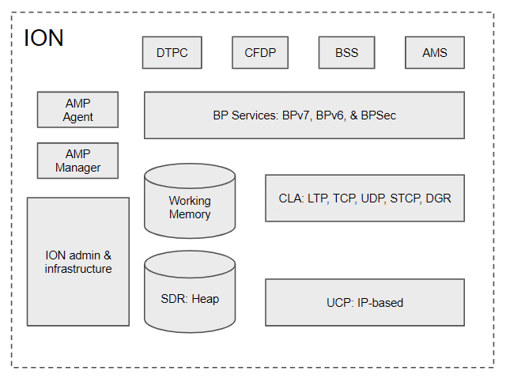
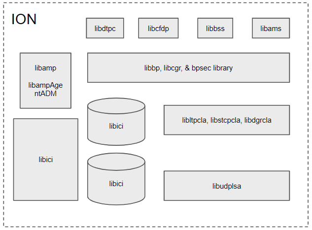
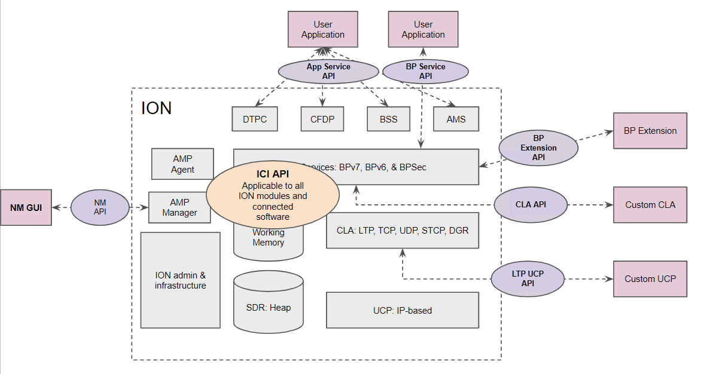

# ION Design and API Overview

## Basic Philosophy

The development of ION began in the early 2000's, focusing on flight systems running Real-time Operating System (RTOS) with minimum resources under strict control. While these constraints might be somewhat relaxed for modern embedded systems, ION's lightweight, modular, and portable traits remain desirable to both flight and ground systems today:

**Hard Memory Allocation Limits**: ION operates within a host-specified memory allocation, managing dynamic allocation internally via a private memory management system. This approach ensures efficient use of the allocated memory resources.

**Modular and Robust Operation**: ION's design allows individual modules to start, stop, re-build, or possibly be replaced independently. This modular structure is implemented through separate daemons and libraries, enhancing system resilience. In a process crash, data in the process's queues/buffers can be preserved in the non-volatile SDR, preventing data loss.

**Efficient Resource Utilization**: ION is optimized for environments with limited memory, storage, and processing resources. It avoids duplicate data copies during multi-stage processing by utilizing Zero-Copy Objects (ZCO) in shared memory space for fast hand-off between modules. This method, while more complex, ensures rapid data handling. Additionally, BP and CLA services operate as background daemons to minimize competition with critical spacecraft functions during nominal, high-stress, and off-nominal events.

**Independence from Native IP Socket Support**: ION employs software abstraction to decouple socket-based programming from its core functionalities. This allows ION to interface the Bundle Protocol and CLAs with various underlying communication systems, such as CCSDS space links, radio communications systems, or customized processing chains that are not IP-based.

**Portability and Minimal Footprint for Static Linking**: ION prioritizes portability and minimal resource footprint by building its function libraries. This approach supports static linking through the ION-core package for a specific set of modules. It reduces dependency on external libraries, thereby mitigating the risk of interference from unexercised or non-required code segments that cannot be removed from the libraries. This design also avoids potential compatibility issues between the target system’s build environment and those of externally sourced libraries.

## ION Modules
The [BP Service API document](./BP-Service-API.md) shows the default installation location of various libraries and daemons. Interactions with these daemons rely on various APIs made available through the libraries. The following diagram shows ION's modular architecture:

ION provides four application-layer services that utilize the underlying DTN protocols. These services are:

1. **AMS**: Asynchronous Message Service
2. **DTPC**: Delay-Tolerant Payload Conditioning
3. **CFDP**: CCSDS File Delivery Protocol
4. **BSS**: Bundle Streaming Service

ION provides BP services based on Bundle Protocol v6 and Bundle Protocol v7, BPSec (Bundle Protocol Security), and the Interplanetary Internet (IPN) naming scheme. In addition, it offers several standardized convergence layer adaptors, namely:

1. **LTP**: Licklider Transmission Protocol
2. **TCPCL**: TCP Convergence Layer version 3
3. **UDPCL**: UDP Convergence Layer
4. **STCP**: Simplified TCP Convergence Layer
5. **DGR**: Datagram Retransmission Convergence Layer

ION also provides UDP-based Underlying Communication Protocol (UCP) to support testing of the LTP CLA in terrestrial systems.

ION also supports the AMS (Asynchronous Management Architecture) by implementing both an Asynchronous Management Protocol (AMP) Agent and Manager and the associated Application Data Model (ADM) that describes both common and ION-specific DTN network management state information and commands.

The entire ION software suite operates within a prescribed memory space. It is privately managed by ION's ICI infrastructure library functions for space allocation/deallocation, data I/O, and linked list and zero-copy object (ZCO) management. There are two types of data storage: working memory to facilitate data processing and heap in the SDR designed to store state information and data that should persist through a power cycle when implemented on a non-volatile storage medium. ION's APIs are exposed to the user through a set of C header files associated with each module's library.

## Modular Packaging - ION Core

Due to the highly modular design of ION, it is possible to build a streamlined package that contains only the modules required for a specific system to maximize resource efficiency and reduce V&V costs. [ION-Core](https://github.com/nasa-jpl/ion-core) 4.1.2b package offers the ability to selectively build different sets of CLAs and bundle extensions blocks, targeting either 32-bit or 64-bit operating systems. 

## ION APIs

For software development, ION provides several sets of APIs for interacting with services/daemons of the underlying DTN protocols, as shown below:

ION APIs can be roughly categorized as follows:

1. **BP Service API**: This set of APIs enables an external application to interact with the BP service daemons to transmit and receive bundles through end-points using the IPN naming scheme.
2. **Convergence Layer API**: This set of APIs enables developers to add custom convergence layer adaptors that can interact with BP Services to transmit and receive bundles between neighboring DTN nodes.
3. **Underlying Communications Protocol API**: This set of APIs allows external software to transmit and receive data on behalf of LTP CLA.
4. **BP Extension Interface**: This set of library functions provides a standard framework to add additional BP extension blocks to ION without modifying the core BP source code.
5. **Application Service API**: These APIs are provided by AMS, CFDP, BSS, and DTPC modules of ION to deliver advanced capabilities such as messaging, file transfer, streaming data real-time and off-line playback, and in-order end-to-end delivery service to DTN applications.
6. **DTN Network Management API**: These APIs enable external applications to interact with the AMP Managers to control and monitor local and remote ION nodes.
7. **Interplanetary Communication Infrastructure (ICI) API**: This set of APIs performs basic administration, SDR & private memory management, and platform portability translation for ION. This is the core set of APIs all software connected to ION utilize to maximize portability between OS and CPU architectures.
