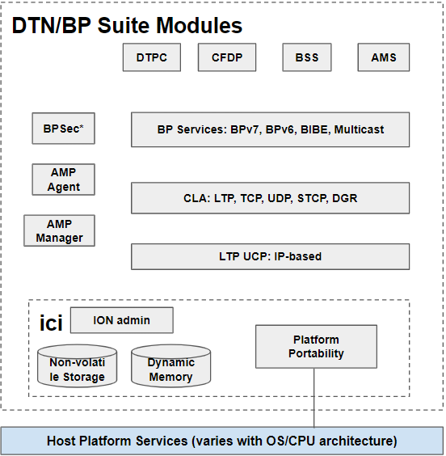
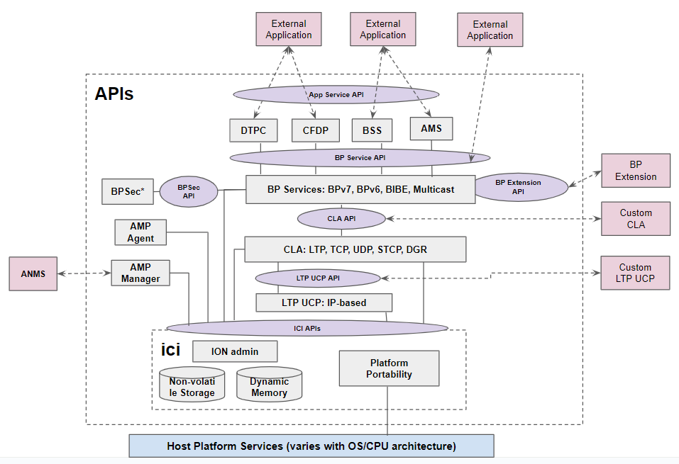

# ION Design and API Overview

## Basic Philosophy

ION began its development in the early 2000's focusing on flight system running Real-time Operating System (RTOS) with minimum resources under strict control. While these constraints might be somewhat relaxed for modern embedded systems, ION's light weight, modular, and portal traits still remain desirable to both flight and ground systems:

**Hard Memory Allocation Limits**: ION operates within a host-specified memory allocation, managing dynamic allocation internally via a private memory management system. This approach ensures efficient use of the allocated memory resources.

**Modular and Robust Operation**: ION's design allows for individual modules to be started, stopped, rebuilt, or possibly replaced independently. This modular structure is implemented through separate daemons and libraries, enhancing system resilience. In the event of a process crash, data in the process's queues/buffers can be preserved in the non-volatile SDR, preventing data loss.

**Efficient Resource Utilization**: ION is optimized for environments with limited memory, storage, and processing resources. It avoids duplicate data copies during multi-stage processing by utilizing Zero-Copy Objects (ZCO) in shared-memory for fast hand-off between modules. This method, while more complex, ensures rapid data handling. Additionally, BP and CLA services operate as background daemons to minimize competition with critical spacecraft functions during nominal, high-stress operation and off-nominal events.

**Independence from Native IP Socket Support**: ION employs software abstraction to decouple socket-based programming from its core functionalities. This allows ION to interface the Bundle Protocol and CLAs with various underlying communication systems, such as CCSDS space links or radio communications systems or customized processing chains that are not IP-based.

**Portability and Minimal Footprint for Static Linking**: ION prioritizes portability and minimal resource footprint by building its own function libraries. This approach supports static linking through the ION-core package for specific set of modules and reduces dependency on external libraries, thereby mitigating the risk of interference from unexercised or non-required code that cannot be removed from the libraries. This design also avoids potential compatibility issues between the target system’s build environment and those of externally-sourced libraries.

## ION Modules

In the [BP Service API document](./BP-Service-API.md) we shown the default installation location of various libraries and daemons. Interactions with these daemons relies on the use of various ION APIs available in the libraries. The following diagram shows ION's modular architecture:

ION provides four application-layer services that utilizes the underlying DTN protocols. These services are:

1. **AMS**: Asynchronous Message Service
2. **DTPC**: Delay-Tolerant Payload Conditioning
3. **CFDP**: CCSDS File Delivery Protocol
4. **BSS**: Bundle Streaming Service

ION provides BP services based on Bundle Protocol v6 and Bundle Protocol v7, BPSec (Bundle Protocol Security), and the Interplanetary Internet (IPN) naming scheme, etc. In addition, it offers several standardized convergence layer adaptors, namely:

1. LTP: Licklider Transmission Protocol
2. TCPCL: TCP Convergence Layer
3. UDPCL: UDP Convergence Layer
4. STCP: Simplified TCP Convergence Layer
5. DGR: Datagram Retransmission Convergence Layer

ION also provides UDP-based Underlying Communication Protocol (UCP) to support testing of the LTP CLA in terrestrial systems.

ION also has supports the AMS (Asynchronous Management Architecture) by implementing both an Asynchronous Management Protocol (AMP) Agent and Manager and the associated Application Data Model (ADM) that describes both common and ION-specific DTN network management state information and commands.

The entire ION software suite is administered and operating within a host-specified memory space and privately managed by ION's ICI infrastructure library functions for space allocation/deallocation, data I/O, and linked list and zero-copy object (ZCO) management. There are two types of data storage, one is working memory to facilitate data processing and the other is heap in the SDR that is designed to store non-volatile state information and data that should persist through power cycle when implemented on non-volatile storage medium. 

ION's API functions are exposed to the user through a set of C header files associated with each modules' library.

## ION APIs

For software development, ION provides several sets of APIs for interacting with services/daemons of the underlying DTN protocols as shown below.

ION APIs can be roughly categoried as follows:

1. **BP Service API**: This set of APIs are used by an application to interact with the BP service daemons to transmit and receive bundles through end-points using the IPN naming scheme.
2. **Convergence Layer API**: This set of APIs are used to write custom convergence layer adaptors that can interact with BP Services to transmit and receive bundles between neighboring DTN nodes.
3. **Underlying Communications Protocol API**: This is a set of APIs that allows external software to provide data transmission and reception functions to the LTP CLA.
4. **BP Extension Interface**: This set of library functions provides a way to implement additional BP extension blocks without modifying the core BP source code.
5. **Application Service API**: These are library functions provided by AMS, CFDP, BSS, and DTPC to offer a user messaging, file transfer, streaming data, and in-order end-to-end delivery service similar to TCP for DTN applications.
6. **DTN Network Management API**: These are library functions enables external application to interact with the AMP managers to control and monitor both local and remote ION nodes.
7. **Interplanetary Communication Infrastructure (ICI) API**: This set of APIs are used to perform basic SDR and private memory operations and other ION administrative functions. This is the core and common set of APIs that all software connected to ION will need.
