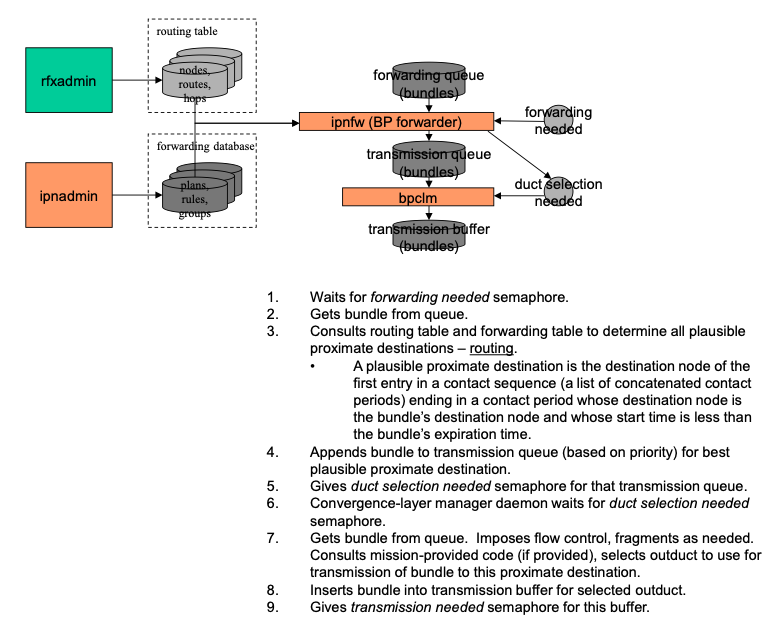

# Interplanetary Overlay Network (ION) Design and Operation's Guide

**Version 4.1.3**
**JPL D-48259**

**Document Change Log**

| Ver No. | Date        | Description                                                             | Note            |
| ------- | ----------- | ----------------------------------------------------------------------- | --------------- |
| V4.1.3  | 12/08/2023  | converted to MarkDown                                                   |                 |
| V4.0.1  | 11/20/2020  | ION 4.0.1                                                               |                 |
| V3.6.2  | 11/19/2018  | ION 3.6.2 release features                                              | Skipped V3.6.1. |
| V3.6    | 12/31/2017  | ION 3.6 release features                                                | Skipped V3.5.   |
| V3.4    | 3/28/2016   | ION 3.4 release features                                                |                 |
| V3.3    | 3/4/2015    | ION 3.3 release features                                                |                 |
| V3.2    | 12/17/2013  | ION 3.2 release features                                                |                 |
| V3.1    | 9/28/2012   | ION 3.1 release features                                                |                 |
| V3.0    | 3/22/2012   | Align with ION 3.0 release                                              |                 |
| V1.13   | 10/13/2011  | Updates for Source Forge Release                                        |                 |
| V1.12   | 6/11/2010   | Updates for second open source release (2.2)                            |                 |
| V1.11   | 12/11/2009  | BRS updates, multi-node config                                          |                 |
| V1.10   | 10/23/2009  | Final additions prior to DINET 2 experiment                             |                 |
| V1.9    | 6/29/2009   | Add updates for DINET 2, including CFDP, ionsec                         |                 |
| V1.8    | 2/6/2009    | Update discussion of Contact Graph Routing; document status msg formats |                 |
| V1.7    | 12/1/2008   | Add documentation for OWLT simulator, BP extension                      |                 |
| V1.6    | 10/03/2008  | Add documentation of sm_SemUnend                                        |                 |
| V1.5    | 09/20/2008  | Revisions requested SQA                                                 |                 |
| V1.4    | 07/31/2008  | Add a section on optimizing ION-based network; tuning                   |                 |
| V1.3    | 07/08/2008  | Revised some details of CGR                                             |                 |
| V1.2    | 05/24/2008  | Revised man pages for bptrace, ltprc, bprc.                             |                 |
| V1.1    | 05/18/2008  | Some additional diagrams                                                |                 |
| V1.0    | 04/28/2008  | Initial version of ION design and ops manual                            |                 |

## Design

The Interplanetary Overlay Network (ION) software distribution is an
implementation of Delay-Tolerant Networking (DTN) architecture as
described in Internet RFC 4838. It is designed to enable inexpensive
insertion of DTN functionality into embedded systems such as robotic
spacecraft. The intent of ION deployment in space flight mission systems
is to reduce cost and risk in mission communications by simplifying the
construction and operation of automated digital data communication
networks spanning space links, planetary surface links, and terrestrial
links.

A comprehensive overview of DTN is beyond the scope of this document.
Very briefly, though, DTN is a digital communication networking
technology that enables data to be conveyed between two communicating
entities automatically and reliably even if one or more of the network
links in the end-to-end path between those entities is subject to very
long signal propagation latency and/or prolonged intervals of
unavailability.

The DTN architecture is much like the architecture of the Internet,
except that it is one layer higher in the familiar ISO protocol "stack".
The DTN analog to the Internet Protocol (IP), called "Bundle Protocol"
(BP), is designed to function as an "overlay" network protocol that
interconnects "internets" -- including both Internet-structured networks
and also data paths that utilize only space communication links as
defined by the Consultative Committee for Space Data Systems (CCSDS) --
in much the same way that IP interconnects "subnets" such as those built
on Ethernet, SONET, etc. By implementing the DTN architecture, ION
provides communication software configured as a protocol stack that
looks like this:


**Figure 1 DTN protocol stack**

Data traversing a DTN are conveyed in DTN *bundles* -- which are
functionally analogous to IP packets -- between BP *endpoints* which are
functionally analogous to sockets. Multiple BP endpoints may be accessed
at a single DTN *node* -- functionally analogous to a network interface
card -- and multiple nodes may reside on the same computer just as a
single computer (host or router) in the Internet may have multiple
network interface cards.

BP endpoints are identified by Universal Record Identifiers (URIs),
which are ASCII text strings of the general form:

*scheme_name*:*scheme_specific_part*

For example:

dtn://topquark.caltech.edu/mail

But for space flight communications this general textual representation
might impose more transmission overhead than missions can afford. For
this reason, ION is optimized for networks of endpoints whose IDs
conform more narrowly to the following scheme:

ipn:*node_number.service_number*

This enables them to be abbreviated to pairs of unsigned binary integers
via a technique called Compressed Bundle Header Encoding (CBHE).
CBHE-conformant BP *endpoint IDs* (EIDs) are not only functionally
similar to Internet socket addresses but also structurally similar: node
numbers are roughly analogous to Internet node numbers (IP addresses),
in that they typically identify the flight or ground data system
computers on which network software executes, and service numbers are
roughly analogous to TCP and UDP port numbers.

More generally, the node numbers in CBHE-conformant BP endpoint IDs are
one manifestation of the fundamental ION notion of *network* *node
number*: in the ION architecture there is a natural one-to-one mapping
not only between node numbers and BP endpoint node numbers but also
between node numbers and:

- LTP engine IDs
- AMS continuum numbers
- CFDP entity numbers

Starting with version 3.1 of ION, this endpoint naming rule is
experimentally extended to accommodate *bundle multicast*, i.e., the
delivery of copies of a single transmitted bundle to multiple nodes at
which interest in that bundle's payload has been expressed. Multicast in
ION -- "Interplanetary Multicast" (IMC) -- is accomplished by simply
issuing a bundle whose destination endpoint ID conforms to the following
scheme:

imc:*group_number.service_number*

A copy of the bundle will automatically be delivered at every node that
has registered in the destination endpoint.

(Note: for now, the operational significance of a given group number
must be privately negotiated among ION users. If this multicast
mechanism proves useful, IANA may at some point establish a registry for
IMC group numbers. **Also note that a new mechanism for bundle multicast
is introduced in ION 4.0.1, along with support for Bundle Protocol
version 7.** This new mechanism vastly simplifies bundle multicast;
chiefly, the **imcadmin** utility is deprecated.)

### Structure and function

The ION distribution comprises the following software packages:

- ici (Interplanetary Communication Infrastructure), a set of
  general-purpose libraries providing common functionality to the
  other packages. The ici package includes a security policy component
  that supports the implementation of security mechanisms at multiple
  layers of the protocol stack.
- ltp (Licklider Transmission Protocol), a core DTN protocol that
  provides transmission reliability based on delay-tolerant
  acknowledgments, timeouts, and retransmissions. The LTP
  specification is defined in Internet RFC 5326.
- bp (Bundle Protocol), a core DTN protocol that provides
  delay-tolerant forwarding of data through a network in which
  continuous end-to-end connectivity is never assured, including
  support for delay-tolerant dynamic routing. The BP specification is
  defined in Internet RFC 5050.
- dgr (Datagram Retransmission), an alternative implementation of LTP
  that is designed for use on the Internet. Equipped with algorithms
  for TCP-like congestion control, DGR enables data to be transmitted
  via UDP with reliability comparable to that provided by TCP. The dgr
  system is provided primarily for the conveyance of Meta-AMS (see
  below) protocol traffic in an Internet-like environment.
- ams (Asynchronous Message Service), an application-layer service
  that is not part of the DTN architecture but utilizes underlying DTN
  protocols. AMS comprises three protocols supporting the distribution
  of brief messages within a network:

  - The core AAMS (Application AMS) protocol, which does message
    distribution on both the publish/subscribe model and the
    client/server model, as required by the application.
  - The MAMS (Meta-AMS) protocol, which distributes control
    information enabling the operation of the Application AMS
    protocol.
  - The RAMS (Remote AMS) protocol, which performs aggregated
    message distribution to end nodes that may be numerous and/or
    accessible only over very expensive links, using an aggregation
    tree structure similar to the distribution trees used by
    Internet multicast technologies.
- cfdp (CCSDS File Delivery Protocol), another application-layer
  service that is not part of the DTN architecture but utilizes
  underlying DTN protocols. CFDP performs the segmentation,
  transmission, reception, reassembly, and delivery of files in a
  delay-tolerant manner. ION's implementation of CFDP conforms to the
  "class 1" definition of the protocol in the CFDP standard, utilizing
  DTN (BP, nominally over LTP) as its "unitdata transport" layer.
- bss (Bundle Streaming Service), a system for efficient data
  streaming over a delay-tolerant network. The bss package
  includes (a) a convergence-layer protocol (bssp) that preserves
  in-order arrival of all data that were never lost en route, yet
  ensures that all data arrive at the destination eventually, and (b)
  a library for building delay-tolerant streaming applications, which
  enables low-latency presentation of streamed data received in real
  time while offering rewind/playback capability for the entire stream
  including late-arriving retransmitted data.
- tc (Trusted Collective), a system for propagating critical yet
  non-confidential information in a trustworthy manner. tc can be
  thought of as a delay-tolerant functional analog to the servers in
  client/server architectures. Multiple applications may make use of
  the tc system, but currently only one tc application is bundled with
  ION: dtka (delay-tolerant key administration), which provides
  delay-tolerant public key infrastructure.

Taken together, the packages included in the ION software distribution
constitute a communication capability characterized by the following
operational features:

- Reliable conveyance of data over a delay-tolerant network (*dtnet*),
  i.e., a network in which it might never be possible for any node to
  have reliable information about the detailed current state of any
  other node.
- Built on this capability, reliable data streaming, reliable file
  delivery, and reliable distribution of short messages to multiple
  recipients (subscribers) residing in such a network.
- Management of traffic through such a network, taking into
  consideration:

  - requirements for data security
  - scheduled times and durations of communication opportunities
  - fluctuating limits on data storage and transmission resources
  - data rate asymmetry
  - the sizes of application data units
  - and user-specified final destination, priority, and useful
    lifetime for those data units.
- Facilities for monitoring the performance of the network.
- Robustness against node failure.
- Portability across heterogeneous computing platforms.
- High speed with low overhead.
- Easy integration with heterogeneous underlying communication
  infrastructure, ranging from Internet to dedicated spacecraft
  communication links.

### Constraints on the Design

A DTN implementation intended to function in an interplanetary network
environment -- specifically, aboard interplanetary research spacecraft
separated from Earth and from one another by vast distances -- must
operate successfully within two general classes of design constraints:
link constraints and processor constraints.

1. **Link constraints**

All communications among interplanetary spacecraft are, obviously,
wireless. Less obviously, those wireless links are generally slow and
are usually asymmetric.

The electrical power provided to on-board radios is limited and antennae
are relatively small, so signals are weak. This limits the speed at
which data can be transmitted intelligibly from an interplanetary
spacecraft to Earth, usually to some rate on the order of 256 Kbps to 6
Mbps.

The electrical power provided to transmitters on Earth is certainly much
greater, but the sensitivity of receivers on spacecraft is again
constrained by limited power and antenna mass allowances. Because
historically the volume of command traffic that had to be sent to
spacecraft was far less than the volume of telemetry the spacecraft were
expected to return, spacecraft receivers have historically been
engineered for even lower data rates from Earth to the spacecraft, on
the order of 1 to 2 Kbps.

As a result, the cost per octet of data transmission or reception is
high and the links are heavily subscribed. Economical use of
transmission and reception opportunities is therefore important, and
transmission is designed to enable useful information to be obtained
from brief communication opportunities: units of transmission are
typically small, and the immediate delivery of even a small part
(carefully delimited) of a large data object may be preferable to
deferring delivery of the entire object until all parts have been
acquired.

2. **Processor constraints**

The computing capability aboard a robotic interplanetary spacecraft is
typically quite different from that provided by an engineering
workstation on Earth. In part this is due, again, to the limited
available electrical power and limited mass allowance within which a
flight computer must operate. But these factors are exacerbated by the
often intense radiation environment of deep space. In order to minimize
errors in computation and storage, flight processors must be
radiation-hardened and both dynamic memory and non-volatile storage
(typically flash memory) must be radiation-tolerant. The additional
engineering required for these adaptations takes time and is not
inexpensive, and the market for radiation-hardened spacecraft computers
is relatively small; for these reasons, the latest advances in
processing technology are typically not available for use on
interplanetary spacecraft, so flight computers are invariably slower
than their Earth-bound counterparts. As a result, the cost per
processing cycle is high and processors are heavily subscribed;
economical use of processing resources is very important.

The nature of interplanetary spacecraft operations imposes a further
constraint. These spacecraft are wholly robotic and are far beyond the
reach of mission technicians; hands-on repairs are out of the question.
Therefore the processing performed by the flight computer must be highly
reliable, which in turn generally means that it must be highly
predictable. Flight software is typically required to meet "hard"
real-time processing deadlines, for which purpose it must be run within
a hard real-time operating system (RTOS).

One other implication of the requirement for high reliability in flight
software is that the dynamic allocation of system memory may be
prohibited except in certain well-understood states, such as at system
start-up. Unrestrained dynamic allocation of system memory introduces a
degree of unpredictability into the overall flight system that can
threaten the reliability of the computing environment and jeopardize the
health of the vehicle.

### Design Principles

The design of the ION software distribution reflects several core
principles that are intended to address these constraints.


**Figure 2 ION inter-task communication**

1. **Shared memory**

Since ION must run on flight processors, it had to be designed to
function successfully within an RTOS. Many real-time operating systems
improve processing determinism by omitting the support for
protected-memory models that is provided by Unix-like operating systems:
all tasks have direct access to all regions of system memory. (In
effect, all tasks operate in kernel mode rather than in user mode.) ION
therefore had to be designed with no expectation of memory protection.

But universally shared access to all memory can be viewed not only as a
hazard but also as an opportunity. Placing a data object in shared
memory is an extremely efficient means of passing data from one software
task to another.

ION is designed to exploit this opportunity as fully as possible. In
particular, virtually all inter-task data interchange in ION follows the
model shown in Figure 2:

- The sending task takes a mutual exclusion semaphore (mutex)
  protecting a linked list in shared memory (either DRAM or
  non-volatile memory), appends a data item to the list, releases the
  mutex, and gives a "signal" semaphore associated with the list to
  announce that the list is now non-empty.
- The receiving task, which is already pending on the linked list's
  associated signal semaphore, resumes execution when the semaphore is
  given. It takes the associated mutex, extracts the next data item
  from the list, releases the mutex, and proceeds to operate on the
  data item from the sending task.

Semaphore operations are typically extremely fast, as is the storage and
retrieval of data in memory, so this inter-task data interchange model
is suitably efficient for flight software.

1. **Zero-copy procedures**

Given ION's orientation toward the shared memory model, a further
strategy for processing efficiency offers itself: if the data item
appended to a linked list is merely a pointer to a large data object,
rather than a copy, then we can further reduce processing overhead by
eliminating the cost of byte-for-byte copying of large objects.

Moreover, in the event that multiple software elements need to access
the same large object at the same time, we can provide each such
software element with a pointer to the object rather than its own copy
(maintaining a count of references to assure that the object is not
destroyed until all elements have relinquished their pointers). This
serves to reduce somewhat the amount of memory needed for ION
operations.

2. **Highly distributed processing**

The efficiency of inter-task communications based on shared memory makes
it practical to distribute ION processing among multiple relatively
simple pipelined tasks rather than localize it in a single, somewhat
more complex daemon. This strategy has a number of advantages:

- The simplicity of each task reduces the sizes of the software
  modules, making them easier to understand and maintain, and thus it
  can somewhat reduce the incidence of errors.
- The scope of the ION operating stack can be adjusted incrementally
  at run time, by spawning or terminating instances of configurable
  software elements, without increasing the size or complexity of any
  single task and without requiring that the stack as a whole be
  halted and restarted in a new configuration. In theory, a module
  could even be upgraded with new functionality and integrated into
  the stack without interrupting operations.
- The clear interfaces between tasks simplify the implementation of
  flow control measures to prevent uncontrolled resource consumption.

  1. **Portability**

Designs based on these kinds of principles are foreign to many software
developers, who may be far more comfortable in development environments
supported by protected memory. It is typically much easier, for example,
to develop software in a Linux environment than in VxWorks 5.4. However,
the Linux environment is not the only one in which ION software must
ultimately run.

Consequently, ION has been designed for easy portability. POSIX™ API
functions are widely used, and differences in operating system support
that are not concealed within the POSIX abstractions are mostly
encapsulated in two small modules of platform-sensitive ION code. The
bulk of the ION software runs, without any source code modification
whatsoever, equally well in Linux™ (Red Hat®, Fedora™, and Ubuntu™, so
far), FreeBSD®, Solaris® 9, Microsoft Windows (the MinGW environment),
OS/X®, VxWorks® 5.4, and RTEMS™, on both 32-bit and 64-bit processors.
Developers may compile and test ION modules in whatever environment they
find most convenient.

### Organizational Overview

Two broad overviews of the organization of ION may be helpful at this
point. First, here is a summary view of the main functional dependencies
among ION software elements:


**Figure 3 ION software functional dependencies**

That is, BP and LTP invoke functions provided by the sdr, zco, psm, and
platform elements of the ici package, in addition to functions provided
by the operating system itself; the zco functions themselves also invoke
sdr, psm, and platform functions; and so on.

Second, here is a summary view of the main line of data flow in ION's
DTN protocol implementations:


**Figure 4 Main line of ION data flow**

Note that data objects residing in shared memory, many of them in a
nominally non-volatile SDR data store, constitute the central organizing
principle of the design. Here as in other diagrams showing data flow in
this document:

- Ordered collections of data objects are shown as cylinders.
- Darker greyscale data entities indicate data that are managed in the
  SDR data store, while lighter greyscale data entities indicate data
  that are managed in volatile DRAM to improve performance.
- Rectangles indicate processing elements (tasks, processes, threads),
  sometimes with library references specifically identified.

A few notes on this main line data flow:

- For simplicity, the data flow depicted here is a "loopback" flow in
  which a single BP "node" is shown sending data to itself (a useful
  configuration for test purposes). To depict typical operations over
  a network we would need two instances of this node diagram, such
  that the \<LSO\> task of one node is shown sending data to the
  \<LSI\> task of the other and vice versa.
- A BP application or application service (such as Remote AMS) that
  has access to the local BP node -- for our purposes, the "sender" --
  invokes the bp_send function to send a unit of application data to a
  remote counterpart. The destination of the application data unit is
  expressed as a BP endpoint ID (EID). The application data unit is
  encapsulated in a bundle and is queued for forwarding.
- The forwarder task identified by the "scheme" portion of the
  bundle's destination EID removes the bundle from the forwarding
  queue and computes a route to the destination EID. The first node on
  the route is termed the "proximate node" for the computed route. The
  forwarder appends the bundle to the transmission queue for the
  convergence-layer manager (CLM) daemon that is responsible for
  transmission to the proximate node.
- The CLM daemon removes the bundle from the transmission queue and
  imposes rate control, fragments the bundle as necessary, and appends
  the bundle to the transmission buffer for some underlying
  "convergence layer" (CL) protocol interface to the proximate node,
  termed an *outduct*. In the event that multiple outducts are
  available for transmission to that node (e.g., multiple radio
  frequency bands), the CLM invokes mission-supplied code to select
  the appropriate duct. Each outduct is serviced by some CL-specific
  output task that communicates with the proximate node -- in this
  case, the LTP output task **ltpclo**. (Other CL protocols supported
  by ION include TCP and UDP.)
- The output task for LTP transmission to the selected proximate node
  removes the bundle from the transmission buffer and invokes the
  ltp_send function to append it to a *block* that is being assembled
  for transmission to the proximate node. (Because LTP acknowledgement
  traffic is issued on a per-block basis, we can limit the amount of
  acknowledgement traffic on the network by aggregating multiple
  bundles into a single block rather than transmitting each bundle in
  its own block.)
- The **ltpmeter** task for the selected proximate node divides the
  aggregated block into multiple segments and enqueues them for
  transmission by underlying link-layer transmission software, such as
  an implementation of the CCSDS AOS protocol.
- Underlying link-layer software at the sending node transmits the
  segments to its counterpart at the proximate node (the receiver),
  where they are used to reassemble the transmission block.
- The receiving node's input task for LTP reception extracts the
  bundles from the reassembled block and dispatches them: each bundle
  whose final destination is some other node is queued for forwarding,
  just like bundles created by local applications, while each bundle
  whose final destination is the local node is queued for delivery to
  whatever application "opens" the BP endpoint identified by the
  bundle's final destination endpoint ID. (Note that a multicast
  bundle may be both queued for forwarding, possibly to multiple
  neighboring nodes, and also queued for delivery.)
- The destination application or application service at the receiving
  node opens the appropriate BP endpoint and invokes the bp_receive
  function to remove the bundle from the associated delivery queue and
  extract the original application data unit, which it can then
  process.

Finally, note that the data flow shown here represents the sustained
operational configuration of a node that has been successfully
instantiated on a suitable computer. The sequence of operations
performed to reach this configuration is not shown. That startup
sequence will necessarily vary depending on the nature of the computing
platform and the supporting link services. Broadly, the first step
normally is to run the **ionadmin** utility program to initialize the
data management infrastructure required by all elements of ION.
Following this initialization, the next steps normally are (a) any
necessary initialization of link service protocols, (b) any necessary
initialization of convergence-layer protocols (e.g., LTP -- the
**ltpadmin** utility program), and finally (c) initialization of the
Bundle Protocol by means of the **bpadmin** utility program. BP
applications should not try to commence operation until BP has been
initialized.

### Resource Management in ION

Successful Delay-Tolerant Networking relies on retention of bundle
protocol agent state information -- including protocol traffic that is
awaiting a transmission opportunity -- for potentially lengthy
intervals. The nature of that state information will fluctuate rapidly
as the protocol agent passes through different phases of operation, so
efficient management of the storage resources allocated to state
information is a key consideration in the design of ION.

Two general classes of storage resources are managed by ION: volatile
"working memory" and non-volatile "heap".

1. **Working Memory**

ION's "working memory" is a fixed-size pool of shared memory (dynamic
RAM) that is allocated from system RAM at the time the bundle protocol
agent commences operation. Working memory is used by ION tasks to store
temporary data of all kinds: linked lists, red-black trees, transient
buffers, volatile databases, etc. All intermediate data products and
temporary data structures that ought not to be retained in the event of
a system power cycle are written to working memory.

Data structures residing in working memory may be shared among ION tasks
or may be created and managed privately by individual ION tasks. The
dynamic allocation of working memory to ION tasks is accomplished by the
Personal Space Management (PSM) service, described later. All of the
working memory for any single ION bundle protocol agent is managed as a
single PSM "partition". The size of the partition is specified in the
**wmSize** parameter of the ionconfig file supplied at the time ION is
initialized.

2. **Heap**

ION's "heap" is a fixed-size pool of notionally non-volatile storage
that is likewise allocated at the time the bundle protocol agent
commences operation. This notionally non-volatile space **may** occupy a
fixed-size pool of shared memory (dynamic RAM, which might or might not
be battery-backed), or it **may** occupy only a single fixed-size file
in the file system, or it may occupy both. In the latter case, all heap
data are written both to memory and to the file but are read only from
memory; this configuration offers the reliable non-volatility of file
storage coupled with the high performance of retrieval from dynamic RAM.

We characterize ION's heap storage as "notionally" non-volatile because
the heap may be configured to reside only in memory (or, for that
matter, in a file that resides in the file system of a RAM disk). When
the heap resides only in memory, its contents are truly non-volatile
only if that memory is battery-backed. Otherwise heap storage is in
reality as volatile as working memory: heap contents will be lost upon a
system power cycle (which may in fact be the preferred behavior for any
given deployment of ION). However, the heap should not be thought of as
\"memory\" even when it in fact resides only in DRAM, just as a disk
device should not be thought of as \"memory\" even when it is in fact a
RAM disk.

{width="4.738575021872266in"
height="3.338542213473316in"}

**Figure 5 ION heap space use**

The ION heap is used for storage of data that (in at least some
deployments) would have to be retained in the event of a system power
cycle to ensure the correct continued operation of the node. For
example, all queues of bundles awaiting route computation, transmission,
or delivery reside in the node's heap. So do the non-volatile databases
for all of the protocols implemented within ION, together with all of
the node's persistent configuration parameters.

The dynamic allocation of heap space to ION tasks is accomplished by the
Simple Data Recorder (SDR) service, described later. The entire heap for
any single ION bundle protocol agent is managed as a single SDR "data
store".

Space within the ION heap is apportioned as shown in Figure 5. The total
number of bytes of storage space in the heap is computed as the product
of the size of a "word" on the deployment platform (normally the size of
a pointer) multiplied by the value of the **heapWords** parameter of the
ionconfig file supplied at the time ION is initialized. Of this total,
20% is normally reserved as margin and another 40% is normally reserved
for various infrastructure operations. (Both of these percentages are
macros that may be overridden at compile time.) The remainder is
available for storage of protocol state data in the form of "zero-copy
objects", described later. At any given moment, the data encapsulated in
a zero-copy object may "belong" to any one of the protocols in the ION
stack (AMS, CFDP, BP, LTP), depending on processing state; the available
heap space is a single common resource to which all of the protocols
share concurrent access.

Because the heap is used to store queues of bundles awaiting processing,
blocks of LTP data awaiting transmission or reassembly, etc., the heap
for any single ION node must be large enough to contain the maximum
volume of such data that the node will be required to retain during
operations. Demand for heap space is substantially mitigated if most of
the application data units passed to ION for transmission are
file-resident, as the file contents themselves need not be copied into
the heap. In general, however, computing the optimum ION heap size for a
given deployment remains a research topic.

### Package Overviews

#### **Interplanetary Communication Infrastructure (ICI)**

The ICI package in ION provides a number of core services that, from
ION's point of view, implement what amounts to an extended POSIX-based
operating system. ICI services include the following:

1\. Platform

The platform system contains operating-system-sensitive code that
enables ICI to present a single, consistent programming interface to
those common operating system services that multiple ION modules
utilize. For example, the platform system implements a standard
semaphore abstraction that may invisibly be mapped to underlying POSIX
semaphores, SVR4 IPC semaphores, Windows Events, or VxWorks semaphores,
depending on which operating system the package is compiled for. The
platform system also implements a standard shared-memory abstraction,
enabling software running on operating systems both with and without
memory protection to participate readily in ION's shared-memory-based
computing environment.

2\. Personal Space Management (PSM)

Although sound flight software design may prohibit the uncontrolled
dynamic management of system memory, private management of assigned,
fixed blocks of system memory is standard practice. Often that private
management amounts to merely controlling the reuse of fixed-size rows in
static tables, but such techniques can be awkward and may not make the
most efficient use of available memory. The ICI package provides an
alternative, called PSM, which performs high-speed dynamic allocation
and recovery of variable-size memory objects within an assigned memory
block of fixed size. A given PSM-managed memory block may be either
private or shared memory.

3\. Memmgr

The static allocation of privately-managed blocks of system memory for
different purposes implies the need for multiple memory management
regimes, and in some cases a program that interacts with multiple
software elements may need to participate in the private shared-memory
management regimes of each. ICI's memmgr system enables multiple memory
managers -- for multiple privately-managed blocks of system memory -- to
coexist within ION and be concurrently available to ION software
elements.

4\. Lyst

The lyst system is a comprehensive, powerful, and efficient system for
managing doubly-linked lists in private memory. It is the model for a
number of other list management systems supported by ICI; as noted
earlier, linked lists are heavily used in ION inter-task communication.

5\. Llcv

The llcv (Linked-List Condition Variables) system is an inter-thread
communication abstraction that integrates POSIX thread condition
variables (vice semaphores) with doubly-linked lists in private memory.

6\. Smlist

Smlist is another doubly-linked list management service. It differs from
lyst in that the lists it manages reside in shared (rather than private)
DRAM, so operations on them must be semaphore-protected to prevent race
conditions.

7\. SmRbt

The SmRbt service provides mechanisms for populating and navigating
"red/black trees" (RBTs) residing in shared DRAM. RBTs offer an
alternative to linked lists: like linked lists they can be navigated as
queues, but locating a single element of an RBT by its "key" value can
be much quicker than the equivalent search through an ordered linked
list.

8\. Simple Data Recorder (SDR)

SDR is a system for managing non-volatile storage, built on exactly the
same model as PSM. Put another way, SDR is a small and simple
"persistent object" system or "object database" management system. It
enables straightforward management of linked lists (and other data
structures of arbitrary complexity) in non-volatile storage, notionally
within a single file whose size is pre-defined and fixed.

SDR includes a transaction mechanism that protects database integrity by
ensuring that the failure of any database operation will cause all other
operations undertaken within the same transaction to be backed out. The
intent of the system is to assure retention of coherent protocol engine
state even in the event of an unplanned flight computer reboot in the
midst of communication activity.

9\. Sptrace

The sptrace system is an embedded diagnostic facility that monitors the
performance of the PSM and SDR space management systems. It can be used,
for example, to detect memory "leaks" and other memory management
errors.

10\. Zco

ION's zco (zero-copy objects) system leverages the SDR system's storage
flexibility to enable user application data to be encapsulated in any
number of layers of protocol without copying the successively augmented
protocol data unit from one layer to the next. It also implements a
reference counting system that enables protocol data to be processed
safely by multiple software elements concurrently -- e.g., a bundle may
be both delivered to a local endpoint and, at the same time, queued for
forwarding to another node -- without requiring that distinct copies of
the data be provided to each element.

11\. Rfx

The ION rfx (R/F Contacts) system manages lists of scheduled
communication opportunities in support of a number of LTP and BP
functions.

12\. Ionsec

The IONSEC (ION security) system manages information that supports the
implementation of security mechanisms in the other packages: security
policy rules and computation keys.

#### **Licklider Transmission Protocol (LTP)**

The ION implementation of LTP conforms fully to RFC 5326, but it also
provides two additional features that enhance functionality without
affecting interoperability with other implementations:

- The service data units -- nominally bundles -- passed to LTP for
  transmission may be aggregated into larger blocks before
  segmentation. By controlling block size we can control the volume of
  acknowledgement traffic generated as blocks are received, for
  improved accommodation of highly asynchronous data rates.
- The maximum number of transmission sessions that may be concurrently
  managed by LTP (a protocol control parameter) constitutes a
  transmission "window" -- the basis for a delay-tolerant,
  non-conversational flow control service over interplanetary links.

In the ION stack, LTP serves effectively the same role that is performed
by an LLC protocol (such as IEEE 802.2) in the Internet architecture,
providing flow control and retransmission-based reliability between
topologically adjacent bundle protocol agents.

All LTP session state is safely retained in the ION heap for rapid
recovery from a spacecraft or software fault.

#### **Bundle Protocol (BP)**

The ION implementation of BP conforms fully to RFC 5050, including
support for the following standard capabilities:

- Prioritization of data flows
- Proactive bundle fragmentation
- Bundle reassembly from fragments
- Flexible status reporting
- Custody transfer, including re-forwarding of custodial bundles upon
  timeout interval expiration or failure of nominally reliable
  convergence-layer transmission

The system also provides three additional features that enhance
functionality without affecting interoperability with other
implementations:

- Rate control provides support for congestion forecasting and
  avoidance.
- Bundle headers are encoded into compressed form (CBHE, as noted
  earlier) before issuance, to reduce protocol overhead and improve
  link utilization.
- Bundles may be "multicast" to all nodes that have registered within
  a given multicast group endpoint.

In addition, ION BP includes a system for computing dynamic routes
through time-varying network topology assembled from scheduled, bounded
communication opportunities. This system, called "Contact Graph
Routing," is described later in this Guide.

In short, BP serves effectively the same role that is performed by IP in
the Internet architecture, providing route computation, forwarding,
congestion avoidance, and control over quality of service.

All bundle transmission state is safely retained in the ION heap for
rapid recovery from a spacecraft or software fault.

#### **Asynchronous Message Service (AMS)**

The ION implementation of the CCSDS AMS standard conforms fully to CCSDS
735.0-B-1. AMS is a data system communications architecture under which
the modules of mission systems may be designed as if they were to
operate in isolation, each one producing and consuming mission
information without explicit awareness of which other modules are
currently operating. Communication relationships among such modules are
self-configuring; this tends to minimize complexity in the development
and operations of modular data systems.

A system built on this model is a "society" of generally autonomous
inter-operating modules that may fluctuate freely over time in response
to changing mission objectives, modules' functional upgrades, and
recovery from individual module failure. The purpose of AMS, then, is to
reduce mission cost and risk by providing standard, reusable
infrastructure for the exchange of information among data system modules
in a manner that is simple to use, highly automated, flexible, robust,
scalable, and efficient.

A detailed discussion of AMS is beyond the scope of this Design Guide.
For more information, please see the [AMS Programmer&#39;s Guide.](AMS-Programmer-Guide.md)

#### **Datagram Retransmission (DGR)**

The DGR package in ION is an alternative implementation of LTP that is
designed to operate responsibly -- i.e., with built-in congestion
control -- in the Internet or other IP-based networks running UDP. It is provided as
a candidate "primary transfer service" in support of AMS operations in
an Internet-like (non-delay-tolerant) environment. The DGR design
combines LTP's concept of concurrent transmission transactions with
congestion control and timeout interval computation algorithms adapted
from TCP. DGR includes an adaptive timeout-interval-computing component that provides
maximum opportunity for reception of acknowledgements, minimizing retransmission. 
By monitoring changes in the rate at which message-transmission transactions 
are completed, DGR detects changes in the level of congestion and 
responds by imposing varying degrees of delay on the transmission of 
new messages. In addition, DGR maximizes throughput by not waiting 
for acknowledgement of a message before sending the next message. All 
DGR communication is asynchronous, to maximize efficient utilization of 
network connections. DGR manages multiple concurrent datagram transmission 
and acknowledgement conversations.

#### **CCSDS File Delivery Protocol (CFDP)**

The ION implementation of CFDP conforms fully to Service Class 1
(Unreliable Transfer) of CCSDS 727.0-B-4, including support for the
following standard capabilities:

- Segmentation of files on user-specified record boundaries.
- Transmission of file segments in protocol data units that are
  conveyed by an underlying Unitdata Transfer service, in this case
  the DTN protocol stack. File data segments may optionally be
  protected by CRCs. When the DTN protocol stack is configured for
  reliable data delivery (i.e., with BP custody transfer running over
  a reliable convergence-layer protocol such as LTP), file delivery is
  reliable; CFDP need not perform retransmission of lost data itself.
- Reassembly of files from received segments, possibly arriving over a
  variety of routes through the delay-tolerant network. The integrity
  of the delivered files is protected by checksums.
- User-specified fault handling procedures.
- Operations (e.g., directory creation, file renaming) on remote file
  systems.

All CFDP transaction state is safely retained in the ION heap for rapid
recovery from a spacecraft or software fault.

#### **Bundle Streaming Service (BSS)**

The BSS service provided in ION enables a stream of video, audio, or
other continuously generated application data units, transmitted over a
delay-tolerant network, to be presented to a destination application in
two useful modes concurrently:

- In the order in which the data units were generated, with the least
  possible end-to-end delivery latency, but possibly with some gaps
  due to transient data loss or corruption.
- In the order in which the data units were generated, without gaps
  (i.e., including lost or corrupt data units which were omitted from
  the real-time presentation but were subsequently retransmitted), but
  in a non-real-time "playback" mode.

#### **Trusted Collective (TC)**

The TC service provided in ION enables critical but non-confidential
information (such as public keys, for asymmetric cryptography) to be
provided in a delay-tolerant, trustworthy manner. An instance of TC
comprises:

- A distributed Authority, the members of which must reach consensus
  on database content and must collaborate on the proactive
  distribution of that content.
- Any number of Clients, which:

  - Announce new content to the Authority via authenticated bundle
    multicast, and/or
  - Receive trustworthy bulletins multicast by the members of the
    Authority.

#### Acronyms

| Acronyms | Description                                   |
| -------- | --------------------------------------------- |
| BP       | Bundle Protocol                               |
| BSP      | Bundle Security Protocol                      |
| BSS      | Bundle Streaming Service                      |
| CCSDS    | Consultative Committee for Space Data Systems |
| CFDP     | CCSDS File Delivery Protocol                  |
| CGR      | Contact Graph Routing                         |
| CL       | convergence layer                             |
| CLI      | convergence layer input                       |
| CLO      | convergence layer output                      |
| DTKA     | Delay-Tolerant Key Administration             |
| DTN      | Delay-Tolerant Networking                     |
| ICI      | Interplanetary Communication Infrastructure   |
| ION      | Interplanetary Overlay Network                |
| LSI      | link service input                            |
| LSO      | link service output                           |
| LTP      | Licklider Transmission Protocol               |
| OWLT     | one-way light time                            |
| RFC      | request for comments                          |
| RFX      | Radio (R/F) Contacts                          |
| RTT      | round-trip time                               |
| TC       | Trusted Collective                            |
| TTL      | time to live                                  |

### Network Operation Concepts

A small number of network operation design elements -- fragmentation and
reassembly, bandwidth management, and delivery assurance
(retransmission) -- can potentially be addressed at multiple layers of
the protocol stack, possibly in different ways for different reasons. In
stack design it's important to allocate this functionality carefully so
that the effects at lower layers complement, rather than subvert, the
effects imposed at higher layers of the stack. This allocation of
functionality is discussed below, together with a discussion of several
related key concepts in the ION design.

#### **Fragmentation and Reassembly**

To minimize transmission overhead and accommodate asymmetric links
(i.e., limited "uplink" data rate from a ground data system to a
spacecraft) in an interplanetary network, we ideally want to send
"downlink" data in the largest possible aggregations -- coarse-grained
transmission.

But to minimize head-of-line blocking (i.e., delay in transmission of a
newly presented high-priority item) and minimize data delivery latency
by using parallel paths (i.e., to provide fine-grained partial data
delivery, and to minimize the impact of unexpected link termination), we
want to send "downlink" data in the smallest possible aggregations --
fine-grained transmission.

We reconcile these impulses by doing both, but at different layers of
the ION protocol stack.

First, at the application service layer (AMS and CFDP) we present
relatively small application data units (ADUs) -- on the order of 64 KB
-- to BP for encapsulation in bundles. This establishes an upper bound
on head-of-line blocking when bundles are de-queued for transmission,
and it provides perforations in the data stream at which forwarding can
readily be switched from one link (route) to another, enabling partial
data delivery at relatively fine, application-appropriate granularity.

(Alternatively, large application data units may be presented to BP and
the resulting large bundles may be proactively fragmented at the time
they are presented to the convergence-layer manager. This capability is
meant to accommodate environments in which the convergence-layer manager
has better information than the application as to the optimal bundle
size, such as when the residual capacity of a contact is known to be
less than the size of the bundle.)

Then, at the BP/LTP convergence layer adapter lower in the stack, we
aggregate these small bundles into *blocks* for presentation to LTP:

Any continuous sequence of bundles that are to be shipped to the same
LTP engine and all require assured delivery may be aggregated into a
single block, to reduce overhead and minimize report traffic.

However, this aggregation is constrained by an aggregation size limit
rule: aggregation must stop and the block must be transmitted as soon as
the sum of the sizes of all bundles aggregated into the block exceeds
the block aggregation threshhold value declared for the applicable
*span* (the relationship between the local node's LTP engine and the
receiving LTP engine) during LTP protocol configuration via
**ltpadmin**.

Given a preferred block acknowledgment period -- e.g., a preferred
acknowledgement traffic rate of one report per second -- the nominal
block aggregation threshold is notionally computed as the amount of data
that can be sent over the link to the receiving LTP engine in a single
block acknowledgment period at the planned outbound data rate to that
engine.

Taken together, application-level fragmentation (or BP proactive
fragmentation) and LTP aggregation place an upper limit on the amount of
data that would need to be re-transmitted over a given link at next
contact in the event of an unexpected link termination that caused
delivery of an entire block to fail. For example, if the data rate is 1
Mbps and the nominal block size is 128 KB (equivalent to 1 second of
transmission time), we would prefer to avoid the risk of having wasted
five minutes of downlink in sending a 37.5 MB file that fails on
transmission of the last kilobyte, forcing retransmission of the entire
37.5 MB. We therefore divide the file into, say, 1200 bundles of 32 KB
each which are aggregated into blocks of 128 KB each: only a single
block failed, so only that block (containing just 4 bundles) needs to be
retransmitted. The cost of this retransmission is only 1 second of link
time rather than 5 minutes. By controlling the cost of convergence-layer
protocol failure in this way, we avoid the overhead and complexity of
"reactive fragmentation" in the BP implementation.

Finally, within LTP itself we fragment the block as necessary to
accommodate the Maximum Transfer Unit (MTU) size of the underlying link
service, typically the transfer frame size of the applicable CCSDS link
protocol.

#### **Bandwidth Management**

The allocation of bandwidth (transmission opportunity) to application
data is requested by the application task that's passing data to DTN,
but it is necessarily accomplished only at the lowest layer of the stack
at which bandwidth allocation decisions can be made -- and then always
in the context of node policy decisions that have global effect.

The transmission queue interface to a given neighbor in the network is
actually three queues of outbound bundles rather than one: one queue for
each of the defined levels of priority ("class of service") supported by
BP. When an application presents an ADU to BP for encapsulation in a
bundle, it indicates its own assessment of the ADU's priority. Upon
selection of a proximate forwarding destination node for that bundle,
the bundle is appended to whichever of the queues corresponds to the
ADU's priority.

Normally the convergence-layer manager (CLM) task servicing a given
proximate node extracts bundles in strict priority order from the heads
of the three queues. That is, the bundle at the head of the
highest-priority non-empty queue is always extracted.

However, if the ION_BANDWIDTH_RESERVED compiler option is selected at
the time ION is built, the convergence-layer manager task servicing a
given proximate node extracts bundles in interleaved fashion from the
heads of the node's three queues:

- Whenever the priority-2 ("express") queue is non-empty, the bundle
  at the head of that queue is the next one extracted.
- At all other times, bundles from both the priority-1 queue and the
  priority-0 queue are extracted, but over a given period of time
  twice as many bytes of priority-1 bundles will be extracted as bytes
  of priority-0 bundles.

Following insertion of the extracted bundles into transmission buffers,
CLO tasks other than **ltpclo** simply segment the buffered bundles as
necessary and transmit them using the underlying convergence-layer
protocols. In the case of **ltpclo**, the output task aggregates the
buffered bundles into blocks as described earlier and a second daemon
task named **ltpmeter** waits for aggregated blocks to be completed;
**ltpmeter**, rather than the CLO task itself, segments each completed
block as necessary and passes the segments to the link service protocol
that underlies LTP. Either way, the transmission ordering requested by
application tasks is preserved.

#### **Contact Plans**

In the Internet, protocol operations can be largely driven by currently
effective information that is discovered opportunistically and
immediately, at the time it is needed, because the latency in
communicating this information over the network is negligible: distances
between communicating entities are small and connectivity is continuous.
In a DTN-based network, however, ad-hoc information discovery would in
many cases take so much time that it could not be completed before the
information lost currency and effectiveness. Instead, protocol
operations must be largely driven by information that is pre-placed at
the network nodes and tagged with the dates and times at which it
becomes effective. This information takes the form of *contact plans*
that are managed by the R/F Contacts (rfx) services of ION's ici
package.


**Figure 6 RFX services in ION**

The structure of ION's RFX (contact plan) database, the rfx system
elements that populate and use that data, and affected portions of the
BP and LTP protocol state databases are shown in Figure 6. (For
additional details of BP and LTP database management, see the BP/LTP
discussion later in this document.)

To clarify the notation of this diagram, which is also used in other
database structure diagrams in this document:

- Data objects of defined structure are shown as circles. Dark
  greyscale indicates notionally non-volatile data retained in "heap"
  storage, while lighter greyscale indicates volatile data retained in
  dynamic random access memory.
- Solid arrows connecting circles indicate one-to-many cardinality.
- A dashed arrow between circles indicates a potentially many-to-one
  reference mapping.
- Arrows from processing elements (rectangles) to data entities
  indicate data production, while arrows from data entities to
  processing elements indicate data retrieval.

A *contact* is here defined as an interval during which it is expected
that data will be transmitted by DTN node A (the contact's transmitting
node) and most or all of the transmitted data will be received by node B
(the contact's receiving node). Implicitly, the transmitting mode will
utilize some "convergence-layer" protocol underneath the Bundle Protocol
to effect this direct transmission of data to the receiving node. Each
contact is characterized by its start time, its end time, the identities
of the transmitting and receiving nodes, and the rate at which data are
expected to be transmitted by the transmitting node throughout the
indicated time period.

(Note that a contact is specifically ***not*** an episode of activity on
a link. Episodes of activity on different links -- e.g., different radio
transponders operating on the same spacecraft -- may well overlap, but
contacts by definition cannot; they are bounded time intervals and as
such are innately "tiled". For example, suppose transmission on link X
from node A to node B, at data rate RX, begins at time T1 and ends at
time T2; also, transmission on link Y from node A to node B, at data
rate RY begins at time T3 and ends at time T4. If T1 = T3 and T2 = T4,
then there is a single contact from time T1 to time T2 at data rate RX +
RY. If T1 \< T3 and T2 = T4, then there are two contiguous contacts: one
from T1 to T3 at data rate RX, then one from T3 to T2 at data rate RX +
RY. If T1 \< T3 and T3\<T2 \< T4, then there are three contiguous
contacts: one from T1 to T3 at data rate RX, then one from T3 to T2 at
data rate RX + RY, then one from T2 to T4 at data rate RY. And so on.)

A *range interval* is a period of time during which the displacement
between two nodes A and B is expected to vary by less than 1 light
second from a stated anticipated distance. (We expect this information
to be readily computable from the known orbital elements of all nodes.)
Each range interval is characterized by its start time, its end time,
the identities of the two nodes to which it pertains, and the
anticipated approximate distance between those nodes throughout the
indicated time period, to the nearest light second.

The *topology timeline* at each node in the network is a time-ordered
list of scheduled or anticipated changes in the topology of the network.
Entries in this list are of two types:

• Contact entries characterize scheduled contacts.

• Range entries characterize anticipated range intervals.

Each node to which, according to the RFX database, the local node
transmits data directly via some convergence-layer protocol at some time
is termed a *neighbor* of the local node. Each neighbor is associated
with one or more outduct for the applicable BP convergence-layer (CL)
protocol adapter(s), so bundles that are to be transmitted directly to
this neighbor can simply be queued for transmission by outduct (as
discussed in the Bandwidth Management notes above).

At startup, and at any time while the system is running, **ionadmin**
inserts and removes Contact and Range entries in the topology timeline
of the RFX database. Inserting or removing a Contact or Range entry will
cause routing tables to be recomputed for the destination nodes of all
subsequently forwarded bundles, as described in the discussion of
Contact Graph Routing below.

Once per second, the **rfxclock** task (which appears in multiple
locations on the diagram to simplify the geometry) applies all topology
timeline events (Contact and Range start, stop, purge) with effective
time in the past. Applying a Contact event that cites a neighboring node
revises the transmission or reception data rate between the local node
and that Neighbor. Applying a Range event that cites a neighboring node
revises the OWLT between the local node and that neighbor. Setting data
rate or OWLT for a node with which the local node will at some time be
in direct communication may entail creation of a Neighbor object.

#### **Route Computation**

ION's computation of a route for a given bundle with a given destination
endpoint is accomplished by one of several methods, depending on the
destination. In every case, the result of successful routing is the
insertion of the bundle into an outbound transmission queue (selected
according to the bundle's priority) for one or more neighboring nodes.

But before discussing these methods it will be helpful to establish some
terminology:

`Egress plans`

ION can only forward bundles to a neighboring node by queuing them on
some explicitly specified transmission queue. Specifications that
associate neighboring nodes with outducts are termed *egress plans*.
They are retained in ION's unicast forwarding database.

`Static routes`

ION can be configured to forward to some specified node all bundles that
are destined for a given node to which no *dynamic route* can be
discovered from an examination of the contact graph, as described later.
Static routing is implemented by means of the "exit" mechanism described
below.

`Unicast`

When the destination of a bundle is a single node that is registered
within a known "singleton endpoint" (that is, an endpoint that is known
to have exactly one member), then transmission of that bundle is termed
*unicast*. For this purpose, the destination endpoint ID must be a URI
formed in either the "dtn" scheme (e.g., dtn://bobsmac/mail) or the
"ipn" scheme (e.g., ipn:913.11).

`Exits`

When unicast routes must be computed to nodes for which no contact plan
information is known (e.g., the size of the network makes it impractical
to distribute all Contact and Range information for all nodes to every
node, or the destination nodes don't participate in Contact Graph
Routing at all), the job of computing routes to all nodes may be
partitioned among multiple *exit* nodes. Each exit is responsible for
managing routing information (for example, a comprehensive contact
graph) for some subset of the total network population -- a group
comprising all nodes whose node numbers fall within the range of node
numbers assigned to the exit. A bundle destined for a node for which no
dynamic route can be computed from the local node's contact graph may be
routed to the exit node for the group within whose range the
destination's node number falls. Exits are defined in ION's unicast
forwarding database. (Note that the exit implements *static routes* in
ION in addition to improving scalability.)

`Multicast`

When the destination of a bundle is all nodes that are registered within
a known "multicast endpoint" (that is, an endpoint that is not known to
have exactly one member), then transmission of that bundle is termed
*multicast*. For this purpose (in ION), the destination endpoint ID must
be a URI formed in the "imc" scheme (e.g., imc:913.11).

`Multicast Groups`

A *multicast group* is the set of all nodes in the network that are
members of a given multicast endpoint. Forwarding a bundle to all
members of its destination multicast endpoint is the responsibility of
all of the multicast-aware nodes of the network. These nodes are
additionally configured to be nodes of a single multicast spanning tree
overlaid onto the dtnet. A single multicast tree serves to forward
bundles to all multicast groups: each node of the tree manages petitions
indicating which of its "relatives" (parent and children) are currently
interested in bundles destined for each multicast endpoint, either
natively (due to membership in the indicated group) or on behalf of more
distant relatives.

#### Unicast

We begin unicast route computation by attempting to compute a dynamic
route to the bundle's final destination node. The details of this
algorithm are described in the section on ***Contact Graph Routing***,
below.

If no dynamic route can be computed, but the final destination node is a
"neighboring" node that is directly reachable, then we assume that
taking this direct route is the best strategy unless transmission to
that neighbor is flagged as "blocked" for network operations purposes.

Otherwise we must look for a static route. If the bundle's destination
node number is in one of the ranges of node numbers assigned to exit
nodes, then we forward the bundle to the exit node for the smallest such
range. (If the exit node is a neighbor and transmission to that neighbor
is not blocked, we simply queue the bundle for transmission to that
neighbor; otherwise we similarly look up the static route for the exit
node until eventually we resolve to some egress plan.)

If we can determine neither a dynamic route nor a static route for this
bundle, but the reason for this failure was transmission blockage that
might be resolved in the future, then the bundle is placed in a "limbo"
list for future re-forwarding when transmission to some node is
"unblocked."

Otherwise, the bundle cannot be forwarded. If custody transfer is
requested for the bundle, we send a custody refusal to the bundle's
current custodian; in any case, we discard the bundle.

#### Multicast

Multicast route computation is much simpler.

- When an endpoint for the "imc" scheme is added on an ION node --
  that is, when the node joins that multicast endpoint -- BP
  administrative records noting the node's new interest in the
  application topic corresponding to the endpoint's group number are
  multicast to other network nodes as needed, using a "built-in"
  multicast group of which all nodes of the network are implicitly
  members. On receipt of such a record, each node notes the sending
  relative's interest and forwards the record to other nodes as
  necessary, and so on. (Deletion of endpoints results in similar
  propagation of cancelling administrative records.)
- A bundle whose destination endpoint cites a multicast group, whether
  locally sourced or received from another node:

  - Is delivered immediately, if the local node is a member of the
    indicated endpoint.
  - Is queued for direct transmission to all other nodes in the
    local "region" of network topology that are members of the
    multicast group. Passageway nodes forward the bundle as
    necessary into other regions that are topologically adjacent to
    the local region.

#### **Delivery Assurance**

End-to-end delivery of data can fail in many ways, at different layers
of the stack. When delivery fails, we can either accept the
communication failure or retransmit the data structure that was
transmitted at the stack layer at which the failure was detected. ION is
designed to enable retransmission at multiple layers of the stack,
depending on the preference of the end user application.

At the lowest stack layer that is visible to ION, the convergence-layer
protocol, failure to deliver one or more segments due to segment loss or
corruption will trigger segment retransmission if a "reliable"
convergence-layer protocol is in use: LTP "red-part" transmission or TCP
(including Bundle Relay Service, which is based on TCP)[^1].

Segment loss may be detected and signaled via NAK by the receiving
entity, or it may only be detected at the sending entity by expiration
of a timer prior to reception of an ACK. Timer interval computation is
well understood in a TCP environment, but it can be a difficult problem
in an environment of scheduled contacts as served by LTP. The round-trip
time for an acknowledgment dialogue may be simply twice the one-way
light time (OWLT) between sender and receiver at one moment, but it may
be hours or days longer at the next moment due to cessation of scheduled
contact until a future contact opportunity. To account for this timer
interval variability in retransmission, the **ltpclock** task infers the
initiation and cessation of LTP transmission, to and from the local
node, from changes in the current xmit and recv data rates in the
corresponding Neighbor objects. This controls the dequeuing of LTP
segments for transmission by underlying link service adapter(s) and it
also controls suspension and resumption of timers, removing the effects
of contact interruption from the retransmission regime. For a further
discussion of this mechanism, see the section below on ***LTP Timeout
Intervals***.

Note that the current OWLT in Neighbor objects is also used in the
computation of the nominal expiration times of timers and that
**ltpclock** is additionally the agent for LTP segment retransmission
based on timer expiration.

It is, of course, possible for the nominally reliable convergence-layer
protocol to fail altogether: a TCP connection might be abruptly
terminated, or an LTP transmission might be canceled due to excessive
retransmission activity (again possibly due to an unexpected loss of
connectivity). In this event, BP itself detects the CL protocol failure
and re-forwards all bundles whose acquisition by the receiving entity is
presumed to have been aborted by the failure. This re-forwarding is
initiated in different ways for different CL protocols, as implemented
in the CL input and output adapter tasks. If immediate re-forwarding is
impossible because transmission to all potentially viable neighbors is
blocked, the affected bundles are placed in the limbo list for future
re-forwarding when transmission to some node is unblocked.

In addition to the implicit forwarding failure detected when a CL
protocol fails, the forwarding of a bundle may be explicitly refused by
the receiving entity, provided the bundle is flagged for custody
transfer service. A receiving node's refusal to take custody of a bundle
may have any of a variety of causes: typically the receiving node either
(a) has insufficient resources to store and forward the bundle, (b) has
no route to the destination, or (c) will have no contact with the next
hop on the route before the bundle's TTL has expired. In any case, a
"custody refusal signal" (packaged in a bundle) is sent back to the
sending node, which must re-forward the bundle in hopes of finding a
more suitable route.

Alternatively, failure to receive a custody acceptance signal within
some convergence-layer-specified or application-specified time interval
may also be taken as an implicit indication of forwarding failure. Here
again, when BP detects such a failure it attempts to re-forward the
affected bundle, placing the bundle in the limbo list if re-forwarding
is currently impossible.

In the worst case, the combined efforts of all the retransmission
mechanisms in ION are not enough to ensure delivery of a given bundle,
even when custody transfer is requested. In that event, the bundle's
"time to live" will eventually expire while the bundle is still in
custody at some node: the **bpclock** task will send a bundle status
report to the bundle's report-to endpoint, noting the TTL expiration,
and destroy the bundle. The report-to endpoint, upon receiving this
report, may be able to initiate application-layer retransmission of the
original application data unit in some way. This final retransmission
mechanism is wholly application-specific, however.

#### **Rate Control**

In the Internet, the rate of transmission at a node can be dynamically
negotiated in response to changes in level of activity on the link, to
minimize congestion. On deep space links, signal propagation delays
(distances) may be too great to enable effective dynamic negotiation of
transmission rates. Fortunately, deep space links are operationally
reserved for use by designated pairs of communicating entities over
pre-planned periods of time at pre-planned rates. Provided there is no
congestion inherent in the contact plan, congestion in the network can
be avoided merely by adhering to the planned contact periods and data
rates. *Rate control* in ION serves this purpose.

While the system is running, transmission and reception of bundles is
constrained by the *current capacity* in the *throttle* of each
convergence-layer manager. Completed bundle transmission activity
reduces the current capacity of the applicable throttle by the capacity
consumption computed for that bundle. This reduction may cause the
throttle's current capacity to become negative. Once the current
capacity of the applicable throttle goes negative, activity is blocked
until non-negative capacity has been restored by **bpclock**.

Once per second, the **bpclock** task increases the current capacity of
each throttle by one second's worth of traffic at the nominal data rate
for transmission to that node, thus enabling some possibly blocked
bundle transmission and reception to proceed.

**bpclock** revises all throttles' nominal data rates once per second in
accord with the current data rates in the corresponding Neighbor
objects, as adjusted by **rfxclock** per the contact plan.

Note that this means that, for any neighboring node for which there are
planned contacts, ION's rate control system will enable data flow only
while contacts are active.

#### **Flow Control**

A further constraint on rates of data transmission in an ION-based
network is LTP flow control. LTP is designed to enable multiple block
transmission sessions to be in various stages of completion
concurrently, to maximize link utilization: there is no requirement to
wait for one session to complete before starting the next one. However,
if unchecked this design principle could in theory result in the
allocation of all memory in the system to incomplete LTP transmission
sessions. To prevent complete storage resource exhaustion, we set a firm
upper limit on the total number of outbound blocks that can be
concurrently in transit at any given time. These limits are established
by **ltpadmin** at node initialization time.

The maximum number of transmission sessions that may be concurrently
managed by LTP therefore constitutes a transmission "window" -- the
basis for a delay-tolerant, non-conversational flow control service over
interplanetary links. Once the maximum number of sessions are in flight,
no new block transmission session can be initiated -- regardless of how
much outduct transmission capacity is provided by rate control -- until
some existing session completes or is canceled.

Note that this consideration emphasizes the importance of configuring
the aggregation size limits and session count limits of spans during LTP
initialization to be consistent with the maximum data rates scheduled
for contacts over those spans.

#### **Storage Management**

*Congestion* in a dtnet is the imbalance between data enqueuing and
dequeuing rates that results in exhaustion of queuing (storage)
resources at a node, preventing continued operation of the protocols at
that node.

In ION, the affected queuing resources are allocated from notionally
non-volatile storage space in the SDR data store and/or file system. The
design of ION is required to prevent resource exhaustion by simply
refusing to enqueue additional data that would cause it.

However, a BP router's refusal to enqueue received data for forwarding
could result in costly retransmission, data loss, and/or the "upstream"
propagation of resource exhaustion to other nodes. Therefore the ION
design additionally attempts to prevent potential resource
exhaustion by forecasting levels of queuing resource occupancy and
reporting on any congestion that is predicted. Network operators, upon
reviewing these forecasts, may revise contact plans to avert the
anticipated resource exhaustion.

The non-volatile storage used by ION serves several purposes: it
contains queues of bundles awaiting forwarding, transmission, and
delivery; it contains LTP transmission and reception sessions, including
the blocks of data that are being transmitted and received; it contains
queues of LTP segments awaiting radiation; it may contain CFDP
transactions in various stages of completion; and it contains protocol
operational state information, such as configuration parameters, static
routes, the contact graph, etc.

Effective utilization of non-volatile storage is a complex problem.
Static pre-allocation of storage resources is in general less efficient
(and also more labor-intensive to configure) than storage resource
pooling and automatic, adaptive allocation: trying to predict a
reasonable maximum size for every data storage structure and then
rigidly enforcing that limit typically results in underutilization of
storage resources and underperformance of the system as a whole.
However, static pre-allocation is mandatory for safety-critical
resources, where certainty of resource availability is more important
than efficient resource utilization.

The tension between the two approaches is analogous to the tension
between circuit switching and packet switching in a network: circuit
switching results in underutilization of link resources and
underperformance of the network as a whole (some peaks of activity can
never be accommodated, even while some resources lie idle much of the
time), but dedicated circuits are still required for some kinds of
safety-critical communication.

So the ION data management design combines these two approaches (see 1.5
above for additional discussion of this topic):

- A fixed percentage of the total SDR data store heap size (by
  default, 40%) is statically allocated to the storage of protocol
  operational state information, which is critical to the operation of
  ION.
- Another fixed percentage of the total SDR data store heap size (by
  default, 20%) is statically allocated to "margin", a reserve that
  helps to insulate node management from errors in resource allocation
  estimates.
- The remainder of the heap, plus all pre-allocated file system space,
  is allocated to protocol traffic[^2].

The maximum projected occupancy of the node is the result of computing a
*congestion forecast* for the node, by adding to the current occupancy
all anticipated net increases and decreases from now until some future
time, termed the *horizon* for the forecast.

The forecast horizon is indefinite -- that is, "forever" -- unless
explicitly declared by network management via the ionadmin utility
program. The difference between the horizon and the current time is
termed the *interval* of the forecast.

Net occupancy increases and decreases are of four types:

1. Bundles that are originated locally by some application on the node,
   which are enqueued for forwarding to some other node.
2. Bundles that are received from some other node, which are enqueued
   either for forwarding to some other node or for local delivery to an
   application.
3. Bundles that are transmitted to some other node, which are dequeued
   from some forwarding queue.
4. Bundles that are delivered locally to an application, which are
   dequeued from some delivery queue.

The type-1 anticipated net increase (total data origination) is computed
by multiplying the node's projected rate of local data production, as
declared via an **ionadmin** command, by the interval of the forecast.
Similarly, the type-4 anticipated net decrease (total data delivery) is
computed by multiplying the node's projected rate of local data
consumption, as declared via an **ionadmin** command, by the interval of
the forecast. Net changes of types 2 and 3 are computed by multiplying
inbound and outbound data rates, respectively, by the durations of all
periods of planned communication contact that begin and/or end within
the interval of the forecast.

Congestion forecasting is performed by the **ionwarn** utility program.
**ionwarn** may be run independently at any time; in addition, the
**ionadmin** utility program automatically runs **ionwarn** immediately
before exiting if it executed any change in the contact plan, the
forecast horizon, or the node's projected rates of local data production
or consumption. Moreover, the **rfxclock** daemon program also runs
**ionwarn** automatically whenever any of the scheduled reconfiguration
events it dispatches result in contact state changes that might alter
the congestion forecast.

If the final result of the forecast computation -- the maximum projected
occupancy of the node over the forecast interval -- is less than the
total protocol traffic allocation, then no congestion is forecast.
Otherwise, a congestion forecast status message is logged noting the
time at which maximum projected occupancy is expected to equal the total
protocol traffic allocation.

*Congestion control* in ION, then, has two components:

First, ION's congestion detection is anticipatory (via
congestion forecasting) rather than reactive as in the Internet.

Anticipatory congestion detection is important because the second
component -- congestion mitigation -- must also be
anticipatory: it is the adjustment of communication contact plans by
network management, via the propagation of revised schedules for future
contacts.

(Congestion mitigation in an ION-based network is likely to remain
mostly manual for many years to come, because communication contact
planning involves much more than orbital dynamics: science operations
plans, thermal and power constraints, etc. It will, however, rely on the
automated rate control features of ION, discussed above, which ensure
that actual network operations conform to established contact plans.)

Rate control in ION is augmented by *admission control*. ION tracks the
sum of the sizes of all zero-copy objects currently residing in the heap
and file system at any moment. Whenever any protocol implementation
attempts to create or extend a ZCO in such a way that total heap or file
occupancy would exceed an upper limit asserted for the node, that
attempt is either blocked until ZCO space becomes available or else
rejected altogether.

### **Optimizing an ION-based network**

ION is designed to deliver critical data to its final destination with
as much certainty as possible (and optionally as soon as possible), but
otherwise to try to maximize link utilization. The delivery of critical
data is expedited by contact graph routing and bundle prioritization as
described elsewhere. Optimizing link utilization, however, is a more
complex problem.

If the volume of data traffic offered to the network for transmission is
less than the capacity of the network, then all offered data should be
successfully delivered[^3]. But in that case the users of the network
are paying the opportunity cost of whatever portion of the network
capacity was not used.

Offering a data traffic volume that is exactly equal to the capacity of
the network is in practice infeasible. TCP in the Internet can usually
achieve this balance because it exercises end-to-end flow control:
essentially, the original source of data is *blocked* from offering a
message until notified by the final destination that transmission of
this message can be accommodated given the current negotiated data rate
over the end-to-end path (as determined by TCP's congestion control
mechanisms). In a delay-tolerant network no such end-to-end negotiated
data rate may exist, much less be knowable, so such precise control of
data flow is impossible.[^4]

The only alternative: the volume of traffic offered by the data source
must be greater than the capacity of the network and the network must
automatically discard excess traffic, shedding lower-priority data in
preference to high-priority messages on the same path.

ION discards excess traffic proactively when possible and reactively
when necessary.

`Proactive data triage` occurs when ION determines that it
cannot compute a route that will deliver a given bundle to its final
destination prior to expiration of the bundle's Time To Live (TTL). That
is, a bundle may be discarded simply because its TTL is too short, but
more commonly it will be discarded because the planned contacts to
whichever neighboring node is first on the path to the destination are
already fully subscribed: the queue of bundles awaiting transmission to
that neighbor is already so long as to consume the entire capacity of
all announced opportunities to transmit to it. Proactive data triage
causes the bundle to be immediately destroyed as one for which there is
"No known route to destination from here."

The determination of the degree to which a contact is subscribed is
based not only on the aggregate size of the queued bundles but also on
the estimated aggregate size of the overhead imposed by all the
convergence-layer (CL) protocol data units -- at all layers of the
underlying stack -- that encapsulate those bundles: packet headers,
frame headers, etc. This means that the accuracy of this overhead
estimate will affect the aggressiveness of ION's proactive data triage:

- If CL overhead is overestimated, the size of the bundle transmission
  backlog for planned contacts will be overstated, unnecessarily
  preventing the enqueuing of additional bundles -- a potential
  under-utilization of available transmission capacity in the network.
- If CL overhead is underestimated, the size of the bundle
  transmission backlog for planned contacts will be understated,
  enabling the enqueuing of bundles whose transmission cannot in fact
  be accomplished by the network within the constraints of the current
  contact plan. This will eventually result in reactive data triage.

Essentially, all `reactive data triage` -- the destruction
of bundles due to TTL expiration prior to successful delivery to the
final destination -- occurs when the network conveys bundles at lower
net rates than were projected during route computation. These
performance shortfalls can have a variety of causes:

- As noted above, underestimating CL overhead causes CL overhead to
  consume a larger fraction of contact capacity than was anticipated,
  leaving less capacity for bundle transmission.
- Conversely, the total volume of traffic offered may have been
  accurately estimated but the amount of contact capacity may be less
  than was promised: a contact might be started late, stopped early,
  or omitted altogether, or the actual data rate on the link might be
  less than was advertised.
- Contacts may be more subtly shortened by the configuration of ION
  itself. If the clocks on nodes are known not to be closely
  synchronized then a "maximum clock error" of N seconds may be
  declared, causing reception episodes to be started locally N seconds
  earlier and stopped N seconds later than scheduled, to avoid missing
  some transmitted data because it arrived earlier or later than
  anticipated. But this mechanism also causes transmission episodes to
  be started N seconds later and stopped N seconds earlier than
  scheduled, to avoid transmitting to a neighbor before it is ready to
  receive data, and this contact truncation ensures transmission of
  fewer bundles than planned.
- Flow control within the convergence layer underlying the bundle
  protocol may constrain the effective rate of data flow over a link
  to a rate that's lower than the link's configured maximum data rate.
  In particular, mis-configuration of the LTP flow control window can
  leave transmission capacity unused while LTP engines are awaiting
  acknowledgments.
- Even if all nodes are correctly configured, a high rate of data loss
  or corruption due to unexpectedly high R/F interference or
  underestimated acknowledgment round-trip times may cause an
  unexpectedly high volume of retransmission traffic. This will
  displace original bundle transmission, reducing the effective
  "goodput" data rate on the link.
- Finally, custody transfer may propagate operational problems from
  one part of the network to other nodes. One result of reduced
  effective transmission rates is the accumulation of bundles for
  which nodes have taken custody: the custodial nodes can't destroy
  those bundles and reclaim the storage space they occupy until
  custody has been accepted by "downstream" nodes, so abbreviated
  contacts that prevent the flow of custody acceptances can increase
  local congestion. This reduces nodes' own ability to take custody of
  bundles transmitted by "upstream" custodians, increasing queue sizes
  on those nodes, and so on. In short, custody transfer may itself
  ultimately impose reactive data triage simply by propagating
  congestion.

Some level of data triage is essential to cost-effective network
utilization, and proactive triage is preferable because its effects can
be communicated immediately to users, improving user control over the
use of the network. Optimizing an ION-based network therefore amounts to
managing for a modicum of proactive data triage and as little reactive
data triage as possible. It entails the following:

1. Estimating convergence-layer protocol overhead as accurately as
   possible, erring (if necessary) on the side of optimism -- that is,
   underestimating a little.

   As an example, suppose the local node uses LTP over CCSDS Telemetry to
   send bundles. The immediate convergence-layer protocol is LTP, but the
   total overhead per CL "frame" (in this case, per LTP segment) will
   include not only the size of the LTP header (nominally 5 bytes) but also
   the size of the encapsulating space packet header (nominally 6 bytes)
   and the overhead imposed by the outer encapsulating TM frame.

   Suppose each LTP segment is to be wrapped in a single space packet,
   which is in turn wrapped in a single TM frame, and Reed-Solomon encoding
   is applied. An efficient TM frame size is 1115 bytes, with an additional
   160 bytes of trailing Reed-Solomon encoding and another 4 bytes of
   leading pseudo-noise code. The frame would contain a 6-byte TM frame
   header, a 6-byte space packet header, a 5-byte LTP segment header, and
   1098 bytes of some LTP transmission block.

   So the number of "payload bytes per frame" in this case would be 1098
   and the number of "overhead bytes per frame" would be 4 + 6 + 6 + 5 +
   160 = 181. Nominal total transmission overhead on the link would be 181
   / 1279 = about 14%.
2. Synchronizing nodes' clocks as accurately as possible, so that
   timing margins configured to accommodate clock error can be kept as
   close to zero as possible.
3. Setting the LTP session limit and block size limit as generously as
   possible (whenever LTP is at the convergence layer), to assure that
   LTP flow control does not constrain data flow to rates below those
   supported by BP rate control.
4. Setting ranges (one-way light times) and queuing delays as
   accurately as possible, to prevent unnecessary retransmission. Err
   on the side of pessimism -- that is, overestimate a little.
5. Communicating changes in configuration -- especially contact plans
   -- to all nodes as far in advance of the time they take effect as
   possible.
6. Providing all nodes with as much storage capacity as possible for
   queues of bundles awaiting transmission.

### BP/LTP Detail -- How They Work

Although the operation of BP/LTP in ION is complex in some ways,
virtually the entire system can be represented in a single diagram. The
interactions among all of the concurrent tasks that make up the node --
plus a Remote AMS task or CFDP UT-layer task, acting as the application
at the top of the stack -- are shown below. (The notation is as used
earlier but with semaphores added. Semaphores are shown as small
circles, with arrows pointing into them signifying that the semaphores
are being given and arrows pointing out of them signifying that the
semaphores are being taken.)


**Figure 7 ION node functional overview**

Further details of the BP/LTP data structures and flow of control and
data appear on the following pages. (For specific details of the
operation of the BP and LTP protocols as implemented by the ION tasks,
such as the nature of report-initiated retransmission in LTP, please see
the protocol specifications. The BP specification is documented in
Internet RFC 5050, while the LTP specification is documented in Internet
RFC 5326.)

#### **Databases**


**Figure 8: Bundle protocol database**


**Figure 9: Licklider transmission protocol database**

#### **Control and data flow**

##### Bundle Protocol



**Figure 10 BP forwarder**


**Figure 11 BP convergence layer output**

##### LTP


**Figure 12 LTP transmission metering**


**Figure 13 LTP link service output**


**Figure 14 LTP link service input**

### Contact Graph Routing (CGR) - CCSDS Schedule Aware Bundle Routing (SABR)

CGR is a dynamic routing system that computes routes through a
time-varying topology of scheduled communication contacts in a DTN
network. It is designed to support operations in a space network based
on DTN, but it also could be used in terrestrial applications where
operation according to a predefined schedule is preferable to
opportunistic communication, as in a low-power sensor network. ION's
CGR implementation complies with CCSDS Schedule Aware Bundle Routing (SABR)
Specification [CCSDS 734.3-B-1](https://public.ccsds.org/Pubs/734x3b1.pdf).

The basic strategy of CGR is to take advantage of the fact that, since
communication operations are planned in detail, the communication routes
between any pair of "bundle agents" in a population of nodes that have
all been informed of one another's plans can be inferred from those
plans rather than discovered via dialogue (which is impractical over
long-one-way-light-time space links).

#### **Contact Plan Messages**

CGR relies on accurate contact plan information provided in the form of
contact plan messages that currently are only read from **ionrc** files
and processed by **ionadmin**, which retains them in a non-volatile
contact plan in the RFX database, in ION's SDR data store.

Contact plan messages are of two types: *contact messages* and *range
messages*.

Each contact message has the following content:

- The starting UTC time of the interval to which the message pertains.
- The stop time of this interval, again in UTC.
- The Transmitting node number.
- The Receiving node number.
- The planned rate of transmission from node A to node B over this
  interval, in bytes per second.

Each range message has the following content:

- The starting UTC time of the interval to which the message pertains.
- The stop time of this interval, again in UTC.
- Node number A.
- Node number B.
- The anticipated distance between A and B over this interval, in
  light seconds.

Note that range messages may be used to declare that the "distance" in
light seconds between nodes A and B is **different** in the B🡪A
direction from the distance in the A🡪B direction. While direct radio
communication between A and B will not be subject to such asymmetry,
it's possible for connectivity established using other convergence-layer
technologies to take different physical paths in different directions,
with different signal propagation delays.

#### **Routing Tables**

Each node uses Range and Contact messages in the contact plan to build a
\"routing table\" data structure.

The routing table constructed locally by each node in the network is a
list of *entry node lists*, one route list for every other node D in the
network that is cited in any Contact or Range in the contact plan. Entry
node lists are computed as they are needed, and the maximum number of
entry node lists resident at a given time is the number of nodes that
are cited in any Contacts or Ranges in the contact plan. Each entry in
the entry node list for node D is a list of the neighbors of local node
X; included with each entry of the entry node list is a list one or more
routes to D through the indicated neighbor, termed a *route lis*t.

Each route in the route list for node D identifies a path to destination
node D, from the local node, that begins with transmission to one of the
local node's neighbors in the network-- the initial receiving node for
the route, termed the route's *entry node*.

For any given route, the contact from the local node to the entry node
constitutes the initial transmission segment of the end-to-end path to
the destination node. Additionally noted in each route object are all of
the other contacts that constitute the remaining segments of the route's
end-to-end path.

Each route object also notes the forwarding *cost* for a bundle that is
forwarded along this route. In this version of ION, CGR is configured to
deliver bundles as early as possible, so best-case final delivery time
is used as the cost of a route. Other metrics might be substituted for
final delivery time in other CGR implementations. NOTE, however, that if
different metrics are used at different nodes along a bundle's
end-to-end path it becomes impossible to prevent routing loops that can
result in non-delivery of the data.

Finally, each route object also notes the route's termination time, the
time after which the route will become moot due to the termination of
the earliest-ending contact in the route.

### **Key Concepts**

#### **Expiration time**

Every bundle transmitted via DTN has a time-to-live (TTL), the length of
time after which the bundle is subject to destruction if it has not yet
been delivered to its destination. The *expiration time* of a bundle is
computed as its creation time plus its TTL. When computing the next-hop
destination for a bundle that the local bundle agent is required to
forward, there is no point in selecting a route that can\'t get the
bundle to its final destination prior to the bundle's expiration time.

#### **OWLT margin**

One-way light time (OWLT) -- that is, distance -- is obviously a factor
in delivering a bundle to a node prior to a given time. OWLT can
actually change during the time a bundle is en route, but route
computation becomes intractably complex if we can\'t assume an OWLT
\"safety margin\" -- a maximum delta by which OWLT between any pair of
nodes can change during the time a bundle is in transit between them.

We assume that the maximum rate of change in distance between any two
nodes in the network is about 150,000 miles per hour, which is about 40
miles per second. (This was the speed of the Helios spacecraft, the
fastest man-made object launched to date.)

At this speed, the distance between any two nodes that are initially
separated by a distance of N light seconds will increase by a maximum of
80 miles per second of transit (in the event that they are moving in
opposite directions). This will result in data arrival no later than
roughly (N + 2Q) seconds after transmission -- where the "OWLT margin"
value Q is (40 \* N) divided by 186,000 -- rather than just N seconds
after transmission as would be the case if the two nodes were stationary
relative to each other. When computing the expected time of arrival of a
transmitted bundle we simply use N + 2Q, the most pessimistic case, as
the anticipated total in-transit time.

#### **Capacity**

The *capacity* of a contact is the product of its data transmission rate
(in bytes per second) and its duration (stop time minus start time, in
seconds).

#### **Estimated capacity consumption**

The size of a bundle is the sum of its payload size and its header
size[^5], but bundle size is not the only lien on the capacity of a
contact. The total estimated volume consumption (or "EVC") for a bundle
is the sum of the sizes of the bundle's payload and header and the
estimated convergence-layer overhead. For a bundle whose header is of
size M and whose payload is of size N, the estimated convergence-layer
overhead is defined as 3% of (M+N), or 100 bytes, whichever is larger.

#### **Residual capacity**

The *residual capacity* of a given contact between the local node and
one of its neighbors, as computed for a given bundle, is the sum of the
capacities of that contact and all prior scheduled contacts between the
local node and that neighbor, less the sum of the ECCs of all bundles
with priority equal to or higher than the priority of the subject bundle
that are currently queued on the outduct for transmission to that
neighbor.

#### **Excluded neighbors**

A neighboring node C that refuses custody of a bundle destined for some
remote node D is termed an *excluded neighbor* for (that is, with
respect to computing routes to) D. So long as C remains an excluded
neighbor for D, no bundles destined for D will be forwarded to C --
except that occasionally (once per lapse of the RTT between the local
node and C) a custodial bundle destined for D will be forwarded to C as
a "probe bundle". C ceases to be an excluded neighbor for D as soon as
it accepts custody of a bundle destined for D.

#### **Critical bundles**

A Critical bundle is one that absolutely has got to reach its
destination and, moreover, has got to reach that destination as soon as
is physically possible[^6].

For an ordinary non-Critical bundle, the CGR dynamic route computation
algorithm uses the routing table to select a single neighboring node to
forward the bundle through. It is possible, though, that due to some
unforeseen delay the selected neighbor may prove to be a sub-optimal
forwarder: the bundle might arrive later than it would have if another
neighbor had been selected, or it might not even arrive at all.

For Critical bundles, the CGR dynamic route computation algorithm causes
the bundle to be inserted into the outbound transmission queues for
transmission to all neighboring nodes that can plausibly
forward the bundle to its final destination. The bundle is therefore
guaranteed to travel over the most successful route, as well as over all
other plausible routes. Note that this may result in multiple copies of
a Critical bundle arriving at the final destination.

#### **Dynamic Route Selection Algorithm**

Given a bundle whose destination is node D, we proceed as follows.

First, if no contacts in the contact plan identify transmission to node
D, then we cannot use CGR to find a route for this bundle; CGR route
selection is abandoned.

Next, if the contact plan has been modified in any way since routes were
computed for any nodes, we discard all routes for all nodes and
authorize route recomputation. (The contact plan changes may have
invalidated any or all of those earlier computations.)

We create an empty list of Proximate Nodes (network neighbors) to send
the bundle to.

We create a list of Excluded Nodes, i.e., nodes through which we will
not compute a route for this bundle. The list of Excluded
Nodes is initially populated with:

- the node from which the bundle was directly received (so that we
  avoid cycling the bundle between that node and the local node) --
  unless the Dynamic Route Selection Algorithm is being
  re-applied due to custody refusal as discussed later;
- all excluded neighbors for the bundle's final destination node.

If all routes computed for node D have been discarded due to contact
plan modification, then we must compute a new list of all routes from
the local node to D. To do so:

- We construct an abstract contact graph, a directed acyclic graph
  whose root is a notional contact from the local node to itself and
  whose other vertices are all other contacts representing
  transmission "from" some node such that a contact "to" that node
  already exists in the graph, excluding contacts representing
  transmission "to" some node such that a contact "from" that node
  already exists in the graph. A terminal vertex is also included in
  the graph, constituting a notional contact from node D to itself.
- We perform several Dijkstra searches within this graph, one search
  for each of the local node's neighbors. On each search we find the
  lowest-cost route that begins at the root of the graph and ends at
  the terminal vertex. Each time a route is computed, we add it to the
  list of routes for that route's entry node and then remove from
  further consideration all contacts from the local node to the entry
  node of that route.

  - The lowest-cost route computed during a search is the one that
    is found to have the earliest best-case delivery time, where the
    best-case delivery time characterizing a route is given by the
    time at which a bundle would arrive at node D if transmitted at
    the earliest possible moment of the last contact in the route
    prior to the terminal vertex.
  - Any contact whose end time is before the earliest possible time
    that the bundle could arrive at the contact's sending node is
    ignored.
  - The earliest possible arrival time for the bundle on a given
    contact is pessimistically computed as the sum of the bundle's
    earliest possible transmission time plus the range in light
    seconds from the contact's sending node to its receiving node,
    plus the applicable one-way light time margin.
  - The earliest possible transmission time for the bundle on a
    given contact is the start time of the contact or bundle's
    earliest possible arrival time at the contact's sending node,
    whichever is later.
- If node D's list of entry nodes (route lists) is still empty, then
  we cannot use CGR to find a route for this bundle; CGR route
  selection is abandoned.

We next examine all of the routes that are currently computed for
transmission of bundles to node D.

- Any route whose termination time is in the past is deleted from the
  list, and all contacts in that route whose termination time is in
  the past are also deleted. But we then run another Dijkstra search
  to compute the best route through the affected entry node given the
  remaining contacts; if this search finds a route, the new route is
  inserted into the appropriate location in the list.
- Any route whose best-case final delivery time is after the bundle's
  expiration time is ignored, as is any route whose entry node is in
  the list of Excluded Nodes. Loopback routes are also ignored unless
  the local node is the bundle's final destination.
- For each route, the aggregate radiation time for this bundle on this
  route is computed by summing the product of payload size and contact
  transmission rate over all contacts in the route. Any route for
  which the sum of best-case delivery time and aggregate radiation
  time is after the bundle's expiration time is ignored.

For each route that is not ignored, the route's entry node is added to
the list of Proximate Nodes for this bundle. Associated with the entry
node number in this list entry are the best-case final delivery time of
the route, the total number of "hops" in the route's end-to-end path,
and the forfeit time for transmission to this node. Forfeit time is the
route's termination time, the time by which the bundle must have been
transmitted to this node in order to have any chance of being forwarded
on this route.

If, at the end of this procedure, the Proximate Nodes list is empty,
then we have been unable to use CGR to find a route for this bundle; CGR
route selection is abandoned.

Otherwise:

- If the bundle is flagged as a critical bundle, then a cloned copy of
  this bundle is enqueued for transmission to every node in the
  Proximate Nodes list.
- Otherwise, the bundle is enqueued for transmission on the outduct to
  the most preferred neighbor in the Proximate Nodes list:

  - If one of the nodes in this list is associated with a best-case
    delivery time that is earlier than that of all other nodes in
    the list, then it is the most preferred neighbor.
  - Otherwise, if one of the nodes with the earliest best-case
    delivery time is associated with a smaller hop count than every
    other node with the same best-case delivery time, then it is the
    most preferred neighbor.
  - Otherwise, the node with the smallest node number among all
    nodes with the earliest best-case delivery time and smallest hop
    count is arbitrarily chosen as the most preferred neighbor.

### **Exception Handling**

Conveyance of a bundle from source to destination through a DTN can fail
in a number of ways, many of which are best addressed by means of the
Delivery Assurance mechanisms described earlier. Failures in Contact
Graph Routing, specifically, occur when the expectations on which
routing decisions are based prove to be false. These failures of
information fall into two general categories: contact failure and
custody refusal.

#### Contact Failure

A scheduled contact between some node and its neighbor on the end-to-end
route may be initiated later than the originally scheduled start time,
or be terminated earlier than the originally scheduled stop time, or be
canceled altogether. Alternatively, the available capacity for a contact
might be overestimated due to, for example, diminished link quality
resulting in unexpectedly heavy retransmission at the convergence layer.
In each of these cases, the anticipated transmission of a given bundle
during the affected contact may not occur as planned: the bundle might
expire before the contact's start time, or the contact's stop time might
be reached before the bundle has been transmitted.

For a non-Critical bundle, we handle this sort of failure by means of a
timeout: if the bundle is not transmitted prior to the forfeit time for
the selected Proximate Node, then the bundle is removed from its
outbound transmission queue and the Dynamic Route Computation Algorithm
is re-applied to the bundle so that an alternate route can be computed.

#### Custody refusal

A node that receives a bundle may find it impossible to forward it, for
any of several reasons: it may not have enough storage capacity to hold
the bundle, it may be unable to compute a forward route (static,
dynamic, or default) for the bundle, etc. Such bundles are simply
discarded, but discarding any such bundle that is marked for custody
transfer will cause a custody refusal signal to be returned to the
bundle's current custodian.

When the affected bundle is non-Critical, the node that receives the
custody refusal re-applies the Dynamic Route Computation Algorithm to
the bundle so that an alternate route can be computed -- except that in
this event the node from which the bundle was originally directly
received is omitted from the initial list of Excluded Nodes. This
enables a bundle that has reached a dead end in the routing tree to be
sent back to a point at which an altogether different branch may be
selected.

For a Critical bundle no mitigation of either sort of failure is
required or indeed possible: the bundle has already been queued for
transmission on all plausible routes, so no mechanism that entails
re-application of CGR's Dynamic Route Computation Algorithm could
improve its prospects for successful delivery to the final destination.
However, in some environments it may be advisable to re-apply the
Dynamic Route Computation Algorithm to all Critical bundles that are
still in local custody whenever a new Contact is added to the contact
graph: the new contact may open an additional forwarding opportunity for
one or more of those bundles.

### **Remarks**

The CGR routing procedures respond dynamically to the changes in network
topology that the nodes are able know about, i.e., those changes that
are subject to mission operations control and are known in advance
rather than discovered in real time. This dynamic responsiveness in
route computation should be significantly more effective and less
expensive than static routing, increasing total data return while at the
same time reducing mission operations cost and risk.

Note that the non-Critical forwarding load across multiple parallel
paths should be balanced automatically:

- Initially all traffic will be forwarded to the node(s) on what is
  computed to be the best path from source to destination.
- At some point, however, a node on that preferred path may have so
  much outbound traffic queued up that no contacts scheduled within
  bundles' lifetimes have any residual capacity. This can cause
  forwarding to fail, resulting in custody refusal.
- Custody refusal causes the refusing node to be temporarily added to
  the current custodian's excluded neighbors list for the affected
  final destination node. If the refusing node is the only one on the
  path to the destination, then the custodian may end up sending the
  bundle back to its upstream neighbor. Moreover, that custodian node
  too may begin refusing custody of bundles subsequently sent to it,
  since it can no longer compute a forwarding path.
- The upstream propagation of custody refusals directs bundles over
  alternate paths that would otherwise be considered suboptimal,
  balancing the queuing load across the parallel paths.
- Eventually, transmission and/or bundle expiration at the
  oversubscribed node relieves queue pressure at that node and enables
  acceptance of custody of a "probe" bundle from the upstream node.
  This eventually returns the routing fabric to its original
  configuration.

Although the route computation procedures are relatively complex they
are not computationally difficult. The impact on computation resources
at the vehicles should be modest.

### LTP Timeout Intervals

Suppose we've got Earth ground station ES that is currently in view of
Mars but will be rotating out of view ("Mars-set") at some time T1 and
rotating back into view ("Mars-rise") at time T3. Suppose we've also got
Mars orbiter MS that is currently out of the shadow of Mars but will
move behind Mars at time T2, emerging at time T4. Let's also suppose
that ES and MS are 4 light-minutes apart (Mars is at its closest
approach to Earth). Finally, for simplicity, let's suppose that both ES
and MS want to be communicating at every possible moment (maximum link
utilization) but never want to waste any electricity.

Neither ES nor MS wants to be wasting power on either transmitting or
receiving at a time when either Earth or Mars will block the signal.

ES will therefore stop transmitting at either T1 or (T2 - 4 minutes),
whichever is earlier; call this time Tet0. It will stop receiving --
that is, power off the receiver -- at either T1 or (T2 + 4 minutes),
whichever is earlier; call this time Ter0. It will resume transmitting
at either T3 or (T4 - 4 minutes), whichever is **late**, and
it will resume reception at either T3 or (T4 + 4 minutes), whichever is
later; call these times Tet1 and Ter1.

Similarly, MS will stop transmitting at either T2 or (T1 - 4 minutes),
whichever is earlier; call this time Tmt0. It will stop receiving --
that is, power off the receiver -- at either T2 or (T1 + 4 minutes),
whichever is earlier; call this time Tmr0. It will resume transmitting
at either T4 or (T3 - 4 minutes), whichever is later, and it will resume
reception at either T4 or (T3 + 4 minutes), whichever is later; call
these times Tmt1 and Tmr1.

By making sure that we don't transmit when the signal would be blocked,
we guarantee that anything that is transmitted will arrive at a time
when it can be received. Any reception failure is due to data corruption
en route.

So the moment of transmission of an acknowledgment to any message is
always equal to the moment the original message was sent plus some
imputed outbound queuing delay QO1 at the sending node, plus 4 minutes,
plus some imputed inbound and outbound queuing delay QI1 + QO2 at the
receiving node. The nominally expected moment of reception of this
acknowledgment is that moment of transmission plus 4 minutes, plus some
imputed inbound queuing delay QI2 at the original sending node. That is,
the timeout interval is 8 minutes + QO1 + QI1 + QO2 + QO2 -- *unless*
this moment of acknowledgement transmission is during an interval when
the receiving node is not transmitting, for whatever reason. In this
latter case, we want to suspend the acknowledgment timer during any
interval in which we know the remote node will not be transmitting. More
precisely, we want to add to the timeout interval the time difference
between the moment of message arrival and the earliest moment at which
the acknowledgment could be sent, i.e., the moment at which transmission
is resumed[^7].

So the timeout interval Z computed at ES for a message sent to MS at
time TX is given by:

```c
Z = QO1 + 8 + QI1 + ((TA = TX + 4) > Tmt0 && TA < Tmt1) ?
Tmt1 - TA: 0) + QI2 + QO2
```

This can actually be computed in advance (at time TX) if T1, T2, T3,
and T4 are known and are exposed to the protocol engine.

If they are not exposed, then Z must initially be estimated to be (2 \*
the one-way light time) + QI + QO. The timer for Z must be dynamically
suspended at time Tmt0 in response to a state change as noted by
**ltpclock**. Finally, the timer must be resumed at time Tmt1 (in
response to another state change as noted by **ltpclock**), at which
moment the correct value for Z can be computed.

### CFDP

The ION implementation of CFDP is very simple, because only Class-1
(Unacknowledged) functionality is implemented: the store-and-forward
routing performed by Bundle Protocol makes the CFDP Extended Procedures
unnecessary and the inter-node reliability provided by the CL protocol
underneath BP -- in particular, by LTP -- makes the CFDP Acknowledged
Procedures unnecessary. All that CFDP is required to do is segment and
reassemble files, interact with the underlying Unitdata Transfer layer
-- BP/LTP -- to effect the transmission and reception of file data
segments, and handle CFDP metadata including filestore requests.
CFDP-ION does all this, including support for cancellation of a file
transfer transaction by cancellation of the transmission of the bundles
encapsulating the transaction's protocol data units.

Note that all CFDP data transmission is "by reference", via the ZCO
system, rather than "by value": the retransmission buffer for a bundle
containing CFDP file data is an extent of the original file itself, not
a copy retained in the ION database, and data received in bundles
containing CFDP PDU is written immediately to the appropriate location
in the reconstituted file rather than stored in the ION database. This
minimizes the space needed for the database. In general, file
transmission via CFDP is the most memory-efficient way to use ION in
flight operations.

**Figure 15 A CFDP-ION entity**


### **List data structures (lyst, sdrlist, smlist)**

**Figure 16 ION list data structures**


### **PSM Partition Structure**

**Figure 17 psm partition structure**


### **PSM and SDR Block Structures**

**Figure 18 psm and sdr block structures**


### **SDR Heap Structure**

**Figure 19 sdr heap structure**


## **Operation**

The ION source distribution contains a README.TXT file with details on
building ION from source. For installations starts with the
open source distribution ION-DTN, using the standard sequence of

- ./configure

  - Note: the user needs to clear all errors reported by the
    configure script before proceeding. The distribution contains a
    default "Makefile" at the top level of the distribution for
    developer use. The configure script must complete successfully
    to produce an updated Makefile.
- make
- sudo make install

will build ION and install it under **/usr/local**.

Users building from a clone of the repository need to use the command

- autoreconf -fi

before starting the installation.

The "Build" instructions shown in the following sections for each
package are the instructions for building each package individually, for
ION development purposes. The default installation target for the
individual package build commands is **/opt.**

One compile-time option is applicable to all ION packages: the platform
selection parameters --DVXWORKS and --DRTEMS affect the manner in which
most task instantiation functions are compiled. For VXWORKS and RTEMS,
these functions are compiled as library functions that must be
identified by name in the platform's symbol table, while for Unix-like
platforms they are compiled as main()functions.

### Interplanetary Communication Infrastructure (ICI)

#### **Compile-time options**

Declaring values for the following variables, by setting parameters that
are provided to the C compiler (for example, --DFSWSOURCE or
--DSM_SEMBASEKEY=0xff13), will alter the functionality of ION as noted
below.

`PRIVATE_SYMTAB`

This option causes ION to be built for VxWorks 5.4 or RTEMS with
reliance on a small private local symbol table that is accessed by means
of a function named sm_FindFunction. Both the table and the function
definition are, by default, provided by the symtab.c source file, which
is automatically included within the platform_sm.c source when this
option is set. The table provides the address of the top-level function
to be executed when a task for the indicated symbol (name) is to be
spawned, together with the priority at which that task is to execute and
the amount of stack space to be allocated to that task.

PRIVATE_SYMTAB is defined by default for RTEMS but not for VxWorks 5.4.

Absent this option, ION on VxWorks 5.4 must successfully execute the
VxWorks symFindByName function in order to spawn a new task. For this
purpose the entire VxWorks symbol table for the compiled image must be
included in the image, and task priority and stack space allocation must
be explicitly specified when tasks are spawned.

`FSWLOGGER`

This option causes the standard ION logging function, which simply
writes all ION status messages to a file named ion.log in the current
working directory, to be replaced (by #include) with code in the source
file fswlogger.c. A file of this name must be in the inclusion path for
the compiler, as defined by --Ixxxx compiler option parameters.

`FSWCLOCK`

This option causes the invocation of the standard time function within
getUTCTime (in ion.c) to be replaced (by #include) with code in the
source file fswutc.c, which might for example invoke a mission-specific
function to read a value from the spacecraft clock. A file of this name
must be in the inclusion path for the compiler.

`FSWWDNAME`

This option causes the invocation of the standard getcwd function within
cfdpInit (in libcfdpP.c) to be replaced (by #include) with code in the
source file wdname.c, which must in some way cause the mission-specific
value of the current working directory name to be copied into
cfdpdbBuf.workingDirectoryName. A file of this name must be in the
inclusion path for the compiler.

`FSWSYMTAB`

If the PRIVATE_SYMTAB option is also set, then the FSWSYMTAB option
causes the code in source file mysymtab.c to be included in
platform_sm.c in place of the default symbol table access implementation
in symtab.c. A file named mysymtab.c must be in the inclusion path for
the compiler.

`FSWSOURCE`

This option simply causes FSWLOGGER, FSWCLOCK, FSWWDNAME, and FSWSYMTAB
all to be set.

`GDSLOGGER`

This option causes the standard ION logging function, which simply
writes all ION status messages to a file named ion.log in the current
working directory, to be replaced (by #include) with code in the source
file gdslogger.c. A file of this name must be in the inclusion path for
the compiler, as defined by --Ixxxx compiler option parameters.

GDSSOURCE

This option simply causes GDSLOGGER to be set.

`ION_OPS_ALLOC=*xx*`

This option specifies the percentage of the total non-volatile storage
space allocated to ION that is reserved for protocol operational state
information, i.e., is not available for the storage of bundles or LTP
segments. The default value is 20.

`ION_SDR_MARGIN=*xx*`

This option specifies the percentage of the total non-volatile storage
space allocated to ION that is reserved simply as margin, for
contingency use. The default value is 20.

The sum of ION_OPS_ALLOC and ION_SDR_MARGIN defines the amount of
non-volatile storage space that is sequestered at the time ION
operations are initiated: for purposes of congestion forecasting and
prevention of resource oversubscription, this sum is subtracted from the
total size of the SDR "heap" to determine the maximum volume of space
available for bundles and LTP segments. Data reception and origination
activities fail whenever they would cause the total amount of data store
space occupied by bundles and segments to exceed this limit.

`USING_SDR_POINTERS`

This is an optimization option for the SDR non-volatile data management
system: when set, it enables the value of any variable in the SDR data
store to be accessed directly by means of a pointer into the dynamic
memory that is used as the data store storage medium, rather than by
reading the variable into a location in local stack memory. Note that
this option must **not** be enabled if the data store is configured for
file storage only, i.e., if the SDR_IN_DRAM flag was set to zero at the
time the data store was created by calling sdr_load_profile. See the
ionconfig(5) man page in Appendix A for more information.

`NO_SDR_TRACE`

This option causes non-volatile storage utilization tracing functions to
be omitted from ION when the SDR system is built. It disables a useful
debugging option but reduces the size of the executable software.

`NO_PSM_TRACE`

This option causes memory utilization tracing functions to be omitted
from ION when the PSM system is built. It disables a useful debugging
option but reduces the size of the executable software.

`IN_FLIGHT`

This option controls the behavior of ION when an unrecoverable error is
encountered.

If it is set, then the status message "Unrecoverable SDR error" is
logged and the SDR non-volatile storage management system is globally
disabled: the current database access transaction is ended and (provided
transaction reversibility is enabled) rolled back, and all ION tasks
terminate.

Otherwise, the ION task that encountered the error is simply aborted,
causing a core dump to be produced to support debugging.

`SM_SEMKEY=0x*XXXX*`

This option overrides the default value (0xee01) of the identifying
"key" used in creating and locating the global ION shared-memory system
mutex.

`SVR4_SHM`

This option causes ION to be built using svr4 shared memory as the
pervasive shared-memory management mechanism. svr4 shared memory is
selected by default when ION is built for any platform other than MinGW,
VxWorks 5.4, or RTEMS. (For these latter operating systems all memory is
shared anyway, due to the absence of a protected-memory mode.)

`POSIX_NAMED_SEMAPHORES`

Starting with version 4.1.3, POSIX named semaphores is selected by default
when ION is built for any platform other than MinGW (for which Windows
event objects are used), VxWorks 5.4 (for which VxWorks native
semaphores are the default choice), or RTEMS (for which POSIX semaphores
are the default choice).

`POSIX_SEMAPHORES`

This option causes ION to be built using POSIX semaphores as the
semaphore mechanism. POSIX semaphores are selected by default
when ION is built for RTEMS but are otherwise not used or supported;
this option enables the default to be overridden.

`SVR4_SEMAPHORES`

This option causes ION to be built using SVR4 semaphores as the 
semaphore mechanism. Prior to version 4.1.3, SVR4 semaphores were
the default choice for Linux, MacOS, and Solaris.

`SM_SEMBASEKEY=0x*XXXX*`

This option overrides the default value (0xee02) of the identifying
"key" used in creating and locating the global ION shared-memory
semaphore database, in the event that svr4 semaphores are used.

`SEMMNI=*xxx*`

This option declares to ION the total number of svr4 semaphore sets
provided by the operating system, in the event that svr4 semaphores are
used. It overrides the default value, which is 10 for Cygwin and 128
otherwise. (Changing this value typically entails rebuilding the O/S
kernel.)

`SEMMSL=*xxx*`

This option declares to ION the maximum number of semaphores in each
svr4 semaphore set, in the event that svr4 semaphores are used. It
overrides the default value, which is 6 for Cygwin and 250 otherwise.
(Changing this value typically entails rebuilding the O/S kernel.)

`SEMMNS=*xxx*`

This option declares to ION the total number of svr4 semaphores that the
operating system can support; the maximum possible value is SEMMNI x
SEMMSL. It overrides the default value, which is 60 for Cygwin and 32000
otherwise. (Changing this value typically entails rebuilding the O/S
kernel.)

`ION_NO_DNS`

This option causes the implementation of a number of Internet socket I/O
operations to be omitted for ION. This prevents ION software from being
able to operate over Internet connections, but it prevents link errors
when ION is loaded on a spacecraft where the operating system does not
include support for these functions.

`ERRMSGS_BUFSIZE=*xxxx*`

This option set the size of the buffer in which ION status messages are
constructed prior to logging. The default value is 4 KB.

`SPACE_ORDER=*x*`

This option declares the word size of the computer on which the compiled
ION software will be running: it is the base-2 log of the number of
bytes in an address. The default value is 2, i.e., the size of an
address is 2^2^ = 4 bytes. For a 64-bit machine, SPACE_ORDER must be
declared to be 3, i.e., the size of an address is 2^3^ = 8 bytes.

`NO_SDRMGT`

This option enables the SDR system to be used as a data access
transaction system only, without doing any dynamic management of
non-volatile data. With the NO_SDRMGT option set, the SDR system library
can (and in fact must) be built from the sdrxn.c source file alone.

`DOS_PATH_DELIMITER`

This option causes ION_PATH_DELIMITER to be set to '\\' (backslash), for
use in construction path names. The default value of ION_PATH_DELIMITER
is '/' (forward slash, as is used in Unix-like operating systems).

#### **Build**

To build ICI for a given deployment platform:

1. Decide where you want ION's executables, libraries, header files,
   etc. to be installed. The ION makefiles all install their build
   products to subdirectories (named **bin**, **lib**, **include**,
   **man**, **man/man1**, **man/man3**, **man/man5**) of an ION root
   directory, which by default is the directory named **/opt**. If you
   wish to use the default build configuration, be sure that the
   default directories (**/opt/bin**, etc.) exist; if not, select
   another ION root directory name -- this document will refer to it as
   **\$OPT** -- and create the subdirectories as needed. In any case,
   make sure that you have read, write, and execute permission for all
   of the ION installation directories and that:

   - The directory **/\$OPT/bin** is in your execution path.
   - The directory **/\$OPT/lib** is in your \$LD_LOADLIB_PATH.
2. Edit the Makefile in **ion/ici**:

- Make sure PLATFORMS is set to the appropriate platform name, e.g.,
  x86-redhat, sparc-sol9, etc.
- Set OPT to the directory where you want to install the ici packages
  you build, if other than "/opt" (for example: /usr/local).

3. Then:

```bash
cd ion/ici
sudo make
sudo make install
```

#### **Configure**

Three types of files are used to provide the information needed to
perform global configuration of the ION protocol stack: the ION system
configuration (or **ionconfig**) file, the ION administration command
(**ionrc**) file, and the ION security configuration (**ionsecrc**)
file. For details, see the man pages for ionconfig(5), ionrc(5), and
ionsecrc(5) in Appendix A.

Normally the instantiation of ION on a given computer establishes a
single ION node on that computer, for which hard-coded values of wmKey
and sdrName (see ionconfig(5)) are used in common by all executables to
assure that all elements of the system operate within the same state
space. For some purposes, however, it may be desirable to establish
multiple ION nodes on a single workstation. (For example, constructing
an entire self-contained DTN network on a single machine may simplify
some kinds of regression testing.) ION supports this configuration
option as follows:

- Multi-node operation on a given computer is enabled if and only if
  the environment variable ION_NODE_LIST_DIR is defined in the
  environment of every participating ION process. Moreover, the value
  assigned to this variable must be the same text string in the
  environments of all participating ION processes. That value must be
  the name (preferably, fully qualified) of the directory in which the
  ION multi-node database file "ion_nodes" will reside.
- The definition of ION_NODE_LIST_DIR makes it possible to establish
  up to one ION node per directory rather than just one ION node on
  the computer. When **ionadmin** is used to establish a node, the
  ionInitialize() function will get that node's wmKey and sdrName from
  the .ionconfig file, use them to allocate working memory and create
  the SDR database, and then write a line to the ion_nodes file noting
  the nodeNbr, wmKey, sdrName, and wdName for the node it just
  initialized. wdName is the current working directory in which
  **ionadmin** was running at the time ionInitialize()is called; it is
  the directory within which the node resides.
- This makes it easy to connect all the node\'s daemon processes --
  running within the same current working directory -- to the correct
  working memory partition and SDR database: the ionAttach() function
  simply searches the ion_nodes file for a line whose wdName matches
  the current working directory of the process that is trying to
  attach, then uses that line\'s wmKey and sdrName to link up.
- It is also possible to initiate a process from within a directory
  other than the one in which the node resides. To do so, define the
  additional environment variable ION_NODE_WDNAME in the shell from
  which the new process is to be initiated. When ionAttach() is called
  it will first try to get \"current working directory\" (for ION
  attachment purposes **only**) from that environment variable; only
  if ION_NODE_WDNAME is undefined will it use the actual cwd that it
  gets from calling igetcwd().
- When running multiple ION instances, the first ION instance must have the largest sdr working memory specified by `sdrWmSize` or default. If any later ION instance launched with `sdrWmSize` exceeding the first ION instance, it will result in crash upon launch. It is further recommended that all ION instances running simultaneously on a single host should set their `sdrWmSize` the same.

#### **Run**

The executable programs used in operation of the ici component of ION
include:

- The **ionadmin** system configuration utility and **ionsecadmin**
  security configuration utility, invoked at node startup time and as
  needed thereafter.
- The **rfxclock** background daemon, which affects scheduled network
  configuration events.
- The **sdrmend** system repair utility, invoked as needed.
- The **sdrwatch** and **psmwatch** utilities for resource utilization
  monitoring, invoked as needed.

Each time it is executed, **ionadmin** computes a new congestion
forecast and, if a congestion collapse is predicted, invokes the node's
congestion alarm script (if any). **ionadmin** also establishes the node
number for the local node and starts/stops the **rfxclock** task, among
other functions. For further details, see the man pages for ionadmin(1),
ionsecadmin(1), rfxclock(1), sdrmend(1), sdrwatch(1), and psmwatch(1) in
Appendix A.

#### **Test**

Six test executables are provided to support testing and debugging of
the ICI component of ION:

- The **file2sdr** and **sdr2file** programs exercise the SDR system.
- The **psmshell** program exercises the PSM system.
- The **file2sm**, **sm2file**, and **smlistsh** programs exercise the
  shared-memory linked list system.

For details, see the man pages for file2sdr(1), sdr2file(1),
psmshell(1), file2sm(1), sm2file(1), and smlistsh(1) in Appendix A.

### Licklider Transmission Protocol (LTP)

#### **Build**

To build LTP:

1. Make sure that the "ici" component of ION has been built for the
   platform on which you plan to run LTP.
2. Edit the Makefile in **ion/ltp**:

- As for ici, make sure PLATFORMS is set to the name of the platform
  on which you plan to run LTP.
- Set OPT to the directory containing the bin, lib, include, etc.
  directories where the ici package is installed (for example:
  /usr/local).

3. Then:

```bash
cd ion/ltp
make
sudo make install
```

#### **Configure**

The LTP administration command (**ltprc**) file provides the information
needed to configure LTP on a given ION node. For details, see the man
page for ltprc(5) in Appendix A.

#### **Run**

The executable programs used in operation of the ltp component of ION
include:

- The **ltpadmin** protocol configuration utility, invoked at node
  startup time and as needed thereafter.
- The **ltpclock** background daemon, which affects scheduled LTP
  events such as segment retransmissions.
- The **ltpmeter** block management daemon, which segments blocks and
  effects LTP flow control.
- The **udplsi** and **udplso** link service input and output tasks,
  which handle transmission of LTP segments encapsulated in UDP
  datagrams (mainly for testing purposes).

**ltpadmin** starts/stops the **ltpclock** and ltpmeter tasks and, as
mandated by configuration, the **udplsi** and **udplso** tasks.

For details, see the man pages for ltpadmin(1), ltpclock(1),
ltpmeter(1), udplsi(1), and udplso(1) in Appendix A.

#### **Test**

Two test executables are provided to support testing and debugging of
the LTP component of ION:

- **ltpdriver** is a continuous source of LTP segments.
- **ltpcounter** is an LTP block receiver that counts blocks as they
  arrive.

For details, see the man pages for ltpdriver(1) and ltpcounter(1) in
Appendix A.

### Bundle Streaming Service Protocol (BSSP)

#### **Build**

To build BSSP:

1. Make sure that the "ici" component of ION has been built for the
   platform on which you plan to run BSSP.
2. Edit the Makefile in **ion/bssp**:

- As for ici, make sure PLATFORMS is set to the name of the platform
  on which you plan to run BSSP.
- Set OPT to the directory containing the bin, lib, include, etc.
  directories where the ici package is installed (for example:
  /usr/local).

3. Then:

```bash
cd ion/bssp
make
sudo make install
```

#### **Configure**

The BSSP administration command (**bssprc**) file provides the
information needed to configure BSSP on a given ION node. For details,
see the man page for bssprc(5) in Appendix A.

The bssprc file has a command option specifying the max_block_size. This
is to prevent retransmission inefficiency when the blocks size of a
stream data is too large. The unit of retransmission for BSSP is the
block, so if the block size is too large, it is very expensive to the
network to provide retransmission. If one needs bulk data transfer,
instead of streaming, one should use BP with reliability LTP instead of
using BSSP. If you are using udpbso and udpbsi as the underlying
convergence layer, then the max_block_size parameter for bssprc cannot
be larger than 65507 bytes, because each UDP datagram can only be as
large as 65507 bytes (payload) + 20 (IP Header) + 8 (UDP Header) = 65535
byte.

#### **Run**

The executable programs used in operation of the bssp component of ION
include:

- The **bsspadmin** protocol configuration utility, invoked at node
  startup time and as needed thereafter.
- The **bsspclock** background daemon, which affects scheduled BSSP
  events such as segment retransmissions.
- The **udpbsi** and **udpbso** link service input and output tasks,
  which handle transmission of BSSP segments encapsulated in UDP
  datagrams (mainly for testing purposes; in space domain, the
  appropriate CCSDS link layer will be used instead of UDP).

**bsspadmin** starts/stops the **bsspclock** task and, as mandated by
configuration, the **udpbsi** and **udblso** tasks.

For details, see the man pages for bsspadmin(1), bsspclock(1),
bsspmeter(1), udpbsi(1), and udpbso(1) in Appendix A.

### Bundle Protocol (BP)

#### **Compile-time options**

Declaring values for the following variables, by setting parameters that
are provided to the C compiler (for example, --DION_NOSTATS or
--DBRSTERM=60), will alter the functionality of BP as noted below.

#### TargetFFS

Setting this option adapts BP for use with the TargetFFS flash file
system on the VxWorks operating system. TargetFFS apparently locks one
or more system semaphores so long as a file is kept open. When a BP task
keeps a file open for a sustained interval, subsequent file system
access may cause a high-priority non-BP task to attempt to lock the
affected semaphore and therefore block; in this event, the priority of
the BP task may automatically be elevated by the inversion safety
mechanisms of VxWorks. This "priority inheritance" can result in
preferential scheduling for the BP task -- which does not need it -- at
the expense of normally higher-priority tasks, and can thereby introduce
runtime anomalies. BP tasks should therefore close files immediately
after each access when running on a VxWorks platform that uses the
TargetFFS flash file system. The TargetFFS compile-time option ensures
that they do so.

#### BRSTERM=*xx*

This option sets the maximum number of seconds by which the current time
at the BRS server may exceed the time tag in a BRS authentication
message from a client; if this interval is exceeded, the authentication
message is presumed to be a replay attack and is rejected. Small values
of BRSTERM are safer than large ones, but they require that clocks be
more closely synchronized. The default value is 5.

#### ION_NOSTATS

Setting this option prevents the logging of bundle processing statistics
in status messages.

#### KEEPALIVE_PERIOD=*xx*

This option sets the number of seconds between transmission of
keep-alive messages over any TCP or BRS convergence-layer protocol
connection. The default value is 15.

#### ION_BANDWIDTH_RESERVED

Setting this option overrides strict priority order in bundle
transmission, which is the default. Instead, bandwidth is shared between
the priority-1 and priority-0 queues on a 2:1 ratio whenever there is no
priority-2 traffic.

#### ENABLE_BPACS

This option causes Aggregate Custody Signaling source code to be
included in the build. ACS is alternative custody transfer signaling
mechanism that sharply reduces the volume of custody acknowledgment
traffic.

#### ENABLE_IMC

This option causes IPN Multicast source code to be included in the
build. IMC is discussed in section 1.8.4 above.

#### **Build**

To build BP:

1. Make sure that the "ici", "ltp", "dgr", and "bssp" components of ION
   have been built for the platform on which you plan to run BP.
2. Edit the Makefile in **ion/bp**:

- As for ici, make sure PLATFORMS is set to the name of the platform
  on which you plan to run BP.
- Set OPT to the directory containing the bin, lib, include, etc.
  directories where the ici package is installed (for example:
  /usr/local).

3. Then:

```bash
cd ion/bp
make
sudo make install
```

#### **Configure**

The BP administration command (**bprc**) file provides the information
needed to configure generic BP on a given ION node. The IPN scheme
administration command (**ipnrc**) file provides information that
configures static and default routes for endpoints whose IDs conform to
the "ipn" scheme. The DTN scheme administration command (**dtn2rc**)
file provides information that configures static and default routes for
endpoints whose IDs conform to the "dtn" scheme, as supported by the
DTN2 reference implementation. For details, see the man pages for
bprc(5), ipnrc(5), and dtn2rc(5) in Appendix A.

#### **Run**

The executable programs used in operation of the bp component of ION
include:

- The **bpadmin, ipnadmin,** and **dtn2admin** protocol configuration
  utilities, invoked at node startup time and as needed thereafter.
- The **bpclock** background daemon, which effects scheduled BP events
  such as TTL expirations and which also implements rate control.
- The **ipnfw** and **dtn2fw** forwarding daemons, which compute
  routes for bundles addressed to "ipn"-scheme and "dtn"-scheme
  endpoints, respectively.
- The **ipnadminep** and **dtn2adminep** administrative endpoint
  daemons, which handle custody acceptances, custody refusals, and
  status messages.
- The **bpclm** background daemon, which selects convergence-layer
  outducts by which bundles are transmitted to neighboring nodes.
- The **brsscla** (server) and **brsccla** (client) Bundle Relay
  Service convergence-layer adapters.
- The **tcpcli** (input) TCP convergence-layer adapter, which includes
  convergence-layer output functionality in privately managed threads.
- The s**tcpcli** (input) and s**tcpclo** (output) simplified TCP
  convergence-layer adapters.
- The **udpcli** (input) and **udpclo** (output) UDP convergence-layer
  adapters.
- The **ltpcli** (input) and **ltpclo** (output) LTP convergence-layer
  adapters.
- The **dgrcla** Datagram Retransmission convergence-layer adapter.
- The **bpsendfile** utility, which sends a file of arbitrary size,
  encapsulated in a single bundle, to a specified BP endpoint.
- The **bpstats** utility, which prints a snapshot of currently
  accumulated BP processing statistics on the local node.
- The **bptrace** utility, which sends a bundle through the network to
  enable a forwarding trace based on bundle status reports.
- The **lgsend** and **lgagent** utilities, which are used for remote
  administration of ION nodes.
- The **hmackeys** utility, which can be used to create hash keys
  suitable for use in bundle authentication blocks and BRS
  convergence-layer protocol connections.

**bpadmin** starts/stops the **bpclock** task and, as mandated by
configuration, the **ipnfw**, **dtn2fw**, **ipnadminep**,
**dtn2adminep**, bpclm, **brsscla**, **brsccla**, tcpcli, s**tcpcli**,
s**tcpclo**, **udpcli**, **udpclo**, **ltpcli**, **ltpclo**, and
**dgrcla** tasks.

For details, see the man pages for bpadmin(1),ipnadmin(1), dtn2admin(1),
bpclock(1), bpclm(1), ipnfw(1), dtn2fw(1), ipnadminep(1),
dtn2adminep(1), brsscla(1), brsccla(1),tcpcli(1), stcpcli(1),
stcpclo(1), udpcli(1), udpclo(1), ltpcli(1), ltpclo(1), dgrcla(1),
bpsendfile(1), bpstats(1), bptrace(1), lgsend(1), lgagent(1), and
hmackeys(1) in Appendix A.

#### **Test**

Five test executables are provided to support testing and debugging of
the BP component of ION:

- **bpdriver** is a continuous source of bundles.
- **bpcounter** is a bundle receiver that counts bundles as they
  arrive.
- **bpecho** is a bundle receiver that sends an "echo" acknowledgment
  bundle back to bpdriver upon reception of each bundle.
- **bpsource** is a simple console-like application for interactively
  sending text strings in bundles to a specified DTN endpoint,
  nominally a **bpsink** task.
- **bpsink** is a simple console-like application for receiving
  bundles and printing their contents.

For details, see the man pages for bpdriver(1), bpcounter(1), bpecho(1),
bpsource(1), and bpsink(1) in Appendix A.

### Datagram Retransmission (DGR)

#### **Build**

To build DGR:

1. Make sure that the "ici" component of ION has been built for the
   platform on which you plan to run DGR.
2. Edit the Makefile in **ion/dgr**:

- As for ici, make sure PLATFORMS is set to the name of the platform
  on which you plan to run DGR.
- Set OPT to the directory containing the bin, lib, include, etc.
  directories where the ici package is installed (for example:
  /usr/local).

3. Then:

```bash
cd ion/dgr
make
sudo make install
```

#### **Configure**

No additional configuration files are required for the operation of the
DGR component of ION.

#### **Run**

No runtime executables are required for the operation of the DGR
component of ION.

#### **Test**

Two test executables are provided to support testing and debugging of
the DGR component of ION:

- **file2dgr** repeatedly reads a file of text lines and sends copies
  of those text lines via DGR to **dgr2file**, which writes them to a
  copy of the original file.

For details, see the man pages for file2dgr(1) and dgr2file(1) in
Appendix A.

### Asynchronous Message Service (AMS)

#### **Compile-time options**

Note that, by default, the syntax by which AMS MIB information is
presented to AMS is as documented in the "amsrc" man page. Alternatively
it is possible to use an XML-based syntax as documented in the "amsxml"
man page. To use the XML-based syntax instead, be sure that the "expat"
XML interpretation system is installed and pass the argument
"\--with-expat" to "./configure" when building ION.

Defining the following macros, by setting parameters that are provided
to the C compiler (for example, DAMS_INDUSTRIAL), will alter the
functionality of AMS as noted below.

`AMS_INDUSTRIAL`

Setting this option adapts AMS to an "industrial" rather than
safety-critical model for memory management. By default, the memory
acquired for message transmission and reception buffers in AMS is
allocated from limited ION working memory, which is fixed at ION
start-up time; this limits the rate at which AMS messages may be
originated and acquired. When --DAMS_INDUSTRIAL is set at compile time,
the memory acquired for message transmission and reception buffers in
AMS is allocated from system memory, using the familiar malloc() and
free() functions; this enables much higher message traffic rates on
machines with abundant system memory.

#### **Build**

To build AMS:

1. Make sure that the "bp" component of ION has been built for the
   platform on which you plan to run AMS.
2. Edit the Makefile in **ion/cfdp**:

- Just as for bp, make sure PLATFORMS is set to the name of the
  platform on which you plan to run AMS.
- Set OPT to the directory containing the bin, lib, include, etc.
  directories where the ici package is installed (for example:
  /usr/local).

3. Then:

```bash
cd ion/ams
make
sudo make install
```

#### **Configure**

There is no central configuration of AMS; each AMS entity (configuration
server, registrar, or application module) is individually configured at
the time its initial MIB is loaded at startup. Note that a single MIB
may be shared between multiple AMS entities without issue.

For details of MIB file syntax, see the man pages for amsrc(5) and
amsxml(5) in Appendix A.

#### **Run**

The executable programs used in operation of the AMS component of ION
include:

- The **amsd** background daemon, which serves as configuration server
  and/or as the registrar for a single application cell.
- The **ramsgate** application module, which serves as the Remote AMS
  gateway for a single message space.
- The **amsstop** utility, which terminates all AMS operation
  throughout a single message space.
- The **amsmib** utility, which announces supplementary MIB
  information to selected subsets of AMS entities without interrupting
  the operation of the message space.

For details, see the man pages for amsd(1), ramsgate(1), amsstop(1), and
amsmib(1) in Appendix A.

#### **Test**

Seven test executables are provided to support testing and debugging of
the AMS component of ION:

- **amsbenchs** is a continuous source of messages.
- **amsbenchr** is a message receiver that calculates bundle
  transmission performance statistics.
- **amshello** is an extremely simple AMS "hello, world" demo program
  -- a self-contained distributed application in a single source file
  of about seventy lines.
- **amsshell** is a simple console-like application for interactively
  publishing, sending, and announcing text strings in messages.
- **amslog** is a simple console-like application for receiving
  messages and piping their contents to stdout.
- **amslogprt** is a pipeline program that simply prints AMS message
  contents piped to it from amslog.
- **amspubsub** is a pair of functions for rudimentary testing of AMS
  functionality in a VxWorks environment.

For details, see the man pages for amsbenchs(1), amsbenchr(1),
amshello(1), amsshell(1), amslog(1), amslogprt(1), amspub(1), and
amssub(1) in Appendix A.

For further operational details of the AMS system, please see sections 4
and 5 of the [AMS Programmer&#39;s Guide.](./AMS-Programmer-Guide.md)

### CCSDS File Delivery Protocol (CFDP)

#### **Compile-time options**

Defining the following macro, by setting a parameter that is provided to
the C compiler (i.e., --DTargetFFS), will alter the functionality of
CFDP as noted below.

#### TargetFFS

Setting this option adapts CFDP for use with the TargetFFS flash file
system on the VxWorks operating system. TargetFFS apparently locks one
or more system semaphores so long as a file is kept open. When a CFDP
task keeps a file open for a sustained interval, subsequent file system
access may cause a high-priority non-CFDP task to attempt to lock the
affected semaphore and therefore block; in this event, the priority of
the CFDP task may automatically be elevated by the inversion safety
mechanisms of VxWorks. This "priority inheritance" can result in
preferential scheduling for the CFDP task -- which does not need it --
at the expense of normally higher-priority tasks, and can thereby
introduce runtime anomalies. CFDP tasks should therefore close files
immediately after each access when running on a VxWorks platform that
uses the TargetFFS flash file system. The TargetFFS compile-time option
ensures that they do so.

#### **Build**

To build CFDP:

1. Make sure that the "bp" component of ION has been built for the
   platform on which you plan to run CFDP.
2. Edit the Makefile in **ion/cfdp**:

- Just as for bp, make sure PLATFORMS is set to the name of the
  platform on which you plan to run CFDP.
- Set OPT to the directory containing the bin, lib, include, etc.
  directories where the ici package is installed.

3. Then:

```bash
cd ion/cfdp

make

make install
```

#### **Configure**

The CFDP administration command (**cfdprc**) file provides the
information needed to configure CFDP on a given ION node. For details,
see the man page for cfdprc(5) in Appendix A.

#### **Run**

The executable programs used in operation of the CFDP component of ION
include:

- The **cfdpadmin** protocol configuration utility, invoked at node
  startup time and as needed thereafter.
- The **cfdpclock** background daemon, which affects scheduled CFDP
  events such as check timer expirations. The **cfdpclock** task also
  affects CFDP transaction cancellations, by canceling the bundles
  encapsulating the transaction's protocol data units.
- The **bputa** UT-layer input/output task, which handles transmission
  of CFDP PDUs encapsulated in bundles.

**cfdpadmin** starts/stops the **cfdpclock** task and, as mandated by
configuration, the **bputa** task.

For details, see the man pages for cfdpadmin(1), cfdpclock(1), and
bputa(1) in Appendix A.

#### **Test**

A single executable, **cfdptest**, is provided to support testing and
debugging of the DGR component of ION. For details, see the man page for
cfdptest(1) in Appendix A.

### Bundle Streaming Service (BSS)

#### **Compile-time options**

Defining the following macro, by setting a parameter that is provided to
the C compiler (e.g., --DWINDOW=10000), will alter the functionality of
BSS as noted below.

#### WINDOW=*xx*

Setting this option changes the maximum number of seconds by which the
BSS database for a BSS application may be "rewound" for replay. The
default value is 86400 seconds, which is 24 hours.

#### **Build**

To build BSS:

- Make sure that the "bp" component of ION has been built for the
  platform on which you plan to run BSS.
- Edit the Makefile in **ion/bss**:
- As for ici, make sure PLATFORMS is set to the name of the platform
  on which you plan to run BSS.
- Set OPT to the directory containing the bin, lib, include, etc.
  directories where the ici package is installed (for example:
  /usr/local).
- Then:

```bash
cd ion/bss

make

sudo make install
```

#### **Configure**

No additional configuration files are required for the operation of the
BSS component of ION.

#### **Run**

No runtime executables are required for the operation of the BSS
component of ION.

#### **Test**

Four test executables are provided to support testing and debugging of
the BSS component of ION:

- **bssdriver** sends a stream of data to **bsscounter** for
  non-interactive testing.
- **bssStreamingApp** sends a stream of data to **bssrecv** for
  graphical, interactive testing.

For details, see the man pages for bssdriver(1), bsscounter(1),
bssStreamingApp(1), and bssrecv(1) in Appendix A.

[^1]: In ION, reliable convergence-layer protocols (where available) are
       by default used for every bundle. The application can instead
       mandate selection of "best-effort" service at the convergence layer
       by setting the BP_BEST_EFFORT flag in the "extended class of service
       flags" parameter, but this feature is an ION extension that is not
       supported by other BP implementations at the time of this writing.
    
[^2]: Note that, in all occupancy figures, ION data management accounts
       not only for the sizes of the payloads of all queued bundles but
       also for the sizes of their headers.
    
[^3]: Barring data loss or corruption for which the various
       retransmission mechanisms in ION cannot compensate.
    
[^4]: Note that ION may indeed block the offering of a message to the
       network, but this is local admission control -- assuring that the
       node's local buffer space for queuing outbound bundles is not
       oversubscribed -- rather than end-to-end flow control. It is always
       possible for there to be ample local buffer space yet insufficient
       network capacity to convey the offered data to their final
       destination, and vice versa.
    
[^5]: The minimum size of an ION bundle header is 26 bytes. Adding
       extension blocks (such as those that effect the Bundle Security
       Protocol) will increase this figure.
    
[^6]: In ION, all bundles are by default non-critical. The application
       can indicate that data should be sent in a Critical bundle by
       setting the BP_MINIMUM_LATENCY flag in the "extended class of
       service" parameter, but this feature is an ION extension that is not
       supported by other BP implementations at the time of this writing.
    
[^7]: If we wanted to be extremely accurate we could also
       subtract from the timeout interval the imputed inbound
       queuing delay QI, since inbound queuing would presumably be
       completed during the interval in which transmission was suspended.
       But since we're guessing at the queuing delays anyway, this
       adjustment doesn't make a lot of sense.
# Interplanetary Overlay Network (ION) Design and Operation's Guide

**Version 4.1.3**
**JPL D-48259**

**Document Change Log**

| Ver No. | Date        | Description                                                             | Note            |
| ------- | ----------- | ----------------------------------------------------------------------- | --------------- |
| V4.1.3  | 12/08/2023  | converted to MarkDown                                                   |                 |
| V4.0.1  | 11/20/2020  | ION 4.0.1                                                               |                 |
| V3.6.2  | 11/19/2018  | ION 3.6.2 release features                                              | Skipped V3.6.1. |
| V3.6    | 12/31/2017  | ION 3.6 release features                                                | Skipped V3.5.   |
| V3.4    | 3/28/2016   | ION 3.4 release features                                                |                 |
| V3.3    | 3/4/2015    | ION 3.3 release features                                                |                 |
| V3.2    | 12/17/2013  | ION 3.2 release features                                                |                 |
| V3.1    | 9/28/2012   | ION 3.1 release features                                                |                 |
| V3.0    | 3/22/2012   | Align with ION 3.0 release                                              |                 |
| V1.13   | 10/13/2011  | Updates for Source Forge Release                                        |                 |
| V1.12   | 6/11/2010   | Updates for second open source release (2.2)                            |                 |
| V1.11   | 12/11/2009  | BRS updates, multi-node config                                          |                 |
| V1.10   | 10/23/2009  | Final additions prior to DINET 2 experiment                             |                 |
| V1.9    | 6/29/2009   | Add updates for DINET 2, including CFDP, ionsec                         |                 |
| V1.8    | 2/6/2009    | Update discussion of Contact Graph Routing; document status msg formats |                 |
| V1.7    | 12/1/2008   | Add documentation for OWLT simulator, BP extension                      |                 |
| V1.6    | 10/03/2008  | Add documentation of sm_SemUnend                                        |                 |
| V1.5    | 09/20/2008  | Revisions requested SQA                                                 |                 |
| V1.4    | 07/31/2008  | Add a section on optimizing ION-based network; tuning                   |                 |
| V1.3    | 07/08/2008  | Revised some details of CGR                                             |                 |
| V1.2    | 05/24/2008  | Revised man pages for bptrace, ltprc, bprc.                             |                 |
| V1.1    | 05/18/2008  | Some additional diagrams                                                |                 |
| V1.0    | 04/28/2008  | Initial version of ION design and ops manual                            |                 |

## Design

The Interplanetary Overlay Network (ION) software distribution is an
implementation of Delay-Tolerant Networking (DTN) architecture as
described in Internet RFC 4838. It is designed to enable inexpensive
insertion of DTN functionality into embedded systems such as robotic
spacecraft. The intent of ION deployment in space flight mission systems
is to reduce cost and risk in mission communications by simplifying the
construction and operation of automated digital data communication
networks spanning space links, planetary surface links, and terrestrial
links.

A comprehensive overview of DTN is beyond the scope of this document.
Very briefly, though, DTN is a digital communication networking
technology that enables data to be conveyed between two communicating
entities automatically and reliably even if one or more of the network
links in the end-to-end path between those entities is subject to very
long signal propagation latency and/or prolonged intervals of
unavailability.

The DTN architecture is much like the architecture of the Internet,
except that it is one layer higher in the familiar ISO protocol "stack".
The DTN analog to the Internet Protocol (IP), called "Bundle Protocol"
(BP), is designed to function as an "overlay" network protocol that
interconnects "internets" -- including both Internet-structured networks
and also data paths that utilize only space communication links as
defined by the Consultative Committee for Space Data Systems (CCSDS) --
in much the same way that IP interconnects "subnets" such as those built
on Ethernet, SONET, etc. By implementing the DTN architecture, ION
provides communication software configured as a protocol stack that
looks like this:


**Figure 1 DTN protocol stack**

Data traversing a DTN are conveyed in DTN *bundles* -- which are
functionally analogous to IP packets -- between BP *endpoints* which are
functionally analogous to sockets. Multiple BP endpoints may be accessed
at a single DTN *node* -- functionally analogous to a network interface
card -- and multiple nodes may reside on the same computer just as a
single computer (host or router) in the Internet may have multiple
network interface cards.

BP endpoints are identified by Universal Record Identifiers (URIs),
which are ASCII text strings of the general form:

*scheme_name*:*scheme_specific_part*

For example:

dtn://topquark.caltech.edu/mail

But for space flight communications this general textual representation
might impose more transmission overhead than missions can afford. For
this reason, ION is optimized for networks of endpoints whose IDs
conform more narrowly to the following scheme:

ipn:*node_number.service_number*

This enables them to be abbreviated to pairs of unsigned binary integers
via a technique called Compressed Bundle Header Encoding (CBHE).
CBHE-conformant BP *endpoint IDs* (EIDs) are not only functionally
similar to Internet socket addresses but also structurally similar: node
numbers are roughly analogous to Internet node numbers (IP addresses),
in that they typically identify the flight or ground data system
computers on which network software executes, and service numbers are
roughly analogous to TCP and UDP port numbers.

More generally, the node numbers in CBHE-conformant BP endpoint IDs are
one manifestation of the fundamental ION notion of *network* *node
number*: in the ION architecture there is a natural one-to-one mapping
not only between node numbers and BP endpoint node numbers but also
between node numbers and:

- LTP engine IDs
- AMS continuum numbers
- CFDP entity numbers

Starting with version 3.1 of ION, this endpoint naming rule is
experimentally extended to accommodate *bundle multicast*, i.e., the
delivery of copies of a single transmitted bundle to multiple nodes at
which interest in that bundle's payload has been expressed. Multicast in
ION -- "Interplanetary Multicast" (IMC) -- is accomplished by simply
issuing a bundle whose destination endpoint ID conforms to the following
scheme:

imc:*group_number.service_number*

A copy of the bundle will automatically be delivered at every node that
has registered in the destination endpoint.

(Note: for now, the operational significance of a given group number
must be privately negotiated among ION users. If this multicast
mechanism proves useful, IANA may at some point establish a registry for
IMC group numbers. **Also note that a new mechanism for bundle multicast
is introduced in ION 4.0.1, along with support for Bundle Protocol
version 7.** This new mechanism vastly simplifies bundle multicast;
chiefly, the **imcadmin** utility is deprecated.)

### Structure and function

The ION distribution comprises the following software packages:

- ici (Interplanetary Communication Infrastructure), a set of
  general-purpose libraries providing common functionality to the
  other packages. The ici package includes a security policy component
  that supports the implementation of security mechanisms at multiple
  layers of the protocol stack.
- ltp (Licklider Transmission Protocol), a core DTN protocol that
  provides transmission reliability based on delay-tolerant
  acknowledgments, timeouts, and retransmissions. The LTP
  specification is defined in Internet RFC 5326.
- bp (Bundle Protocol), a core DTN protocol that provides
  delay-tolerant forwarding of data through a network in which
  continuous end-to-end connectivity is never assured, including
  support for delay-tolerant dynamic routing. The BP specification is
  defined in Internet RFC 5050.
- dgr (Datagram Retransmission), an alternative implementation of LTP
  that is designed for use on the Internet. Equipped with algorithms
  for TCP-like congestion control, DGR enables data to be transmitted
  via UDP with reliability comparable to that provided by TCP. The dgr
  system is provided primarily for the conveyance of Meta-AMS (see
  below) protocol traffic in an Internet-like environment.
- ams (Asynchronous Message Service), an application-layer service
  that is not part of the DTN architecture but utilizes underlying DTN
  protocols. AMS comprises three protocols supporting the distribution
  of brief messages within a network:

  - The core AAMS (Application AMS) protocol, which does message
    distribution on both the publish/subscribe model and the
    client/server model, as required by the application.
  - The MAMS (Meta-AMS) protocol, which distributes control
    information enabling the operation of the Application AMS
    protocol.
  - The RAMS (Remote AMS) protocol, which performs aggregated
    message distribution to end nodes that may be numerous and/or
    accessible only over very expensive links, using an aggregation
    tree structure similar to the distribution trees used by
    Internet multicast technologies.
- cfdp (CCSDS File Delivery Protocol), another application-layer
  service that is not part of the DTN architecture but utilizes
  underlying DTN protocols. CFDP performs the segmentation,
  transmission, reception, reassembly, and delivery of files in a
  delay-tolerant manner. ION's implementation of CFDP conforms to the
  "class 1" definition of the protocol in the CFDP standard, utilizing
  DTN (BP, nominally over LTP) as its "unitdata transport" layer.
- bss (Bundle Streaming Service), a system for efficient data
  streaming over a delay-tolerant network. The bss package
  includes (a) a convergence-layer protocol (bssp) that preserves
  in-order arrival of all data that were never lost en route, yet
  ensures that all data arrive at the destination eventually, and (b)
  a library for building delay-tolerant streaming applications, which
  enables low-latency presentation of streamed data received in real
  time while offering rewind/playback capability for the entire stream
  including late-arriving retransmitted data.
- tc (Trusted Collective), a system for propagating critical yet
  non-confidential information in a trustworthy manner. tc can be
  thought of as a delay-tolerant functional analog to the servers in
  client/server architectures. Multiple applications may make use of
  the tc system, but currently only one tc application is bundled with
  ION: dtka (delay-tolerant key administration), which provides
  delay-tolerant public key infrastructure.

Taken together, the packages included in the ION software distribution
constitute a communication capability characterized by the following
operational features:

- Reliable conveyance of data over a delay-tolerant network (*dtnet*),
  i.e., a network in which it might never be possible for any node to
  have reliable information about the detailed current state of any
  other node.
- Built on this capability, reliable data streaming, reliable file
  delivery, and reliable distribution of short messages to multiple
  recipients (subscribers) residing in such a network.
- Management of traffic through such a network, taking into
  consideration:

  - requirements for data security
  - scheduled times and durations of communication opportunities
  - fluctuating limits on data storage and transmission resources
  - data rate asymmetry
  - the sizes of application data units
  - and user-specified final destination, priority, and useful
    lifetime for those data units.
- Facilities for monitoring the performance of the network.
- Robustness against node failure.
- Portability across heterogeneous computing platforms.
- High speed with low overhead.
- Easy integration with heterogeneous underlying communication
  infrastructure, ranging from Internet to dedicated spacecraft
  communication links.

### Constraints on the Design

A DTN implementation intended to function in an interplanetary network
environment -- specifically, aboard interplanetary research spacecraft
separated from Earth and from one another by vast distances -- must
operate successfully within two general classes of design constraints:
link constraints and processor constraints.

1. **Link constraints**

All communications among interplanetary spacecraft are, obviously,
wireless. Less obviously, those wireless links are generally slow and
are usually asymmetric.

The electrical power provided to on-board radios is limited and antennae
are relatively small, so signals are weak. This limits the speed at
which data can be transmitted intelligibly from an interplanetary
spacecraft to Earth, usually to some rate on the order of 256 Kbps to 6
Mbps.

The electrical power provided to transmitters on Earth is certainly much
greater, but the sensitivity of receivers on spacecraft is again
constrained by limited power and antenna mass allowances. Because
historically the volume of command traffic that had to be sent to
spacecraft was far less than the volume of telemetry the spacecraft were
expected to return, spacecraft receivers have historically been
engineered for even lower data rates from Earth to the spacecraft, on
the order of 1 to 2 Kbps.

As a result, the cost per octet of data transmission or reception is
high and the links are heavily subscribed. Economical use of
transmission and reception opportunities is therefore important, and
transmission is designed to enable useful information to be obtained
from brief communication opportunities: units of transmission are
typically small, and the immediate delivery of even a small part
(carefully delimited) of a large data object may be preferable to
deferring delivery of the entire object until all parts have been
acquired.

2. **Processor constraints**

The computing capability aboard a robotic interplanetary spacecraft is
typically quite different from that provided by an engineering
workstation on Earth. In part this is due, again, to the limited
available electrical power and limited mass allowance within which a
flight computer must operate. But these factors are exacerbated by the
often intense radiation environment of deep space. In order to minimize
errors in computation and storage, flight processors must be
radiation-hardened and both dynamic memory and non-volatile storage
(typically flash memory) must be radiation-tolerant. The additional
engineering required for these adaptations takes time and is not
inexpensive, and the market for radiation-hardened spacecraft computers
is relatively small; for these reasons, the latest advances in
processing technology are typically not available for use on
interplanetary spacecraft, so flight computers are invariably slower
than their Earth-bound counterparts. As a result, the cost per
processing cycle is high and processors are heavily subscribed;
economical use of processing resources is very important.

The nature of interplanetary spacecraft operations imposes a further
constraint. These spacecraft are wholly robotic and are far beyond the
reach of mission technicians; hands-on repairs are out of the question.
Therefore the processing performed by the flight computer must be highly
reliable, which in turn generally means that it must be highly
predictable. Flight software is typically required to meet "hard"
real-time processing deadlines, for which purpose it must be run within
a hard real-time operating system (RTOS).

One other implication of the requirement for high reliability in flight
software is that the dynamic allocation of system memory may be
prohibited except in certain well-understood states, such as at system
start-up. Unrestrained dynamic allocation of system memory introduces a
degree of unpredictability into the overall flight system that can
threaten the reliability of the computing environment and jeopardize the
health of the vehicle.

### Design Principles

The design of the ION software distribution reflects several core
principles that are intended to address these constraints.


**Figure 2 ION inter-task communication**

1. **Shared memory**

Since ION must run on flight processors, it had to be designed to
function successfully within an RTOS. Many real-time operating systems
improve processing determinism by omitting the support for
protected-memory models that is provided by Unix-like operating systems:
all tasks have direct access to all regions of system memory. (In
effect, all tasks operate in kernel mode rather than in user mode.) ION
therefore had to be designed with no expectation of memory protection.

But universally shared access to all memory can be viewed not only as a
hazard but also as an opportunity. Placing a data object in shared
memory is an extremely efficient means of passing data from one software
task to another.

ION is designed to exploit this opportunity as fully as possible. In
particular, virtually all inter-task data interchange in ION follows the
model shown in Figure 2:

- The sending task takes a mutual exclusion semaphore (mutex)
  protecting a linked list in shared memory (either DRAM or
  non-volatile memory), appends a data item to the list, releases the
  mutex, and gives a "signal" semaphore associated with the list to
  announce that the list is now non-empty.
- The receiving task, which is already pending on the linked list's
  associated signal semaphore, resumes execution when the semaphore is
  given. It takes the associated mutex, extracts the next data item
  from the list, releases the mutex, and proceeds to operate on the
  data item from the sending task.

Semaphore operations are typically extremely fast, as is the storage and
retrieval of data in memory, so this inter-task data interchange model
is suitably efficient for flight software.

1. **Zero-copy procedures**

Given ION's orientation toward the shared memory model, a further
strategy for processing efficiency offers itself: if the data item
appended to a linked list is merely a pointer to a large data object,
rather than a copy, then we can further reduce processing overhead by
eliminating the cost of byte-for-byte copying of large objects.

Moreover, in the event that multiple software elements need to access
the same large object at the same time, we can provide each such
software element with a pointer to the object rather than its own copy
(maintaining a count of references to assure that the object is not
destroyed until all elements have relinquished their pointers). This
serves to reduce somewhat the amount of memory needed for ION
operations.

2. **Highly distributed processing**

The efficiency of inter-task communications based on shared memory makes
it practical to distribute ION processing among multiple relatively
simple pipelined tasks rather than localize it in a single, somewhat
more complex daemon. This strategy has a number of advantages:

- The simplicity of each task reduces the sizes of the software
  modules, making them easier to understand and maintain, and thus it
  can somewhat reduce the incidence of errors.
- The scope of the ION operating stack can be adjusted incrementally
  at run time, by spawning or terminating instances of configurable
  software elements, without increasing the size or complexity of any
  single task and without requiring that the stack as a whole be
  halted and restarted in a new configuration. In theory, a module
  could even be upgraded with new functionality and integrated into
  the stack without interrupting operations.
- The clear interfaces between tasks simplify the implementation of
  flow control measures to prevent uncontrolled resource consumption.

  1. **Portability**

Designs based on these kinds of principles are foreign to many software
developers, who may be far more comfortable in development environments
supported by protected memory. It is typically much easier, for example,
to develop software in a Linux environment than in VxWorks 5.4. However,
the Linux environment is not the only one in which ION software must
ultimately run.

Consequently, ION has been designed for easy portability. POSIX™ API
functions are widely used, and differences in operating system support
that are not concealed within the POSIX abstractions are mostly
encapsulated in two small modules of platform-sensitive ION code. The
bulk of the ION software runs, without any source code modification
whatsoever, equally well in Linux™ (Red Hat®, Fedora™, and Ubuntu™, so
far), FreeBSD®, Solaris® 9, Microsoft Windows (the MinGW environment),
OS/X®, VxWorks® 5.4, and RTEMS™, on both 32-bit and 64-bit processors.
Developers may compile and test ION modules in whatever environment they
find most convenient.

### Organizational Overview

Two broad overviews of the organization of ION may be helpful at this
point. First, here is a summary view of the main functional dependencies
among ION software elements:


**Figure 3 ION software functional dependencies**

That is, BP and LTP invoke functions provided by the sdr, zco, psm, and
platform elements of the ici package, in addition to functions provided
by the operating system itself; the zco functions themselves also invoke
sdr, psm, and platform functions; and so on.

Second, here is a summary view of the main line of data flow in ION's
DTN protocol implementations:


**Figure 4 Main line of ION data flow**

Note that data objects residing in shared memory, many of them in a
nominally non-volatile SDR data store, constitute the central organizing
principle of the design. Here as in other diagrams showing data flow in
this document:

- Ordered collections of data objects are shown as cylinders.
- Darker greyscale data entities indicate data that are managed in the
  SDR data store, while lighter greyscale data entities indicate data
  that are managed in volatile DRAM to improve performance.
- Rectangles indicate processing elements (tasks, processes, threads),
  sometimes with library references specifically identified.

A few notes on this main line data flow:

- For simplicity, the data flow depicted here is a "loopback" flow in
  which a single BP "node" is shown sending data to itself (a useful
  configuration for test purposes). To depict typical operations over
  a network we would need two instances of this node diagram, such
  that the \<LSO\> task of one node is shown sending data to the
  \<LSI\> task of the other and vice versa.
- A BP application or application service (such as Remote AMS) that
  has access to the local BP node -- for our purposes, the "sender" --
  invokes the bp_send function to send a unit of application data to a
  remote counterpart. The destination of the application data unit is
  expressed as a BP endpoint ID (EID). The application data unit is
  encapsulated in a bundle and is queued for forwarding.
- The forwarder task identified by the "scheme" portion of the
  bundle's destination EID removes the bundle from the forwarding
  queue and computes a route to the destination EID. The first node on
  the route is termed the "proximate node" for the computed route. The
  forwarder appends the bundle to the transmission queue for the
  convergence-layer manager (CLM) daemon that is responsible for
  transmission to the proximate node.
- The CLM daemon removes the bundle from the transmission queue and
  imposes rate control, fragments the bundle as necessary, and appends
  the bundle to the transmission buffer for some underlying
  "convergence layer" (CL) protocol interface to the proximate node,
  termed an *outduct*. In the event that multiple outducts are
  available for transmission to that node (e.g., multiple radio
  frequency bands), the CLM invokes mission-supplied code to select
  the appropriate duct. Each outduct is serviced by some CL-specific
  output task that communicates with the proximate node -- in this
  case, the LTP output task **ltpclo**. (Other CL protocols supported
  by ION include TCP and UDP.)
- The output task for LTP transmission to the selected proximate node
  removes the bundle from the transmission buffer and invokes the
  ltp_send function to append it to a *block* that is being assembled
  for transmission to the proximate node. (Because LTP acknowledgement
  traffic is issued on a per-block basis, we can limit the amount of
  acknowledgement traffic on the network by aggregating multiple
  bundles into a single block rather than transmitting each bundle in
  its own block.)
- The **ltpmeter** task for the selected proximate node divides the
  aggregated block into multiple segments and enqueues them for
  transmission by underlying link-layer transmission software, such as
  an implementation of the CCSDS AOS protocol.
- Underlying link-layer software at the sending node transmits the
  segments to its counterpart at the proximate node (the receiver),
  where they are used to reassemble the transmission block.
- The receiving node's input task for LTP reception extracts the
  bundles from the reassembled block and dispatches them: each bundle
  whose final destination is some other node is queued for forwarding,
  just like bundles created by local applications, while each bundle
  whose final destination is the local node is queued for delivery to
  whatever application "opens" the BP endpoint identified by the
  bundle's final destination endpoint ID. (Note that a multicast
  bundle may be both queued for forwarding, possibly to multiple
  neighboring nodes, and also queued for delivery.)
- The destination application or application service at the receiving
  node opens the appropriate BP endpoint and invokes the bp_receive
  function to remove the bundle from the associated delivery queue and
  extract the original application data unit, which it can then
  process.

Finally, note that the data flow shown here represents the sustained
operational configuration of a node that has been successfully
instantiated on a suitable computer. The sequence of operations
performed to reach this configuration is not shown. That startup
sequence will necessarily vary depending on the nature of the computing
platform and the supporting link services. Broadly, the first step
normally is to run the **ionadmin** utility program to initialize the
data management infrastructure required by all elements of ION.
Following this initialization, the next steps normally are (a) any
necessary initialization of link service protocols, (b) any necessary
initialization of convergence-layer protocols (e.g., LTP -- the
**ltpadmin** utility program), and finally (c) initialization of the
Bundle Protocol by means of the **bpadmin** utility program. BP
applications should not try to commence operation until BP has been
initialized.

### Resource Management in ION

Successful Delay-Tolerant Networking relies on retention of bundle
protocol agent state information -- including protocol traffic that is
awaiting a transmission opportunity -- for potentially lengthy
intervals. The nature of that state information will fluctuate rapidly
as the protocol agent passes through different phases of operation, so
efficient management of the storage resources allocated to state
information is a key consideration in the design of ION.

Two general classes of storage resources are managed by ION: volatile
"working memory" and non-volatile "heap".

1. **Working Memory**

ION's "working memory" is a fixed-size pool of shared memory (dynamic
RAM) that is allocated from system RAM at the time the bundle protocol
agent commences operation. Working memory is used by ION tasks to store
temporary data of all kinds: linked lists, red-black trees, transient
buffers, volatile databases, etc. All intermediate data products and
temporary data structures that ought not to be retained in the event of
a system power cycle are written to working memory.

Data structures residing in working memory may be shared among ION tasks
or may be created and managed privately by individual ION tasks. The
dynamic allocation of working memory to ION tasks is accomplished by the
Personal Space Management (PSM) service, described later. All of the
working memory for any single ION bundle protocol agent is managed as a
single PSM "partition". The size of the partition is specified in the
**wmSize** parameter of the ionconfig file supplied at the time ION is
initialized.

2. **Heap**

ION's "heap" is a fixed-size pool of notionally non-volatile storage
that is likewise allocated at the time the bundle protocol agent
commences operation. This notionally non-volatile space **may** occupy a
fixed-size pool of shared memory (dynamic RAM, which might or might not
be battery-backed), or it **may** occupy only a single fixed-size file
in the file system, or it may occupy both. In the latter case, all heap
data are written both to memory and to the file but are read only from
memory; this configuration offers the reliable non-volatility of file
storage coupled with the high performance of retrieval from dynamic RAM.

We characterize ION's heap storage as "notionally" non-volatile because
the heap may be configured to reside only in memory (or, for that
matter, in a file that resides in the file system of a RAM disk). When
the heap resides only in memory, its contents are truly non-volatile
only if that memory is battery-backed. Otherwise heap storage is in
reality as volatile as working memory: heap contents will be lost upon a
system power cycle (which may in fact be the preferred behavior for any
given deployment of ION). However, the heap should not be thought of as
\"memory\" even when it in fact resides only in DRAM, just as a disk
device should not be thought of as \"memory\" even when it is in fact a
RAM disk.

{width="4.738575021872266in"
height="3.338542213473316in"}

**Figure 5 ION heap space use**

The ION heap is used for storage of data that (in at least some
deployments) would have to be retained in the event of a system power
cycle to ensure the correct continued operation of the node. For
example, all queues of bundles awaiting route computation, transmission,
or delivery reside in the node's heap. So do the non-volatile databases
for all of the protocols implemented within ION, together with all of
the node's persistent configuration parameters.

The dynamic allocation of heap space to ION tasks is accomplished by the
Simple Data Recorder (SDR) service, described later. The entire heap for
any single ION bundle protocol agent is managed as a single SDR "data
store".

Space within the ION heap is apportioned as shown in Figure 5. The total
number of bytes of storage space in the heap is computed as the product
of the size of a "word" on the deployment platform (normally the size of
a pointer) multiplied by the value of the **heapWords** parameter of the
ionconfig file supplied at the time ION is initialized. Of this total,
20% is normally reserved as margin and another 40% is normally reserved
for various infrastructure operations. (Both of these percentages are
macros that may be overridden at compile time.) The remainder is
available for storage of protocol state data in the form of "zero-copy
objects", described later. At any given moment, the data encapsulated in
a zero-copy object may "belong" to any one of the protocols in the ION
stack (AMS, CFDP, BP, LTP), depending on processing state; the available
heap space is a single common resource to which all of the protocols
share concurrent access.

Because the heap is used to store queues of bundles awaiting processing,
blocks of LTP data awaiting transmission or reassembly, etc., the heap
for any single ION node must be large enough to contain the maximum
volume of such data that the node will be required to retain during
operations. Demand for heap space is substantially mitigated if most of
the application data units passed to ION for transmission are
file-resident, as the file contents themselves need not be copied into
the heap. In general, however, computing the optimum ION heap size for a
given deployment remains a research topic.

### Package Overviews

#### **Interplanetary Communication Infrastructure (ICI)**

The ICI package in ION provides a number of core services that, from
ION's point of view, implement what amounts to an extended POSIX-based
operating system. ICI services include the following:

1\. Platform

The platform system contains operating-system-sensitive code that
enables ICI to present a single, consistent programming interface to
those common operating system services that multiple ION modules
utilize. For example, the platform system implements a standard
semaphore abstraction that may invisibly be mapped to underlying POSIX
semaphores, SVR4 IPC semaphores, Windows Events, or VxWorks semaphores,
depending on which operating system the package is compiled for. The
platform system also implements a standard shared-memory abstraction,
enabling software running on operating systems both with and without
memory protection to participate readily in ION's shared-memory-based
computing environment.

2\. Personal Space Management (PSM)

Although sound flight software design may prohibit the uncontrolled
dynamic management of system memory, private management of assigned,
fixed blocks of system memory is standard practice. Often that private
management amounts to merely controlling the reuse of fixed-size rows in
static tables, but such techniques can be awkward and may not make the
most efficient use of available memory. The ICI package provides an
alternative, called PSM, which performs high-speed dynamic allocation
and recovery of variable-size memory objects within an assigned memory
block of fixed size. A given PSM-managed memory block may be either
private or shared memory.

3\. Memmgr

The static allocation of privately-managed blocks of system memory for
different purposes implies the need for multiple memory management
regimes, and in some cases a program that interacts with multiple
software elements may need to participate in the private shared-memory
management regimes of each. ICI's memmgr system enables multiple memory
managers -- for multiple privately-managed blocks of system memory -- to
coexist within ION and be concurrently available to ION software
elements.

4\. Lyst

The lyst system is a comprehensive, powerful, and efficient system for
managing doubly-linked lists in private memory. It is the model for a
number of other list management systems supported by ICI; as noted
earlier, linked lists are heavily used in ION inter-task communication.

5\. Llcv

The llcv (Linked-List Condition Variables) system is an inter-thread
communication abstraction that integrates POSIX thread condition
variables (vice semaphores) with doubly-linked lists in private memory.

6\. Smlist

Smlist is another doubly-linked list management service. It differs from
lyst in that the lists it manages reside in shared (rather than private)
DRAM, so operations on them must be semaphore-protected to prevent race
conditions.

7\. SmRbt

The SmRbt service provides mechanisms for populating and navigating
"red/black trees" (RBTs) residing in shared DRAM. RBTs offer an
alternative to linked lists: like linked lists they can be navigated as
queues, but locating a single element of an RBT by its "key" value can
be much quicker than the equivalent search through an ordered linked
list.

8\. Simple Data Recorder (SDR)

SDR is a system for managing non-volatile storage, built on exactly the
same model as PSM. Put another way, SDR is a small and simple
"persistent object" system or "object database" management system. It
enables straightforward management of linked lists (and other data
structures of arbitrary complexity) in non-volatile storage, notionally
within a single file whose size is pre-defined and fixed.

SDR includes a transaction mechanism that protects database integrity by
ensuring that the failure of any database operation will cause all other
operations undertaken within the same transaction to be backed out. The
intent of the system is to assure retention of coherent protocol engine
state even in the event of an unplanned flight computer reboot in the
midst of communication activity.

9\. Sptrace

The sptrace system is an embedded diagnostic facility that monitors the
performance of the PSM and SDR space management systems. It can be used,
for example, to detect memory "leaks" and other memory management
errors.

10\. Zco

ION's zco (zero-copy objects) system leverages the SDR system's storage
flexibility to enable user application data to be encapsulated in any
number of layers of protocol without copying the successively augmented
protocol data unit from one layer to the next. It also implements a
reference counting system that enables protocol data to be processed
safely by multiple software elements concurrently -- e.g., a bundle may
be both delivered to a local endpoint and, at the same time, queued for
forwarding to another node -- without requiring that distinct copies of
the data be provided to each element.

11\. Rfx

The ION rfx (R/F Contacts) system manages lists of scheduled
communication opportunities in support of a number of LTP and BP
functions.

12\. Ionsec

The IONSEC (ION security) system manages information that supports the
implementation of security mechanisms in the other packages: security
policy rules and computation keys.

#### **Licklider Transmission Protocol (LTP)**

The ION implementation of LTP conforms fully to RFC 5326, but it also
provides two additional features that enhance functionality without
affecting interoperability with other implementations:

- The service data units -- nominally bundles -- passed to LTP for
  transmission may be aggregated into larger blocks before
  segmentation. By controlling block size we can control the volume of
  acknowledgement traffic generated as blocks are received, for
  improved accommodation of highly asynchronous data rates.
- The maximum number of transmission sessions that may be concurrently
  managed by LTP (a protocol control parameter) constitutes a
  transmission "window" -- the basis for a delay-tolerant,
  non-conversational flow control service over interplanetary links.

In the ION stack, LTP serves effectively the same role that is performed
by an LLC protocol (such as IEEE 802.2) in the Internet architecture,
providing flow control and retransmission-based reliability between
topologically adjacent bundle protocol agents.

All LTP session state is safely retained in the ION heap for rapid
recovery from a spacecraft or software fault.

#### **Bundle Protocol (BP)**

The ION implementation of BP conforms fully to RFC 5050, including
support for the following standard capabilities:

- Prioritization of data flows
- Proactive bundle fragmentation
- Bundle reassembly from fragments
- Flexible status reporting
- Custody transfer, including re-forwarding of custodial bundles upon
  timeout interval expiration or failure of nominally reliable
  convergence-layer transmission

The system also provides three additional features that enhance
functionality without affecting interoperability with other
implementations:

- Rate control provides support for congestion forecasting and
  avoidance.
- Bundle headers are encoded into compressed form (CBHE, as noted
  earlier) before issuance, to reduce protocol overhead and improve
  link utilization.
- Bundles may be "multicast" to all nodes that have registered within
  a given multicast group endpoint.

In addition, ION BP includes a system for computing dynamic routes
through time-varying network topology assembled from scheduled, bounded
communication opportunities. This system, called "Contact Graph
Routing," is described later in this Guide.

In short, BP serves effectively the same role that is performed by IP in
the Internet architecture, providing route computation, forwarding,
congestion avoidance, and control over quality of service.

All bundle transmission state is safely retained in the ION heap for
rapid recovery from a spacecraft or software fault.

#### **Asynchronous Message Service (AMS)**

The ION implementation of the CCSDS AMS standard conforms fully to CCSDS
735.0-B-1. AMS is a data system communications architecture under which
the modules of mission systems may be designed as if they were to
operate in isolation, each one producing and consuming mission
information without explicit awareness of which other modules are
currently operating. Communication relationships among such modules are
self-configuring; this tends to minimize complexity in the development
and operations of modular data systems.

A system built on this model is a "society" of generally autonomous
inter-operating modules that may fluctuate freely over time in response
to changing mission objectives, modules' functional upgrades, and
recovery from individual module failure. The purpose of AMS, then, is to
reduce mission cost and risk by providing standard, reusable
infrastructure for the exchange of information among data system modules
in a manner that is simple to use, highly automated, flexible, robust,
scalable, and efficient.

A detailed discussion of AMS is beyond the scope of this Design Guide.
For more information, please see the [AMS Programmer&#39;s Guide.](AMS-Programmer-Guide.md)

#### **Datagram Retransmission (DGR)**

The DGR package in ION is an alternative implementation of LTP that is
designed to operate responsibly -- i.e., with built-in congestion
control -- in the Internet or other IP-based networks running UDP. It is provided as
a candidate "primary transfer service" in support of AMS operations in
an Internet-like (non-delay-tolerant) environment. The DGR design
combines LTP's concept of concurrent transmission transactions with
congestion control and timeout interval computation algorithms adapted
from TCP. DGR includes an adaptive timeout-interval-computing component that provides
maximum opportunity for reception of acknowledgements, minimizing retransmission. 
By monitoring changes in the rate at which message-transmission transactions 
are completed, DGR detects changes in the level of congestion and 
responds by imposing varying degrees of delay on the transmission of 
new messages. In addition, DGR maximizes throughput by not waiting 
for acknowledgement of a message before sending the next message. All 
DGR communication is asynchronous, to maximize efficient utilization of 
network connections. DGR manages multiple concurrent datagram transmission 
and acknowledgement conversations.

#### **CCSDS File Delivery Protocol (CFDP)**

The ION implementation of CFDP conforms fully to Service Class 1
(Unreliable Transfer) of CCSDS 727.0-B-4, including support for the
following standard capabilities:

- Segmentation of files on user-specified record boundaries.
- Transmission of file segments in protocol data units that are
  conveyed by an underlying Unitdata Transfer service, in this case
  the DTN protocol stack. File data segments may optionally be
  protected by CRCs. When the DTN protocol stack is configured for
  reliable data delivery (i.e., with BP custody transfer running over
  a reliable convergence-layer protocol such as LTP), file delivery is
  reliable; CFDP need not perform retransmission of lost data itself.
- Reassembly of files from received segments, possibly arriving over a
  variety of routes through the delay-tolerant network. The integrity
  of the delivered files is protected by checksums.
- User-specified fault handling procedures.
- Operations (e.g., directory creation, file renaming) on remote file
  systems.

All CFDP transaction state is safely retained in the ION heap for rapid
recovery from a spacecraft or software fault.

#### **Bundle Streaming Service (BSS)**

The BSS service provided in ION enables a stream of video, audio, or
other continuously generated application data units, transmitted over a
delay-tolerant network, to be presented to a destination application in
two useful modes concurrently:

- In the order in which the data units were generated, with the least
  possible end-to-end delivery latency, but possibly with some gaps
  due to transient data loss or corruption.
- In the order in which the data units were generated, without gaps
  (i.e., including lost or corrupt data units which were omitted from
  the real-time presentation but were subsequently retransmitted), but
  in a non-real-time "playback" mode.

#### **Trusted Collective (TC)**

The TC service provided in ION enables critical but non-confidential
information (such as public keys, for asymmetric cryptography) to be
provided in a delay-tolerant, trustworthy manner. An instance of TC
comprises:

- A distributed Authority, the members of which must reach consensus
  on database content and must collaborate on the proactive
  distribution of that content.
- Any number of Clients, which:

  - Announce new content to the Authority via authenticated bundle
    multicast, and/or
  - Receive trustworthy bulletins multicast by the members of the
    Authority.

#### Acronyms

| Acronyms | Description                                   |
| -------- | --------------------------------------------- |
| BP       | Bundle Protocol                               |
| BSP      | Bundle Security Protocol                      |
| BSS      | Bundle Streaming Service                      |
| CCSDS    | Consultative Committee for Space Data Systems |
| CFDP     | CCSDS File Delivery Protocol                  |
| CGR      | Contact Graph Routing                         |
| CL       | convergence layer                             |
| CLI      | convergence layer input                       |
| CLO      | convergence layer output                      |
| DTKA     | Delay-Tolerant Key Administration             |
| DTN      | Delay-Tolerant Networking                     |
| ICI      | Interplanetary Communication Infrastructure   |
| ION      | Interplanetary Overlay Network                |
| LSI      | link service input                            |
| LSO      | link service output                           |
| LTP      | Licklider Transmission Protocol               |
| OWLT     | one-way light time                            |
| RFC      | request for comments                          |
| RFX      | Radio (R/F) Contacts                          |
| RTT      | round-trip time                               |
| TC       | Trusted Collective                            |
| TTL      | time to live                                  |

### Network Operation Concepts

A small number of network operation design elements -- fragmentation and
reassembly, bandwidth management, and delivery assurance
(retransmission) -- can potentially be addressed at multiple layers of
the protocol stack, possibly in different ways for different reasons. In
stack design it's important to allocate this functionality carefully so
that the effects at lower layers complement, rather than subvert, the
effects imposed at higher layers of the stack. This allocation of
functionality is discussed below, together with a discussion of several
related key concepts in the ION design.

#### **Fragmentation and Reassembly**

To minimize transmission overhead and accommodate asymmetric links
(i.e., limited "uplink" data rate from a ground data system to a
spacecraft) in an interplanetary network, we ideally want to send
"downlink" data in the largest possible aggregations -- coarse-grained
transmission.

But to minimize head-of-line blocking (i.e., delay in transmission of a
newly presented high-priority item) and minimize data delivery latency
by using parallel paths (i.e., to provide fine-grained partial data
delivery, and to minimize the impact of unexpected link termination), we
want to send "downlink" data in the smallest possible aggregations --
fine-grained transmission.

We reconcile these impulses by doing both, but at different layers of
the ION protocol stack.

First, at the application service layer (AMS and CFDP) we present
relatively small application data units (ADUs) -- on the order of 64 KB
-- to BP for encapsulation in bundles. This establishes an upper bound
on head-of-line blocking when bundles are de-queued for transmission,
and it provides perforations in the data stream at which forwarding can
readily be switched from one link (route) to another, enabling partial
data delivery at relatively fine, application-appropriate granularity.

(Alternatively, large application data units may be presented to BP and
the resulting large bundles may be proactively fragmented at the time
they are presented to the convergence-layer manager. This capability is
meant to accommodate environments in which the convergence-layer manager
has better information than the application as to the optimal bundle
size, such as when the residual capacity of a contact is known to be
less than the size of the bundle.)

Then, at the BP/LTP convergence layer adapter lower in the stack, we
aggregate these small bundles into *blocks* for presentation to LTP:

Any continuous sequence of bundles that are to be shipped to the same
LTP engine and all require assured delivery may be aggregated into a
single block, to reduce overhead and minimize report traffic.

However, this aggregation is constrained by an aggregation size limit
rule: aggregation must stop and the block must be transmitted as soon as
the sum of the sizes of all bundles aggregated into the block exceeds
the block aggregation threshhold value declared for the applicable
*span* (the relationship between the local node's LTP engine and the
receiving LTP engine) during LTP protocol configuration via
**ltpadmin**.

Given a preferred block acknowledgment period -- e.g., a preferred
acknowledgement traffic rate of one report per second -- the nominal
block aggregation threshold is notionally computed as the amount of data
that can be sent over the link to the receiving LTP engine in a single
block acknowledgment period at the planned outbound data rate to that
engine.

Taken together, application-level fragmentation (or BP proactive
fragmentation) and LTP aggregation place an upper limit on the amount of
data that would need to be re-transmitted over a given link at next
contact in the event of an unexpected link termination that caused
delivery of an entire block to fail. For example, if the data rate is 1
Mbps and the nominal block size is 128 KB (equivalent to 1 second of
transmission time), we would prefer to avoid the risk of having wasted
five minutes of downlink in sending a 37.5 MB file that fails on
transmission of the last kilobyte, forcing retransmission of the entire
37.5 MB. We therefore divide the file into, say, 1200 bundles of 32 KB
each which are aggregated into blocks of 128 KB each: only a single
block failed, so only that block (containing just 4 bundles) needs to be
retransmitted. The cost of this retransmission is only 1 second of link
time rather than 5 minutes. By controlling the cost of convergence-layer
protocol failure in this way, we avoid the overhead and complexity of
"reactive fragmentation" in the BP implementation.

Finally, within LTP itself we fragment the block as necessary to
accommodate the Maximum Transfer Unit (MTU) size of the underlying link
service, typically the transfer frame size of the applicable CCSDS link
protocol.

#### **Bandwidth Management**

The allocation of bandwidth (transmission opportunity) to application
data is requested by the application task that's passing data to DTN,
but it is necessarily accomplished only at the lowest layer of the stack
at which bandwidth allocation decisions can be made -- and then always
in the context of node policy decisions that have global effect.

The transmission queue interface to a given neighbor in the network is
actually three queues of outbound bundles rather than one: one queue for
each of the defined levels of priority ("class of service") supported by
BP. When an application presents an ADU to BP for encapsulation in a
bundle, it indicates its own assessment of the ADU's priority. Upon
selection of a proximate forwarding destination node for that bundle,
the bundle is appended to whichever of the queues corresponds to the
ADU's priority.

Normally the convergence-layer manager (CLM) task servicing a given
proximate node extracts bundles in strict priority order from the heads
of the three queues. That is, the bundle at the head of the
highest-priority non-empty queue is always extracted.

However, if the ION_BANDWIDTH_RESERVED compiler option is selected at
the time ION is built, the convergence-layer manager task servicing a
given proximate node extracts bundles in interleaved fashion from the
heads of the node's three queues:

- Whenever the priority-2 ("express") queue is non-empty, the bundle
  at the head of that queue is the next one extracted.
- At all other times, bundles from both the priority-1 queue and the
  priority-0 queue are extracted, but over a given period of time
  twice as many bytes of priority-1 bundles will be extracted as bytes
  of priority-0 bundles.

Following insertion of the extracted bundles into transmission buffers,
CLO tasks other than **ltpclo** simply segment the buffered bundles as
necessary and transmit them using the underlying convergence-layer
protocols. In the case of **ltpclo**, the output task aggregates the
buffered bundles into blocks as described earlier and a second daemon
task named **ltpmeter** waits for aggregated blocks to be completed;
**ltpmeter**, rather than the CLO task itself, segments each completed
block as necessary and passes the segments to the link service protocol
that underlies LTP. Either way, the transmission ordering requested by
application tasks is preserved.

#### **Contact Plans**

In the Internet, protocol operations can be largely driven by currently
effective information that is discovered opportunistically and
immediately, at the time it is needed, because the latency in
communicating this information over the network is negligible: distances
between communicating entities are small and connectivity is continuous.
In a DTN-based network, however, ad-hoc information discovery would in
many cases take so much time that it could not be completed before the
information lost currency and effectiveness. Instead, protocol
operations must be largely driven by information that is pre-placed at
the network nodes and tagged with the dates and times at which it
becomes effective. This information takes the form of *contact plans*
that are managed by the R/F Contacts (rfx) services of ION's ici
package.


**Figure 6 RFX services in ION**

The structure of ION's RFX (contact plan) database, the rfx system
elements that populate and use that data, and affected portions of the
BP and LTP protocol state databases are shown in Figure 6. (For
additional details of BP and LTP database management, see the BP/LTP
discussion later in this document.)

To clarify the notation of this diagram, which is also used in other
database structure diagrams in this document:

- Data objects of defined structure are shown as circles. Dark
  greyscale indicates notionally non-volatile data retained in "heap"
  storage, while lighter greyscale indicates volatile data retained in
  dynamic random access memory.
- Solid arrows connecting circles indicate one-to-many cardinality.
- A dashed arrow between circles indicates a potentially many-to-one
  reference mapping.
- Arrows from processing elements (rectangles) to data entities
  indicate data production, while arrows from data entities to
  processing elements indicate data retrieval.

A *contact* is here defined as an interval during which it is expected
that data will be transmitted by DTN node A (the contact's transmitting
node) and most or all of the transmitted data will be received by node B
(the contact's receiving node). Implicitly, the transmitting mode will
utilize some "convergence-layer" protocol underneath the Bundle Protocol
to effect this direct transmission of data to the receiving node. Each
contact is characterized by its start time, its end time, the identities
of the transmitting and receiving nodes, and the rate at which data are
expected to be transmitted by the transmitting node throughout the
indicated time period.

(Note that a contact is specifically ***not*** an episode of activity on
a link. Episodes of activity on different links -- e.g., different radio
transponders operating on the same spacecraft -- may well overlap, but
contacts by definition cannot; they are bounded time intervals and as
such are innately "tiled". For example, suppose transmission on link X
from node A to node B, at data rate RX, begins at time T1 and ends at
time T2; also, transmission on link Y from node A to node B, at data
rate RY begins at time T3 and ends at time T4. If T1 = T3 and T2 = T4,
then there is a single contact from time T1 to time T2 at data rate RX +
RY. If T1 \< T3 and T2 = T4, then there are two contiguous contacts: one
from T1 to T3 at data rate RX, then one from T3 to T2 at data rate RX +
RY. If T1 \< T3 and T3\<T2 \< T4, then there are three contiguous
contacts: one from T1 to T3 at data rate RX, then one from T3 to T2 at
data rate RX + RY, then one from T2 to T4 at data rate RY. And so on.)

A *range interval* is a period of time during which the displacement
between two nodes A and B is expected to vary by less than 1 light
second from a stated anticipated distance. (We expect this information
to be readily computable from the known orbital elements of all nodes.)
Each range interval is characterized by its start time, its end time,
the identities of the two nodes to which it pertains, and the
anticipated approximate distance between those nodes throughout the
indicated time period, to the nearest light second.

The *topology timeline* at each node in the network is a time-ordered
list of scheduled or anticipated changes in the topology of the network.
Entries in this list are of two types:

• Contact entries characterize scheduled contacts.

• Range entries characterize anticipated range intervals.

Each node to which, according to the RFX database, the local node
transmits data directly via some convergence-layer protocol at some time
is termed a *neighbor* of the local node. Each neighbor is associated
with one or more outduct for the applicable BP convergence-layer (CL)
protocol adapter(s), so bundles that are to be transmitted directly to
this neighbor can simply be queued for transmission by outduct (as
discussed in the Bandwidth Management notes above).

At startup, and at any time while the system is running, **ionadmin**
inserts and removes Contact and Range entries in the topology timeline
of the RFX database. Inserting or removing a Contact or Range entry will
cause routing tables to be recomputed for the destination nodes of all
subsequently forwarded bundles, as described in the discussion of
Contact Graph Routing below.

Once per second, the **rfxclock** task (which appears in multiple
locations on the diagram to simplify the geometry) applies all topology
timeline events (Contact and Range start, stop, purge) with effective
time in the past. Applying a Contact event that cites a neighboring node
revises the transmission or reception data rate between the local node
and that Neighbor. Applying a Range event that cites a neighboring node
revises the OWLT between the local node and that neighbor. Setting data
rate or OWLT for a node with which the local node will at some time be
in direct communication may entail creation of a Neighbor object.

#### **Route Computation**

ION's computation of a route for a given bundle with a given destination
endpoint is accomplished by one of several methods, depending on the
destination. In every case, the result of successful routing is the
insertion of the bundle into an outbound transmission queue (selected
according to the bundle's priority) for one or more neighboring nodes.

But before discussing these methods it will be helpful to establish some
terminology:

`Egress plans`

ION can only forward bundles to a neighboring node by queuing them on
some explicitly specified transmission queue. Specifications that
associate neighboring nodes with outducts are termed *egress plans*.
They are retained in ION's unicast forwarding database.

`Static routes`

ION can be configured to forward to some specified node all bundles that
are destined for a given node to which no *dynamic route* can be
discovered from an examination of the contact graph, as described later.
Static routing is implemented by means of the "exit" mechanism described
below.

`Unicast`

When the destination of a bundle is a single node that is registered
within a known "singleton endpoint" (that is, an endpoint that is known
to have exactly one member), then transmission of that bundle is termed
*unicast*. For this purpose, the destination endpoint ID must be a URI
formed in either the "dtn" scheme (e.g., dtn://bobsmac/mail) or the
"ipn" scheme (e.g., ipn:913.11).

`Exits`

When unicast routes must be computed to nodes for which no contact plan
information is known (e.g., the size of the network makes it impractical
to distribute all Contact and Range information for all nodes to every
node, or the destination nodes don't participate in Contact Graph
Routing at all), the job of computing routes to all nodes may be
partitioned among multiple *exit* nodes. Each exit is responsible for
managing routing information (for example, a comprehensive contact
graph) for some subset of the total network population -- a group
comprising all nodes whose node numbers fall within the range of node
numbers assigned to the exit. A bundle destined for a node for which no
dynamic route can be computed from the local node's contact graph may be
routed to the exit node for the group within whose range the
destination's node number falls. Exits are defined in ION's unicast
forwarding database. (Note that the exit implements *static routes* in
ION in addition to improving scalability.)

`Multicast`

When the destination of a bundle is all nodes that are registered within
a known "multicast endpoint" (that is, an endpoint that is not known to
have exactly one member), then transmission of that bundle is termed
*multicast*. For this purpose (in ION), the destination endpoint ID must
be a URI formed in the "imc" scheme (e.g., imc:913.11).

`Multicast Groups`

A *multicast group* is the set of all nodes in the network that are
members of a given multicast endpoint. Forwarding a bundle to all
members of its destination multicast endpoint is the responsibility of
all of the multicast-aware nodes of the network. These nodes are
additionally configured to be nodes of a single multicast spanning tree
overlaid onto the dtnet. A single multicast tree serves to forward
bundles to all multicast groups: each node of the tree manages petitions
indicating which of its "relatives" (parent and children) are currently
interested in bundles destined for each multicast endpoint, either
natively (due to membership in the indicated group) or on behalf of more
distant relatives.

#### Unicast

We begin unicast route computation by attempting to compute a dynamic
route to the bundle's final destination node. The details of this
algorithm are described in the section on ***Contact Graph Routing***,
below.

If no dynamic route can be computed, but the final destination node is a
"neighboring" node that is directly reachable, then we assume that
taking this direct route is the best strategy unless transmission to
that neighbor is flagged as "blocked" for network operations purposes.

Otherwise we must look for a static route. If the bundle's destination
node number is in one of the ranges of node numbers assigned to exit
nodes, then we forward the bundle to the exit node for the smallest such
range. (If the exit node is a neighbor and transmission to that neighbor
is not blocked, we simply queue the bundle for transmission to that
neighbor; otherwise we similarly look up the static route for the exit
node until eventually we resolve to some egress plan.)

If we can determine neither a dynamic route nor a static route for this
bundle, but the reason for this failure was transmission blockage that
might be resolved in the future, then the bundle is placed in a "limbo"
list for future re-forwarding when transmission to some node is
"unblocked."

Otherwise, the bundle cannot be forwarded. If custody transfer is
requested for the bundle, we send a custody refusal to the bundle's
current custodian; in any case, we discard the bundle.

#### Multicast

Multicast route computation is much simpler.

- When an endpoint for the "imc" scheme is added on an ION node --
  that is, when the node joins that multicast endpoint -- BP
  administrative records noting the node's new interest in the
  application topic corresponding to the endpoint's group number are
  multicast to other network nodes as needed, using a "built-in"
  multicast group of which all nodes of the network are implicitly
  members. On receipt of such a record, each node notes the sending
  relative's interest and forwards the record to other nodes as
  necessary, and so on. (Deletion of endpoints results in similar
  propagation of cancelling administrative records.)
- A bundle whose destination endpoint cites a multicast group, whether
  locally sourced or received from another node:

  - Is delivered immediately, if the local node is a member of the
    indicated endpoint.
  - Is queued for direct transmission to all other nodes in the
    local "region" of network topology that are members of the
    multicast group. Passageway nodes forward the bundle as
    necessary into other regions that are topologically adjacent to
    the local region.

#### **Delivery Assurance**

End-to-end delivery of data can fail in many ways, at different layers
of the stack. When delivery fails, we can either accept the
communication failure or retransmit the data structure that was
transmitted at the stack layer at which the failure was detected. ION is
designed to enable retransmission at multiple layers of the stack,
depending on the preference of the end user application.

At the lowest stack layer that is visible to ION, the convergence-layer
protocol, failure to deliver one or more segments due to segment loss or
corruption will trigger segment retransmission if a "reliable"
convergence-layer protocol is in use: LTP "red-part" transmission or TCP
(including Bundle Relay Service, which is based on TCP)[^1].

Segment loss may be detected and signaled via NAK by the receiving
entity, or it may only be detected at the sending entity by expiration
of a timer prior to reception of an ACK. Timer interval computation is
well understood in a TCP environment, but it can be a difficult problem
in an environment of scheduled contacts as served by LTP. The round-trip
time for an acknowledgment dialogue may be simply twice the one-way
light time (OWLT) between sender and receiver at one moment, but it may
be hours or days longer at the next moment due to cessation of scheduled
contact until a future contact opportunity. To account for this timer
interval variability in retransmission, the **ltpclock** task infers the
initiation and cessation of LTP transmission, to and from the local
node, from changes in the current xmit and recv data rates in the
corresponding Neighbor objects. This controls the dequeuing of LTP
segments for transmission by underlying link service adapter(s) and it
also controls suspension and resumption of timers, removing the effects
of contact interruption from the retransmission regime. For a further
discussion of this mechanism, see the section below on ***LTP Timeout
Intervals***.

Note that the current OWLT in Neighbor objects is also used in the
computation of the nominal expiration times of timers and that
**ltpclock** is additionally the agent for LTP segment retransmission
based on timer expiration.

It is, of course, possible for the nominally reliable convergence-layer
protocol to fail altogether: a TCP connection might be abruptly
terminated, or an LTP transmission might be canceled due to excessive
retransmission activity (again possibly due to an unexpected loss of
connectivity). In this event, BP itself detects the CL protocol failure
and re-forwards all bundles whose acquisition by the receiving entity is
presumed to have been aborted by the failure. This re-forwarding is
initiated in different ways for different CL protocols, as implemented
in the CL input and output adapter tasks. If immediate re-forwarding is
impossible because transmission to all potentially viable neighbors is
blocked, the affected bundles are placed in the limbo list for future
re-forwarding when transmission to some node is unblocked.

In addition to the implicit forwarding failure detected when a CL
protocol fails, the forwarding of a bundle may be explicitly refused by
the receiving entity, provided the bundle is flagged for custody
transfer service. A receiving node's refusal to take custody of a bundle
may have any of a variety of causes: typically the receiving node either
(a) has insufficient resources to store and forward the bundle, (b) has
no route to the destination, or (c) will have no contact with the next
hop on the route before the bundle's TTL has expired. In any case, a
"custody refusal signal" (packaged in a bundle) is sent back to the
sending node, which must re-forward the bundle in hopes of finding a
more suitable route.

Alternatively, failure to receive a custody acceptance signal within
some convergence-layer-specified or application-specified time interval
may also be taken as an implicit indication of forwarding failure. Here
again, when BP detects such a failure it attempts to re-forward the
affected bundle, placing the bundle in the limbo list if re-forwarding
is currently impossible.

In the worst case, the combined efforts of all the retransmission
mechanisms in ION are not enough to ensure delivery of a given bundle,
even when custody transfer is requested. In that event, the bundle's
"time to live" will eventually expire while the bundle is still in
custody at some node: the **bpclock** task will send a bundle status
report to the bundle's report-to endpoint, noting the TTL expiration,
and destroy the bundle. The report-to endpoint, upon receiving this
report, may be able to initiate application-layer retransmission of the
original application data unit in some way. This final retransmission
mechanism is wholly application-specific, however.

#### **Rate Control**

In the Internet, the rate of transmission at a node can be dynamically
negotiated in response to changes in level of activity on the link, to
minimize congestion. On deep space links, signal propagation delays
(distances) may be too great to enable effective dynamic negotiation of
transmission rates. Fortunately, deep space links are operationally
reserved for use by designated pairs of communicating entities over
pre-planned periods of time at pre-planned rates. Provided there is no
congestion inherent in the contact plan, congestion in the network can
be avoided merely by adhering to the planned contact periods and data
rates. *Rate control* in ION serves this purpose.

While the system is running, transmission and reception of bundles is
constrained by the *current capacity* in the *throttle* of each
convergence-layer manager. Completed bundle transmission activity
reduces the current capacity of the applicable throttle by the capacity
consumption computed for that bundle. This reduction may cause the
throttle's current capacity to become negative. Once the current
capacity of the applicable throttle goes negative, activity is blocked
until non-negative capacity has been restored by **bpclock**.

Once per second, the **bpclock** task increases the current capacity of
each throttle by one second's worth of traffic at the nominal data rate
for transmission to that node, thus enabling some possibly blocked
bundle transmission and reception to proceed.

**bpclock** revises all throttles' nominal data rates once per second in
accord with the current data rates in the corresponding Neighbor
objects, as adjusted by **rfxclock** per the contact plan.

Note that this means that, for any neighboring node for which there are
planned contacts, ION's rate control system will enable data flow only
while contacts are active.

#### **Flow Control**

A further constraint on rates of data transmission in an ION-based
network is LTP flow control. LTP is designed to enable multiple block
transmission sessions to be in various stages of completion
concurrently, to maximize link utilization: there is no requirement to
wait for one session to complete before starting the next one. However,
if unchecked this design principle could in theory result in the
allocation of all memory in the system to incomplete LTP transmission
sessions. To prevent complete storage resource exhaustion, we set a firm
upper limit on the total number of outbound blocks that can be
concurrently in transit at any given time. These limits are established
by **ltpadmin** at node initialization time.

The maximum number of transmission sessions that may be concurrently
managed by LTP therefore constitutes a transmission "window" -- the
basis for a delay-tolerant, non-conversational flow control service over
interplanetary links. Once the maximum number of sessions are in flight,
no new block transmission session can be initiated -- regardless of how
much outduct transmission capacity is provided by rate control -- until
some existing session completes or is canceled.

Note that this consideration emphasizes the importance of configuring
the aggregation size limits and session count limits of spans during LTP
initialization to be consistent with the maximum data rates scheduled
for contacts over those spans.

#### **Storage Management**

*Congestion* in a dtnet is the imbalance between data enqueuing and
dequeuing rates that results in exhaustion of queuing (storage)
resources at a node, preventing continued operation of the protocols at
that node.

In ION, the affected queuing resources are allocated from notionally
non-volatile storage space in the SDR data store and/or file system. The
design of ION is required to prevent resource exhaustion by simply
refusing to enqueue additional data that would cause it.

However, a BP router's refusal to enqueue received data for forwarding
could result in costly retransmission, data loss, and/or the "upstream"
propagation of resource exhaustion to other nodes. Therefore the ION
design additionally attempts to prevent potential resource
exhaustion by forecasting levels of queuing resource occupancy and
reporting on any congestion that is predicted. Network operators, upon
reviewing these forecasts, may revise contact plans to avert the
anticipated resource exhaustion.

The non-volatile storage used by ION serves several purposes: it
contains queues of bundles awaiting forwarding, transmission, and
delivery; it contains LTP transmission and reception sessions, including
the blocks of data that are being transmitted and received; it contains
queues of LTP segments awaiting radiation; it may contain CFDP
transactions in various stages of completion; and it contains protocol
operational state information, such as configuration parameters, static
routes, the contact graph, etc.

Effective utilization of non-volatile storage is a complex problem.
Static pre-allocation of storage resources is in general less efficient
(and also more labor-intensive to configure) than storage resource
pooling and automatic, adaptive allocation: trying to predict a
reasonable maximum size for every data storage structure and then
rigidly enforcing that limit typically results in underutilization of
storage resources and underperformance of the system as a whole.
However, static pre-allocation is mandatory for safety-critical
resources, where certainty of resource availability is more important
than efficient resource utilization.

The tension between the two approaches is analogous to the tension
between circuit switching and packet switching in a network: circuit
switching results in underutilization of link resources and
underperformance of the network as a whole (some peaks of activity can
never be accommodated, even while some resources lie idle much of the
time), but dedicated circuits are still required for some kinds of
safety-critical communication.

So the ION data management design combines these two approaches (see 1.5
above for additional discussion of this topic):

- A fixed percentage of the total SDR data store heap size (by
  default, 40%) is statically allocated to the storage of protocol
  operational state information, which is critical to the operation of
  ION.
- Another fixed percentage of the total SDR data store heap size (by
  default, 20%) is statically allocated to "margin", a reserve that
  helps to insulate node management from errors in resource allocation
  estimates.
- The remainder of the heap, plus all pre-allocated file system space,
  is allocated to protocol traffic[^2].

The maximum projected occupancy of the node is the result of computing a
*congestion forecast* for the node, by adding to the current occupancy
all anticipated net increases and decreases from now until some future
time, termed the *horizon* for the forecast.

The forecast horizon is indefinite -- that is, "forever" -- unless
explicitly declared by network management via the ionadmin utility
program. The difference between the horizon and the current time is
termed the *interval* of the forecast.

Net occupancy increases and decreases are of four types:

1. Bundles that are originated locally by some application on the node,
   which are enqueued for forwarding to some other node.
2. Bundles that are received from some other node, which are enqueued
   either for forwarding to some other node or for local delivery to an
   application.
3. Bundles that are transmitted to some other node, which are dequeued
   from some forwarding queue.
4. Bundles that are delivered locally to an application, which are
   dequeued from some delivery queue.

The type-1 anticipated net increase (total data origination) is computed
by multiplying the node's projected rate of local data production, as
declared via an **ionadmin** command, by the interval of the forecast.
Similarly, the type-4 anticipated net decrease (total data delivery) is
computed by multiplying the node's projected rate of local data
consumption, as declared via an **ionadmin** command, by the interval of
the forecast. Net changes of types 2 and 3 are computed by multiplying
inbound and outbound data rates, respectively, by the durations of all
periods of planned communication contact that begin and/or end within
the interval of the forecast.

Congestion forecasting is performed by the **ionwarn** utility program.
**ionwarn** may be run independently at any time; in addition, the
**ionadmin** utility program automatically runs **ionwarn** immediately
before exiting if it executed any change in the contact plan, the
forecast horizon, or the node's projected rates of local data production
or consumption. Moreover, the **rfxclock** daemon program also runs
**ionwarn** automatically whenever any of the scheduled reconfiguration
events it dispatches result in contact state changes that might alter
the congestion forecast.

If the final result of the forecast computation -- the maximum projected
occupancy of the node over the forecast interval -- is less than the
total protocol traffic allocation, then no congestion is forecast.
Otherwise, a congestion forecast status message is logged noting the
time at which maximum projected occupancy is expected to equal the total
protocol traffic allocation.

*Congestion control* in ION, then, has two components:

First, ION's congestion detection is anticipatory (via
congestion forecasting) rather than reactive as in the Internet.

Anticipatory congestion detection is important because the second
component -- congestion mitigation -- must also be
anticipatory: it is the adjustment of communication contact plans by
network management, via the propagation of revised schedules for future
contacts.

(Congestion mitigation in an ION-based network is likely to remain
mostly manual for many years to come, because communication contact
planning involves much more than orbital dynamics: science operations
plans, thermal and power constraints, etc. It will, however, rely on the
automated rate control features of ION, discussed above, which ensure
that actual network operations conform to established contact plans.)

Rate control in ION is augmented by *admission control*. ION tracks the
sum of the sizes of all zero-copy objects currently residing in the heap
and file system at any moment. Whenever any protocol implementation
attempts to create or extend a ZCO in such a way that total heap or file
occupancy would exceed an upper limit asserted for the node, that
attempt is either blocked until ZCO space becomes available or else
rejected altogether.

### **Optimizing an ION-based network**

ION is designed to deliver critical data to its final destination with
as much certainty as possible (and optionally as soon as possible), but
otherwise to try to maximize link utilization. The delivery of critical
data is expedited by contact graph routing and bundle prioritization as
described elsewhere. Optimizing link utilization, however, is a more
complex problem.

If the volume of data traffic offered to the network for transmission is
less than the capacity of the network, then all offered data should be
successfully delivered[^3]. But in that case the users of the network
are paying the opportunity cost of whatever portion of the network
capacity was not used.

Offering a data traffic volume that is exactly equal to the capacity of
the network is in practice infeasible. TCP in the Internet can usually
achieve this balance because it exercises end-to-end flow control:
essentially, the original source of data is *blocked* from offering a
message until notified by the final destination that transmission of
this message can be accommodated given the current negotiated data rate
over the end-to-end path (as determined by TCP's congestion control
mechanisms). In a delay-tolerant network no such end-to-end negotiated
data rate may exist, much less be knowable, so such precise control of
data flow is impossible.[^4]

The only alternative: the volume of traffic offered by the data source
must be greater than the capacity of the network and the network must
automatically discard excess traffic, shedding lower-priority data in
preference to high-priority messages on the same path.

ION discards excess traffic proactively when possible and reactively
when necessary.

`Proactive data triage` occurs when ION determines that it
cannot compute a route that will deliver a given bundle to its final
destination prior to expiration of the bundle's Time To Live (TTL). That
is, a bundle may be discarded simply because its TTL is too short, but
more commonly it will be discarded because the planned contacts to
whichever neighboring node is first on the path to the destination are
already fully subscribed: the queue of bundles awaiting transmission to
that neighbor is already so long as to consume the entire capacity of
all announced opportunities to transmit to it. Proactive data triage
causes the bundle to be immediately destroyed as one for which there is
"No known route to destination from here."

The determination of the degree to which a contact is subscribed is
based not only on the aggregate size of the queued bundles but also on
the estimated aggregate size of the overhead imposed by all the
convergence-layer (CL) protocol data units -- at all layers of the
underlying stack -- that encapsulate those bundles: packet headers,
frame headers, etc. This means that the accuracy of this overhead
estimate will affect the aggressiveness of ION's proactive data triage:

- If CL overhead is overestimated, the size of the bundle transmission
  backlog for planned contacts will be overstated, unnecessarily
  preventing the enqueuing of additional bundles -- a potential
  under-utilization of available transmission capacity in the network.
- If CL overhead is underestimated, the size of the bundle
  transmission backlog for planned contacts will be understated,
  enabling the enqueuing of bundles whose transmission cannot in fact
  be accomplished by the network within the constraints of the current
  contact plan. This will eventually result in reactive data triage.

Essentially, all `reactive data triage` -- the destruction
of bundles due to TTL expiration prior to successful delivery to the
final destination -- occurs when the network conveys bundles at lower
net rates than were projected during route computation. These
performance shortfalls can have a variety of causes:

- As noted above, underestimating CL overhead causes CL overhead to
  consume a larger fraction of contact capacity than was anticipated,
  leaving less capacity for bundle transmission.
- Conversely, the total volume of traffic offered may have been
  accurately estimated but the amount of contact capacity may be less
  than was promised: a contact might be started late, stopped early,
  or omitted altogether, or the actual data rate on the link might be
  less than was advertised.
- Contacts may be more subtly shortened by the configuration of ION
  itself. If the clocks on nodes are known not to be closely
  synchronized then a "maximum clock error" of N seconds may be
  declared, causing reception episodes to be started locally N seconds
  earlier and stopped N seconds later than scheduled, to avoid missing
  some transmitted data because it arrived earlier or later than
  anticipated. But this mechanism also causes transmission episodes to
  be started N seconds later and stopped N seconds earlier than
  scheduled, to avoid transmitting to a neighbor before it is ready to
  receive data, and this contact truncation ensures transmission of
  fewer bundles than planned.
- Flow control within the convergence layer underlying the bundle
  protocol may constrain the effective rate of data flow over a link
  to a rate that's lower than the link's configured maximum data rate.
  In particular, mis-configuration of the LTP flow control window can
  leave transmission capacity unused while LTP engines are awaiting
  acknowledgments.
- Even if all nodes are correctly configured, a high rate of data loss
  or corruption due to unexpectedly high R/F interference or
  underestimated acknowledgment round-trip times may cause an
  unexpectedly high volume of retransmission traffic. This will
  displace original bundle transmission, reducing the effective
  "goodput" data rate on the link.
- Finally, custody transfer may propagate operational problems from
  one part of the network to other nodes. One result of reduced
  effective transmission rates is the accumulation of bundles for
  which nodes have taken custody: the custodial nodes can't destroy
  those bundles and reclaim the storage space they occupy until
  custody has been accepted by "downstream" nodes, so abbreviated
  contacts that prevent the flow of custody acceptances can increase
  local congestion. This reduces nodes' own ability to take custody of
  bundles transmitted by "upstream" custodians, increasing queue sizes
  on those nodes, and so on. In short, custody transfer may itself
  ultimately impose reactive data triage simply by propagating
  congestion.

Some level of data triage is essential to cost-effective network
utilization, and proactive triage is preferable because its effects can
be communicated immediately to users, improving user control over the
use of the network. Optimizing an ION-based network therefore amounts to
managing for a modicum of proactive data triage and as little reactive
data triage as possible. It entails the following:

1. Estimating convergence-layer protocol overhead as accurately as
   possible, erring (if necessary) on the side of optimism -- that is,
   underestimating a little.

   As an example, suppose the local node uses LTP over CCSDS Telemetry to
   send bundles. The immediate convergence-layer protocol is LTP, but the
   total overhead per CL "frame" (in this case, per LTP segment) will
   include not only the size of the LTP header (nominally 5 bytes) but also
   the size of the encapsulating space packet header (nominally 6 bytes)
   and the overhead imposed by the outer encapsulating TM frame.

   Suppose each LTP segment is to be wrapped in a single space packet,
   which is in turn wrapped in a single TM frame, and Reed-Solomon encoding
   is applied. An efficient TM frame size is 1115 bytes, with an additional
   160 bytes of trailing Reed-Solomon encoding and another 4 bytes of
   leading pseudo-noise code. The frame would contain a 6-byte TM frame
   header, a 6-byte space packet header, a 5-byte LTP segment header, and
   1098 bytes of some LTP transmission block.

   So the number of "payload bytes per frame" in this case would be 1098
   and the number of "overhead bytes per frame" would be 4 + 6 + 6 + 5 +
   160 = 181. Nominal total transmission overhead on the link would be 181
   / 1279 = about 14%.
2. Synchronizing nodes' clocks as accurately as possible, so that
   timing margins configured to accommodate clock error can be kept as
   close to zero as possible.
3. Setting the LTP session limit and block size limit as generously as
   possible (whenever LTP is at the convergence layer), to assure that
   LTP flow control does not constrain data flow to rates below those
   supported by BP rate control.
4. Setting ranges (one-way light times) and queuing delays as
   accurately as possible, to prevent unnecessary retransmission. Err
   on the side of pessimism -- that is, overestimate a little.
5. Communicating changes in configuration -- especially contact plans
   -- to all nodes as far in advance of the time they take effect as
   possible.
6. Providing all nodes with as much storage capacity as possible for
   queues of bundles awaiting transmission.

### BP/LTP Detail -- How They Work

Although the operation of BP/LTP in ION is complex in some ways,
virtually the entire system can be represented in a single diagram. The
interactions among all of the concurrent tasks that make up the node --
plus a Remote AMS task or CFDP UT-layer task, acting as the application
at the top of the stack -- are shown below. (The notation is as used
earlier but with semaphores added. Semaphores are shown as small
circles, with arrows pointing into them signifying that the semaphores
are being given and arrows pointing out of them signifying that the
semaphores are being taken.)


**Figure 7 ION node functional overview**

Further details of the BP/LTP data structures and flow of control and
data appear on the following pages. (For specific details of the
operation of the BP and LTP protocols as implemented by the ION tasks,
such as the nature of report-initiated retransmission in LTP, please see
the protocol specifications. The BP specification is documented in
Internet RFC 5050, while the LTP specification is documented in Internet
RFC 5326.)

#### **Databases**


**Figure 8: Bundle protocol database**


**Figure 9: Licklider transmission protocol database**

#### **Control and data flow**

##### Bundle Protocol


**Figure 10 BP forwarder**


**Figure 11 BP convergence layer output**

##### LTP


**Figure 12 LTP transmission metering**


**Figure 13 LTP link service output**


**Figure 14 LTP link service input**

### Contact Graph Routing (CGR) - CCSDS Schedule Aware Bundle Routing (SABR)

CGR is a dynamic routing system that computes routes through a
time-varying topology of scheduled communication contacts in a DTN
network. It is designed to support operations in a space network based
on DTN, but it also could be used in terrestrial applications where
operation according to a predefined schedule is preferable to
opportunistic communication, as in a low-power sensor network. ION's
CGR implementation complies with CCSDS Schedule Aware Bundle Routing (SABR)
Specification [CCSDS 734.3-B-1](https://public.ccsds.org/Pubs/734x3b1.pdf).

The basic strategy of CGR is to take advantage of the fact that, since
communication operations are planned in detail, the communication routes
between any pair of "bundle agents" in a population of nodes that have
all been informed of one another's plans can be inferred from those
plans rather than discovered via dialogue (which is impractical over
long-one-way-light-time space links).

#### **Contact Plan Messages**

CGR relies on accurate contact plan information provided in the form of
contact plan messages that currently are only read from **ionrc** files
and processed by **ionadmin**, which retains them in a non-volatile
contact plan in the RFX database, in ION's SDR data store.

Contact plan messages are of two types: *contact messages* and *range
messages*.

Each contact message has the following content:

- The starting UTC time of the interval to which the message pertains.
- The stop time of this interval, again in UTC.
- The Transmitting node number.
- The Receiving node number.
- The planned rate of transmission from node A to node B over this
  interval, in bytes per second.

Each range message has the following content:

- The starting UTC time of the interval to which the message pertains.
- The stop time of this interval, again in UTC.
- Node number A.
- Node number B.
- The anticipated distance between A and B over this interval, in
  light seconds.

Note that range messages may be used to declare that the "distance" in
light seconds between nodes A and B is **different** in the B🡪A
direction from the distance in the A🡪B direction. While direct radio
communication between A and B will not be subject to such asymmetry,
it's possible for connectivity established using other convergence-layer
technologies to take different physical paths in different directions,
with different signal propagation delays.

#### **Routing Tables**

Each node uses Range and Contact messages in the contact plan to build a
\"routing table\" data structure.

The routing table constructed locally by each node in the network is a
list of *entry node lists*, one route list for every other node D in the
network that is cited in any Contact or Range in the contact plan. Entry
node lists are computed as they are needed, and the maximum number of
entry node lists resident at a given time is the number of nodes that
are cited in any Contacts or Ranges in the contact plan. Each entry in
the entry node list for node D is a list of the neighbors of local node
X; included with each entry of the entry node list is a list one or more
routes to D through the indicated neighbor, termed a *route lis*t.

Each route in the route list for node D identifies a path to destination
node D, from the local node, that begins with transmission to one of the
local node's neighbors in the network-- the initial receiving node for
the route, termed the route's *entry node*.

For any given route, the contact from the local node to the entry node
constitutes the initial transmission segment of the end-to-end path to
the destination node. Additionally noted in each route object are all of
the other contacts that constitute the remaining segments of the route's
end-to-end path.

Each route object also notes the forwarding *cost* for a bundle that is
forwarded along this route. In this version of ION, CGR is configured to
deliver bundles as early as possible, so best-case final delivery time
is used as the cost of a route. Other metrics might be substituted for
final delivery time in other CGR implementations. NOTE, however, that if
different metrics are used at different nodes along a bundle's
end-to-end path it becomes impossible to prevent routing loops that can
result in non-delivery of the data.

Finally, each route object also notes the route's termination time, the
time after which the route will become moot due to the termination of
the earliest-ending contact in the route.

### **Key Concepts**

#### **Expiration time**

Every bundle transmitted via DTN has a time-to-live (TTL), the length of
time after which the bundle is subject to destruction if it has not yet
been delivered to its destination. The *expiration time* of a bundle is
computed as its creation time plus its TTL. When computing the next-hop
destination for a bundle that the local bundle agent is required to
forward, there is no point in selecting a route that can\'t get the
bundle to its final destination prior to the bundle's expiration time.

#### **OWLT margin**

One-way light time (OWLT) -- that is, distance -- is obviously a factor
in delivering a bundle to a node prior to a given time. OWLT can
actually change during the time a bundle is en route, but route
computation becomes intractably complex if we can\'t assume an OWLT
\"safety margin\" -- a maximum delta by which OWLT between any pair of
nodes can change during the time a bundle is in transit between them.

We assume that the maximum rate of change in distance between any two
nodes in the network is about 150,000 miles per hour, which is about 40
miles per second. (This was the speed of the Helios spacecraft, the
fastest man-made object launched to date.)

At this speed, the distance between any two nodes that are initially
separated by a distance of N light seconds will increase by a maximum of
80 miles per second of transit (in the event that they are moving in
opposite directions). This will result in data arrival no later than
roughly (N + 2Q) seconds after transmission -- where the "OWLT margin"
value Q is (40 \* N) divided by 186,000 -- rather than just N seconds
after transmission as would be the case if the two nodes were stationary
relative to each other. When computing the expected time of arrival of a
transmitted bundle we simply use N + 2Q, the most pessimistic case, as
the anticipated total in-transit time.

#### **Capacity**

The *capacity* of a contact is the product of its data transmission rate
(in bytes per second) and its duration (stop time minus start time, in
seconds).

#### **Estimated capacity consumption**

The size of a bundle is the sum of its payload size and its header
size[^5], but bundle size is not the only lien on the capacity of a
contact. The total estimated volume consumption (or "EVC") for a bundle
is the sum of the sizes of the bundle's payload and header and the
estimated convergence-layer overhead. For a bundle whose header is of
size M and whose payload is of size N, the estimated convergence-layer
overhead is defined as 3% of (M+N), or 100 bytes, whichever is larger.

#### **Residual capacity**

The *residual capacity* of a given contact between the local node and
one of its neighbors, as computed for a given bundle, is the sum of the
capacities of that contact and all prior scheduled contacts between the
local node and that neighbor, less the sum of the ECCs of all bundles
with priority equal to or higher than the priority of the subject bundle
that are currently queued on the outduct for transmission to that
neighbor.

#### **Excluded neighbors**

A neighboring node C that refuses custody of a bundle destined for some
remote node D is termed an *excluded neighbor* for (that is, with
respect to computing routes to) D. So long as C remains an excluded
neighbor for D, no bundles destined for D will be forwarded to C --
except that occasionally (once per lapse of the RTT between the local
node and C) a custodial bundle destined for D will be forwarded to C as
a "probe bundle". C ceases to be an excluded neighbor for D as soon as
it accepts custody of a bundle destined for D.

#### **Critical bundles**

A Critical bundle is one that absolutely has got to reach its
destination and, moreover, has got to reach that destination as soon as
is physically possible[^6].

For an ordinary non-Critical bundle, the CGR dynamic route computation
algorithm uses the routing table to select a single neighboring node to
forward the bundle through. It is possible, though, that due to some
unforeseen delay the selected neighbor may prove to be a sub-optimal
forwarder: the bundle might arrive later than it would have if another
neighbor had been selected, or it might not even arrive at all.

For Critical bundles, the CGR dynamic route computation algorithm causes
the bundle to be inserted into the outbound transmission queues for
transmission to all neighboring nodes that can plausibly
forward the bundle to its final destination. The bundle is therefore
guaranteed to travel over the most successful route, as well as over all
other plausible routes. Note that this may result in multiple copies of
a Critical bundle arriving at the final destination.

#### **Dynamic Route Selection Algorithm**

Given a bundle whose destination is node D, we proceed as follows.

First, if no contacts in the contact plan identify transmission to node
D, then we cannot use CGR to find a route for this bundle; CGR route
selection is abandoned.

Next, if the contact plan has been modified in any way since routes were
computed for any nodes, we discard all routes for all nodes and
authorize route recomputation. (The contact plan changes may have
invalidated any or all of those earlier computations.)

We create an empty list of Proximate Nodes (network neighbors) to send
the bundle to.

We create a list of Excluded Nodes, i.e., nodes through which we will
not compute a route for this bundle. The list of Excluded
Nodes is initially populated with:

- the node from which the bundle was directly received (so that we
  avoid cycling the bundle between that node and the local node) --
  unless the Dynamic Route Selection Algorithm is being
  re-applied due to custody refusal as discussed later;
- all excluded neighbors for the bundle's final destination node.

If all routes computed for node D have been discarded due to contact
plan modification, then we must compute a new list of all routes from
the local node to D. To do so:

- We construct an abstract contact graph, a directed acyclic graph
  whose root is a notional contact from the local node to itself and
  whose other vertices are all other contacts representing
  transmission "from" some node such that a contact "to" that node
  already exists in the graph, excluding contacts representing
  transmission "to" some node such that a contact "from" that node
  already exists in the graph. A terminal vertex is also included in
  the graph, constituting a notional contact from node D to itself.
- We perform several Dijkstra searches within this graph, one search
  for each of the local node's neighbors. On each search we find the
  lowest-cost route that begins at the root of the graph and ends at
  the terminal vertex. Each time a route is computed, we add it to the
  list of routes for that route's entry node and then remove from
  further consideration all contacts from the local node to the entry
  node of that route.

  - The lowest-cost route computed during a search is the one that
    is found to have the earliest best-case delivery time, where the
    best-case delivery time characterizing a route is given by the
    time at which a bundle would arrive at node D if transmitted at
    the earliest possible moment of the last contact in the route
    prior to the terminal vertex.
  - Any contact whose end time is before the earliest possible time
    that the bundle could arrive at the contact's sending node is
    ignored.
  - The earliest possible arrival time for the bundle on a given
    contact is pessimistically computed as the sum of the bundle's
    earliest possible transmission time plus the range in light
    seconds from the contact's sending node to its receiving node,
    plus the applicable one-way light time margin.
  - The earliest possible transmission time for the bundle on a
    given contact is the start time of the contact or bundle's
    earliest possible arrival time at the contact's sending node,
    whichever is later.
- If node D's list of entry nodes (route lists) is still empty, then
  we cannot use CGR to find a route for this bundle; CGR route
  selection is abandoned.

We next examine all of the routes that are currently computed for
transmission of bundles to node D.

- Any route whose termination time is in the past is deleted from the
  list, and all contacts in that route whose termination time is in
  the past are also deleted. But we then run another Dijkstra search
  to compute the best route through the affected entry node given the
  remaining contacts; if this search finds a route, the new route is
  inserted into the appropriate location in the list.
- Any route whose best-case final delivery time is after the bundle's
  expiration time is ignored, as is any route whose entry node is in
  the list of Excluded Nodes. Loopback routes are also ignored unless
  the local node is the bundle's final destination.
- For each route, the aggregate radiation time for this bundle on this
  route is computed by summing the product of payload size and contact
  transmission rate over all contacts in the route. Any route for
  which the sum of best-case delivery time and aggregate radiation
  time is after the bundle's expiration time is ignored.

For each route that is not ignored, the route's entry node is added to
the list of Proximate Nodes for this bundle. Associated with the entry
node number in this list entry are the best-case final delivery time of
the route, the total number of "hops" in the route's end-to-end path,
and the forfeit time for transmission to this node. Forfeit time is the
route's termination time, the time by which the bundle must have been
transmitted to this node in order to have any chance of being forwarded
on this route.

If, at the end of this procedure, the Proximate Nodes list is empty,
then we have been unable to use CGR to find a route for this bundle; CGR
route selection is abandoned.

Otherwise:

- If the bundle is flagged as a critical bundle, then a cloned copy of
  this bundle is enqueued for transmission to every node in the
  Proximate Nodes list.
- Otherwise, the bundle is enqueued for transmission on the outduct to
  the most preferred neighbor in the Proximate Nodes list:

  - If one of the nodes in this list is associated with a best-case
    delivery time that is earlier than that of all other nodes in
    the list, then it is the most preferred neighbor.
  - Otherwise, if one of the nodes with the earliest best-case
    delivery time is associated with a smaller hop count than every
    other node with the same best-case delivery time, then it is the
    most preferred neighbor.
  - Otherwise, the node with the smallest node number among all
    nodes with the earliest best-case delivery time and smallest hop
    count is arbitrarily chosen as the most preferred neighbor.

### **Exception Handling**

Conveyance of a bundle from source to destination through a DTN can fail
in a number of ways, many of which are best addressed by means of the
Delivery Assurance mechanisms described earlier. Failures in Contact
Graph Routing, specifically, occur when the expectations on which
routing decisions are based prove to be false. These failures of
information fall into two general categories: contact failure and
custody refusal.

#### Contact Failure

A scheduled contact between some node and its neighbor on the end-to-end
route may be initiated later than the originally scheduled start time,
or be terminated earlier than the originally scheduled stop time, or be
canceled altogether. Alternatively, the available capacity for a contact
might be overestimated due to, for example, diminished link quality
resulting in unexpectedly heavy retransmission at the convergence layer.
In each of these cases, the anticipated transmission of a given bundle
during the affected contact may not occur as planned: the bundle might
expire before the contact's start time, or the contact's stop time might
be reached before the bundle has been transmitted.

For a non-Critical bundle, we handle this sort of failure by means of a
timeout: if the bundle is not transmitted prior to the forfeit time for
the selected Proximate Node, then the bundle is removed from its
outbound transmission queue and the Dynamic Route Computation Algorithm
is re-applied to the bundle so that an alternate route can be computed.

#### Custody refusal

A node that receives a bundle may find it impossible to forward it, for
any of several reasons: it may not have enough storage capacity to hold
the bundle, it may be unable to compute a forward route (static,
dynamic, or default) for the bundle, etc. Such bundles are simply
discarded, but discarding any such bundle that is marked for custody
transfer will cause a custody refusal signal to be returned to the
bundle's current custodian.

When the affected bundle is non-Critical, the node that receives the
custody refusal re-applies the Dynamic Route Computation Algorithm to
the bundle so that an alternate route can be computed -- except that in
this event the node from which the bundle was originally directly
received is omitted from the initial list of Excluded Nodes. This
enables a bundle that has reached a dead end in the routing tree to be
sent back to a point at which an altogether different branch may be
selected.

For a Critical bundle no mitigation of either sort of failure is
required or indeed possible: the bundle has already been queued for
transmission on all plausible routes, so no mechanism that entails
re-application of CGR's Dynamic Route Computation Algorithm could
improve its prospects for successful delivery to the final destination.
However, in some environments it may be advisable to re-apply the
Dynamic Route Computation Algorithm to all Critical bundles that are
still in local custody whenever a new Contact is added to the contact
graph: the new contact may open an additional forwarding opportunity for
one or more of those bundles.

### **Remarks**

The CGR routing procedures respond dynamically to the changes in network
topology that the nodes are able know about, i.e., those changes that
are subject to mission operations control and are known in advance
rather than discovered in real time. This dynamic responsiveness in
route computation should be significantly more effective and less
expensive than static routing, increasing total data return while at the
same time reducing mission operations cost and risk.

Note that the non-Critical forwarding load across multiple parallel
paths should be balanced automatically:

- Initially all traffic will be forwarded to the node(s) on what is
  computed to be the best path from source to destination.
- At some point, however, a node on that preferred path may have so
  much outbound traffic queued up that no contacts scheduled within
  bundles' lifetimes have any residual capacity. This can cause
  forwarding to fail, resulting in custody refusal.
- Custody refusal causes the refusing node to be temporarily added to
  the current custodian's excluded neighbors list for the affected
  final destination node. If the refusing node is the only one on the
  path to the destination, then the custodian may end up sending the
  bundle back to its upstream neighbor. Moreover, that custodian node
  too may begin refusing custody of bundles subsequently sent to it,
  since it can no longer compute a forwarding path.
- The upstream propagation of custody refusals directs bundles over
  alternate paths that would otherwise be considered suboptimal,
  balancing the queuing load across the parallel paths.
- Eventually, transmission and/or bundle expiration at the
  oversubscribed node relieves queue pressure at that node and enables
  acceptance of custody of a "probe" bundle from the upstream node.
  This eventually returns the routing fabric to its original
  configuration.

Although the route computation procedures are relatively complex they
are not computationally difficult. The impact on computation resources
at the vehicles should be modest.

### LTP Timeout Intervals

Suppose we've got Earth ground station ES that is currently in view of
Mars but will be rotating out of view ("Mars-set") at some time T1 and
rotating back into view ("Mars-rise") at time T3. Suppose we've also got
Mars orbiter MS that is currently out of the shadow of Mars but will
move behind Mars at time T2, emerging at time T4. Let's also suppose
that ES and MS are 4 light-minutes apart (Mars is at its closest
approach to Earth). Finally, for simplicity, let's suppose that both ES
and MS want to be communicating at every possible moment (maximum link
utilization) but never want to waste any electricity.

Neither ES nor MS wants to be wasting power on either transmitting or
receiving at a time when either Earth or Mars will block the signal.

ES will therefore stop transmitting at either T1 or (T2 - 4 minutes),
whichever is earlier; call this time Tet0. It will stop receiving --
that is, power off the receiver -- at either T1 or (T2 + 4 minutes),
whichever is earlier; call this time Ter0. It will resume transmitting
at either T3 or (T4 - 4 minutes), whichever is **late**, and
it will resume reception at either T3 or (T4 + 4 minutes), whichever is
later; call these times Tet1 and Ter1.

Similarly, MS will stop transmitting at either T2 or (T1 - 4 minutes),
whichever is earlier; call this time Tmt0. It will stop receiving --
that is, power off the receiver -- at either T2 or (T1 + 4 minutes),
whichever is earlier; call this time Tmr0. It will resume transmitting
at either T4 or (T3 - 4 minutes), whichever is later, and it will resume
reception at either T4 or (T3 + 4 minutes), whichever is later; call
these times Tmt1 and Tmr1.

By making sure that we don't transmit when the signal would be blocked,
we guarantee that anything that is transmitted will arrive at a time
when it can be received. Any reception failure is due to data corruption
en route.

So the moment of transmission of an acknowledgment to any message is
always equal to the moment the original message was sent plus some
imputed outbound queuing delay QO1 at the sending node, plus 4 minutes,
plus some imputed inbound and outbound queuing delay QI1 + QO2 at the
receiving node. The nominally expected moment of reception of this
acknowledgment is that moment of transmission plus 4 minutes, plus some
imputed inbound queuing delay QI2 at the original sending node. That is,
the timeout interval is 8 minutes + QO1 + QI1 + QO2 + QO2 -- *unless*
this moment of acknowledgement transmission is during an interval when
the receiving node is not transmitting, for whatever reason. In this
latter case, we want to suspend the acknowledgment timer during any
interval in which we know the remote node will not be transmitting. More
precisely, we want to add to the timeout interval the time difference
between the moment of message arrival and the earliest moment at which
the acknowledgment could be sent, i.e., the moment at which transmission
is resumed[^7].

So the timeout interval Z computed at ES for a message sent to MS at
time TX is given by:

```c
Z = QO1 + 8 + QI1 + ((TA = TX + 4) > Tmt0 && TA < Tmt1) ?
Tmt1 - TA: 0) + QI2 + QO2
```

This can actually be computed in advance (at time TX) if T1, T2, T3,
and T4 are known and are exposed to the protocol engine.

If they are not exposed, then Z must initially be estimated to be (2 \*
the one-way light time) + QI + QO. The timer for Z must be dynamically
suspended at time Tmt0 in response to a state change as noted by
**ltpclock**. Finally, the timer must be resumed at time Tmt1 (in
response to another state change as noted by **ltpclock**), at which
moment the correct value for Z can be computed.

### CFDP

The ION implementation of CFDP is very simple, because only Class-1
(Unacknowledged) functionality is implemented: the store-and-forward
routing performed by Bundle Protocol makes the CFDP Extended Procedures
unnecessary and the inter-node reliability provided by the CL protocol
underneath BP -- in particular, by LTP -- makes the CFDP Acknowledged
Procedures unnecessary. All that CFDP is required to do is segment and
reassemble files, interact with the underlying Unitdata Transfer layer
-- BP/LTP -- to effect the transmission and reception of file data
segments, and handle CFDP metadata including filestore requests.
CFDP-ION does all this, including support for cancellation of a file
transfer transaction by cancellation of the transmission of the bundles
encapsulating the transaction's protocol data units.

Note that all CFDP data transmission is "by reference", via the ZCO
system, rather than "by value": the retransmission buffer for a bundle
containing CFDP file data is an extent of the original file itself, not
a copy retained in the ION database, and data received in bundles
containing CFDP PDU is written immediately to the appropriate location
in the reconstituted file rather than stored in the ION database. This
minimizes the space needed for the database. In general, file
transmission via CFDP is the most memory-efficient way to use ION in
flight operations.

**Figure 15 A CFDP-ION entity**


### **List data structures (lyst, sdrlist, smlist)**

**Figure 16 ION list data structures**


### **PSM Partition Structure**

**Figure 17 psm partition structure**


### **PSM and SDR Block Structures**

**Figure 18 psm and sdr block structures**


### **SDR Heap Structure**

**Figure 19 sdr heap structure**


## **Operation**

The ION source distribution contains a README.TXT file with details on
building ION from source. For installations starts with the
open source distribution ION-DTN, using the standard sequence of

- ./configure

  - Note: the user needs to clear all errors reported by the
    configure script before proceeding. The distribution contains a
    default "Makefile" at the top level of the distribution for
    developer use. The configure script must complete successfully
    to produce an updated Makefile.
- make
- sudo make install

will build ION and install it under **/usr/local**.

Users building from a clone of the repository need to use the command

- autoreconf -fi

before starting the installation.

The "Build" instructions shown in the following sections for each
package are the instructions for building each package individually, for
ION development purposes. The default installation target for the
individual package build commands is **/opt.**

One compile-time option is applicable to all ION packages: the platform
selection parameters --DVXWORKS and --DRTEMS affect the manner in which
most task instantiation functions are compiled. For VXWORKS and RTEMS,
these functions are compiled as library functions that must be
identified by name in the platform's symbol table, while for Unix-like
platforms they are compiled as main()functions.

### Interplanetary Communication Infrastructure (ICI)

#### **Compile-time options**

Declaring values for the following variables, by setting parameters that
are provided to the C compiler (for example, --DFSWSOURCE or
--DSM_SEMBASEKEY=0xff13), will alter the functionality of ION as noted
below.

`PRIVATE_SYMTAB`

This option causes ION to be built for VxWorks 5.4 or RTEMS with
reliance on a small private local symbol table that is accessed by means
of a function named sm_FindFunction. Both the table and the function
definition are, by default, provided by the symtab.c source file, which
is automatically included within the platform_sm.c source when this
option is set. The table provides the address of the top-level function
to be executed when a task for the indicated symbol (name) is to be
spawned, together with the priority at which that task is to execute and
the amount of stack space to be allocated to that task.

PRIVATE_SYMTAB is defined by default for RTEMS but not for VxWorks 5.4.

Absent this option, ION on VxWorks 5.4 must successfully execute the
VxWorks symFindByName function in order to spawn a new task. For this
purpose the entire VxWorks symbol table for the compiled image must be
included in the image, and task priority and stack space allocation must
be explicitly specified when tasks are spawned.

`FSWLOGGER`

This option causes the standard ION logging function, which simply
writes all ION status messages to a file named ion.log in the current
working directory, to be replaced (by #include) with code in the source
file fswlogger.c. A file of this name must be in the inclusion path for
the compiler, as defined by --Ixxxx compiler option parameters.

`FSWCLOCK`

This option causes the invocation of the standard time function within
getUTCTime (in ion.c) to be replaced (by #include) with code in the
source file fswutc.c, which might for example invoke a mission-specific
function to read a value from the spacecraft clock. A file of this name
must be in the inclusion path for the compiler.

`FSWWDNAME`

This option causes the invocation of the standard getcwd function within
cfdpInit (in libcfdpP.c) to be replaced (by #include) with code in the
source file wdname.c, which must in some way cause the mission-specific
value of the current working directory name to be copied into
cfdpdbBuf.workingDirectoryName. A file of this name must be in the
inclusion path for the compiler.

`FSWSYMTAB`

If the PRIVATE_SYMTAB option is also set, then the FSWSYMTAB option
causes the code in source file mysymtab.c to be included in
platform_sm.c in place of the default symbol table access implementation
in symtab.c. A file named mysymtab.c must be in the inclusion path for
the compiler.

`FSWSOURCE`

This option simply causes FSWLOGGER, FSWCLOCK, FSWWDNAME, and FSWSYMTAB
all to be set.

`GDSLOGGER`

This option causes the standard ION logging function, which simply
writes all ION status messages to a file named ion.log in the current
working directory, to be replaced (by #include) with code in the source
file gdslogger.c. A file of this name must be in the inclusion path for
the compiler, as defined by --Ixxxx compiler option parameters.

GDSSOURCE

This option simply causes GDSLOGGER to be set.

`ION_OPS_ALLOC=*xx*`

This option specifies the percentage of the total non-volatile storage
space allocated to ION that is reserved for protocol operational state
information, i.e., is not available for the storage of bundles or LTP
segments. The default value is 20.

`ION_SDR_MARGIN=*xx*`

This option specifies the percentage of the total non-volatile storage
space allocated to ION that is reserved simply as margin, for
contingency use. The default value is 20.

The sum of ION_OPS_ALLOC and ION_SDR_MARGIN defines the amount of
non-volatile storage space that is sequestered at the time ION
operations are initiated: for purposes of congestion forecasting and
prevention of resource oversubscription, this sum is subtracted from the
total size of the SDR "heap" to determine the maximum volume of space
available for bundles and LTP segments. Data reception and origination
activities fail whenever they would cause the total amount of data store
space occupied by bundles and segments to exceed this limit.

`USING_SDR_POINTERS`

This is an optimization option for the SDR non-volatile data management
system: when set, it enables the value of any variable in the SDR data
store to be accessed directly by means of a pointer into the dynamic
memory that is used as the data store storage medium, rather than by
reading the variable into a location in local stack memory. Note that
this option must **not** be enabled if the data store is configured for
file storage only, i.e., if the SDR_IN_DRAM flag was set to zero at the
time the data store was created by calling sdr_load_profile. See the
ionconfig(5) man page in Appendix A for more information.

`NO_SDR_TRACE`

This option causes non-volatile storage utilization tracing functions to
be omitted from ION when the SDR system is built. It disables a useful
debugging option but reduces the size of the executable software.

`NO_PSM_TRACE`

This option causes memory utilization tracing functions to be omitted
from ION when the PSM system is built. It disables a useful debugging
option but reduces the size of the executable software.

`IN_FLIGHT`

This option controls the behavior of ION when an unrecoverable error is
encountered.

If it is set, then the status message "Unrecoverable SDR error" is
logged and the SDR non-volatile storage management system is globally
disabled: the current database access transaction is ended and (provided
transaction reversibility is enabled) rolled back, and all ION tasks
terminate.

Otherwise, the ION task that encountered the error is simply aborted,
causing a core dump to be produced to support debugging.

`SM_SEMKEY=0x*XXXX*`

This option overrides the default value (0xee01) of the identifying
"key" used in creating and locating the global ION shared-memory system
mutex.

`SVR4_SHM`

This option causes ION to be built using svr4 shared memory as the
pervasive shared-memory management mechanism. svr4 shared memory is
selected by default when ION is built for any platform other than MinGW,
VxWorks 5.4, or RTEMS. (For these latter operating systems all memory is
shared anyway, due to the absence of a protected-memory mode.)

`POSIX_NAMED_SEMAPHORES`

Starting with version 4.1.3, POSIX named semaphores is selected by default
when ION is built for any platform other than MinGW (for which Windows
event objects are used), VxWorks 5.4 (for which VxWorks native
semaphores are the default choice), or RTEMS (for which POSIX semaphores
are the default choice).

`POSIX_SEMAPHORES`

This option causes ION to be built using POSIX semaphores as the
semaphore mechanism. POSIX semaphores are selected by default
when ION is built for RTEMS but are otherwise not used or supported;
this option enables the default to be overridden.

`SVR4_SEMAPHORES`

This option causes ION to be built using SVR4 semaphores as the 
semaphore mechanism. Prior to version 4.1.3, SVR4 semaphores were
the default choice for Linux, MacOS, and Solaris.

`SM_SEMBASEKEY=0x*XXXX*`

This option overrides the default value (0xee02) of the identifying
"key" used in creating and locating the global ION shared-memory
semaphore database, in the event that svr4 semaphores are used.

`SEMMNI=*xxx*`

This option declares to ION the total number of svr4 semaphore sets
provided by the operating system, in the event that svr4 semaphores are
used. It overrides the default value, which is 10 for Cygwin and 128
otherwise. (Changing this value typically entails rebuilding the O/S
kernel.)

`SEMMSL=*xxx*`

This option declares to ION the maximum number of semaphores in each
svr4 semaphore set, in the event that svr4 semaphores are used. It
overrides the default value, which is 6 for Cygwin and 250 otherwise.
(Changing this value typically entails rebuilding the O/S kernel.)

`SEMMNS=*xxx*`

This option declares to ION the total number of svr4 semaphores that the
operating system can support; the maximum possible value is SEMMNI x
SEMMSL. It overrides the default value, which is 60 for Cygwin and 32000
otherwise. (Changing this value typically entails rebuilding the O/S
kernel.)

`ION_NO_DNS`

This option causes the implementation of a number of Internet socket I/O
operations to be omitted for ION. This prevents ION software from being
able to operate over Internet connections, but it prevents link errors
when ION is loaded on a spacecraft where the operating system does not
include support for these functions.

`ERRMSGS_BUFSIZE=*xxxx*`

This option set the size of the buffer in which ION status messages are
constructed prior to logging. The default value is 4 KB.

`SPACE_ORDER=*x*`

This option declares the word size of the computer on which the compiled
ION software will be running: it is the base-2 log of the number of
bytes in an address. The default value is 2, i.e., the size of an
address is 2^2^ = 4 bytes. For a 64-bit machine, SPACE_ORDER must be
declared to be 3, i.e., the size of an address is 2^3^ = 8 bytes.

`NO_SDRMGT`

This option enables the SDR system to be used as a data access
transaction system only, without doing any dynamic management of
non-volatile data. With the NO_SDRMGT option set, the SDR system library
can (and in fact must) be built from the sdrxn.c source file alone.

`DOS_PATH_DELIMITER`

This option causes ION_PATH_DELIMITER to be set to '\\' (backslash), for
use in construction path names. The default value of ION_PATH_DELIMITER
is '/' (forward slash, as is used in Unix-like operating systems).

#### **Build**

To build ICI for a given deployment platform:

1. Decide where you want ION's executables, libraries, header files,
   etc. to be installed. The ION makefiles all install their build
   products to subdirectories (named **bin**, **lib**, **include**,
   **man**, **man/man1**, **man/man3**, **man/man5**) of an ION root
   directory, which by default is the directory named **/opt**. If you
   wish to use the default build configuration, be sure that the
   default directories (**/opt/bin**, etc.) exist; if not, select
   another ION root directory name -- this document will refer to it as
   **\$OPT** -- and create the subdirectories as needed. In any case,
   make sure that you have read, write, and execute permission for all
   of the ION installation directories and that:

   - The directory **/\$OPT/bin** is in your execution path.
   - The directory **/\$OPT/lib** is in your \$LD_LOADLIB_PATH.
2. Edit the Makefile in **ion/ici**:

- Make sure PLATFORMS is set to the appropriate platform name, e.g.,
  x86-redhat, sparc-sol9, etc.
- Set OPT to the directory where you want to install the ici packages
  you build, if other than "/opt" (for example: /usr/local).

3. Then:

```bash
cd ion/ici
sudo make
sudo make install
```

#### **Configure**

Three types of files are used to provide the information needed to
perform global configuration of the ION protocol stack: the ION system
configuration (or **ionconfig**) file, the ION administration command
(**ionrc**) file, and the ION security configuration (**ionsecrc**)
file. For details, see the man pages for ionconfig(5), ionrc(5), and
ionsecrc(5) in Appendix A.

Normally the instantiation of ION on a given computer establishes a
single ION node on that computer, for which hard-coded values of wmKey
and sdrName (see ionconfig(5)) are used in common by all executables to
assure that all elements of the system operate within the same state
space. For some purposes, however, it may be desirable to establish
multiple ION nodes on a single workstation. (For example, constructing
an entire self-contained DTN network on a single machine may simplify
some kinds of regression testing.) ION supports this configuration
option as follows:

- Multi-node operation on a given computer is enabled if and only if
  the environment variable ION_NODE_LIST_DIR is defined in the
  environment of every participating ION process. Moreover, the value
  assigned to this variable must be the same text string in the
  environments of all participating ION processes. That value must be
  the name (preferably, fully qualified) of the directory in which the
  ION multi-node database file "ion_nodes" will reside.
- The definition of ION_NODE_LIST_DIR makes it possible to establish
  up to one ION node per directory rather than just one ION node on
  the computer. When **ionadmin** is used to establish a node, the
  ionInitialize() function will get that node's wmKey and sdrName from
  the .ionconfig file, use them to allocate working memory and create
  the SDR database, and then write a line to the ion_nodes file noting
  the nodeNbr, wmKey, sdrName, and wdName for the node it just
  initialized. wdName is the current working directory in which
  **ionadmin** was running at the time ionInitialize()is called; it is
  the directory within which the node resides.
- This makes it easy to connect all the node\'s daemon processes --
  running within the same current working directory -- to the correct
  working memory partition and SDR database: the ionAttach() function
  simply searches the ion_nodes file for a line whose wdName matches
  the current working directory of the process that is trying to
  attach, then uses that line\'s wmKey and sdrName to link up.
- It is also possible to initiate a process from within a directory
  other than the one in which the node resides. To do so, define the
  additional environment variable ION_NODE_WDNAME in the shell from
  which the new process is to be initiated. When ionAttach() is called
  it will first try to get \"current working directory\" (for ION
  attachment purposes **only**) from that environment variable; only
  if ION_NODE_WDNAME is undefined will it use the actual cwd that it
  gets from calling igetcwd().
- When running multiple ION instances, the first ION instance must have the largest sdr working memory specified by `sdrWmSize` or default. If any later ION instance launched with `sdrWmSize` exceeding the first ION instance, it will result in crash upon launch. It is further recommended that all ION instances running simultaneously on a single host should set their `sdrWmSize` the same.

#### **Run**

The executable programs used in operation of the ici component of ION
include:

- The **ionadmin** system configuration utility and **ionsecadmin**
  security configuration utility, invoked at node startup time and as
  needed thereafter.
- The **rfxclock** background daemon, which affects scheduled network
  configuration events.
- The **sdrmend** system repair utility, invoked as needed.
- The **sdrwatch** and **psmwatch** utilities for resource utilization
  monitoring, invoked as needed.

Each time it is executed, **ionadmin** computes a new congestion
forecast and, if a congestion collapse is predicted, invokes the node's
congestion alarm script (if any). **ionadmin** also establishes the node
number for the local node and starts/stops the **rfxclock** task, among
other functions. For further details, see the man pages for ionadmin(1),
ionsecadmin(1), rfxclock(1), sdrmend(1), sdrwatch(1), and psmwatch(1) in
Appendix A.

#### **Test**

Six test executables are provided to support testing and debugging of
the ICI component of ION:

- The **file2sdr** and **sdr2file** programs exercise the SDR system.
- The **psmshell** program exercises the PSM system.
- The **file2sm**, **sm2file**, and **smlistsh** programs exercise the
  shared-memory linked list system.

For details, see the man pages for file2sdr(1), sdr2file(1),
psmshell(1), file2sm(1), sm2file(1), and smlistsh(1) in Appendix A.

### Licklider Transmission Protocol (LTP)

#### **Build**

To build LTP:

1. Make sure that the "ici" component of ION has been built for the
   platform on which you plan to run LTP.
2. Edit the Makefile in **ion/ltp**:

- As for ici, make sure PLATFORMS is set to the name of the platform
  on which you plan to run LTP.
- Set OPT to the directory containing the bin, lib, include, etc.
  directories where the ici package is installed (for example:
  /usr/local).

3. Then:

```bash
cd ion/ltp
make
sudo make install
```

#### **Configure**

The LTP administration command (**ltprc**) file provides the information
needed to configure LTP on a given ION node. For details, see the man
page for ltprc(5) in Appendix A.

#### **Run**

The executable programs used in operation of the ltp component of ION
include:

- The **ltpadmin** protocol configuration utility, invoked at node
  startup time and as needed thereafter.
- The **ltpclock** background daemon, which affects scheduled LTP
  events such as segment retransmissions.
- The **ltpmeter** block management daemon, which segments blocks and
  effects LTP flow control.
- The **udplsi** and **udplso** link service input and output tasks,
  which handle transmission of LTP segments encapsulated in UDP
  datagrams (mainly for testing purposes).

**ltpadmin** starts/stops the **ltpclock** and ltpmeter tasks and, as
mandated by configuration, the **udplsi** and **udplso** tasks.

For details, see the man pages for ltpadmin(1), ltpclock(1),
ltpmeter(1), udplsi(1), and udplso(1) in Appendix A.

#### **Test**

Two test executables are provided to support testing and debugging of
the LTP component of ION:

- **ltpdriver** is a continuous source of LTP segments.
- **ltpcounter** is an LTP block receiver that counts blocks as they
  arrive.

For details, see the man pages for ltpdriver(1) and ltpcounter(1) in
Appendix A.

### Bundle Streaming Service Protocol (BSSP)

#### **Build**

To build BSSP:

1. Make sure that the "ici" component of ION has been built for the
   platform on which you plan to run BSSP.
2. Edit the Makefile in **ion/bssp**:

- As for ici, make sure PLATFORMS is set to the name of the platform
  on which you plan to run BSSP.
- Set OPT to the directory containing the bin, lib, include, etc.
  directories where the ici package is installed (for example:
  /usr/local).

3. Then:

```bash
cd ion/bssp
make
sudo make install
```

#### **Configure**

The BSSP administration command (**bssprc**) file provides the
information needed to configure BSSP on a given ION node. For details,
see the man page for bssprc(5) in Appendix A.

The bssprc file has a command option specifying the max_block_size. This
is to prevent retransmission inefficiency when the blocks size of a
stream data is too large. The unit of retransmission for BSSP is the
block, so if the block size is too large, it is very expensive to the
network to provide retransmission. If one needs bulk data transfer,
instead of streaming, one should use BP with reliability LTP instead of
using BSSP. If you are using udpbso and udpbsi as the underlying
convergence layer, then the max_block_size parameter for bssprc cannot
be larger than 65507 bytes, because each UDP datagram can only be as
large as 65507 bytes (payload) + 20 (IP Header) + 8 (UDP Header) = 65535
byte.

#### **Run**

The executable programs used in operation of the bssp component of ION
include:

- The **bsspadmin** protocol configuration utility, invoked at node
  startup time and as needed thereafter.
- The **bsspclock** background daemon, which affects scheduled BSSP
  events such as segment retransmissions.
- The **udpbsi** and **udpbso** link service input and output tasks,
  which handle transmission of BSSP segments encapsulated in UDP
  datagrams (mainly for testing purposes; in space domain, the
  appropriate CCSDS link layer will be used instead of UDP).

**bsspadmin** starts/stops the **bsspclock** task and, as mandated by
configuration, the **udpbsi** and **udblso** tasks.

For details, see the man pages for bsspadmin(1), bsspclock(1),
bsspmeter(1), udpbsi(1), and udpbso(1) in Appendix A.

### Bundle Protocol (BP)

#### **Compile-time options**

Declaring values for the following variables, by setting parameters that
are provided to the C compiler (for example, --DION_NOSTATS or
--DBRSTERM=60), will alter the functionality of BP as noted below.

#### TargetFFS

Setting this option adapts BP for use with the TargetFFS flash file
system on the VxWorks operating system. TargetFFS apparently locks one
or more system semaphores so long as a file is kept open. When a BP task
keeps a file open for a sustained interval, subsequent file system
access may cause a high-priority non-BP task to attempt to lock the
affected semaphore and therefore block; in this event, the priority of
the BP task may automatically be elevated by the inversion safety
mechanisms of VxWorks. This "priority inheritance" can result in
preferential scheduling for the BP task -- which does not need it -- at
the expense of normally higher-priority tasks, and can thereby introduce
runtime anomalies. BP tasks should therefore close files immediately
after each access when running on a VxWorks platform that uses the
TargetFFS flash file system. The TargetFFS compile-time option ensures
that they do so.

#### BRSTERM=*xx*

This option sets the maximum number of seconds by which the current time
at the BRS server may exceed the time tag in a BRS authentication
message from a client; if this interval is exceeded, the authentication
message is presumed to be a replay attack and is rejected. Small values
of BRSTERM are safer than large ones, but they require that clocks be
more closely synchronized. The default value is 5.

#### ION_NOSTATS

Setting this option prevents the logging of bundle processing statistics
in status messages.

#### KEEPALIVE_PERIOD=*xx*

This option sets the number of seconds between transmission of
keep-alive messages over any TCP or BRS convergence-layer protocol
connection. The default value is 15.

#### ION_BANDWIDTH_RESERVED

Setting this option overrides strict priority order in bundle
transmission, which is the default. Instead, bandwidth is shared between
the priority-1 and priority-0 queues on a 2:1 ratio whenever there is no
priority-2 traffic.

#### ENABLE_BPACS

This option causes Aggregate Custody Signaling source code to be
included in the build. ACS is alternative custody transfer signaling
mechanism that sharply reduces the volume of custody acknowledgment
traffic.

#### ENABLE_IMC

This option causes IPN Multicast source code to be included in the
build. IMC is discussed in section 1.8.4 above.

#### **Build**

To build BP:

1. Make sure that the "ici", "ltp", "dgr", and "bssp" components of ION
   have been built for the platform on which you plan to run BP.
2. Edit the Makefile in **ion/bp**:

- As for ici, make sure PLATFORMS is set to the name of the platform
  on which you plan to run BP.
- Set OPT to the directory containing the bin, lib, include, etc.
  directories where the ici package is installed (for example:
  /usr/local).

3. Then:

```bash
cd ion/bp
make
sudo make install
```

#### **Configure**

The BP administration command (**bprc**) file provides the information
needed to configure generic BP on a given ION node. The IPN scheme
administration command (**ipnrc**) file provides information that
configures static and default routes for endpoints whose IDs conform to
the "ipn" scheme. The DTN scheme administration command (**dtn2rc**)
file provides information that configures static and default routes for
endpoints whose IDs conform to the "dtn" scheme, as supported by the
DTN2 reference implementation. For details, see the man pages for
bprc(5), ipnrc(5), and dtn2rc(5) in Appendix A.

#### **Run**

The executable programs used in operation of the bp component of ION
include:

- The **bpadmin, ipnadmin,** and **dtn2admin** protocol configuration
  utilities, invoked at node startup time and as needed thereafter.
- The **bpclock** background daemon, which effects scheduled BP events
  such as TTL expirations and which also implements rate control.
- The **ipnfw** and **dtn2fw** forwarding daemons, which compute
  routes for bundles addressed to "ipn"-scheme and "dtn"-scheme
  endpoints, respectively.
- The **ipnadminep** and **dtn2adminep** administrative endpoint
  daemons, which handle custody acceptances, custody refusals, and
  status messages.
- The **bpclm** background daemon, which selects convergence-layer
  outducts by which bundles are transmitted to neighboring nodes.
- The **brsscla** (server) and **brsccla** (client) Bundle Relay
  Service convergence-layer adapters.
- The **tcpcli** (input) TCP convergence-layer adapter, which includes
  convergence-layer output functionality in privately managed threads.
- The s**tcpcli** (input) and s**tcpclo** (output) simplified TCP
  convergence-layer adapters.
- The **udpcli** (input) and **udpclo** (output) UDP convergence-layer
  adapters.
- The **ltpcli** (input) and **ltpclo** (output) LTP convergence-layer
  adapters.
- The **dgrcla** Datagram Retransmission convergence-layer adapter.
- The **bpsendfile** utility, which sends a file of arbitrary size,
  encapsulated in a single bundle, to a specified BP endpoint.
- The **bpstats** utility, which prints a snapshot of currently
  accumulated BP processing statistics on the local node.
- The **bptrace** utility, which sends a bundle through the network to
  enable a forwarding trace based on bundle status reports.
- The **lgsend** and **lgagent** utilities, which are used for remote
  administration of ION nodes.
- The **hmackeys** utility, which can be used to create hash keys
  suitable for use in bundle authentication blocks and BRS
  convergence-layer protocol connections.

**bpadmin** starts/stops the **bpclock** task and, as mandated by
configuration, the **ipnfw**, **dtn2fw**, **ipnadminep**,
**dtn2adminep**, bpclm, **brsscla**, **brsccla**, tcpcli, s**tcpcli**,
s**tcpclo**, **udpcli**, **udpclo**, **ltpcli**, **ltpclo**, and
**dgrcla** tasks.

For details, see the man pages for bpadmin(1),ipnadmin(1), dtn2admin(1),
bpclock(1), bpclm(1), ipnfw(1), dtn2fw(1), ipnadminep(1),
dtn2adminep(1), brsscla(1), brsccla(1),tcpcli(1), stcpcli(1),
stcpclo(1), udpcli(1), udpclo(1), ltpcli(1), ltpclo(1), dgrcla(1),
bpsendfile(1), bpstats(1), bptrace(1), lgsend(1), lgagent(1), and
hmackeys(1) in Appendix A.

#### **Test**

Five test executables are provided to support testing and debugging of
the BP component of ION:

- **bpdriver** is a continuous source of bundles.
- **bpcounter** is a bundle receiver that counts bundles as they
  arrive.
- **bpecho** is a bundle receiver that sends an "echo" acknowledgment
  bundle back to bpdriver upon reception of each bundle.
- **bpsource** is a simple console-like application for interactively
  sending text strings in bundles to a specified DTN endpoint,
  nominally a **bpsink** task.
- **bpsink** is a simple console-like application for receiving
  bundles and printing their contents.

For details, see the man pages for bpdriver(1), bpcounter(1), bpecho(1),
bpsource(1), and bpsink(1) in Appendix A.

### Datagram Retransmission (DGR)

#### **Build**

To build DGR:

1. Make sure that the "ici" component of ION has been built for the
   platform on which you plan to run DGR.
2. Edit the Makefile in **ion/dgr**:

- As for ici, make sure PLATFORMS is set to the name of the platform
  on which you plan to run DGR.
- Set OPT to the directory containing the bin, lib, include, etc.
  directories where the ici package is installed (for example:
  /usr/local).

3. Then:

```bash
cd ion/dgr
make
sudo make install
```

#### **Configure**

No additional configuration files are required for the operation of the
DGR component of ION.

#### **Run**

No runtime executables are required for the operation of the DGR
component of ION.

#### **Test**

Two test executables are provided to support testing and debugging of
the DGR component of ION:

- **file2dgr** repeatedly reads a file of text lines and sends copies
  of those text lines via DGR to **dgr2file**, which writes them to a
  copy of the original file.

For details, see the man pages for file2dgr(1) and dgr2file(1) in
Appendix A.

### Asynchronous Message Service (AMS)

#### **Compile-time options**

Note that, by default, the syntax by which AMS MIB information is
presented to AMS is as documented in the "amsrc" man page. Alternatively
it is possible to use an XML-based syntax as documented in the "amsxml"
man page. To use the XML-based syntax instead, be sure that the "expat"
XML interpretation system is installed and pass the argument
"\--with-expat" to "./configure" when building ION.

Defining the following macros, by setting parameters that are provided
to the C compiler (for example, DAMS_INDUSTRIAL), will alter the
functionality of AMS as noted below.

`AMS_INDUSTRIAL`

Setting this option adapts AMS to an "industrial" rather than
safety-critical model for memory management. By default, the memory
acquired for message transmission and reception buffers in AMS is
allocated from limited ION working memory, which is fixed at ION
start-up time; this limits the rate at which AMS messages may be
originated and acquired. When --DAMS_INDUSTRIAL is set at compile time,
the memory acquired for message transmission and reception buffers in
AMS is allocated from system memory, using the familiar malloc() and
free() functions; this enables much higher message traffic rates on
machines with abundant system memory.

#### **Build**

To build AMS:

1. Make sure that the "bp" component of ION has been built for the
   platform on which you plan to run AMS.
2. Edit the Makefile in **ion/cfdp**:

- Just as for bp, make sure PLATFORMS is set to the name of the
  platform on which you plan to run AMS.
- Set OPT to the directory containing the bin, lib, include, etc.
  directories where the ici package is installed (for example:
  /usr/local).

3. Then:

```bash
cd ion/ams
make
sudo make install
```

#### **Configure**

There is no central configuration of AMS; each AMS entity (configuration
server, registrar, or application module) is individually configured at
the time its initial MIB is loaded at startup. Note that a single MIB
may be shared between multiple AMS entities without issue.

For details of MIB file syntax, see the man pages for amsrc(5) and
amsxml(5) in Appendix A.

#### **Run**

The executable programs used in operation of the AMS component of ION
include:

- The **amsd** background daemon, which serves as configuration server
  and/or as the registrar for a single application cell.
- The **ramsgate** application module, which serves as the Remote AMS
  gateway for a single message space.
- The **amsstop** utility, which terminates all AMS operation
  throughout a single message space.
- The **amsmib** utility, which announces supplementary MIB
  information to selected subsets of AMS entities without interrupting
  the operation of the message space.

For details, see the man pages for amsd(1), ramsgate(1), amsstop(1), and
amsmib(1) in Appendix A.

#### **Test**

Seven test executables are provided to support testing and debugging of
the AMS component of ION:

- **amsbenchs** is a continuous source of messages.
- **amsbenchr** is a message receiver that calculates bundle
  transmission performance statistics.
- **amshello** is an extremely simple AMS "hello, world" demo program
  -- a self-contained distributed application in a single source file
  of about seventy lines.
- **amsshell** is a simple console-like application for interactively
  publishing, sending, and announcing text strings in messages.
- **amslog** is a simple console-like application for receiving
  messages and piping their contents to stdout.
- **amslogprt** is a pipeline program that simply prints AMS message
  contents piped to it from amslog.
- **amspubsub** is a pair of functions for rudimentary testing of AMS
  functionality in a VxWorks environment.

For details, see the man pages for amsbenchs(1), amsbenchr(1),
amshello(1), amsshell(1), amslog(1), amslogprt(1), amspub(1), and
amssub(1) in Appendix A.

For further operational details of the AMS system, please see sections 4
and 5 of the [AMS Programmer&#39;s Guide.](./AMS-Programmer-Guide.md)

### CCSDS File Delivery Protocol (CFDP)

#### **Compile-time options**

Defining the following macro, by setting a parameter that is provided to
the C compiler (i.e., --DTargetFFS), will alter the functionality of
CFDP as noted below.

#### TargetFFS

Setting this option adapts CFDP for use with the TargetFFS flash file
system on the VxWorks operating system. TargetFFS apparently locks one
or more system semaphores so long as a file is kept open. When a CFDP
task keeps a file open for a sustained interval, subsequent file system
access may cause a high-priority non-CFDP task to attempt to lock the
affected semaphore and therefore block; in this event, the priority of
the CFDP task may automatically be elevated by the inversion safety
mechanisms of VxWorks. This "priority inheritance" can result in
preferential scheduling for the CFDP task -- which does not need it --
at the expense of normally higher-priority tasks, and can thereby
introduce runtime anomalies. CFDP tasks should therefore close files
immediately after each access when running on a VxWorks platform that
uses the TargetFFS flash file system. The TargetFFS compile-time option
ensures that they do so.

#### **Build**

To build CFDP:

1. Make sure that the "bp" component of ION has been built for the
   platform on which you plan to run CFDP.
2. Edit the Makefile in **ion/cfdp**:

- Just as for bp, make sure PLATFORMS is set to the name of the
  platform on which you plan to run CFDP.
- Set OPT to the directory containing the bin, lib, include, etc.
  directories where the ici package is installed.

3. Then:

```bash
cd ion/cfdp

make

make install
```

#### **Configure**

The CFDP administration command (**cfdprc**) file provides the
information needed to configure CFDP on a given ION node. For details,
see the man page for cfdprc(5) in Appendix A.

#### **Run**

The executable programs used in operation of the CFDP component of ION
include:

- The **cfdpadmin** protocol configuration utility, invoked at node
  startup time and as needed thereafter.
- The **cfdpclock** background daemon, which affects scheduled CFDP
  events such as check timer expirations. The **cfdpclock** task also
  affects CFDP transaction cancellations, by canceling the bundles
  encapsulating the transaction's protocol data units.
- The **bputa** UT-layer input/output task, which handles transmission
  of CFDP PDUs encapsulated in bundles.

**cfdpadmin** starts/stops the **cfdpclock** task and, as mandated by
configuration, the **bputa** task.

For details, see the man pages for cfdpadmin(1), cfdpclock(1), and
bputa(1) in Appendix A.

#### **Test**

A single executable, **cfdptest**, is provided to support testing and
debugging of the DGR component of ION. For details, see the man page for
cfdptest(1) in Appendix A.

### Bundle Streaming Service (BSS)

#### **Compile-time options**

Defining the following macro, by setting a parameter that is provided to
the C compiler (e.g., --DWINDOW=10000), will alter the functionality of
BSS as noted below.

#### WINDOW=*xx*

Setting this option changes the maximum number of seconds by which the
BSS database for a BSS application may be "rewound" for replay. The
default value is 86400 seconds, which is 24 hours.

#### **Build**

To build BSS:

- Make sure that the "bp" component of ION has been built for the
  platform on which you plan to run BSS.
- Edit the Makefile in **ion/bss**:
- As for ici, make sure PLATFORMS is set to the name of the platform
  on which you plan to run BSS.
- Set OPT to the directory containing the bin, lib, include, etc.
  directories where the ici package is installed (for example:
  /usr/local).
- Then:

```bash
cd ion/bss

make

sudo make install
```

#### **Configure**

No additional configuration files are required for the operation of the
BSS component of ION.

#### **Run**

No runtime executables are required for the operation of the BSS
component of ION.

#### **Test**

Four test executables are provided to support testing and debugging of
the BSS component of ION:

- **bssdriver** sends a stream of data to **bsscounter** for
  non-interactive testing.
- **bssStreamingApp** sends a stream of data to **bssrecv** for
  graphical, interactive testing.

For details, see the man pages for bssdriver(1), bsscounter(1),
bssStreamingApp(1), and bssrecv(1) in Appendix A.

[^1]: In ION, reliable convergence-layer protocols (where available) are
       by default used for every bundle. The application can instead
       mandate selection of "best-effort" service at the convergence layer
       by setting the BP_BEST_EFFORT flag in the "extended class of service
       flags" parameter, but this feature is an ION extension that is not
       supported by other BP implementations at the time of this writing.
    
[^2]: Note that, in all occupancy figures, ION data management accounts
       not only for the sizes of the payloads of all queued bundles but
       also for the sizes of their headers.
    
[^3]: Barring data loss or corruption for which the various
       retransmission mechanisms in ION cannot compensate.
    
[^4]: Note that ION may indeed block the offering of a message to the
       network, but this is local admission control -- assuring that the
       node's local buffer space for queuing outbound bundles is not
       oversubscribed -- rather than end-to-end flow control. It is always
       possible for there to be ample local buffer space yet insufficient
       network capacity to convey the offered data to their final
       destination, and vice versa.
    
[^5]: The minimum size of an ION bundle header is 26 bytes. Adding
       extension blocks (such as those that effect the Bundle Security
       Protocol) will increase this figure.
    
[^6]: In ION, all bundles are by default non-critical. The application
       can indicate that data should be sent in a Critical bundle by
       setting the BP_MINIMUM_LATENCY flag in the "extended class of
       service" parameter, but this feature is an ION extension that is not
       supported by other BP implementations at the time of this writing.
    
[^7]: If we wanted to be extremely accurate we could also
       subtract from the timeout interval the imputed inbound
       queuing delay QI, since inbound queuing would presumably be
       completed during the interval in which transmission was suspended.
       But since we're guessing at the queuing delays anyway, this
       adjustment doesn't make a lot of sense.
