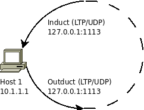
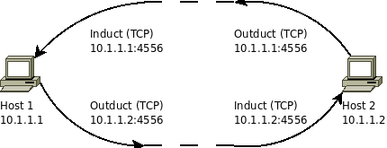
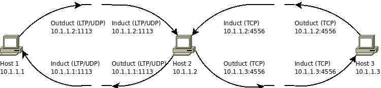

# ION Quick Start Guide

**IMPORTANT NOTE ON DUAL-STACK IPv4/IPv6 NETWORKING (ION 4.1.4-b.1 and later)**: The dual-stack IPv4/IPv6 capability will automatically use the network address family returned by hostname resolution. Most operating systems return IPv6 addresses first when available, and ION's network stack will use the first entry returned. If a host is not properly configured for the returned address family, this may cause network address family conflicts, resulting in connection failures for TCP, UDP, and LTPCLA (which runs over UDP). The most reliable approach is to use explicit IP addresses if known. If using hostnames, ensure all hosts resolve to the correct address family as the first entry in DNS resolution.

- [ION Quick Start Guide](#ion-quick-start-guide)
  - [Installing ION on Linux, MacOS, Solaris](#installing-ion-on-linux-macos-solaris)
    - [Build ION 4.1.3 (and earlier versions) without actual cipher suite](#build-ion-413-and-earlier-versions-without-actual-cipher-suite)
    - [Build ION 4.1.3s (and later version) with interface to actual cipher suite](#build-ion-413s-and-later-version-with-interface-to-actual-cipher-suite)
      - [Building ION to use the MBEDTLS cipher suite](#building-ion-to-use-the-mbedtls-cipher-suite)
    - [MAC and FreeBSD](#mac-and-freebsd)
    - [Adding Other Compile Time Switches](#adding-other-compile-time-switches)
    - [BPSec Logging](#bpsec-logging)
    - [Alternative Build Methods without Automake](#alternative-build-methods-without-automake)
      - [Method 1: Using Development Makefiles](#method-1-using-development-makefiles)
        - [Build Individual Packages](#build-individual-packages)
      - [Method 2: Using the ion-core Package](#method-2-using-the-ion-core-package)
  - [Running ION](#running-ion)
    - [Quick Setup with ionrun (Recommended for Beginners)](#quick-setup-with-ionrun-recommended-for-beginners)
    - [Check Installed BP and ION versions](#check-installed-bp-and-ion-versions)
    - [Try the 'bping' test](#try-the-bping-test)
    - [Setup a UDP Session on Two Hosts](#setup-a-udp-session-on-two-hosts)
  - [Run a bpdriver-bpcounter test](#run-a-bpdriver-bpcounter-test)
  - [Running multiple ION instances on a single host](#running-multiple-ion-instances-on-a-single-host)
  - [Check the ion.log](#check-the-ionlog)
  - [bpacq and ltpacq files](#bpacq-and-ltpacq-files)
  - [Forced Shutdown of ION](#forced-shutdown-of-ion)
  - [Additional Tutorials](#additional-tutorials)
    - [ION Configuration File Tutorial](#ion-configuration-file-tutorial)
    - [ION Configuration File Template](#ion-configuration-file-template)
    - [ION NASA Course](#ion-nasa-course)
  - [Three ION Configuration File Examples](#three-ion-configuration-file-examples)
    - [Single-Node Loopback](#single-node-loopback)
      - [FILE: loopback.rc](#file-loopbackrc)
    - [Two-Node Network](#two-node-network)
      - [FILE: host1.rc](#file-host1rc)
      - [FILE: host2.rc](#file-host2rc)
    - [Three-Node Relay](#three-node-relay)
      - [FILE: host1.rc (3-node network)](#file-host1rc-3-node-network)
      - [FILE: host2.rc (3-node network)](#file-host2rc-3-node-network)
      - [FILE: host3.rc (3-node network)](#file-host3rc-3-node-network)
  - [Accessing ION Open-Source Code Repository](#accessing-ion-open-source-code-repository)
    - [Releases](#releases)
    - [Using the code repository](#using-the-code-repository)
  - [Open Source Development and Support](#open-source-development-and-support)
  - [Updated IPN-URI Format Support (ION 4.1.4-a.2)](#updated-ipn-uri-format-support-ion-414-a2)

## Installing ION on Linux, MacOS, Solaris

The recommended method to install ION on most Linux-based systems is to use the `automake` ecosystem. For this, you will need to make sure the following packages are installed and updated:

- `automake`
- `autoconf`
- `libtool`
- `m4`
- `gcc`
- `make`
- `pkg-config`

Depending on the Linux distribution, the package names may differ. To install packages on Debian-based systems, run:

`sudo apt-get update && sudo apt-get install automake autoconf libtool m4 gcc make pkg-config`

To verify the installation, run:

`automake --version`

`autoconf --version`

`libtool --version`

`m4 --version`

`gcc --version`

`make --version`

`pkg-config --version`

to check for proper installation.

NOTE: Alternative build methods without the `automake` ecosystem are also available. See section [Alternative Build Methods without Automake](#alternative-build-methods-without-automake) for details.

### Build ION 4.1.3 (and earlier versions) without actual cipher suite

To build and install the entire ION system on a Linux, MacOS, or Solaris platform, cd into ion-open-source and enter the following commands:

`./configure`

If configure is not present run: `autoreconf -fi` first

`make`

`sudo make install`

Optionally, to run certain c-based regression tests, you need to build the test program from C code first. To do that, run:

`make test`

Then update the shared library cache of the linker:

`sudo ldconfig`

### Build ION 4.1.3s (and later version) with interface to actual cipher suite

If you are not planning to use BPSec's interface to the MBEDTLS cipher suite, you can simply follow the build instruction for ION 4.1.3.

#### Building ION to use the MBEDTLS cipher suite

Before building ION, you should build and install MBEDTLS first. Download [MBEDTLS release 2.28.8 from GitHub.](https://github.com/Mbed-TLS/mbedtls/releases/tag/v2.28.8)

Assume you place the files in your home directory under `$HOME/mbedtls-2.28.2`. Now do the following:

1. Modify the file under `$HOME/mbedtls-2.28.2/include/mbedtls/config.h`
   - Uncomment the line `#define MBEDTLS_NIST_KW_C` and save the file.

2. Return to the root folder of MBEDTLS `$HOME/mbedtls-2.28.2` and build the shared libraries: `make SHARED=1`
3. Optionally, run `make check` to execute self-test on the MBEDTLS libraries.
4. Install MBEDTLS shared library: `sudo make install`
    - The default library installation locations are `/usr/local/lib` and `/usr/local/include`. After the installation, verify the location of the library and header files. If the MBEDTLS shared libraries are not copied into the above locations, then make a note of the full path to the actual library and header files, which will need to be provided to ION during compilation.

Now we are ready to install ION. For the `./configure` command you need to enable MBEDTLS cipher suite interface using the `--enable-crypto-mbedtls` option. In addition, you may also optionally add the `--enable-bpsec-debugging` flag if you plan to run the BPSec related regression tests.

If the MBEDTLS library is not installed under the `/usr/local` prefix, then you will need to provide the path to the MBEDTLS library explicitly to ION by adding `MBED_LIB_PATH=<path-to-mbedtls-sharedlibrary> MBED_INC_PATH=<path-to-mbedtls-header-files>` to the `./configure` command.

After running `./configure` with the appropriate options/flags, you can build ION in the same way by:

`make`

`sudo make install`

`make test` (optional)

`sudo ldconfig`

To clean up compilation artifacts such as object files and shared libraries stored within the ION open-source directory, cd to the ION open-source directory and run:

`make clean`

To remove executables and shared libraries installed in the system, run:

`sudo make uninstall`

### MAC and FreeBSD

For MacOS, the `ldconfig` command is not present and not necessary.

For MacOS and FreeBSD, prior to building ION, you should check whether there is sufficient system resource to run ION by running the `sysctl_script.sh` script in ION's root directory.

### Adding Other Compile Time Switches

If you want to set additional compile-time switches for a build, the place to do this is to add them to the `./configure` command. To see a list of supported ION compiler options, see the explanation provided by:

`./configure -h`

By default, Bundle Protocol V7 will be built and installed. Starting with ION 4.1.4-a.2, BPv6 has been removed from the codebase. All users must use BPv7 for ION 4.1.4 or later.

To build ION with enhanced watch character support, use the `--enable-ewchar` option.

For minimal builds targeting resource-constrained environments, ION 4.1.4-b.1 introduces options to selectively disable optional convergence layer modules:

- `--disable-dgr` - Disable the DGR (Datagram Retransmission) convergence layer
- `--disable-bssp` - Disable the BSSP (Bundle Streaming Service Protocol) convergence layer

These options can reduce the compiled size and runtime resource requirements when these specific convergence layers are not needed for your deployment.

For ground-based operations where operators interact with admin utilities
(ionadmin, bpadmin, etc.) via terminal, the `--enable-commandline-history`
option enables command-line history and editing (arrow keys to recall
previous commands). This feature is **not recommended for flight builds**
as it uses dynamic memory allocation. See the
[ION Deployment Guide](ION-Deployment-Guide.md#input_history-configure-option---enable-commandline-history)
for details.

#### AddressSanitizer build (`--enable-asan`)

For debugging memory errors (heap corruption, use-after-free, wild/NULL
dereferences) during development or stress testing, ION can be built with
[AddressSanitizer](https://github.com/google/sanitizers/wiki/AddressSanitizer):

`./configure --enable-asan CFLAGS='-O1 -g'`

This adds `-fsanitize=address` to the compile and link flags. **It is a
debug/diagnostic build only** (roughly 2× CPU and 3× memory overhead) and is
**not for flight builds**. The ASan runtime library must be installed first
(`libasan`; on RHEL/Oracle Linux `sudo dnf install -y libasan`).

Recommendations and caveats:

- **Pass `CFLAGS='-O1 -g'`.** ION's default `-O2` inlines heavily and makes
  crash backtraces (core/gdb) misleading; `-O1` keeps stacks trustworthy while
  staying much faster than `-O0`. Because `CFLAGS` is applied after the build's
  own flags, a plain `--enable-asan` would otherwise still compile at `-O2`.
- ION is **multi-process** (daemons are spawned), so export `ASAN_OPTIONS`
  before starting ION. Set `log_path=<dir>/asan` so each process writes its
  report to `<dir>/asan.<pid>` (daemon stderr is otherwise hard to capture), and
  `detect_leaks=0` to suppress leak-checker noise from ION's long-lived daemons
  and shared-memory pools. Example:
  `export ASAN_OPTIONS="log_path=/var/log/ion-asan/asan:detect_leaks=0:abort_on_error=1"`
- ION's working memory (PSM) and SDR heap are **custom shared-memory allocators
  that ASan does not instrument**, so a use-after-free of an object *inside*
  those regions may not be reported as `heap-use-after-free`; ASan will still
  catch the resulting invalid dereference. For allocations within PSM, use ION's
  own `PSM_TRACE`/`sptrace` facility.
- When built with ASan, ION's in-process fatal-signal handler is automatically
  disabled so that AddressSanitizer owns crash reporting.

To introduce customized build flags, you can add them via the `./configure` in this manner:

`./configure CFLAGS="<string of compiler options>"`

For example, the `GDSLOGGER` and `GDSWATCHER` options are software hooks that add timestamps to ion.log and write timestamped watch characters to a file for analysis. Each requires a corresponding `.c` file to be in the compiler's include path. ION ships `gdswatcher.c` in `tools/gdswatcher/`; a full-featured `gdslogger.c` for ground systems is in `tools/gdslogger/` (a stripped-down RTEMS version also exists in `arch-rtems/`). See the [ION Deployment Guide](ION-Deployment-Guide.md) for details on both versions.

To enable these features, point `-I` at the directories containing the respective `.c` files:

`./configure CFLAGS="-DGDSWATCHER -Itools/gdswatcher -DGDSLOGGER -I<path to folder containing gdslogger.c>"`

### BPSec Logging

The BPSec implementation in ION provides 4 levels of debugging/logging:

__Function entry/exit logging__:  This logs the entry and exit of all major functions in the bpsec library and is useful for confirming control flow through the bpsec module.

__Information logging__:  Information statements are peppered through the code to provide insight into the state of the module at processing points considered useful by bpsec module software engineers.

__Warning logging__:  Warning statements are used to flag unexpected values that, based on runtime context, may not constitute errors.

__Error logging__:  Errors are areas in the code where some sanity check or other required condition fails to be met by the software. Error logging within the BPSec module is of the form:

```text
<id> <function name>: <message>
```

Where `id` is one of:

- `+` (function entry)
- `-` (function exit)
- `i` (information statement)
- `?` (warning statement)
- `x` (error statement)

To help users quickly verify their BP security configurations and operations are correct, the default BPSec logging level is set to 4 to provide per bundle status updates in _ion.log_. This is also the level required for running the python-based BPSec regression tests in the ION distribution. This level of verbosity may be too high for operation or too low for in-depth debugging. Therefore, when needed, you can recompile ION to turn BPSec logging off or set a specific logging level based on your needs.

To run BPSec logging at default level, run

```bash
./configure --enable-bpsec-logging
```

To run BPSec without logging, simply omit the `--enable-bpsec-logging` option.

To run BPSec logging at a specific level (1, 2, 3, or 4 - note 4 is the least verbose), run

```bash
./configure --enable-bpsec-logging=x
```

Where `x` is the desired logging level.

To enable the MBEDTLS cipher suite, you need to also add the `--enable-crypto-mbedtls` option when running the `./configure` script.

### Alternative Build Methods without Automake

If you do not wish to use the automake build system, you can build ION by using a set of development Makefiles or use the `ion-core` package.

#### Method 1: Using Development Makefiles

The ION distribution provides a set of Makefiles that does not rely on the automake system. This set of Makefiles is used by ION developers on Linux-based OS to offer more flexibility for compiling and debugging.

Currently, the only actively maintained platform-specific development Makefile set is for 64-bit Linux under the "x86_64-linux" folder in each module. If you choose this option, be aware of the following limitations:

For ION 4.1.1, 4.1.2 and 4.1.3:

- The development Makefiles are hierarchical. There is a top-level Makefile in the ION root directory and a set of Makefiles in the individual ION modules, under the "x86_64-linux" subfolder. If you run `./configure` command, it will switch to the automake system and all development Makefiles will be renamed from `Makefile` to `Makefile.dev`.
  - If you used the automake system and want to revert to the development Makefiles, you should first run `make clean` and `make uninstall` to completely remove ION from the system because the two compilation method builds organizes shared libraries differently. Then you can either run `git stash` to restore the old Makefiles or simply pull a fresh copy of the code from the repo.
- The development Makefiles, as they are, provide only the default compilation options - similar to running `./configure` with no arguments. If you need to set specific compiler flags, you need to modify the Makefiles directly or pass an `ADD_FLAGS` argument to the `make all` command.
- The default directory for installation is `/usr/local/`, which usually requires sudo privilege. To override the installation prefix, change the value of `OPT` in the top-level Makefile of each package.
- **The development Makefiles cannot reliably support parallel builds. Always build serially with `make all` — do not pass `-j`/`--jobs`.** The hierarchy does not declare complete inter-target/inter-module dependencies, so under parallel make a library and an executable that links it can build out of order, producing intermittent link failures (for example `cannot find -ltc` or `cannot find -lcfdp`). If you need a parallel build, use the automake system (`./configure && make -j`), which is the supported path for parallelism.

To build using the development Makefiles, cd to the ION root directory and run:

`make all`

OR if you need to set specific compiler flags, run:

`make all ADD_FLAGS="<string of compiler options>"`

Note: The `make all` command builds all ION executables and libraries to local `bin/` and `lib/` subdirectories within each module. To install these to the system directories (default: `/usr/local/`), run:

`sudo make install && sudo ldconfig`

To uninstall ION, run:

`sudo make uninstall`

To remove all build artifacts, run:

`make clean`

For ION 4.1.3s and later:

- ION will be released without any Makefile. The default build method is automake. You run the `./configure` command to create a single Makefile in the ION root directory.
- If you want to switch to use the development Makefiles, you need to first run `make clean` and `make uninstall` to completely remove ION from the system because the two compilation method builds organizes shared libraries differently. Then you can run the script `enable_manual_build.sh` to clear the automake build system and replace it with the development Makefiles.

##### Build Individual Packages

It's also possible to build the individual packages of ION, using the development Makefiles in the package subdirectories. If you choose this option, be aware of the dependencies among the packages:

- The "ici" package must be built (run `make` and `make install`) before any other package.
- The "bp" package is dependent on "dgr", "ltp", and "bssp" as well as "ici"
- The "cfdp", "ams", "bss", and "dtpc" packages are dependent on "bp"
- The "restart" package is dependent on "cfdp", "bp", "ltp", and "ici"

For more detailed instruction on building ION, see section 2 of the "ION Design and Operation Guide" document that is distributed with this package.

Additional details are provided in the README.txt files in the root directories of the subsystems.

All Makefiles are for gmake; on a FreeBSD platform, be sure to install gmake before trying to build ION.

#### Method 2: Using the ion-core Package

The `ion-core` package contains only a subset of essential BP functionalities - particularly those features that are more stable and have been deployed for operations previously. The `ion-core` package can be [downloaded here](https://github.com/nasa-jpl/ion-core). Please follow the `README.md` file there for installation instructions.

## Running ION

### Quick Setup with ionrun (Recommended for Beginners)

The easiest way to get started with ION is using the `ionrun` utility. It interactively generates configuration files and launches ION in a working directory of your choosing.

**Loopback test (single node):**

```bash
# Create a working directory and start the wizard
ionrun ~/my-first-ion

# Select: 1) Loopback, accept defaults for name/ID, pick a convergence layer
# ION starts automatically after config generation
```

Once ION is running, test it:

```bash
cd ~/my-first-ion
bpsink ipn:1.1 &
echo "Hello DTN" | bpsource ipn:1.1
# You should see: "ION event: Payload delivered."
```

Stop ION when done:

```bash
ionrun -s ~/my-first-ion
```

**Two-node network across hosts:**

```bash
# Generate config (on either host)
ionrun -g ~/ion-2node
# Select: 2) 2-node, enter names, IPN IDs, and IP addresses for each host

# Copy ~/ion-2node to both hosts, then:
ionrun -n host1 ~/ion-2node    # on first host
ionrun -n host2 ~/ion-2node    # on second host
```

`ionrun` supports loopback, 2-node, and 3-node topologies (both across hosts and on the same host) with LTP, TCP, and UDP convergence layers, and allows custom port numbers.

**Two nodes on the same host (no second machine needed):**

```bash
ionrun -g ~/ion-2local
# Select: 4) 2-node (same host), accept defaults

# Start each node in a separate terminal:
ionrun -n node1 ~/ion-2local    # terminal 1
ionrun -n node2 ~/ion-2local    # terminal 2
```

See the [ionrun documentation](./ionrun.md) for full details and examples.

### Check Installed ION version

Check the ION version installed by running:

`ionadmin`

At the ":" prompt, please enter the single character command 'v' and you should see a response like this:

```bash
 $ ionadmin
: v
ION-OPEN-SOURCE-4.1.2
```

Then type 'q' to quit ionadmin. While ionadmin quits, it may display certain error messages like this:

```text
at line 427 of ici/library/platform_sm.c, Can't get shared memory segment: Invalid argument (0)
at line 312 of ici/library/memmgr.c, Can't open memory region.
at line 367 of ici/sdr/sdrxn.c, Can't open SDR working memory.
at line 513 of ici/sdr/sdrxn.c, Can't open SDR working memory.
at line 963 of ici/library/ion.c, Can't initialize the SDR system.
Stopping ionadmin.
```

This is normal due to the fact that ION has not launched yet.

### Try the 'bping' test

The `tests` directory contains regression tests used by system integrator to check ION before issuing each new release. To make sure ION is operating properly after installation, you can also manually run the bping test:

First enter the test directory: `cd tests`

Enter the command: `./runtests bping/`

This command invokes one of the simplest test whereby two ION instances are created and a ping message is sent from one to the other and an echo is returned to the sender of the ping.

During test, ION will display the configuration files used, clean the system of existing ION instances, relaunch ION according to the test configuration files, execute bping actions, display texts that indicates what the actions are being executed in real-time, and then shutdown ION, and display the final test status message, which looks like this:

```bash
ION node ended. Log file: ion.log
TEST PASSED!

passed: 1
    bping

failed: 0

skipped: 0

excluded by OS type: 0

excluded by BP version: 0

obsolete tests: 0
```

In this case, the test script confirms that ION is able to execute a bping function properly.

See the [ION Testset Readme](./ION-TestSet-Readme.md) for more information on how to run the regression tests.

### Setup a UDP Session on Two Hosts

In this section we use `ionrun` to quickly set up a two-node UDP network across two hosts. We assume host A has IP address 192.168.0.2 and host B has IP address 192.168.0.3. Install ION on both hosts and verify the installation as described in earlier sections.

#### Pre-flight checks

Before launching ION, verify connectivity between the two hosts:

1. Use `iperf` or `netcat` to confirm the link is working. You want a sufficiently high data rate and low loss rate (low single-digit percent or less).
2. If the measured data rate is significantly below 800 Mbps, you may want to edit the generated `ionrun.rc` and reduce the contact rate in the `a contact` commands. Note that the unit in ION is **bytes per second**, not bits per second.
3. If loss is high, check the physical connection, kernel buffer settings, firewall rules, and MTU settings.
4. Wireshark can be helpful for diagnosing connectivity issues.

#### Generate configuration

On either host, run `ionrun` with the `--generate-only` flag:

```bash
ionrun -g ~/ion-udp-2node
```

The wizard will prompt you. Enter the following:

```text
Topology [1-3]: 2

--- Node 1 ---
  Name [node1]: hostA
  IPN node ID [1]: 1
  IP address [127.0.0.1]: 192.168.0.2

--- Node 2 ---
  Name [node2]: hostB
  IPN node ID [2]: 2
  IP address [127.0.0.1]: 192.168.0.3

Select convergence layer:
  Choice [1-3]: 3
  Port [4556]:
```

This generates two files in `~/ion-udp-2node/`:

- `ionrun.rc` - combined configuration for both nodes (tagged sections)
- `ionrun.meta` - metadata for `ionrun` to re-launch

#### Launch ION on both hosts

Copy the `~/ion-udp-2node/` directory to both host A and host B. Then start each node:

```bash
# On host A (192.168.0.2):
ionrun -n hostA ~/ion-udp-2node

# On host B (192.168.0.3):
ionrun -n hostB ~/ion-udp-2node
```

You should see output confirming that ION has started. Additional status information is written to the `ion.log` file in the working directory.

## Run a bpdriver-bpcounter test

Now that ION is running on both hosts, let’s send some data using the `bpdriver` and `bpcounter` test utilities. This pair of programs sends bundles from one node to another and measures throughput.

On host B, start the receiver:

```bash
bpcounter ipn:2.2 3
```

This tells ION node 2 (host B) to wait for 3 bundles on endpoint `ipn:2.2`.

On host A, send the bundles:

```bash
bpdriver 3 ipn:1.2 ipn:2.2 -10000
```

This sends 3 bundles of 10,000 bytes each from endpoint `ipn:1.2` (host A) to `ipn:2.2` (host B). The "-" prefix on the size means bpdriver sends continuously without waiting for responses.

When the test completes, you will see throughput statistics on both sides.

**Note on throughput reporting:** The sending side may report very high throughput because `bpdriver` measures how fast the application pushes data into the bundle protocol agent, which can buffer data. The `bpcounter` throughput on the receiving side is a more accurate measure of end-to-end delivery speed. A "pilot" bundle is sent first to synchronize the timing.

If you want to throttle the sending rate, use the `i` option to specify a rate in bits per second.

**Stop ION** when done:

```bash
# On each host:
ionrun -s ~/ion-udp-2node
```

For more about these and other ION test utilities (`bpecho`, `bping`, `bpsource`, `bpsink`, `bpsendfile`, `bprecvfile`), consult their man pages.

## Running multiple ION instances on a single host

The regression tests under the `tests/` and `demos/` directories often launch 2 or 3 ION nodes on the same host. While necessary for automated testing, this is not a typical configuration for new users.

Running multiple ION instances on one host requires unique IPC keys (`wmKey`) and SDR names (`sdrName`) for each instance, along with proper shell environment setup. See the ION Deployment Guide for details.

We recommend that most users run each ION instance on a separate host or VM.

## Check the ion.log

To confirm whether ION is running properly or has experienced an error, the first thing to do is to check the ion.log, which is a file created in the directory from which ION was launched. If an ion.log file exists when ION starts, it will simply append additional log entries into that file. Each entry has a timestamp to help you determine the time and the relative order in which events occurred.

When a serious error occurs, ion.log will have detailed messages that can pinpoint the name and line number of the source code where the error was reported or triggered.

## bpacq and ltpacq files

Sometimes after operating ION for a while, you will notice a number of files with names such as "bpacq" or "ltpacq" followed by a number. These are temporary files created by ION to stage bundles or LTP blocks during reception and processing.  Once a bundle or LTP block is completely constructed, delivered, or cancelled properly, these temporary files are automatically removed by ION. But if ION experiences an anomalous shutdown, then these files may remain and accumulate in the local directory.

It is generally safe to remove these files between ION runs. Their presence does not automatically imply issues with ION but can indicate that ION operations were interrupted for some reason. By noting their creation time stamp, it can provide clues on when these interruptions occurred. Right now there are no ION utility programs to parse them because these files are essentially bit buckets and do not contain internal markers or structure that would allow users to parse them or extract information by processes outside the bundle agents that created them in the first place.

## Forced Shutdown of ION

Sometimes shutting down ION does not go smoothly and you can't seem to relaunch ION properly. In that case, you can use the global `ionstop` script (or the `killm` script) to kill all ION processes that did not terminate using local ionstop script. The global ionstop or killm scripts also clears out the IPC shared memory and semaphores allocations that were locked by ION processes and would not terminate otherwise.

## Additional Tutorials

### ION Configuration File Tutorial

To learn about the configuration files and the basic set of command syntax and functions:
[ION Config File Tutorial](./Basic-Configuration-File-Tutorial.md)

### ION Configuration File Template

[ION Config File Template](./ION-Config-File-Templates.md)

### ION NASA Course

To learn more about the design principle of ION and how to use it, a complete series of tutorials is available here:
[NASA ION Course](https://www.nasa.gov/directorates/heo/scan/engineering/technology/disruption_tolerant_networking_software_options_ion)

The ION Dev Kit mentioned in the NASA ION Course had been deprecated. However, some additional helpful files can be found here to complete the examples:
[Additional DevKit Files](https://sourceforge.net/p/ion-dtn/wiki/DevKit%20-%20additional%20materials/)

## Three ION Configuration File Examples

In this section, we provide three configuration file examples with detailed comments explaining the configuration commands. The three examples are:

- Single Node Loopback over LTP
- Two Nodes over TCPCL
- Three Node with a relay using LTP and TCPCL

### Single-Node Loopback



Here is an example configuration file for "loopback.rc" using LTP as the primary convergence layer:

#### FILE: loopback.rc

```text
## Run the following command to start ION node:
##  % ionstart -I "loopback.rc"

## begin ionadmin
# Initialize node 1 with default SDR configuration
1 1
s

# Add contact and range (loopback, +1 to +3600 seconds, 100000 bytes/sec, 1 sec OWLT)
a contact +1 +3600 1 1 100000
a range +1 +3600 1 1 1

# Set production and consumption rates
m production 1000000
m consumption 1000000
## end ionadmin

## begin ltpadmin
# Initialize LTP with 32 sessions
1 32

# Add span for node 1 (10 sessions, 1400 byte segments, 10000 byte blocks, 1 sec aggregation)
a span 1 10 10 1400 10000 1 'udplso localhost:1113'

# Start LTP with UDP listener on port 1113
s 'udplsi localhost:1113'
## end ltpadmin

## begin bpadmin
# Initialize BP
1

# Add IPN scheme
a scheme ipn 'ipnfw' 'ipnadminep'

# Add endpoints
a endpoint ipn:1.0 q
a endpoint ipn:1.1 q
a endpoint ipn:1.2 q

# Add LTP protocol (1400 byte payload, 100 byte overhead)
a protocol ltp 1400 100

# Add LTP induct and outduct
a induct ltp 1 ltpcli
a outduct ltp 1 ltpclo

# Start bundle protocol engine
s
## end bpadmin

## begin ipnadmin
# Add egress plan for node 1
a plan 1 ltp/1
## end ipnadmin
```

### Two-Node Network



In this section, we assume that host1 has an IP address of 10.1.1.1 and host2 has an IP address of 10.1.1.2. Please modify this for your uses.

Note that this example network uses a different convergence layer: TCP.

#### FILE: host1.rc

```text
## Run the following command to start ION node:
## % ionstart -I "host1.rc"

## begin ionadmin
# Initialize node 1 with default SDR configuration
1 1
s

# Add contacts (unidirectional, 100000 bytes/sec)
a contact +1 +3600 1 1 100000
a contact +1 +3600 1 2 100000
a contact +1 +3600 2 1 100000
a contact +1 +3600 2 2 100000

# Add ranges (bidirectional, 1 sec OWLT)
a range +1 +3600 1 1 1
a range +1 +3600 2 2 1
a range +1 +3600 2 1 1

# Set production and consumption rates
m production 1000000
m consumption 1000000
## end ionadmin

## begin bpadmin
# Initialize BP
1

# Add IPN scheme
a scheme ipn 'ipnfw' 'ipnadminep'

# Add endpoints (discard behavior 'x')
a endpoint ipn:1.0 x
a endpoint ipn:1.1 x
a endpoint ipn:1.2 x

# Add TCP protocol (1400 byte payload, 100 byte overhead)
a protocol tcp 1400 100

# Add TCP induct (listen on port 4556)
a induct tcp 10.1.1.1:4556 tcpcli

# Add TCP outducts (to self and host2)
a outduct tcp 10.1.1.1:4556 tcpclo
a outduct tcp 10.1.1.2:4556 tcpclo

# Start bundle protocol engine
s
## end bpadmin

## begin ipnadmin
# Add egress plans
a plan 1 tcp/10.1.1.1:4556
a plan 2 tcp/10.1.1.2:4556
## end ipnadmin
```

#### FILE: host2.rc

```text
## Run the following command to start ION node:
##  % ionstart -I "host2.rc"

## begin ionadmin
# Initialize node 2 with default SDR configuration
1 2
s

# Add contacts (unidirectional, 100000 bytes/sec)
a contact +1 +3600 1 1 100000
a contact +1 +3600 1 2 100000
a contact +1 +3600 2 1 100000
a contact +1 +3600 2 2 100000

# Add ranges (bidirectional, 1 sec OWLT)
a range +1 +3600 1 1 1
a range +1 +3600 2 2 1
a range +1 +3600 2 1 1

# Set production and consumption rates
m production 1000000
m consumption 1000000
## end ionadmin

## begin bpadmin
# Initialize BP
1

# Add IPN scheme
a scheme ipn 'ipnfw' 'ipnadminep'

# Add endpoints (discard behavior 'x')
a endpoint ipn:2.0 x
a endpoint ipn:2.1 x
a endpoint ipn:2.2 x

# Add TCP protocol (1400 byte payload, 100 byte overhead)
a protocol tcp 1400 100

# Add TCP induct (listen on port 4556)
a induct tcp 10.1.1.2:4556 tcpcli

# Add TCP outducts (to self and host1)
a outduct tcp 10.1.1.2:4556 tcpclo
a outduct tcp 10.1.1.1:4556 tcpclo

# Start bundle protocol engine
s
## end bpadmin

## begin ipnadmin
# Add egress plans
a plan 2 tcp/10.1.1.2:4556
a plan 1 tcp/10.1.1.1:4556
## end ipnadmin
```

### Three-Node Relay



In this section, we assume that host1 has an IP address of 10.1.1.1, host2 has an IP address of 10.1.1.2, and host3 has an IP address of 10.1.1.3. Please modify this for your uses.

You will notice that this network uses host2 as a router in between host1 and host3. At this point, routing is handled by creating a group from the remote node and using the middle node as the gateway. Notice how host1 will take traffic for host3 and transmit it on the same outduct to host2, the next hop. Host3 will transmit traffic destined for host1 on the outduct for host2, also the next hop.

Also note that this network uses both LTP and TCP convergence layers.

#### FILE: host1.rc (3-node network)

```text
## Run the following command to start ION node:
##  % ionstart -I "host1.rc"

## begin ionadmin
# Initialize node 1 with default SDR configuration
1 1
s

# Add contacts for 3-node network (topology: 1--2--3)
a contact +1 +3600 1 1 100000
a contact +1 +3600 1 2 100000
a contact +1 +3600 2 1 100000
a contact +1 +3600 2 2 100000
a contact +1 +3600 2 3 100000
a contact +1 +3600 3 2 100000
a contact +1 +3600 3 3 100000

# Add ranges (1 sec OWLT for neighbors, 2 sec for node 1 to 3)
a range +1 +3600 1 1 1
a range +1 +3600 1 2 1
a range +1 +3600 1 3 2
a range +1 +3600 2 2 1
a range +1 +3600 2 3 1
a range +1 +3600 3 3 1

# Set production and consumption rates
m production 1000000
m consumption 1000000
## end ionadmin

## begin ltpadmin
# Initialize LTP with 32 sessions
1 32

# Add LTP spans (to self and host2)
a span 1 10 10 1400 10000 1 'udplso 10.1.1.1:1113'
a span 2 10 10 1400 10000 1 'udplso 10.1.1.2:1113'

# Start LTP with UDP listener on port 1113
s 'udplsi 10.1.1.1:1113'
## end ltpadmin

## begin bpadmin
# Initialize BP
1

# Add IPN scheme
a scheme ipn 'ipnfw' 'ipnadminep'

# Add endpoints (discard behavior 'x')
a endpoint ipn:1.0 x
a endpoint ipn:1.1 x
a endpoint ipn:1.2 x

# Add LTP protocol (1400 byte payload, 100 byte overhead)
a protocol ltp 1400 100

# Add LTP induct and outducts
a induct ltp 1 ltpcli
a outduct ltp 1 ltpclo
a outduct ltp 2 ltpclo

# Start bundle protocol engine
s
## end bpadmin

## begin ipnadmin
# Add egress plans for nodes 1 and 2
a plan 1 ltp/1
a plan 2 ltp/2

# Add group route: send bundles for node 3 via node 2 (gateway)
a group 3 3 ipn:2.0
## end ipnadmin
```

#### FILE: host2.rc (3-node network)

```text
## Run the following command to start ION node:
##  % ionstart -I "host2.rc"

## begin ionadmin
# Initialize node 2 with default SDR configuration
1 2
s

# Add contacts for 3-node network (topology: 1--2--3)
a contact +1 +3600 1 1 100000
a contact +1 +3600 1 2 100000
a contact +1 +3600 2 1 100000
a contact +1 +3600 2 2 100000
a contact +1 +3600 2 3 100000
a contact +1 +3600 3 2 100000
a contact +1 +3600 3 3 100000

# Add ranges (1 sec OWLT for neighbors, 2 sec for node 1 to 3)
a range +1 +3600 1 1 1
a range +1 +3600 1 2 1
a range +1 +3600 1 3 2
a range +1 +3600 2 2 1
a range +1 +3600 2 3 1
a range +1 +3600 3 3 1

# Set production and consumption rates
m production 1000000
m consumption 1000000
## end ionadmin

## begin ltpadmin
# Initialize LTP with 32 sessions
1 32

# Add LTP spans (to host1 and self)
a span 1 10 10 1400 10000 1 'udplso 10.1.1.1:1113'
a span 2 10 10 1400 10000 1 'udplso 10.1.1.2:1113'

# Start LTP with UDP listener on port 1113
s 'udplsi 10.1.1.2:1113'
## end ltpadmin

## begin bpadmin
# Initialize BP
1

# Add IPN scheme
a scheme ipn 'ipnfw' 'ipnadminep'

# Add endpoints (discard behavior 'x')
a endpoint ipn:2.0 x
a endpoint ipn:2.1 x
a endpoint ipn:2.2 x

# Add protocols (LTP and TCP)
a protocol ltp 1400 100
a protocol tcp 1400 100

# Add inducts (LTP and TCP)
a induct ltp 2 ltpcli
a induct tcp 10.1.1.2:4556 tcpcli

# Add outducts (TCP to self and host3, LTP to host1)
a outduct tcp 10.1.1.2:4556 tcpclo
a outduct tcp 10.1.1.3:4556 tcpclo
a outduct ltp 1 ltpclo

# Start bundle protocol engine
s
## end bpadmin

## begin ipnadmin
# Add egress plans (node 2 uses TCP, node 3 uses TCP, node 1 uses LTP)
a plan 2 tcp/10.1.1.2:4556
a plan 3 tcp/10.1.1.3:4556
a plan 1 ltp/1
## end ipnadmin
```

#### FILE: host3.rc (3-node network)

```text
## Run the following command to start ION node:
##  % ionstart -I "host3.rc"

## begin ionadmin
# Initialize node 3 with default SDR configuration
1 3
s

# Add contacts for 3-node network (topology: 1--2--3)
a contact +1 +3600 1 1 100000
a contact +1 +3600 1 2 100000
a contact +1 +3600 2 1 100000
a contact +1 +3600 2 2 100000
a contact +1 +3600 2 3 100000
a contact +1 +3600 3 2 100000
a contact +1 +3600 3 3 100000

# Add ranges (1 sec OWLT for neighbors, 2 sec for node 1 to 3)
a range +1 +3600 1 1 1
a range +1 +3600 1 2 1
a range +1 +3600 1 3 2
a range +1 +3600 2 2 1
a range +1 +3600 2 3 1
a range +1 +3600 3 3 1

# Set production and consumption rates
m production 1000000
m consumption 1000000
## end ionadmin

## begin bpadmin
# Initialize BP
1

# Add IPN scheme
a scheme ipn 'ipnfw' 'ipnadminep'

# Add endpoints (discard behavior 'x')
a endpoint ipn:3.0 x
a endpoint ipn:3.1 x
a endpoint ipn:3.2 x

# Add TCP protocol (1400 byte payload, 100 byte overhead)
a protocol tcp 1400 100

# Add TCP induct (listen on port 4556)
a induct tcp 10.1.1.3:4556 tcpcli

# Add TCP outducts (to self and host2)
a outduct tcp 10.1.1.3:4556 tcpclo
a outduct tcp 10.1.1.2:4556 tcpclo

# Start bundle protocol engine
s
## end bpadmin

## begin ipnadmin
# Add egress plans for nodes 3 and 2
a plan 3 tcp/10.1.1.3:4556
a plan 2 tcp/10.1.1.2:4556

# Add group route: send bundles for node 1 via node 2 (gateway)
a group 1 1 ipn:2.0
## end ipnadmin
```

## Accessing ION Open-Source Code Repository

### Releases

Use the Summary or the Files tab to download point releases

### Using the code repository

There are two ways to obtain ION source code:

#### Option 1: Download ZIP file (Recommended for most users)

1. Visit the ION-DTN GitHub releases page: https://github.com/nasa-jpl/ION-DTN/releases
2. Find the desired release version (e.g., `ion-open-source-4.2.0-a.2`)
3. Click on "Assets" to expand the download options
4. Download the source code archive:
   - `Source code (zip)` for ZIP format
   - `Source code (tar.gz)` for compressed tarball format
5. Extract the downloaded archive:
   ```bash
   # For ZIP file:
   unzip ION-DTN-<version>.zip
   cd ION-DTN-<version>

   # For tar.gz file:
   tar -xzf ION-DTN-<version>.tar.gz
   cd ION-DTN-<version>
   ```
6. Proceed with the build instructions in [Installing ION on Linux, MacOS, Solaris](#installing-ion-on-linux-macos-solaris)

#### Option 2: Clone the Git repository

For developers who want to track the latest development or contribute to ION:

```bash
# Clone the repository
git clone https://github.com/nasa-jpl/ION-DTN.git
cd ION-DTN

# Checkout a specific release tag (optional)
git checkout ion-open-source-4.2.0-a.2

# Or checkout a branch
git checkout integration  # For alpha/beta releases
git checkout current      # For stable releases
```

**Branch Information:**
- Track the tags for alpha, beta, and stable releases
- Stable releases are on the `current` branch
- Alpha and beta releases are on `integration` branch

## Open Source Development and Support

- Please see the [Open Source Development and Support](./community/OpenSource-Development-Support.md) document for details on governance of ION software development and ION support levels.

## Updated IPN-URI Format Support (ION 4.1.4-a.2)

Starting with ION 4.1.4-a.2, ION has been updated to support the new IPN URI
scheme defined in [RFC 9758](https://datatracker.ietf.org/doc/html/rfc9758)
as a alpha release feature. The new format is as follows:

```abnf
ipn-uri = "ipn:" [allocator-identifier "."] node-number "." service-number
```

`allocator-identifier`: An unsigned integer identifying the allocation
authority. If the authority is the default (IANA, Allocator ID 0), this
part and the following dot (.) may be omitted for brevity. ION is backward
compatible with IPN URIs that omit the allocator identifier, which is
interpreted as having the default value of 0.

For all examples in this tutorial, the allocator identifier is omitted and
defaults to 0.

New IPN URI support is under alpha testing.
