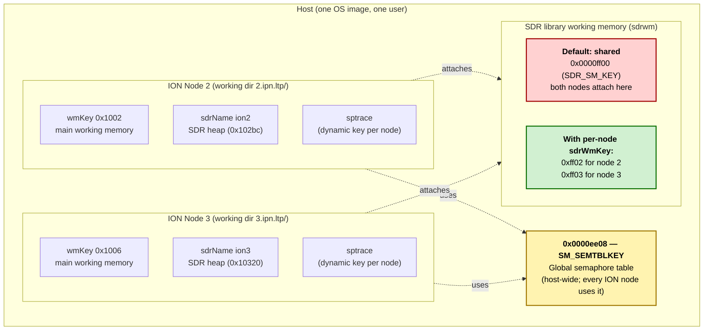
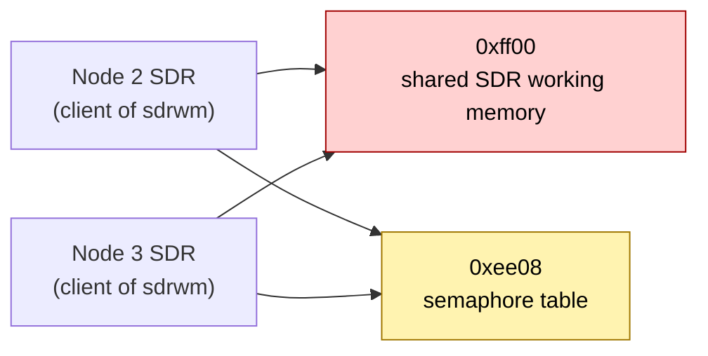
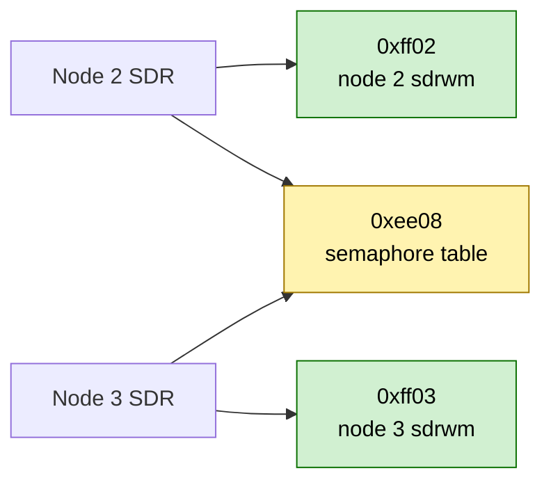

# ION Shutdown Guide

This guide provides comprehensive documentation on the various methods available for stopping ION nodes and cleaning up system resources. Understanding when and how to use each method is critical for proper ION operation.

## Overview

ION provides four primary shutdown methods, each suited for different scenarios:

| Method | Use Case | Preserves SDR | Graceful | Destructive |
|--------|----------|---------------|----------|-------------|
| **Admin Programs (`.`)** | Manual control of individual subsystems | Configurable | Yes | No |
| **ionexit** | Normal shutdown (recommended) | Optional (`k n` flags) | Yes | No |
| **killm** | Ensure clean state; backup for abnormal situations | No | Yes (via ionexit), then forced | Yes (single-node/forced mode) |
| **ionstop** | Legacy shutdown script | No | Partial | Yes |
| **Public APIs** | Embedded/programmatic control | Configurable | Yes | No |

## Shutdown Methods

### Method 1: Admin Programs with Period (`.`) Argument

This method provides fine-grained manual control over individual ION subsystems. Each admin program can be instructed to stop its associated daemons by passing `.` as a command file argument.

**Usage:**
```bash
# Stop subsystems in reverse dependency order (application layer first)
dtpcadmin .    # Stop DTPC daemons (if running)
cfdpadmin .    # Stop CFDP daemons
bpadmin .      # Stop BP daemons
ltpadmin .     # Stop LTP daemons
bsspadmin .    # Stop BSSP daemons (if running)
ionadmin .     # Stop ION core (rfxclock)
```

**When to use:**
- When you need to stop specific subsystems while keeping others running
- For debugging purposes
- When scripting custom shutdown sequences
- When troubleshooting shutdown issues

**Admin Programs Supporting `.` Shutdown:**

| Program | Subsystem | Daemons Stopped |
|---------|-----------|-----------------|
| `ionadmin .` | ION Core | rfxclock |
| `ltpadmin .` | LTP | ltpclock, ltpmeter, link service adapters |
| `bpadmin .` | BP | bpclock, forwarders, CLAs, transit daemons |
| `cfdpadmin .` | CFDP | cfdpclock, UT layer service |
| `bsspadmin .` | BSSP | bsspclock, link service adapters |
| `dtpcadmin .` | DTPC | dtpcclock, dtpcd |

### Method 2: ionexit (Recommended for Normal Shutdown)

The `ionexit` program is the recommended method for normal ION shutdown. It gracefully stops all ION daemon services in the correct dependency order while optionally preserving the SDR (Shared Data Region) state and/or IPC resources.

**Modes:**

`ionexit` has two independent flags (`k` and `n`) that can be combined, giving four distinct modes:

| Command | SDR | IPC | Restartable? | Use Case |
|---------|-----|-----|--------------|----------|
| `ionexit` | Destroyed | Destroyed | No (clean slate) | **Normal shutdown (single-node host).** Removes all ION state. Use when you want a fresh start next time, or for the *last* node in a multi-node host. |
| `ionexit k` | Preserved | Destroyed | **No** | **Forensics/inspection only.** The `.sdr` file remains on disk for examination, but IPC destruction prevents `ionstart` from reattaching. |
| `ionexit n` | Destroyed | Preserved | No (SDR gone) | **Single-node only.** Tears down SDR but keeps the host's IPC infrastructure. **Unsafe in multi-node** — see warning below. |
| `ionexit k n` | Preserved | Preserved | **Yes** | **Planned maintenance / restart, and per-node shutdown in multi-node hosts.** The only mode that allows a subsequent `ionstart` to reattach. Also the only `ionexit` form safe to run on a non-last node in a multi-node host (preserves both the shared SDR working memory and the shared IPC). |

Flags can be combined in any order.

> ⚠ **Multi-node warning:** `ionexit n` on one of several ION nodes sharing a host **will break the others.** Although `n` preserves the global semaphore table (`SM_SEMTBLKEY`, `0xee08`), the underlying `ionTerminate(1)` call still destroys the SDR working memory segment at `SDR_SM_KEY` (`0xff00`), which all ION nodes on the host share by default. Once that segment is marked for destruction, no other node can attach to it, and any node that restarts a component will create a fresh, disjoint segment at the same key — a recipe for corruption. Use `ionexit k n` for every node except the last; only the last node may run a destructive `ionexit`. See [Multi-node shutdown order and shared SDR working memory](#multi-node-shutdown-order-and-shared-sdr-working-memory) below.

**Why `ionexit k n` is required for restart:**

`ionexit k` preserves SDR data (the `.sdr` file on disk or the DRAM shared-memory segment) but still calls `sm_ipc_stop()`, which destroys the global semaphore table and sdrwm catalog. Without those IPC structures, a subsequent `ionstart` cannot cleanly reattach to the preserved SDR. The `n` flag skips `sm_ipc_stop()`, keeping both SDR data and the IPC infrastructure intact so that `ionstart` can resume normally.

**Shutdown Order:**
`ionexit` stops services in the following order (application layer first, then core):

1. **DTPC** - Delay Tolerant Payload Conditioning (if enabled)
2. **TCA** - Trusted Custody Authority instances (if enabled)
3. **TCC** - Trusted Custody Client instances (if enabled)
4. **BP** - Bundle Protocol
5. **LTP** - Licklider Transmission Protocol
6. **BSSP** - Bundle Streaming Service Protocol (if enabled)
7. **CFDP** - CCSDS File Delivery Protocol
8. **RFX** - Contact plan/range system
9. **Grace period** - 3-second wait for flag-polled processes to detect shutdown
10. **SDR** - Shared Data Region cleanup (unless `k` flag used)
11. **IPC** - Inter-process communication resources (unless `n` flag used)

#### How ionexit signals processes to stop

ION uses two distinct signaling mechanisms to stop processes during shutdown. Understanding these mechanisms is important for developers working on ION internals, writing new CLAs, or debugging shutdown issues.

**Mechanism 1: Direct SIGTERM to daemon PIDs**

Clock daemons, the transit daemon, the CPSD daemon, and certain other processes are stopped by sending SIGTERM directly to their recorded PID via `sm_TaskKill()`. These PIDs are stored in the protocol's volatile database struct in PSM (shared memory). For example:

| Process | PID field | Stop function |
|---------|-----------|---------------|
| `bpclock` | `bpvdb->clockPid` | `bpStop()` |
| `bptransit` | `bpvdb->transitPid` | `bpStop()` |
| `cpsd` | `bpvdb->cpsdPid` | `bpStop()` |
| `ltpclock` | `ltpvdb->clockPid` | `ltpStop()` |
| `ltpdeliv` | `ltpvdb->delivPid` | `ltpStop()` |
| `dtpcclock` | `dtpcvdb->clockPid` | `dtpcStop()` |
| `dtpcd` | `dtpcvdb->dtpcdPid` | `dtpcStop()` |
| CLI (induct) daemons | `vduct->cliPid` | `stopInduct()` |
| LSI (LTP induct) daemons | `vseat->lsiPid` | `stopSeat()` |
| Admin endpoint daemon | `vscheme->admAppPid` | `stopScheme()` |

These processes receive SIGTERM immediately and are expected to exit promptly. If a process does not exit within 5 seconds, it is sent SIGKILL as a fallback.

**Mechanism 2: Semaphore "end" flag (stop flag polling)**

Most ION processes — forwarders, CLO (outduct) daemons, CLM daemons, and LSO (LTP outduct) daemons — do **not** receive SIGTERM directly. Instead, they are stopped by "ending" a semaphore they are blocked on or polling.

Each of these processes runs a main loop that calls `sm_SemTake()` with a timeout (typically 1 second) on a semaphore associated with its volatile struct. For example, the `ipnfw` forwarder's main loop:

```c
while (running && !(sm_SemEnded(vscheme->semaphore)))
{
    /* forward bundles from the queue ... */
}
```

When `bpStop()` calls `sm_SemEnd(vscheme->semaphore)`, the semaphore's `ended` flag is set atomically in shared memory, and any threads/processes blocked on `sm_SemTake()` are woken via `sem_post()`. The process then sees `sm_SemEnded()` return true and exits its main loop cleanly.

The stop functions that use this mechanism include:

| Process type | Semaphore ended | Stop function |
|--------------|-----------------|---------------|
| Scheme forwarder (`ipnfw`, etc.) | `vscheme->semaphore` | `stopScheme()` |
| Endpoint application | `vpoint->semaphore` | `stopScheme()` |
| Plan CLM daemon (`bpclm`) | `vplan->semaphore` | `stopPlan()` |
| Outduct CLO daemon | `vduct->semaphore` | `stopOutduct()` |
| LTP span LSO daemon | `vspan->segSemaphore` and buffer semaphores | `stopSpan()` |
| LTP delivery | `ltpvdb->deliverySemaphore` | `ltpStop()` |
| LTP clients | `client->semaphore` | `ltpStop()` |
| DTPC SAP applications | `vsap->semaphore` | `dtpcStop()` |
| DTPC daemon (`dtpcd`) | `dtpcvdb->aduSemaphore` | `dtpcStop()` |

**Why there are two mechanisms:**

The choice of mechanism depends on the process's run-loop design:

- **Clock daemons** (`bpclock`, `ltpclock`, etc.) typically `snooze()` between iterations rather than blocking on a semaphore. They cannot detect a semaphore-end flag, so they must receive a direct signal. The SIGTERM handler in these processes sets a local `running` flag to 0, causing the main loop to exit on the next iteration.

- **Queue-draining processes** (forwarders, CLO/CLM daemons, LSO daemons) block on a semaphore waiting for work to arrive. Ending the semaphore both wakes them from the block and provides the "should I stop?" indication via the `ended` flag. This is more efficient than polling — the process sleeps until either work arrives or shutdown is signaled.

**The grace period:**

After all `*Stop()` calls have been issued and RFX has been stopped, `ionexit` waits 3 seconds (`snooze(3)`) before proceeding to `ionTerminate()` and `sm_ipc_stop()`. This grace period exists because:

1. The `*Stop()` functions **signal** processes to stop but do not wait for all of them to actually exit.
2. Flag-polled processes that are mid-iteration (not blocked on a semaphore at the moment the flag is set) need up to one timeout cycle (typically 1 second) to notice the flag.
3. Without this delay, `ionTerminate()` would destroy the SDR working memory and `sm_ipc_stop()` would destroy the global semaphores while processes still need them to detect the shutdown and exit cleanly.

**Overall ionexit shutdown timeline:**

```
Time   Action
─────  ────────────────────────────────────────────────────
 0s    ionAttach() — connect to this node's ION instance
       dtpcStop()  — SIGTERM to clock/daemon, sm_SemEnd to SAPs
       [wait up to 5s for DTPC processes]
       tcaStop(), tccStop() for each group
       [wait up to 5s for each TC group]
       bpStop() — sm_SemEnd to forwarders/CLMs/endpoints/outducts,
                  SIGTERM to bpclock/cpsd/bptransit,
                  SIGTERM to induct CLIs, SIGTERM to admAppPid
       [wait up to 5s for each process; SIGKILL fallback]
       ltpStop() — sm_SemEnd to spans/clients/delivery,
                   SIGTERM to ltpclock/ltpdeliv/LSIs
       [wait until each process exits]
       bsspStop(), cfdpStop() — similar pattern
       [wait up to 5s each]
       rfx_stop() — SIGTERM to rfxclock
       [wait up to 5s]
+~20s  Grace period: snooze(3) — let stragglers detect stop flag
+~23s  ionTerminate(1) — destroy SDR (unless "k" flag)
       sm_ipc_stop() — destroy semaphores + shared memory (unless "n" flag)
```

**When to use each mode:**

| Scenario | Command | Why |
|----------|---------|-----|
| Normal operational shutdown | `ionexit` | Clean slate; no residual state |
| Preserve state for restart | `ionexit k n` | Only mode that supports restart via `ionstart` |
| Inspect SDR after shutdown | `ionexit k` | Preserves `.sdr` file for post-mortem analysis |
| Multi-node: stop one node (others still running) | `ionexit k n` | Preserves both the shared SDR working memory (`0xff00`) and the shared IPC. **`ionexit n` is unsafe** because it destroys the shared SDR working memory. |
| Multi-node: stop the last running node | `ionexit` | Safe to release SDR working memory and IPC when no other instances remain |

**Important Notes:**
- `ionexit` operates on a single ION instance — the one associated with the current working directory. It does **not** stop other ION instances on the same host. In a multi-node environment, each node must be shut down individually by running `ionexit` from that node's working directory. To stop **all** ION instances at once, use `killm f` instead, which sends SIGTERM/SIGKILL to all ION processes and cleans up all IPC resources unconditionally.
- **Multi-node shutdown order is critical.** When shutting down individual nodes on a shared host, use `ionexit k n` for every node until only the last node remains, then use `ionexit` (without flags) for the final node. The `k` flag preserves the global SDR working memory (shared by all instances) and the `n` flag preserves the global IPC semaphores. Destroying either resource prematurely prevents remaining nodes from attaching or detecting the shutdown signal. **Do not substitute `ionexit n` for `ionexit k n`** in multi-node shutdown: `n` only protects the IPC semaphore table (`0xee08`), but the destructive `ionTerminate(1)` invoked by `ionexit n` still tears down the shared SDR working memory (`0xff00`), corrupting the remaining nodes. See [Multi-node shutdown order and shared SDR working memory](#multi-node-shutdown-order-and-shared-sdr-working-memory) below.
- User applications attached to ION must detach separately
- Custom services started by the user must be stopped manually
- All modes stop all ION daemon processes for the current node; only SDR data and IPC resources are optionally preserved

#### Multi-node shutdown order and shared SDR working memory

##### How multiple ION nodes share IPC on one host

When two or more ION nodes run on the same host, exactly one resource is unconditionally host-global, several are per-node, and one — the SDR library's own working memory — is **configurable**: shared across nodes by default, but optionally per-node when each node sets `sdrWmKey` in its ionconfig.



| Resource | Scope | Source | When destroyed |
|----------|-------|--------|----------------|
| `0x0000ee08` `SM_SEMTBLKEY` | **host-global** (always) | `ici/library/platform_sm.c` | `sm_ipc_stop()` — suppressed by `ionexit n` |
| `0x0000ff00` `SDR_SM_KEY` | host-global **by default**; per-node when each ionconfig sets `sdrWmKey` | `ici/sdr/sdrP.h` | `sdr_shutdown()` (called from `ionTerminate(1)`) — suppressed by `ionexit k` |
| `wmKey` (main working memory) | per-node (each ionconfig sets a unique value) | ionconfig `wmKey` line | `sm_ipc_stop()` — suppressed by `ionexit n` |
| SDR heap (e.g. `0x102bc`, `0x10320`) | per-node (derived from `sdrName`) | ionconfig `sdrName` | `ionTerminate(1)` — suppressed by `ionexit k` |
| sptrace partition | per-node (key allocated dynamically by `sm_GetUniqueKey()` at startup) | `ici/sdr/sdrxn.c:1382` | with the rest of the SDR partition |

##### Two layout modes — and what `ionexit` does in each

###### Layout A — legacy default: shared SDR working memory

Every node's SDR library attaches to the same `0x0000ff00` segment. This is what stock `ionstart` produces when ionconfig has no `sdrWmKey` line.



`ionexit` flags determine which of the two destructive calls fire:

| Command | Calls `ionTerminate(1)`<br/>(destroys SDR heap **and** `0xff00`) | Calls `sm_ipc_stop()`<br/>(destroys `0xee08`) | Safe to run on a non-last node? |
|---------|:-:|:-:|:-:|
| `ionexit`     | ✓ | ✓ | ✗ — destroys both shared segments |
| `ionexit n`   | ✓ | ✗ | ✗ — still destroys shared `0xff00` |
| `ionexit k`   | ✗ | ✓ | ✗ — still destroys shared `0xee08` |
| `ionexit k n` | ✗ | ✗ | ✔ — preserves both shared segments |

In Layout A, **only `ionexit k n` is safe per node**. After every node has run `ionexit k n`, the last operator runs a bare `ionexit` (or `killm f`) to release `0xee08` and `0xff00`. This is what `killm` does in multi-node mode and what `ionstop` defers to.

When `ionexit n` is run on a node in Layout A, the kernel marks `0xff00` for destruction: in `ipcs -m` it shows up with key `0x00000000` and status `dest`. Any other still-running node keeps its existing attachment but cannot re-attach (its key has vanished), and any newly forked component creates a fresh empty `0xff00` — silent SDR corruption.

###### Layout B — per-node `sdrWmKey`: independent SDR working memory

Each node's ionconfig declares its own `sdrWmKey`, so each node gets its own SDR working-memory segment. Only `0xee08` remains host-global.



Example ionconfig snippets:

```
# Node 2
sdrWmKey:        65282      # 0xff02
wmKey:           4098       # 0x1002

# Node 3
sdrWmKey:        65283      # 0xff03
wmKey:           4102       # 0x1006
```

Now `ionTerminate(1)` only ever touches the per-node segment, so:

| Command | Destroys this node's SDR heap + sdrwm | Destroys host-global `0xee08` | Safe to run on a non-last node? |
|---------|:-:|:-:|:-:|
| `ionexit`     | ✓ | ✓ | ✗ — `0xee08` still kills the rest |
| `ionexit n`   | ✓ | ✗ | ✔ — node-local destruction only |
| `ionexit k`   | ✗ | ✓ | ✗ — `0xee08` still kills the rest |
| `ionexit k n` | ✗ | ✗ | ✔ — preserves everything (resumable) |

Layout B is what unlocks the `ionexit n` per node + `ionexit` for the last node sequence: each node's SDR can be cleanly destroyed while the others continue running, because nothing host-global is touched until the very last `ionexit`.

##### Picking a layout

| Layout | When to use |
|--------|-------------|
| **A — shared `0xff00`** | Single-node hosts; multi-node test setups that you tear down all at once with `killm f`; deployments that don't rely on per-node `ionexit`. This is the default; no ionconfig change needed. |
| **B — per-node `sdrWmKey`** | Multi-node hosts where you want to bring nodes up and down independently, where one node's crash recovery shouldn't disturb the others, or where `ionexit n` for individual nodes must work cleanly. Each node's ionconfig must set a unique `sdrWmKey`; mixing Layout A and Layout B nodes on the same host is unsafe. |

##### Recommended sequential teardown

**Layout A (shared `0xff00`):**

```bash
# For every node EXCEPT the last running one, from that node's working dir:
ionexit k n

# For the LAST running node, from that node's working dir:
ionexit
```

**Layout B (per-node `sdrWmKey`):**

```bash
# For each node (in any order), from that node's working dir:
ionexit n

# After the last node has been stopped, from any registered working dir:
ionexit          # only releases 0xee08
```

##### Why not stop everything via `killm f`?

`killm f` is the right tool when you want to wipe every node and every IPC resource at once — it skips graceful `ionexit`, SIGTERMs/SIGKILLs every ION process listed in `ionprocesses.txt`, then `ipcrm`s all SVR4 segments owned by the user. Use it for clean-slate restarts. It is **not** a substitute for orderly per-node shutdown when other nodes must keep running, because it kills processes belonging to every node on the host.

##### A note for developers

The original ION code path always treated the SDR working memory as a process-private partition (i.e., destroyed by `sdr_shutdown()`) only when the caller passed `SM_NO_KEY` to `sdr_initialize()`. With the introduction of the `sdrWmKey` ionconfig parameter, the partition is now considered ION-owned regardless of whether the key was the legacy default or a per-node value (`ici/sdr/sdrxn.c`, `_sdrwm()`). That is what makes a per-node `ionexit n` actually destroy the per-node `sdrwm` segment instead of leaking it.

The `ion_nodes` registry (created under `ION_NODE_LIST_DIR`) was extended with an optional 5th column carrying each node's `sdrWmKey`, so that subsequent `ionAttach()` calls in the node's daemons attach to the correct segment. Old 4-column files remain readable; the 5th column defaults to `SM_NO_KEY` (Layout A) when absent.

### Method 3: ionstop and killm (Complete Cleanup)

The `ionstop` script and `killm` utility provide complete system cleanup, ensuring all ION processes are terminated and all shared resources are released.

#### ionstop Script

**Usage:**
```bash
ionstop
```

**Behavior:**
- Calls each admin program with `.` to gracefully stop subsystems
- For single-ION instances: calls `killm` automatically
- For multi-ION instances: does NOT call `killm` (to avoid affecting other instances)
- Uses `ION_NODE_WDNAME` environment variable to determine which instance to stop

**Multi-ION Instance Considerations:**

When running multiple ION instances on the same host:

1. Set the environment variable before calling `ionstop`:
   ```bash
   export ION_NODE_WDNAME=/path/to/ion/working/directory
   ionstop
   ```

2. The global `ionstop` will NOT call `killm` when multiple instances are detected

3. Use local `ionstop` scripts in each node's working directory for targeted shutdown

#### killm Script

`killm` is the overall script used to ensure a clean start by wiping out all prior ION instances. It deploys `ionexit` first for graceful shutdown, then unconditionally runs SIGTERM/SIGKILL to catch any stragglers, and finally cleans up all IPC resources. The long-term plan is to transition `killm` into a backup script for clearing ION in abnormal situations, with `ionexit` serving as the primary graceful shutdown command for most purposes.

**Usage:**
```bash
killm      # Graceful shutdown; multi-node safe (node-only if detected)
killm f    # Force full cleanup of all ION instances on host
killm d    # Dry-run: report ION processes and IPC resources without changing anything
```

#### killm shutdown paths

`killm` follows different paths depending on whether the `f` flag is given and whether a multi-node environment is detected (`ION_NODE_LIST_DIR` set and `ion_nodes` file exists with content).

**Path 1: `killm` — single-node** (no `ION_NODE_LIST_DIR` or no `ion_nodes`)

| Step | Action |
|------|--------|
| Initial check | Check for ION processes (twice, 1s apart) and IPC resources |
| Skip? | If no processes AND no IPC → skip to IPC cleanup |
| ionexit | `ionexit` (bare — destroys SDR and IPC) |
| Wait | Up to 5s for processes to exit |
| SIGTERM/SIGKILL | Always runs unconditionally |
| IPC cleanup | `ipcrm` + remove POSIX named semaphore files |

**Path 2: `killm` — multi-node** (no `f`, `ION_NODE_LIST_DIR` set + `ion_nodes` exists)

| Step | Action |
|------|--------|
| Validate cwd | Check that the current working directory is listed in `ion_nodes`. If not, print registered directories and exit with error. |
| Initial check | Check for ION processes (twice, 1s apart) and IPC resources |
| Skip? | If no processes AND no IPC → exit immediately |
| ionexit | `ionexit k n` from cwd (preserve SDR and IPC for other nodes) |
| Wait | Up to 5s for processes to exit |
| **Stop** | Exits without SIGTERM/SIGKILL or IPC cleanup — other nodes are still running |

**Path 3: `killm f` — single-node** (no `ION_NODE_LIST_DIR` or no `ion_nodes`)

Same as Path 1. The `f` flag has no effect in single-node mode.

**Path 4: `killm f` — multi-node** (`ION_NODE_LIST_DIR` set + `ion_nodes` exists)

| Step | Action |
|------|--------|
| Initial check | Check for ION processes (twice, 1s apart) and IPC resources |
| Skip? | If no processes AND no IPC → skip to IPC cleanup |
| ionexit | **Skipped** — no graceful ionexit is attempted |
| SIGTERM/SIGKILL | Sends SIGTERM then SIGKILL to all ION processes |
| IPC cleanup | `ipcrm` + remove POSIX named semaphore files |

#### Summary of killm behavior

| Command | ionexit | SIGTERM/SIGKILL | IPC cleanup |
|---------|---------|-----------------|-------------|
| `killm` single-node | `ionexit` (full) | Yes | Yes |
| `killm` multi-node, cwd valid | `ionexit k n` (current node only) | No | No |
| `killm` multi-node, cwd invalid | None (error + exit) | No | No |
| `killm f` single-node | `ionexit` (full) | Yes | Yes |
| `killm f` multi-node | None (skipped) | Yes | Yes |

#### Diagnostics

`killm` reports the state of ION processes and IPC resources at three points during shutdown:

1. **Initial state** — before any shutdown action. Shows surviving ION processes and IPC resources (SVR4 shared memory, message queues, semaphore sets, and POSIX named semaphore files).
2. **Post-ionexit state** — after `ionexit` and the process wind-down wait. Shows what remains after graceful shutdown.
3. **Post-signal state** — after the SIGTERM/SIGKILL cycle. Shows what (if anything) survived forced termination.

This output is useful for diagnosing shutdown issues. Note that `ionexit` may not reduce IPC resource counts — processes performing graceful shutdown can temporarily create additional IPC resources during their cleanup sequence. The SIGTERM/SIGKILL cycle and subsequent `ipcrm`/semaphore file deletion are what fully clean up these resources.

#### Multi-instance shutdown and residual shared memory

ION's multi-instance-per-host configuration (multiple ION nodes running on the same machine) is designed for **testing convenience only** — it allows multi-node DTN topologies to be exercised on a single host. ION is not designed to run in this mode for operational deployments, where each host should run a single ION instance.

In multi-instance configurations, `ionexit` alone **cannot fully clean up all shared memory**. This is an inherent limitation of the ordered shutdown sequence, not a bug. Here is an example from a 2-node `bench-udp` test on Solaris:

**Initial state** — test has completed, all ION processes have exited, but 6 shared memory segments remain (3 per node: working memory, SDR heap, plus 2 global segments for the SDR catalog and semaphore table):

```
=== Initial state ===
All ION processes stopped.
SVR4 shared memory segments found: 6
  shm id: 67108921   (global SDR working memory)
  shm id: 67108920   (global semaphore table)
  shm id: 67108919   (node 2 working memory)
  shm id: 67108918   (node 2 SDR heap)
  shm id: 67108917   (node 3 working memory)
  shm id: 67108916   (node 3 SDR heap)
```

**After SIGTERM/SIGKILL** — `killm f` skips graceful ionexit and sends SIGTERM then SIGKILL to all ION processes. The processes are terminated but their shared memory segments remain:

```
=== Post-signal state ===
All ION processes stopped.
SVR4 shared memory segments found: 6
  shm id: 67108921   (global SDR working memory)
  shm id: 67108920   (global semaphore table)
  shm id: 67108919   (node 2 working memory)
  shm id: 67108918   (node 2 SDR heap)
  shm id: 67108917   (node 3 working memory)
  shm id: 67108916   (node 3 SDR heap)
```

**After ipcrm** — the `ipcrm` sweep at the end of `killm f` removes all shared memory segments:

```
=== Post-ipcrm state ===
No IPC resources found.
Killm completed.
```

Since `killm f` in multi-node mode skips graceful `ionexit` and terminates processes directly, the `ipcrm` sweep is essential — it removes all shared memory segments, message queues, and semaphore sets that the killed processes were using. This is why `killm f` is required for full cleanup in multi-instance environments; bare `ionexit` cannot do it alone.

#### Single-instance operational deployments

For production/operational environments, ION is designed to run as a **single instance per host**. In this configuration, `ionexit` is the official and recommended method for graceful shutdown. A bare `ionexit` (no flags) cleanly stops all daemons, destroys the SDR, and releases all IPC resources — no residual shared memory or semaphores are left behind.

For operational environments that require additional assurance, `killm f` can be used as a safety net after `ionexit`, or in place of it. In single-node mode, `killm f` runs `ionexit` internally, then follows up with SIGTERM/SIGKILL and `ipcrm` to guarantee a clean slate. In multi-node mode, `killm f` skips `ionexit` entirely and goes directly to SIGTERM/SIGKILL and `ipcrm` for a fast, unconditional cleanup of all instances.

**Recommended operational shutdown:**
```bash
ionexit           # Graceful shutdown — sufficient for single-instance
```

**With safety net (optional):**
```bash
killm f           # SIGTERM/SIGKILL + ipcrm (skips ionexit in multi-node)
```

#### When to use killm

- Before a fresh ION start to ensure a clean state
- After a failed normal shutdown
- When ION processes are hung or unresponsive
- When shared resources are corrupted
- During system recovery after crashes
- In multi-node test environments: `killm` (without `f`) safely stops only the current node
- Use `killm f` to force full cleanup of all instances on the host

#### Exit codes

`killm` reports the outcome of the cleanup via its exit status. Callers (e.g. `runtests`, `ionstop`, systemd) should check it and react accordingly — in particular, **exit 2 means "could not verify state" and must not be treated as success**.

| Code | Meaning | Suggested caller action |
|------|---------|-------------------------|
| `0` | Clean — no surviving ION processes, no IPC resources remaining, all survivor checks completed successfully | Proceed |
| `1` | ION processes remained after the SIGTERM/SIGKILL cycle | Investigate stuck processes; may require reboot |
| `2` | Could not verify survivor state — one or more `ps` snapshots failed during the run; survivor state is unknown | Treat as unclean; rerun `killm` or investigate runner/host state |
| `3` | POSIX named semaphore files could not be removed | Rerun with `sudo killm` |

When a survivor check fails, `killm` logs `killm: WARN -- could not capture process list ...` once (rate-limited to avoid log explosions) and continues with the cleanup cycle. At end of run it prints a summary line `killm: N survivor check(s) failed during this run` if any failures occurred.

**Cross-Platform Support:**
`killm` works on Linux, macOS, FreeBSD, and Solaris.

### Method 4: Programmatic Shutdown via Public APIs

ION provides public C APIs that enable applications to configure, start, and stop ION subsystems programmatically without using command-line tools. This method is ideal for embedded systems, automated test frameworks, and applications that need full control over the ION lifecycle.

**Available API Headers:**

| Header | Subsystem | Key Functions |
|--------|-----------|---------------|
| `ion_admin.h` | ION Core | Contact/range management |
| `ltp_admin.h` | LTP | `ltp_init()`, `ltp_start()`, `ltp_stop()` |
| `bp_admin.h` | BP | `bp_init()`, `bp_start()`, `bp_stop()` |
| `rfx.h` | RFX | `rfx_start()`, `rfx_stop()` |

**Shutdown Functions:**

```c
#include "bp_admin.h"
#include "ltp_admin.h"
#include "rfx.h"
#include "ion.h"
#include "sdr.h"
#include "platform.h"

/* Stop BP agent and all its daemons */
bp_stop();

/* Wait for BP to fully stop */
while (bp_agent_is_started()) {
    snooze(1);
}

/* Stop LTP engine and all LSO/LSI processes */
ltp_stop();

/* Wait for LTP to fully stop */
while (ltp_engine_is_started()) {
    snooze(1);
}

/* Stop RFX (contact plan system) */
rfx_stop();

/* Wait for RFX to fully stop */
while (rfx_system_is_started()) {
    snooze(1);
}

/* Delete SDR (pass 1 to destroy, 0 to preserve) */
ionTerminate(1);

/* Clean up IPC resources (skip in multi-node environments) */
sm_ipc_stop();
```

**Note:** To preserve SDR for restart, call `ionTerminate(0)` instead of `ionTerminate(1)` AND omit the `sm_ipc_stop()` call (equivalent to `ionexit k n`). The `sm_ipc_stop()` function destroys the global semaphore table and sdrwm catalog; without them, a subsequent `ionstart` cannot reattach to the preserved SDR regardless of storage mode. In multi-node environments, also omit `sm_ipc_stop()` to avoid destroying shared IPC used by other instances.

**Complete Cleanup Example:**

```c
void programmatic_shutdown(int preserve_sdr)
{
    int loopcount;

    /* Stop BP (stops bpclock, bptransit, forwarders, CLAs) */
    bp_stop();
    for (loopcount = 5; bp_agent_is_started() && loopcount; loopcount--) {
        snooze(1);
    }

    /* Stop LTP (stops ltpclock, ltpdeliv, all LSO/LSI) */
    ltp_stop();
    for (loopcount = 5; ltp_engine_is_started() && loopcount; loopcount--) {
        snooze(1);
    }

    /* Stop RFX (stops rfxclock) */
    rfx_stop();
    for (loopcount = 5; rfx_system_is_started() && loopcount; loopcount--) {
        snooze(1);
    }

    /* Clean up SDR and IPC */
    if (!preserve_sdr) {
        ionTerminate(1);  /* Destroy SDR */
        sm_ipc_stop();    /* Release IPC resources */
    } else {
        /* To enable restart: preserve SDR AND skip sm_ipc_stop().
         * Calling sm_ipc_stop() destroys the sdrwm catalog and
         * semaphores, preventing ionstart from reattaching. */
    }
}
```

**Fine-Grained Control:**

The APIs also support stopping individual components:

```c
/* Stop a specific scheme forwarder */
bp_stop_scheme("ipn");

/* Stop a specific egress plan */
bp_stop_plan("ipn:2.0");

/* Stop a specific outduct */
bp_stop_outduct("ltp", "2");

/* Stop a specific LTP span */
ltp_stop_span(2);  /* Stop LSO for engine ID 2 */
```

**When to use:**
- Embedded systems without shell access
- Automated testing frameworks
- Custom ION management applications
- Flight software requiring programmatic control
- Applications needing graceful shutdown with state preservation

**Demonstration Tests:**

The `tests/admin_public_api/` directory contains working examples:

| Test | Description |
|------|-------------|
| `ltp_loopback/` | Complete node initialization, configuration, and shutdown via API |
| `tcp_2nodes/` | Multi-node setup demonstrating per-node shutdown |
| `ltp_span_management/` | Runtime span start/stop operations |
| `bp_plan_crash_recovery/` | Daemon restart after crash using `bp_start_plan()` |

These tests demonstrate the complete lifecycle from `ionInitialize()` through configuration, operation, and cleanup using `ionTerminate()` and `sm_ipc_stop()`.

**API Documentation:**

For complete API documentation, see the [Public Administration API Guide](Public-Admin-API-Guide.md).

## Choosing the Right Shutdown Method

### Decision Tree

```
Need to stop ION?
│
├─► Multiple ION instances on same host?
│   ├─► Stop all nodes at once: `killm f`
│   ├─► Stop one node (others still running):
│   │   └─► `ionexit k n` (preserves shared SDR working memory + IPC)
│   │       Do NOT use `ionexit n` — it destroys the shared SDR
│   │       working memory at 0xff00 and breaks the other nodes.
│   └─► Stop the last remaining node:
│       └─► `ionexit` (safe to release all resources)
│
├─► Single ION instance:
│   ├─► Normal shutdown: `ionexit`
│   ├─► Preserve state for restart: `ionexit k n`
│   └─► Preserve SDR for inspection only: `ionexit k`
│
├─► Need to stop specific subsystem only?
│   └─► Use appropriate admin program with `.` or public API
│
├─► Need fine-grained programmatic control (no shell)?
│   └─► Use public APIs (bp_stop, ltp_stop, etc.)
│       Note: `ionexit` also works on embedded/LWT platforms
│
├─► Need a clean start (pre-test reset)?
│   └─► `killm` (graceful via ionexit, then cleanup)
│
└─► Normal shutdown failed or processes hung?
    └─► `killm f` to force full cleanup
```

### Comparison Matrix

| Scenario | Recommended Method | Reason |
|----------|-------------------|--------|
| Normal operational shutdown | `ionexit` | Clean slate; primary graceful shutdown |
| Preserve state for restart | `ionexit k n` | Only mode that keeps both SDR and IPC, enabling `ionstart` to resume |
| Inspect SDR after shutdown | `ionexit k` | Preserves `.sdr` file for forensics; cannot restart |
| Debug specific subsystem | `bpadmin .`, `ltpadmin .`, etc. | Targeted control |
| Multi-node: stop one node (not last) | `ionexit k n` | Preserves the shared SDR working memory at `0xff00` and the global IPC. **Never use `ionexit n` here** — it destroys `0xff00` and breaks the remaining nodes. |
| Multi-node: stop last node | `ionexit` | Safe to release all shared resources |
| Multi-node: stop all nodes at once | `killm f` | Skips graceful `ionexit`, sends SIGTERM/SIGKILL, then `ipcrm` everything |
| Pre-test clean start | `killm` | Graceful shutdown via ionexit, then cleanup |
| System crash recovery | `killm f` | Force cleanup of all resources |
| Production shutdown | `ionexit` then verify with `ps` | Graceful with verification |
| Embedded/flight software | `ionexit` or public APIs | `ionexit` supports LWT; APIs give fine-grained control |
| Automated test framework | Public APIs | Programmatic control |

## Verifying Shutdown

After shutdown, verify that ION has fully stopped:

### Check for Running Processes

```bash
# Look for key ION daemon processes
ps -ef | grep -E "rfxclock|bpclock|ltpclock|bpclm|ipnfw|bptransit"

# Use the comprehensive ION process list file for pattern matching
ps -ef | grep -f /usr/local/bin/ionprocesses.txt
# Or from source directory:
ps -ef | grep -f ionprocesses.txt
```

**Note:** The `ionprocesses.txt` file contains one ION process name per line and is used by both `killm` and for `grep -f` pattern matching.

### Check for Shared Memory

```bash
ipcs

# Look for ION-related keys:
# 0x0000ee02 - SM_SEMBASEKEY (semaphore tracking)
# 0x0000ff00 - SDR working memory
# 0x0000ff01 - ION working memory
```

### Check for POSIX Named Semaphores

```bash
# Linux (Ubuntu)
ls /dev/shm/ | grep "sem.ion"

# Pattern: sem.ion:GLOBAL:<integer>
```

### Automated Check with ionwatch

```bash
ionwatch      # Shows daemon status once and exits
ionwatch -r   # Shows only running daemons
```

## Troubleshooting Shutdown Issues

### Shutdown Hangs

If `ionexit` or admin programs hang:

1. Check `ion.log` for error messages
2. Try stopping subsystems individually with admin programs
3. Use `killm` as last resort

### Processes Won't Terminate

```bash
# Find stubborn processes
ps -ef | grep ion

# Force kill specific process
kill -9 <pid>

# Or use killm for complete cleanup
killm
```

### Shared Memory Not Released

```bash
# List shared memory
ipcs -m

# Remove specific segment (use with caution)
ipcrm -m <shmid>

# Or let killm handle it
killm
```

### Semaphores Left Behind

```bash
# POSIX named semaphores (Linux)
rm /dev/shm/sem.ion:GLOBAL:*

# System V semaphores
ipcs -s
ipcrm -s <semid>
```

### Docker/Kubernetes Issues

If running ION in Docker with PID 1:
- ION process with PID 1 cannot be killed normally
- Use [dumb-init](https://github.com/Yelp/dumb-init) as entrypoint
- Override entrypoint in Kubernetes manifest

## Best Practices

1. **Use `ionexit` for normal shutdown** - Clean slate; primary graceful shutdown method

2. **Use `ionexit k n` in multi-node environments and for restart** - In multi-node-per-host configurations, use `ionexit k n` for every node except the last, then `ionexit` for the final node. Both the `k` flag (preserve SDR working memory) and `n` flag (preserve IPC semaphores) are required because these are global shared resources. This is also the only mode that supports restart via `ionstart`.

3. **Use `ionexit k` only for forensics** - The `.sdr` file is preserved on disk for inspection, but ION cannot be restarted because IPC is destroyed

4. **Verify shutdown completed** - Always check for remaining processes and resources

5. **Use killm for clean starts** - `killm` deploys ionexit first, then cleans up remaining resources

6. **Use killm f sparingly** - Force full cleanup only when graceful methods fail or all instances need clearing

7. **Handle multi-ION carefully** - Set `ION_NODE_WDNAME` and `ION_NODE_LIST_DIR` appropriately

8. **Check logs** - Review `ion.log` if shutdown behaves unexpectedly

## Related Documentation

- [ION Utilities](ION-Utilities.md) - Overview of ION utility programs
- [ION Deployment Guide](ION-Deployment-Guide.md) - Comprehensive deployment instructions
- [SOP for ION](SOP-for-ION.md) - Standard Operating Procedures
- [ION Quick Start Guide](ION-Quick-Start-Guide.md) - Getting started guide

## See Also

- Man pages: `ionadmin(1)`, `bpadmin(1)`, `ltpadmin(1)`, `cfdpadmin(1)`
- Configuration files: `ionrc(5)`, `bprc(5)`, `ltprc(5)`
