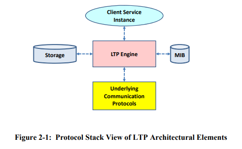

# LTP Underlying Communications API

In the Licklider Transmission Protocol (LTP) Specification issued by [CCSDS 734.1-B-1](https://public.ccsds.org/Pubs/734x1b1.pdf), the elements of a LTP architecture is shown as follows:



The `LTP Engine` and `MIB` is implemented and configured by ION, and the `Client Service Instance` is either BPv6 or BPv7. The storage is provided by the host system through the ICI APIs.

The `Underlying Communication Protocol` element is responsible for data and control message exchanges between two peered LTP Engines. It is not responsible for flow control, error correction/detection, and in-ordered delivery.

For a spacecraft, the LTP Engine will execute the LTP protocol logic and handing the LTP segments to the underlying communication services provided in the form of a simple UDP socket or a radio frequency/optical telecommunication system. In ION, the standard underlying communications protocol is UDP since it is widely available in terrestrial computer systems. In actual deployment, the UDP protocol may need to be substituted by a different ground-based or flight communications system.

In the document we describe a few essential APIs for any externally implemented underlying communication protocols to interface with LTP engine and perform the most basic tasks of (a) submitting a received LTP segments to the LTP Engine for processing and (b) acquiring an LTP segment from the LTP Engine for transmission to its peer.

## Connecting to the LTP Engine

There are several steps for an external application to connecting to LTP:

1. The ltp service must be running on the host system. The ltp service is started by the ION system and is configured by the `.ltprc` file processed `ltpadmin`. See the [Configuration File Tutorial](./Basic-Configuration-File-Tutorial.md) to understand how BP and LTP services are instantiated.
    * Typically, to ensure that the ltp service is running before the communications protocols try to connect to it, the underlying communication protocol service is invoked as part of LTP instantiation. See manual page for `ltprc` for more details.
2. The external application must make sure LTP is initialized by calling the `ltpInit()` API.
3. Once `ltpInit` called returned successfully, it must obtain access to ION SDR and detemine the associated LTP `span` (based on a peer engine number) for which communication service will be provisioned.  This is done by using the `findSpan()` API. A `span` defines the communication parameters between two LTP engine peers.
4. Acquire the semaphore used by the associated LTP engines - for the span - to indicate the availability of a segment for transmission. The presences of a valid semaphore is also indication that the span is currently active.
5. Use the `ltpDequeueOUtboundSegment` API to acquire each available segment from the LTP Engine for transmission to the peer entity.

In the following section we will describe the *private* APIs used by the underlying communication protocols. There are other APIs for external processes to use LTP as a reliable point-to-point data transmission service, but they are not described in this document; they are available in the manual pages.

## LTP Data Structure

Here is a diagram of the major LTP data structures and their relationships. 

```text
+----------------------------------+----------------------------------+
|                                  |                                  |
| non->olatile (SDR heap)          |    volatile (working memory ION) |
|                                  |                                  |
|                                  |                                  |
| LtpDB                            |    LtpVdb                        |
|   +      (list)                  |     +       (list)               |
|   +---> spans +--+               |     +-----+ spans+------+        |
|   |              |               |     |                   |        |
|   +---> seats +---------+        |     +-----+ seats+---+  |        |
|                  |      |        |                      |  |        |
|                  |      |        |                      |  |        |
| LtpSpan <--------+      |        |     LtpVspan <----------+        |
|   +                     |        |       +              |           |
|   +---> importSessions+----+     |       +-> importSessions+--+     |
|   |       (list)        |  |     |             (list)   |     |     |
|   +---> exportSessions+------+   |                      |     |     |
|                         |  | |   |     LtpVseat <-------+     |     |
| LtpSeat <---------------+  | |   |                            |     |
|                            | |   |                            |     |
|                            | |   |                            |     |
| LtpImportSession <---------+ |   |     LtpVImportSession<-----+     |
|                              |   |                                  |
|                              |   |                                  |
| LtpExportSession <-----------+   |                                  |
|                                  |                                  |
+----------------------------------+----------------------------------+
```

* `LtpDB`: The LTP database is a global database that contains the LTP configuration information for the entire system. It is a persistent data stored in the SDR's heap - assuming the SDR is implemented in a non-volatile medium such as a disk or a battery backed RAM.

* `LtpSpan`: A span is a communication channel between two LTP engine peers. A span is defined by a unique span number and a set of communication parameters stored in a non-volatile database. Each instance of `LtpSpan` is tracked as an element in the LTP database under the `LtpDB.spans` list.

* `LtpSeat`: A seat is the reception process for LTP and its parameters are stored under LtpSeat, and its tracked as an element in the list `LtpDB.seats`.

* `LtpImportSession` and `LtpExportSession` are tracked by lists in the `LtpSpan` structure.

* `LtpVdb`: The LTP volatile database is a global database that contains the LTP configuration information for the entire system. It is a volatile data stored in the working memory and not expected to persist through power reset. It tracks, in two lists, each instance of `LtpVspan` and `LtpVseat` that are currently active.

* `LtpVspan`: contains the state information of an active span in the working memory. It is tracked as an element in the list `LtpVdb.spans`.

* `LtpVseat`: contains the state information of an active seat in the working memory. It is tracked as an element in the list `LtpVdb.seats`.

* `LtpVImportSession`: contains the state information of an active import session in the working memory. It is tracked as an element in the list `LtpVspan.importSessions`.

## LTP APIs for implementation of underlying communication protocol

### Header

```c
#include "ltpP.h"
```

### ltpInit

Function Prototype

```c
extern int	ltpInit(int estMaxExportSessions);
```

Parameters

* `estMaxExportSessions`: name of the endpoint

Return Value

* 0: success
* -1: any error

Example Call

```c
/*	Note that ltpadmin must be run before the first
 *	invocation of ltplso, to initialize the LTP database
 *	(as necessary) and dynamic database.*/

if (ltpInit(0) < 0)
{
    putErrmsg("aoslso can't initialize LTP.", NULL);
    
    /* user error handling routine here */
}
```

Description

This call attaches to ION and either initializes a new LTP database or loads the LTP database of an existing service. If the value of `estMaxExportSessions` is positive and no existing LTP service are found, then LTP service will be initialized with the specified maximum number of export sessions indicated. If the value of `estMaxExportSessions` is zero or negative, then `ltpInit` will load the LTP database or otherwise quit if no existing LTP service is found. **NOTE**: for the underlying communication protocol implementation, setting `ltpInit(0)` is appropriate since the intention is to load an existing LTP service only.

Once a LTP service is either found or initialized, it loads the address to the LTP database object defined by `LtpDB` in `ltpP.h`.

-----------------------

### findSpan

Function Prototype

```c
void findSpan(uvast engineId, LtpVspan **vspan, PsmAddress *vspanElt);
```

Parameters

* `engineId`: The engine number of the peer LTP engine
* `vspan`: pointer to the pointer of the LTP span object in ION working memory that encapsulates the current state of the LTP span
* `vspanElt`: pointer to the address stored in a list of span in the volatile database defined by `LtpVdb`

Return Value

* none

Example Code

```c++
sdr = getIonsdr();
CHKZERO(sdr_begin_xn(sdr));	/*	Lock SDR.	*/
findSpan(remoteEngineId, &vspan, &vspanElt);
if (vspanElt == 0)
{
    sdr_exit_xn(sdr);
    putErrmsg("No such engine in database.", itoa(remoteEngineId));
    /* user error handling routine here */
}

if (vspan->lsoPid != ERROR && vspan->lsoPid != sm_TaskIdSelf())
{
    sdr_exit_xn(sdr);
    putErrmsg("LSO task is already started for this span.",
        itoa(vspan->lsoPid));
    /* user error handling routine here */
}

/* unlock the SDR */
sdr_exit_xn(sdr);
```

Description

This function searches the volatile database for the span that corresponds to the specified engine number. If the span is found, then the pointer to the span object is stored in the `vspan` parameter and the address of the span object in the list of spans in the volatile database is stored in the `vspanElt` parameter. If the span is not found, then `vspanElt` parameter is set to 0.

**Note**: In addition to check the value of `vspanElt`, one can also check for the process ID of the LSO task (the LTP output process, i.e., the underlying communication protocol) of the span has not already been serviced by another protocol implementation.

### ltpDequeueOutboundSegment

Function Prototype

```c
extern int ltpDequeueOutboundSegment(LtpVspan *vspan, char **buf);
```

Parameters

* `vspan`: address to the volatile LTP span object
* `buf`: the buffer in which outbound LTP segments are stored

Return Value

* `length of segment`: success
* `0`: session associated to the dequeued segment has already closed; no need to transmit any data
* `-1`: any error

Example Code

```c
segmentLength = ltpDequeueOutboundSegment(vspan, &segment);
if (segmentLength < 0)
{
	/* handle error */
}

if (segmentLength == 0)
{
	/* session is closed, take appropriate action */

}

/* transmit the segment */
```

Description:

This function dequeues a LTP segment, based on the `segSemaphore` in `vspan` object, into a buffer space for the calling task to process for transmission. The returned value is the length of the LTP segment dequeue; 0 if the segment belongs to a session that already closed (therefore no action is required), and -1 if an error occurred.

If this call is implemented in a loop, then it is suggested that the loop monitors the `segSemaphore` in `vspan` to detect the termination of the semaphore using the `sm_SemEnded(vspan->segSemaphore)` call. If the semaphore has ended, it means the span associated with the underlying communication protocol instance has ended. This is the right time to end the task itself.

After each successful iteration in a loop, it is recommended that you call `sm_TaskYield()` to give other tasks a chance to run. A good example code to read is the `udplso.c` program.

### ltpHandleInboundSegment

Function Prototype

```c
int	ltpHandleInboundSegment(char *buf, int length)
```

Parameters

* `buf`: pointer to buffer storing the received LTP segment, to be submitted to LTP engine for processing
* `length`: the length of the received LTP segment

Return Value

* `0`: segment successfully handled
* `-1`: any error

Example Code

```c
if (ltpHandleInboundSegment(buffer, segmentLength) < 0)
{
	putErrmsg("Can't handle inbound segment.", NULL);
	/* handle error here */
}`
```


Description

This function submits received LTP segments to LTP engine for processing. The return value is 0 if the segment is successfully handled, and -1 if an error occurred. A successfully handled segment includes cases where the segments are ignored for several possible, non-critial, non-fatal discrepencies such as wrong LTP version number, closed session number, session under cancellation (therefore the segment was not processed) and other conditions are may occur under nominal condition.

To develop one's own underlying communication protocol implementation to support LTP, the `udplsi.c` and `udplso.c` programs are good templates to use.