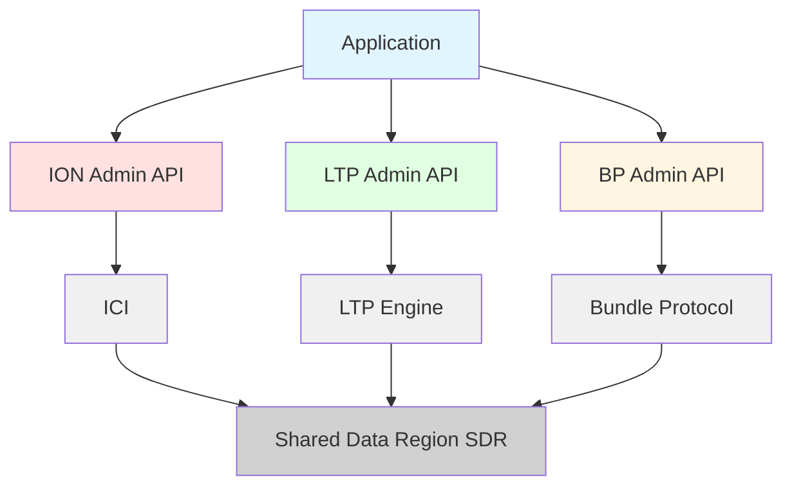
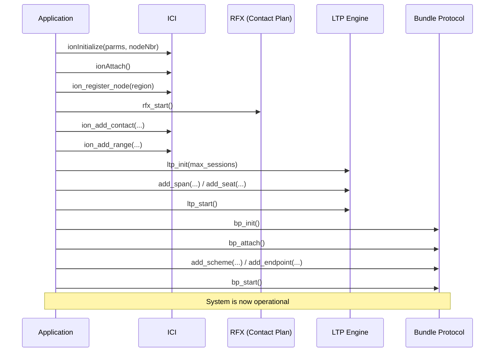

# ION Public Administrative API User Guide

## Table of Contents
1. [Overview](#overview)
2. [Architecture](#architecture)
3. [ION Administrative API](#ion-administrative-api)
4. [LTP Administrative API](#ltp-administrative-api)
5. [Bundle Protocol Administrative API](#bundle-protocol-administrative-api)
6. [Complete Example](#complete-example)
7. [Best Practices](#best-practices)
8. [Debugging Crash Recovery](#debugging-crash-recovery)
9. [API Reference](#api-reference)

---

## Overview

The ION Public Administrative APIs provide programmatic access to configure and manage ION (Interplanetary Overlay Network) systems. These APIs eliminate the need to use command-line administration tools (`ionadmin`, `ltpadmin`, `bpadmin`) and enable developers to integrate ION configuration directly into their applications.

### Key Features

- Direct programmatic control of ION, LTP, and BP subsystems
- Runtime management of network topology (contacts, ranges, spans)
- Dynamic configuration of convergence layers and routing
- Thread-safe operations with proper SDR transaction handling
- Integration-friendly design for embedded systems and automation

### API Layers



---

## Architecture

### Initialization Sequence

The ION stack must be initialized in a specific order to ensure proper dependency resolution:



### Runtime Safety Considerations

Different administrative operations have different runtime safety characteristics:

| Operation Type | Safe While Running? | Notes |
|---------------|---------------------|-------|
| ION contacts/ranges | Yes | Uses SDR transactions |
| LTP spans/seats | Yes | Automatic process lifecycle management |
| BP schemes (add/remove) | No | Must stop BP first (`bp_stop()`) |
| BP scheme state (start/stop) | Yes | Designed for runtime use |
| BP protocols/ducts | Yes | Uses SDR transactions |

---

## ION Administrative API

**Header:** `ion_admin.h`

The ION Administrative API manages the foundational ION layer, including congestion forecasting, node registration, contact plans, and range information.

### Key Concepts

- **Production/Consumption Rates:** Control congestion forecasting by specifying expected data generation and consumption rates
- **Contacts:** Define scheduled transmission opportunities between nodes
- **Ranges:** Specify One-Way Light Time (OWLT) for propagation delay modeling
- **Congestion Forecast Horizon:** Time window for congestion prediction

### Production and Consumption Rate Management

```c
// Set production rate (bytes/sec)
// -1 = unknown, 0 = router-only node
int ion_set_production_rate(int rate_bytes_per_sec);

// Set consumption rate (bytes/sec)
int ion_set_consumption_rate(int rate_bytes_per_sec);

// Set congestion forecast horizon (Unix timestamp)
// 0 = disable congestion forecasting
int ion_set_congestion_forecast_horizon(time_t horizon_time);

// Retrieve current settings
int ion_get_production_rate(int *rate_bytes_per_sec);
int ion_get_consumption_rate(int *rate_bytes_per_sec);
int ion_get_congestion_forecast_horizon(time_t *horizon_time);
```

**Example:**
```c
// Configure for a data-producing node
ion_set_production_rate(50000);    // 50 KB/s production
ion_set_consumption_rate(25000);   // 25 KB/s consumption

// Set forecast horizon to 24 hours from now
time_t horizon = time(NULL) + (24 * 3600);
ion_set_congestion_forecast_horizon(horizon);
```

### System Initialization

Before using the ION Admin API, the ICI layer must be initialized with appropriate parameters.

#### IonParms Structure

The `IonParms` structure controls ION's memory allocation and operational mode:

```c
typedef struct {
    char        *wmAddress;     // Working memory address (NULL = auto-allocate)
    unsigned int wmSize;        // Working memory size in bytes
    char        *sdrName;       // SDR name (NULL = use default)
    int         configFlags;    // Configuration flags (ION_NODE_DBMS, etc.)
    long        heapWords;      // SDR heap size in words (deprecated - use sdrWmSize)
    int         heapKey;        // Shared memory key (deprecated)
    char        *pathName;      // File system path for SDR files
    unsigned long sdrWmSize;    // SDR working memory size in bytes
} IonParms;
```

**Configuration Flags:**
- `ION_NODE_DBMS` - Use file-based SDR (persistent storage)
- `ION_NODE_SHARE` - Use shared memory SDR (higher performance, volatile)

**Mapping to ionadmin Configuration:**

| ionadmin Command | IonParms Field | Example Value |
|------------------|----------------|---------------|
| `1 1 'ionconfig.ionrc'` first number | `wmSize` | `5000000` (5 MB) |
| File-based or shared memory | `configFlags` | `ION_NODE_DBMS` or `ION_NODE_SHARE` |
| SDR working memory | `sdrWmSize` | `20000000` (20 MB) |
| SDR storage path | `pathName` | `"/tmp/ion"` or `"./ion"` |

**Example:**
```c
IonParms parms;
memset(&parms, 0, sizeof(parms));

// Equivalent to: ionadmin "1 1 ionconfig.ionrc" with file-based SDR
parms.wmSize = 5000000;              // 5 MB working memory
parms.wmAddress = NULL;              // Auto-allocate
parms.sdrName = NULL;                // Use default SDR name
parms.sdrWmSize = 20000000;          // 20 MB SDR working memory
parms.configFlags = ION_NODE_DBMS;   // Use file-based SDR
parms.pathName = "/tmp/ion";         // SDR file location

// Initialize with node number 1
if (ionInitialize(&parms, 1) < 0) {
    fprintf(stderr, "Failed to initialize ION\n");
    return -1;
}

if (ionAttach() < 0) {
    fprintf(stderr, "Failed to attach to ION\n");
    return -1;
}
```

**Alternative: Shared Memory Configuration**
```c
// For higher performance with volatile storage
parms.wmSize = 10000000;             // 10 MB working memory
parms.wmAddress = NULL;
parms.sdrName = NULL;
parms.sdrWmSize = 50000000;          // 50 MB SDR working memory
parms.configFlags = ION_NODE_SHARE;  // Use shared memory SDR
parms.pathName = NULL;               // Not needed for shared memory

ionInitialize(&parms, 1);
ionAttach();
```

### Node Registration

Before adding contacts, the local node must be registered in a region:

```c
// Register node in region (typically region 1)
int ion_register_node(uint32_t region_nbr);
```

**Important Notes:**
- **Must be called before adding contacts**: Contacts will be rejected as "foreign region" if the node is not registered
- **Region number must be > 0**: Region 0 is reserved and will be rejected
- **Typical usage**: Most applications use region 1 for all nodes
- **Two-region support**: Each ION node can belong to at most 2 regions (home region and outer region)

**Example:**
```c
// Initialize ION
ionInitialize(&parms, 1);
ionAttach();

// Register in region 1 (REQUIRED before adding contacts)
ion_register_node(1);

// Now contacts can be added
ion_add_contact(now + 1, now + 3600, 1, 2, 100000, 1.0);
```

**What happens if you skip node registration?**
- `ion_add_contact()` will fail with return value -1
- `ion.log` will show: "Contact is for a foreign region: N"
- The contact will be silently rejected

### Contact Management

Contacts define when nodes can communicate and at what data rate.

```c
// Add a contact
int ion_add_contact(time_t from_time,        // Start time
                    time_t to_time,          // End time
                    uvast from_node,         // Source node number
                    uvast to_node,           // Destination node number
                    unsigned int xmit_rate,  // Bytes/sec
                    float confidence);       // 0.0 to 1.0

// Delete a contact
int ion_delete_contact(time_t *from_time,    // NULL = delete all
                       uvast from_node,
                       uvast to_node);

// List all contacts
int ion_list_contacts(void);
```

**Example:**
```c
time_t now = time(NULL);

// Add contact from node 1 to node 2, starting in 1 second,
// lasting 1 hour at 100 KB/s with full confidence
ion_add_contact(now + 1, now + 3600, 1, 2, 100000, 1.0);

// Add hypothetical contact (from_time = 0)
ion_add_contact(0, now + 7200, 1, 3, 50000, 0.8);

// Delete specific contact
time_t contact_start = now + 1;
ion_delete_contact(&contact_start, 1, 2);

// Delete all contacts from node 1 to node 2
ion_delete_contact(NULL, 1, 2);
```

### Range Management

Ranges define the One-Way Light Time (propagation delay) between nodes.

```c
// Add a range
int ion_add_range(time_t from_time,      // Start time
                  time_t to_time,        // End time
                  uvast from_node,       // Source node
                  uvast to_node,         // Destination node
                  unsigned int owlt);    // OWLT in seconds

// Delete a range
int ion_delete_range(time_t *from_time,  // NULL = delete all
                     uvast from_node,
                     uvast to_node);

// List all ranges
int ion_list_ranges(void);
```

**Example:**
```c
time_t now = time(NULL);

// Add range with 1 second propagation delay
ion_add_range(now + 1, now + 3600, 1, 2, 1);

// For GEO satellite: ~0.24 second actual delay (rounded to 1 second)
// Note: OWLT parameter must be whole seconds (unsigned int)
ion_add_range(now, now + 86400, 1, 100, 1);
```

**Important:** The `owlt` (one-way light time) parameter is an `unsigned int` representing whole seconds. Fractional second delays cannot be specified through this API.

---

## LTP Administrative API

**Header:** `ltp_admin.h`

The LTP (Licklider Transmission Protocol) Administrative API manages reliable data transmission over long-delay, high-loss links.

### Key Concepts

- **Span:** Configuration for transmitting to a remote LTP engine
- **Seat:** Configuration for receiving from remote LTP engines
- **LSO (Link Service Output):** Transmission daemon, one per span
- **LSI (Link Service Input):** Reception daemon, one per seat
- **Runtime Safety:** LTP span/seat operations are safe during runtime

### System Lifecycle

```c
// Initialize LTP engine
int ltp_init(unsigned int est_max_sessions);

// Start LTP engine and all daemons
int ltp_start(void);

// Stop LTP engine and all daemons
void ltp_stop(void);
```

**Example:**
```c
// After ionAttach()
ltp_init(1000);  // Support up to 1000 concurrent sessions
// Configure spans and seats...
ltp_start();
```

### Span Management (Outbound)

Spans define how to transmit data to remote LTP engines.

```c
int add_span(uvast engine_id,                    // Remote engine ID
             unsigned int max_export_sessions,   // Max outbound sessions
             unsigned int max_import_sessions,   // Max inbound sessions
             unsigned int max_segment_size,      // Max segment bytes
             unsigned int aggr_size_limit,       // Aggregation size threshold
             unsigned int aggr_time_limit,       // Aggregation time limit (sec)
             char *lso_command,                  // Link service output command
             unsigned int queuing_latency,       // Queuing delay (sec)
             int purge_enabled);                 // Auto-purge sessions

int update_span(/* same parameters */);

int remove_span(uvast engine_id);

int ltp_start_span(uvast engine_id);
void ltp_stop_span(uvast engine_id);
```

**Example:**
```c
// Add span to remote engine 2 via UDP
add_span(2,                          // Engine ID
         100,                        // 100 export sessions
         100,                        // 100 import sessions
         1400,                       // 1400-byte max segment
         10000,                      // 10KB aggregation limit
         1,                          // 1 second time limit
         "udplso localhost:1113",    // LSO command
         1,                          // 1 second queuing latency
         0);                         // Purge disabled

// Dynamically stop/start span
ltp_stop_span(2);
ltp_start_span(2);

// Remove span (must have no pending data)
remove_span(2);
```

### Seat Management (Inbound)

Seats define how to receive data from remote LTP engines.

```c
int add_seat(char *lsi_command);
int remove_seat(char *lsi_command);
```

**Example:**
```c
// Add UDP receiver
add_seat("udplsi localhost:1113");

// Remove seat (automatically stops LSI)
remove_seat("udplsi localhost:1113");
```

### Important: Span Configuration Updates

**CRITICAL BEHAVIOR:** The `update_span()` function updates the span configuration in the database but **does NOT restart the LSO (Link Service Output) daemon**. The old LSO process continues running with the previous configuration until the span is explicitly restarted.

#### Why This Matters

When you change span parameters—especially the `lso_command`—using `update_span()` or the ltpadmin `c span` command:

1. **Database is updated** with new configuration
2. **LSO process continues running** with the old command
3. **New configuration takes effect** only after span restart

This behavior can cause operational confusion if not properly understood.

#### Recommended Approach: Remove and Re-add

The safest and most straightforward approach to change span configuration is to remove and re-add the span:

```c
// Step 1: Stop and remove the existing span
ltp_stop_span(engine_id);
remove_span(engine_id);

// Step 2: Re-add span with new configuration
add_span(engine_id,
         max_export_sessions,
         max_import_sessions,
         max_segment_size,
         aggr_size_limit,
         aggr_time_limit,
         "NEW_lso_command",  // New LSO command
         queuing_latency,
         purge_enabled);

// Step 3: Start the span with new configuration
ltp_start_span(engine_id);
```

**Note:** If you remove the last span, consider also stopping and restarting the corresponding BP outduct to prevent the ltpclo from attempting to transmit to a non-existent destination:

```c
// After removing last LTP span
bp_stop_outduct("ltp", "engine_id_string");

// After re-adding span
bp_start_outduct("ltp", "engine_id_string");
```

#### Alternative: Stop-Update-Start Sequence

If you need to update parameters without removing the span (e.g., to preserve session state), use this sequence:

```c
// Step 1: Stop the span (stops LSO/ltpmeter processes)
ltp_stop_span(engine_id);

// Step 2: Update the configuration
update_span(engine_id,
            max_export_sessions,
            max_import_sessions,
            max_segment_size,
            aggr_size_limit,
            aggr_time_limit,
            "NEW_lso_command",  // New LSO command
            queuing_latency,
            purge_enabled);

// Step 3: Restart the span (starts new LSO/ltpmeter with updated config)
ltp_start_span(engine_id);
```

**Warning:** This approach may not properly clean up all span state. The remove-and-re-add approach is recommended for most scenarios.

#### For ltpadmin Users

When using the ltpadmin command-line tool:

**Option 1: Delete and re-add (Recommended)**
```
# In ltpadmin
d span <engine_ID>
a span <engine_ID> <params...> '<NEW_LSO_command>' [queuing_latency]
```

**Option 2: Stop and restart entire LTP**
```
# In ltpadmin
x    # Stop LTP engine (stops all spans)
c span <engine_ID> <params...> '<NEW_LSO_command>' [queuing_latency]
s    # Start LTP engine (starts all spans with updated config)
```

**Important:** The `c span` command alone (without stopping/restarting LTP) will **NOT** apply the new LSO command to the running daemon.

#### Reference Implementation

See the test program at `tests/admin_public_api/ltp_span_management/ltp_span_management_test.c` for a complete working example of proper span lifecycle management, including:
- Removing spans during runtime
- Managing BP outducts during span removal
- Re-adding spans with new configuration
- Verifying bundle delivery after span restart

### Monitoring

```c
void ltp_list_spans(void);  // Display all configured spans
void ltp_list_seats(void);  // Display all configured seats
```

---

## Bundle Protocol Administrative API

**Header:** `bp_admin.h`

The Bundle Protocol Administrative API manages the BP layer, including schemes, endpoints, convergence layers, and routing plans.

### Key Concepts

- **Scheme:** URI scheme (e.g., "ipn", "dtn") with associated forwarder
- **Endpoint:** Destination for receiving bundles
- **Protocol:** Convergence layer protocol (e.g., "tcp", "udp", "ltp")
- **Induct:** Input duct for receiving data via a protocol
- **Outduct:** Output duct for transmitting data via a protocol
- **Plan:** Egress routing plan for a destination
- **Planduct:** Attachment of an outduct to a plan

### Configuration vs. State Management

**CRITICAL SAFETY DISTINCTION:**

| Operation | Runtime Safety | Explanation |
|-----------|---------------|-------------|
| `add_scheme()` / `remove_scheme()` | UNSAFE | Structural changes - must call `bp_stop()` first |
| `bp_start_scheme()` / `bp_stop_scheme()` | SAFE | State changes - designed for runtime use |

**Correct pattern for scheme configuration:**
```c
bp_stop();           // Stop BP agent
add_scheme(...);     // Add new scheme
remove_scheme(...);  // Remove old scheme
bp_start();          // Restart BP agent
```

**Correct pattern for scheme state management (runtime):**
```c
// BP is running...
bp_stop_scheme("ipn");   // Suspend IPN forwarding
// Bundles queue safely in forward queue
bp_start_scheme("ipn");  // Resume IPN forwarding
```

### System Lifecycle

```c
// Initialize BP subsystem
int bp_init(void);

// Initialize IPN routing (if using IPN scheme)
int ipn_init(void);

// Attach to BP
int bp_attach(void);

// Start BP agent and all daemons
int bp_start(void);

// Stop BP agent
void bp_stop(void);
```

### Scheme Management

```c
// Add URI scheme (ONLY when BP is stopped!)
int add_scheme(char *name,         // Scheme name (e.g., "ipn")
               char *fwdCmd,       // Forwarder command (e.g., "ipnfw")
               char *admAppCmd);   // Admin app command

// Remove scheme (ONLY when BP is stopped!)
int remove_scheme(char *name);

// Start/stop scheme forwarder (safe at runtime)
int bp_start_scheme(char *name);
void bp_stop_scheme(char *name);
```

**Example:**
```c
// During initialization (BP stopped)
add_scheme("ipn", "ipnfw", "ipnadminep");

// At runtime (BP running)
bp_stop_scheme("ipn");   // Pause IPN routing
bp_start_scheme("ipn");  // Resume IPN routing
```

### Endpoint Management

```c
typedef enum {
    DiscardBundle = 0,
    EnqueueBundle
} BpRecvRule;

int add_endpoint(char *eid,              // Endpoint ID (e.g., "ipn:1.1")
                 BpRecvRule recvRule,    // Reception rule
                 char *script);          // Optional script (NULL if none)

int remove_endpoint(char *eid);
```

**Example:**
```c
// Add endpoint that enqueues bundles
add_endpoint("ipn:1.1", EnqueueBundle, NULL);

// Add endpoint with delivery script
add_endpoint("ipn:1.2", EnqueueBundle, "/usr/local/bin/process_bundle.sh");

// Add endpoint that discards bundles
add_endpoint("ipn:1.99", DiscardBundle, NULL);
```

### Protocol Management

```c
int add_protocol(char *protocol_name,  // Protocol name
                 int protocol_class);   // Protocol class

int remove_protocol(char *protocol_name);

int bp_start_protocol(char *protocol_name);
void bp_stop_protocol(char *protocol_name);
```

**Protocol Classes:**
- `0` = Scheduled (contact graph routing)
- `1` = Continuous (always available)
- `2` = Best-effort (unreliable, e.g., UDP)
- `10` = Reliable (e.g., TCP, LTP)
- `26` = Any (accepts any traffic class)

**Example:**
```c
add_protocol("ltp", 0);   // Scheduled protocol
add_protocol("tcp", 10);  // Reliable continuous protocol
add_protocol("udp", 2);   // Best-effort protocol
```

### Induct Management

```c
int add_induct(char *protocol_name,    // Protocol name
               char *duct_name,        // Duct identifier
               char *cli_command);     // CLI command

int remove_induct(char *protocol_name, char *duct_name);

int bp_start_induct(char *protocol_name, char *duct_name);
void bp_stop_induct(char *protocol_name, char *duct_name);
```

**Example:**
```c
add_induct("ltp", "1", "ltpcli");
add_induct("tcp", "0.0.0.0:4556", "tcpcli 0.0.0.0:4556");
```

### Outduct Management

```c
int add_outduct(char *protocol_name,              // Protocol name
                char *duct_name,                   // Duct identifier
                char *clo_command,                 // CLO command
                unsigned int max_payload_length);  // Max payload (0=default)

int remove_outduct(char *protocol_name, char *duct_name);

int bp_start_outduct(char *protocol_name, char *duct_name);
void bp_stop_outduct(char *protocol_name, char *duct_name);
```

**Example:**
```c
add_outduct("ltp", "1", "ltpclo", 0);
add_outduct("tcp", "192.168.1.100:4556", "tcpclo 192.168.1.100:4556", 65535);
```

### Egress Plan Management

```c
int add_plan(char *eid,                  // Destination EID pattern
             unsigned int nominal_rate); // Expected rate (bytes/sec)

int remove_plan(char *eid);

int bp_start_plan(char *eid);
void bp_stop_plan(char *eid);
```

**Example:**
```c
add_plan("ipn:2.*", 100000);  // Route to node 2, all services
add_plan("ipn:3.1", 50000);   // Route to specific endpoint
```

### Planduct Management

Plan-outduct attachments (planducts) attach outducts to plans, creating routing directives.

```c
int add_planduct(char *eid,              // Plan EID
                 char *protocol_name,    // Protocol
                 char *duct_name);       // Outduct

int remove_planduct(char *protocol_name, char *duct_name);
```

**Example:**
```c
// Route to ipn:2.* via LTP outduct 1
add_planduct("ipn:2.*", "ltp", "1");

// Route to ipn:3.* via TCP
add_planduct("ipn:3.*", "tcp", "192.168.1.100:4556");
```

### Monitoring

```c
void bp_list_schemes(void);
void bp_list_endpoints(void);
void bp_list_protocols(void);
void report_all_state_stats(void);
```

---

## Complete Example

This example demonstrates configuring a complete ION node with LTP transport, based on `ltp_admin_api_test.c`.

### Full Configuration Flow

```c
#include "ion.h"
#include "ion_admin.h"
#include "ltp_admin.h"
#include "bp_admin.h"
#include "rfx.h"

int main(void)
{
    IonParms parms;
    time_t now;

    // ========================================
    // Step 1: Initialize ICI
    // ========================================

    // OPTION 1: File-based SDR (persistent, survives restarts)
    memset(&parms, 0, sizeof(parms));
    parms.wmSize = 5000000;           // 5 MB working memory
    parms.wmAddress = NULL;           // Let ION allocate
    parms.sdrName = NULL;             // Use default SDR name
    parms.sdrWmSize = 20000000;       // 20 MB SDR working memory
    parms.configFlags = ION_NODE_DBMS; // Use file-based SDR
    parms.pathName = "/tmp/ion";      // SDR path

    // OPTION 2: In-memory SDR (volatile, faster, destroyed on shutdown)
    // Uncomment to use shared memory instead of file-based SDR
    // memset(&parms, 0, sizeof(parms));
    // parms.wmSize = 10000000;             // 10 MB working memory
    // parms.wmAddress = NULL;              // Auto-allocate
    // parms.sdrName = NULL;                // Use default SDR name
    // parms.sdrWmSize = 50000000;          // 50 MB SDR working memory
    // parms.configFlags = ION_NODE_SHARE;  // Use shared memory SDR
    // parms.pathName = NULL;               // Not used for shared memory

    if (ionInitialize(&parms, 1) < 0) {
        fprintf(stderr, "Failed to initialize ION\n");
        return -1;
    }

    if (ionAttach() < 0) {
        fprintf(stderr, "Failed to attach to ION\n");
        return -1;
    }

    // ========================================
    // Step 2: Register Node and Start RFX
    // ========================================
    if (ion_register_node(1) < 0) {
        fprintf(stderr, "Failed to register node\n");
        return -1;
    }

    if (rfx_start() < 0) {
        fprintf(stderr, "Failed to start RFX\n");
        return -1;
    }

    // ========================================
    // Step 3: Configure Contact Plan
    // ========================================
    now = time(NULL);

    // Add contact: node 1 to 1, 1 hour, 100 KB/s
    if (ion_add_contact(now + 1, now + 3600, 1, 1, 100000, 1.0) < 0) {
        fprintf(stderr, "Failed to add contact\n");
        return -1;
    }

    // Add range: 1 second OWLT
    if (ion_add_range(now + 1, now + 3600, 1, 1, 1) < 0) {
        fprintf(stderr, "Failed to add range\n");
        return -1;
    }

    // ========================================
    // Step 4: Initialize and Configure LTP
    // ========================================
    if (ltp_init(1000) < 0) {
        fprintf(stderr, "Failed to initialize LTP\n");
        return -1;
    }

    // Add span to engine 1
    if (add_span(1,                        // Engine ID
                 100,                      // Max export sessions
                 100,                      // Max import sessions
                 1400,                     // Max segment size
                 10000,                    // Aggregation size limit
                 1,                        // Aggregation time limit
                 "udplso localhost:1113",  // LSO command
                 1,                        // Queuing latency
                 0) <= 0) {                // Purge disabled
        fprintf(stderr, "Failed to add LTP span\n");
        return -1;
    }

    // Add seat for receiving
    if (add_seat("udplsi localhost:1113") <= 0) {
        fprintf(stderr, "Failed to add LTP seat\n");
        return -1;
    }

    // Start LTP
    if (ltp_start() < 0) {
        fprintf(stderr, "Failed to start LTP\n");
        return -1;
    }

    // Allow LTP daemons to fully initialize and register semaphores
    // Shorter delays may cause race conditions on some systems
    sleep(5);

    // ========================================
    // Step 5: Initialize and Configure BP
    // ========================================
    if (bp_init() < 0) {
        fprintf(stderr, "Failed to initialize BP\n");
        return -1;
    }

    if (ipn_init() < 0) {
        fprintf(stderr, "Failed to initialize IPN\n");
        return -1;
    }

    if (bp_attach() < 0) {
        fprintf(stderr, "Failed to attach to BP\n");
        return -1;
    }

    // Add IPN scheme
    if (add_scheme("ipn", "ipnfw", "ipnadminep") <= 0) {
        fprintf(stderr, "Failed to add IPN scheme\n");
        return -1;
    }

    // Add endpoints
    if (add_endpoint("ipn:1.1", EnqueueBundle, NULL) <= 0) {
        fprintf(stderr, "Failed to add endpoint ipn:1.1\n");
        return -1;
    }

    if (add_endpoint("ipn:1.2", EnqueueBundle, NULL) <= 0) {
        fprintf(stderr, "Failed to add endpoint ipn:1.2\n");
        return -1;
    }

    // Add LTP protocol
    if (add_protocol("ltp", 0) <= 0) {
        fprintf(stderr, "Failed to add LTP protocol\n");
        return -1;
    }

    // Add LTP induct
    if (add_induct("ltp", "1", "ltpcli") <= 0) {
        fprintf(stderr, "Failed to add LTP induct\n");
        return -1;
    }

    // Add LTP outduct
    if (add_outduct("ltp", "1", "ltpclo", 0) <= 0) {
        fprintf(stderr, "Failed to add LTP outduct\n");
        return -1;
    }

    // Add egress plan
    if (add_plan("ipn:1.0", 0) <= 0) {
        fprintf(stderr, "Failed to add plan\n");
        return -1;
    }

    // Attach outduct to plan
    if (add_planduct("ipn:1.0", "ltp", "1") <= 0) {
        fprintf(stderr, "Failed to add planduct\n");
        return -1;
    }

    // ========================================
    // Step 6: Start BP
    // ========================================
    if (bp_start() < 0) {
        fprintf(stderr, "Failed to start BP\n");
        return -1;
    }

    // Allow BP daemons to fully initialize and register semaphores
    sleep(5);

    // ========================================
    // Step 7: System is Operational
    // ========================================
    printf("ION node is now operational!\n");

    // Display configuration
    printf("\n=== LTP Configuration ===\n");
    ltp_list_spans();
    ltp_list_seats();

    printf("\n=== BP Configuration ===\n");
    bp_list_schemes();
    bp_list_endpoints();
    bp_list_protocols();

    // Keep running...
    printf("\nPress ENTER to shutdown...\n");
    getchar();

    // ========================================
    // Step 8: Graceful Shutdown
    // ========================================
    printf("Shutting down...\n");
    bp_stop();
    ltp_stop();

    // OPTION 1: Standard shutdown (preserves file-based SDR)
    ionDetach();

    // OPTION 2: Destroy SDR and clear IPC (for in-memory SDR or complete cleanup)
    // Use ionTerminate() to destroy SDR, then sm_ipc_stop() to clear IPC resources
    // ionTerminate(1);     // 1 = destroy SDR (use 0 to preserve)
    // sm_ipc_stop();       // Clear System V IPC resources (semaphores, shared memory)

    return 0;
}
```

### Compilation

```bash
gcc -o ion_example ion_example.c \
    -lici -lbp -lltp -lpthread -lm -lrt
```

### Expected Output

```
ION node is now operational!

=== LTP Configuration ===
Engine ID: 1
  Export sessions: 100
  Import sessions: 100
  Max segment size: 1400
  LSO: udplso localhost:1113 (PID: 12345)

Seat: udplsi localhost:1113 (PID: 12346)

=== BP Configuration ===
Scheme: ipn
  Forwarder: ipnfw (PID: 12347)

Endpoint: ipn:1.1 (EnqueueBundle)
Endpoint: ipn:1.2 (EnqueueBundle)

Protocol: ltp (Scheduled)
  Induct: 1 (ltpcli, PID: 12348)
  Outduct: 1 (ltpclo, PID: 12349)
```

---

## Best Practices

### 1. Initialization Order

Always follow the correct initialization sequence:

```c
ionInitialize() → ionAttach() → ion_register_node() →
rfx_start() → ltp_init() → bp_init() → bp_attach()
```

### 2. Error Handling

Check return values for all API calls. Different API families return different success values:

**Return Value Convention Summary**

| API Family | Success | Duplicate/Not Found | Error | Notes |
|-----------|---------|---------------------|-------|-------|
| ION Admin | 0 | N/A | -1 | Traditional Unix convention |
| LTP Admin | 1 | 0 | -1 | 1=success, 0=already exists/not found |
| BP Admin | 1 | 0 | -1 | 1=success, 0=already exists/not found |

**Examples:**

```c
// ION Admin APIs return 0 on success
if (ion_add_contact(now, now + 3600, 1, 2, 100000, 1.0) < 0) {
    fprintf(stderr, "Failed to add contact\n");
}

// LTP/BP Admin APIs return 1 on success, 0 if duplicate
int result = add_span(1, 100000, 1400, 1400, 100000, 0, 100, "udplso");
if (result < 0) {
    fprintf(stderr, "Failed to add span\n");
} else if (result == 0) {
    fprintf(stderr, "Span already exists\n");
}
// result == 1 means success

// BP Admin APIs follow same pattern
result = add_scheme("ipn", "ipnfw", "ipnadminep");
if (result <= 0) {  // Check for both user and system errors
    if (result == 0)
        fprintf(stderr, "Scheme already exists or invalid\n");
    else
        fprintf(stderr, "System error adding scheme\n");
}
```

### 3. Thread Safety

- All APIs use SDR transactions internally
- Safe to call from multiple threads
- Avoid concurrent structural changes (e.g., adding/removing schemes)

### 4. Resource Management

Always ensure proper cleanup on exit. The cleanup method depends on your SDR configuration.

**CRITICAL: Shutdown Order**

Services must be stopped in reverse initialization order. Never call `ionTerminate()` or `ionDetach()` while services are still running:

1. Stop BP: `bp_stop()`
2. Stop LTP: `ltp_stop()`
3. Then cleanup: `ionDetach()` or `ionTerminate()`

Incorrect shutdown order can cause crashes, resource leaks, or corrupted SDR data.

```c
// OPTION 1: Standard shutdown (preserves file-based SDR)
bp_stop();
ltp_stop();
ionDetach();

// OPTION 2: Destroy SDR and clear IPC (for in-memory SDR or complete cleanup)
bp_stop();
ltp_stop();
ionTerminate(1);    // 1 = destroy SDR, 0 = preserve
sm_ipc_stop();      // Clear System V IPC resources
```

**Cleanup Options:**

| Cleanup Level | Commands | SDR Type | Use Case |
|--------------|----------|----------|----------|
| Graceful stop | `ionDetach()` | File-based | Stop services, keep SDR files for restart |
| Destroy SDR | `ionTerminate(1)` | Both | Remove SDR data (files or shared memory) |
| Clear IPC | `ionTerminate(1); sm_ipc_stop()` | Shared memory | Complete cleanup of in-memory SDR and IPC |

**When to use each:**
- **`ionDetach()`**: Use with file-based SDR when you want to preserve data for later restart
- **`ionTerminate(1)`**: Use to destroy SDR (removes files for ION_NODE_DBMS or shared memory for ION_NODE_SHARE)
- **`sm_ipc_stop()`**: Use after `ionTerminate()` to clean up System V IPC resources (semaphores, shared memory segments)

### 5. Dynamic Reconfiguration

For runtime changes, prefer state operations over structural changes:

```c
// GOOD: Dynamic state management (safe at runtime)
bp_stop_scheme("ipn");
// Modify something...
bp_start_scheme("ipn");

// BAD: Structural change while running
add_scheme("ipn", ...);  // May cause instability!
```

### 6. Bulk Removal for Runtime Reconfiguration

For selective cleanup or reconfiguration without full shutdown, use the bulk
removal functions. These remove all items of a specific type while respecting
pending data constraints.

```c
// Stop BP first for safe removal
bp_stop();

// Remove all LTP configuration
int seats_removed = ltp_remove_all_seats();
int spans_removed = ltp_remove_all_spans();

// Remove all BP configuration for IPN scheme
int plans_removed = ipn_remove_all_plans();
int outducts_removed = bp_remove_all_outducts("ltp");
int inducts_removed = bp_remove_all_inducts("ltp");
int endpoints_removed = bp_remove_all_endpoints("ipn");

printf("Removed: %d seats, %d spans, %d plans, %d outducts, %d inducts, %d endpoints\n",
       seats_removed, spans_removed, plans_removed,
       outducts_removed, inducts_removed, endpoints_removed);

// Reconfigure and restart
add_span(1, 100, 100, 1400, 10000, 1, "udplso localhost:1113", 1, 0);
add_seat("udplsi localhost:1113");
add_endpoint("ipn:1.1", EnqueueBundle, NULL);
add_induct("ltp", "1", "ltpcli");
add_outduct("ltp", "1", "ltpclo", 0);
add_plan("ipn:1.0", 0);
add_planduct("ipn:1.0", "ltp", "1");

ltp_start();
bp_start();
```

**Important:** For simple shutdown, bulk removal is unnecessary:
```c
bp_stop();
ltp_stop();
ionTerminate(1);  // Destroys all configuration
```

Bulk removal is for **selective reconfiguration** while preserving other parts
of the system, such as switching protocols or updating network topology without
a full restart.

### 7. Timing and Synchronization

Allow time for daemons to start:

```c
ltp_start();
sleep(5);  // Give daemons time to initialize

bp_start();
sleep(5);  // Give BP time to start
```

### 8. Contact Plan Configuration

- Set ranges before relying on OWLT calculations
- Use realistic confidence values (0.0-1.0) for probabilistic contacts
- Avoid overlapping contacts with different rates to the same destination

### 9. LTP Configuration

- Set `max_export_sessions` based on expected concurrent outbound traffic
- Set `max_import_sessions` based on expected concurrent inbound traffic
- Tune `aggr_size_limit` and `aggr_time_limit` for your latency requirements
- Use appropriate `max_segment_size` for your network MTU

### 10. Monitoring and Debugging

Use the list functions for real-time visibility:

```c
ion_list_contacts();
ltp_list_spans();
bp_list_schemes();
bp_list_endpoints();
report_all_state_stats();
```

### 11. Production Deployment

```c
// Set realistic production/consumption rates
ion_set_production_rate(expected_bytes_per_sec);
ion_set_consumption_rate(expected_bytes_per_sec);

// Set appropriate forecast horizon
time_t horizon = time(NULL) + (mission_duration_hours * 3600);
ion_set_congestion_forecast_horizon(horizon);
```

---

## Debugging Crash Recovery

The BP plan and LTP span crash recovery code includes conditional debug instrumentation that can be enabled at compile time. This provides detailed logging of daemon state checks, semaphore operations, and recovery decisions without cluttering `ion.log` during normal operation.

### Enabling Debug Instrumentation

To enable crash recovery debugging, compile ION with the `DEBUG_CRASH_RECOVERY` preprocessor flag:

```bash
make CFLAGS="-DDEBUG_CRASH_RECOVERY"
```

### Debug Output

When `DEBUG_CRASH_RECOVERY` is defined, `ion.log` will include detailed trace messages showing:

- **Daemon state detection**: Whether daemons (bpclm, ltpmeter, udplso) are running or crashed
- **Recovery function calls**: When `resetPlan()` or `resetSpan()` is called and why
- **Semaphore operations**: Detailed logging of `sm_SemTake()` and `sm_SemGive()` during recovery
- **Spawn decisions**: Logic for determining whether to spawn or skip daemon starts

### Use Cases

This debugging capability is particularly useful for:

1. **Platform-specific troubleshooting**: Investigating semaphore race conditions that manifest differently across platforms (e.g., Solaris vs Linux process scheduling differences)
2. **Crash recovery development**: When modifying the crash recovery logic in `bpStartPlan()` or `ltpStartSpan()`
3. **Daemon lifecycle debugging**: Understanding complex interactions between parent processes and spawned daemons

### Affected Code Sections

The debug instrumentation is present in:

- **`bpv7/library/libbpP.c`**: Functions `bpStartPlan()`, `resetPlan()`, `startPlan()`
- **`bpv7/daemon/bpclm.c`**: Main semaphore wait loop in bpclm daemon
- **`ltp/library/libltpP.c`**: Functions `ltpStartSpan()`, `resetSpan()`, `startSpan()`

### Example Debug Output

With `DEBUG_CRASH_RECOVERY` enabled, `ion.log` will contain entries like:

```
[DEBUG] bpStartPlan: bpclm is running for plan ipn:1.0
[DEBUG] bpStartPlan: Not calling resetPlan - daemon already running
[DEBUG] startPlan: bpclm already running for plan ipn:1.0, skipping spawn
```

Or during actual crash recovery:

```
[DEBUG] ltpStartSpan: ltpmeter crashed: 2
[DEBUG] ltpStartSpan: udplso crashed: 2
[DEBUG] ltpStartSpan: Calling resetSpan: 2
[DEBUG] resetSpan: About to take bufClosedSemaphore for span 2
[DEBUG] resetSpan: Unending and giving all semaphores for span 2
[DEBUG] startSpan: Spawning new ltpmeter for span 2
[DEBUG] startSpan: Spawning new udplso for span 2
```

### Best Practices

- **Enable only when needed**: Keep this flag disabled during production builds to avoid log bloat
- **Test suite integration**: Regression tests for crash recovery (in `tests/admin_public_api/bp_plan_crash_recovery/` and `tests/admin_public_api/ltp_span_crash_recovery/`) benefit from this instrumentation when failures occur
- **Clean rebuilds**: When toggling this flag, perform a clean rebuild to ensure consistent behavior:
  ```bash
  make clean
  make CFLAGS="-DDEBUG_CRASH_RECOVERY"
  ```

---

## API Reference

### ION Admin API (`ion_admin.h`)
| Function | Purpose | Runtime Safe |
|----------|---------|--------------|
| `ion_set_production_rate()` | Set data production rate | Yes |
| `ion_set_consumption_rate()` | Set data consumption rate | Yes |
| `ion_set_congestion_forecast_horizon()` | Set forecast horizon | Yes |
| `ion_register_node()` | Register node in region | During init |
| `ion_add_contact()` | Add contact to plan | Yes |
| `ion_delete_contact()` | Remove contact | Yes |
| `ion_add_range()` | Add OWLT range | Yes |
| `ion_delete_range()` | Remove range | Yes |

### LTP Admin API (`ltp_admin.h`)
| Function | Purpose | Runtime Safe |
|----------|---------|--------------|
| `ltp_init()` | Initialize LTP | During init |
| `ltp_start()` | Start LTP engine | During init |
| `ltp_stop()` | Stop LTP engine | Yes |
| `add_span()` | Add transmission span | Yes |
| `update_span()` | Update span parameters | Yes |
| `remove_span()` | Remove span | Yes |
| `ltp_start_span()` | Start span LSO | Yes |
| `ltp_stop_span()` | Stop span LSO | Yes |
| `add_seat()` | Add reception seat | Yes |
| `remove_seat()` | Remove seat | Yes |
| `ltp_remove_all_spans()` | Remove all spans | Yes (after bp_stop) |
| `ltp_remove_all_seats()` | Remove all seats | Yes (after bp_stop) |

### BP Admin API (`bp_admin.h`)
| Function | Purpose | Runtime Safe |
|----------|---------|--------------|
| `bp_init()` | Initialize BP | During init |
| `bp_start()` | Start BP agent | During init |
| `bp_stop()` | Stop BP agent | Yes |
| `add_scheme()` | Add URI scheme | No - must stop BP |
| `remove_scheme()` | Remove scheme | No - must stop BP |
| `bp_start_scheme()` | Start scheme forwarder | Yes |
| `bp_stop_scheme()` | Stop scheme forwarder | Yes |
| `add_endpoint()` | Register endpoint | Yes |
| `remove_endpoint()` | Unregister endpoint | Yes |
| `add_protocol()` | Add convergence layer | Yes |
| `add_induct()` | Add input duct | Yes |
| `add_outduct()` | Add output duct | Yes |
| `add_plan()` | Add egress plan | Yes |
| `add_planduct()` | Attach outduct to plan | Yes |
| `bp_remove_all_endpoints()` | Remove all endpoints for scheme | Yes (after bp_stop) |
| `bp_remove_all_inducts()` | Remove all inducts for protocol | Yes (after bp_stop) |
| `bp_remove_all_outducts()` | Remove all outducts for protocol | Yes (after bp_stop) |
| `ipn_remove_all_plans()` | Remove all IPN plans | Yes (after bp_stop) |

---

**Document Version:** 1.2
**Last Updated:** 2025-01-16
**Based on:** ION Public Admin API Test Suite (`ltp_admin_api_test.c`)
