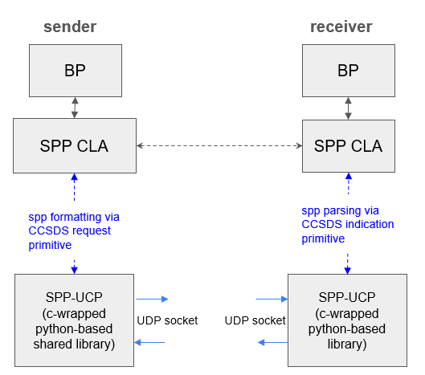
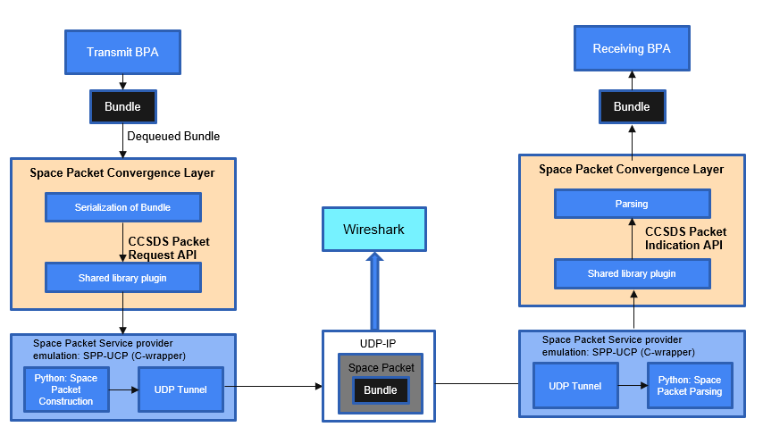
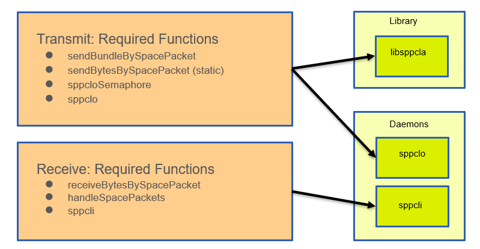
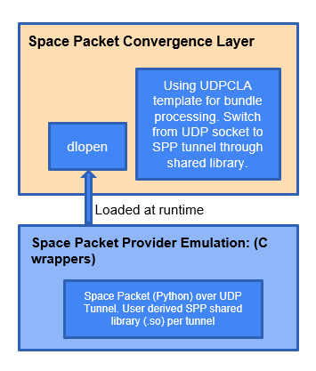
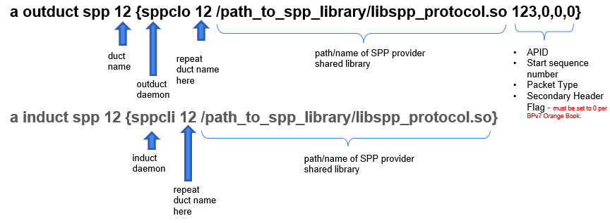

# A CCSDS Space Packet Protocol (SPP) CLA Prototype in ION

**September 2025**

*Note: This experiment module (as of ION 4.1.4-a.2 release) is built and dynamically linked to an underlying Space Packet Protocol (SPP) emulation software. Users can examine the header prototype to reconstruct the SPP emulator underneath to use this prototype. The emulator software is a submodule under the `contrib` folder and is not yet publicly available.*

## SPP CLA Description

In the CCSDS Bundle Protocol Version 7 Orange Book, the Bundle Protocol Agent (BPA) is required to interact with an underlying Space Packet service through the following service primitives:

- Use the Octet_String Mode for the Space Packet Protocol with this service primitive:
  - `OCTET_STRING.request` (Octet String, APID, Secondary Header Indicator, Packet Type, Packet Sequence Count/Packet Name)
  - `OCTET_STRING.indication` (Octet String, APID, Secondary Header Indicator, Data Loss Indicator (optional))

- The maximum size of BP is 65,536 bytes (minus the size of packet secondary header, which, in this CLA specification is zero) and the following restrictions applies:
  - Octet string shall be a single CBOR serialized bundle
  - The specific link destination shall be used to determine the APID
  - Packet Secondary Header Indicator shall be set to absent
  - Packet Sequence Count shall always be used instead of a Packet Name

__NOTE__: additional configuration and service limitations for an SPP provider instance underneath BP layer can be found in ANNEX B of the CCSDS BPv7 Orange Book.

## Design Considerations

- In actual deployment, the SPP provider is external software/hardware component available in a user's platform.
- In order to build a SPP CLA, we need to build an emulation of a SPP provider. For this emulation, we make the following assumptions:
  - The SPP provider will offer a well-defined API, consistent with the service primitives shown above, for the SPP CLA to interact with.
  - The SPP provider will adhere to the CCSDS SPP Bluebook specifications.
  - The SPP provider will handle the means of transferring the space packets to a peer entity. Whether this transfer mechanism is provided by use of internet protocols (TCP, UDP), via serial communication, or other data buses such as RS-232, SpaceWire, etc., should be transparent to the SPP CLA. Therefore, the SPP CLA will not responsible for configuring any underlying communications below the SPP layer.
- The SPP CLA will be implemented as a shared library that can be dynamically loaded by the ION-DTN Bundle Protocol Agent (BPA) at runtime, so that different SPP provider libraries can be easily swapped in and out as needed.

## ION SPP CLA Prototype Design

### Architecture Overview

**Sender Side:**
- BP → SPP CLA → SPP-UCP (c-wrapped python-based shared library) → UDP socket

**Receiver Side:**
- BP ← SPP CLA ← SPP-UCP (c-wrapped python-based shared library) ← UDP socket

### Key Design Points:

- **SPP CLA structure will be derived from UDPCLA** all the way up to the serialization function of a bundle.
- **SPP CLA will access the SPP-UCP** (a simple python-based space packet library wrapped in a c-function prototype) transmit and receive.
- **SPP-UCP is under development** as open source repo (currently private) under nasa-jpl as emulation for testing.
- **NOTE:** Each instance of SPP-UCP library will be built via unique IP/port assignments made at the time of library build. To facilitate a bidirectional connection, each instance will need to be separately compiled with its specific IP/port configuration.

### Communication Flow:
- **spp formatting via CCSDS request primitive** → **spp parsing via CCSDS indication primitive**
- Communication between SPP-UCP instances happens over UDP sockets

## End-to-End Prototype Configuration

### Setup Requirements:
1. Two ION-DTN nodes running SPP CLA (node ID 10 & 12)
2. Bi-directional SPP transmit and receive (*diagram shows only single direction*)
3. A template setup is available under the `configs/two-node-spp` folder.

### Architecture Components:

**Transmit BPA** → Bundle → Dequeued Bundle → **Space Packet Convergence Layer**
- Serialization of Bundle
- CCSDS Packet Request API
- Shared library plugin

**Space Packet Service provider emulation: SPP-UCP (C-wrapper)**
- Python: Space Packet Construction → UDP Tunnel

**UDP-IP** → Space Packet Bundle → **Wireshark**

**Receiving BPA** ← Bundle ← **Space Packet Convergence Layer**
- Parsing
- CCSDS Packet Indication API
- Shared library plugin

**Space Packet Service provider emulation: SPP-UCP (C-wrapper)**
- UDP Tunnel → Python: Space Packet Parsing

## Detailed Software Design and Planning - Planned Functions

## Software Interface Design

### `void *dlopen(const char *file, int mode)`:
- Dynamically loads shared libraries as plugins for the SPP CLA at runtime.
  - Makes an executable object file specified by file available to the calling program. For this use case it would be a shared library.
  - POSIX standard.
  - Security mechanisms might need to be configured to allow dlopen (i.e. SELinux denials)
  - The address of a function from a loaded library is retrieved with dlsym.

### Configuration via bpadmin and ipnadmin
  - Add `protocol`, `induct` and `outduct` via `bpadmin`
  - duct name will be the node number of
  - Add egress plan via `ipnadmin`
  -

### Compatibility Concerns
- Embedded RTOS compatibility might be limited, i.e, FREE-RTOS does not support dlopen. Custom embedded Linux systems built using Yocto or Buildroot should be supported.
- Users still would need to build an externally sourced space packet libraries as dynamic link libraries and properly export their functions with extern.

### User needs to:
- Provide (outside of ION) a conforming space packet implementation or emulation
- Utilize the functional prototype pattern specified by Space Packet Protocol (as well as from the SPP CLA Orange Book)
- Build a dynamic library of the Space Packet provider and its path for run-time loading via dlopen.

### Space Packet Convergence Layer Component:
- Using UDPCLA template for bundle processing
- Switch from UDP socket to SPP tunnel through shared library
- dlopen (loaded at runtime)

### Space Packet Provider Emulator (C wrappers):
- Space Packet (Python) over UDP Tunnel
- User derived SPP shared library (.so) per tunnel

## Required Function Prototypes

### Two function prototypes are required to interface with the SPP CLA:
- `int packet_request(unsigned char *hex_payload, int apid, int seq_count, int packet_type, int sec_header_flag, size_t to_send_bytes)`
- `size_t packet_indication(char *buffer, int apid)`

### Requirements:
- Function prototypes shall have these exact names known to the dynamic linker (packet_request, packet_indication)
- For packet_request the function prototype shall return an int and take unsigned char*, int, int, int, int, size_t as its function parameters in that order.
- For packet_indication the function prototype shall return a size_t and take char*, int as its function parameters in that order.
- The returned value of packet_request shall be the total number of bytes sent including all SPP headers and payload size.
- The returned value of packet_indication shall be the total number of bytes received including all SPP headers and payload size.

### Rational:
The function dlsym is used to obtain the address of a symbol or object and requires a specific symbol name. For the SPP CLA convergence layer to work it must pass in these exact parameters and function symbol names.

However, the user wishes to implement the internals of the Space Packet Protocol is up to the user but for the plugin to function properly with the ION-DTN SPP CLA it requires that the user both conform to the function prototypes listed above and to return the total bytes sent or received.

## Induct and Outduct Configuration

### Sample demo files included in ION-DTN/configs/two-node-spp/

### Notes:
In addition to the shared library, any other libraries used must also be available when running sppcli and sppclo. While this sounds a bit vague, an example is that if Python C API is used, any python modules and virtual environment which needs to be activated must be activated before launching ION.

Also, IPN egress plans must be added via ipnadmin (.ipnrc file) for each SPP CLA. See UDPCLA for example of the general syntax.
