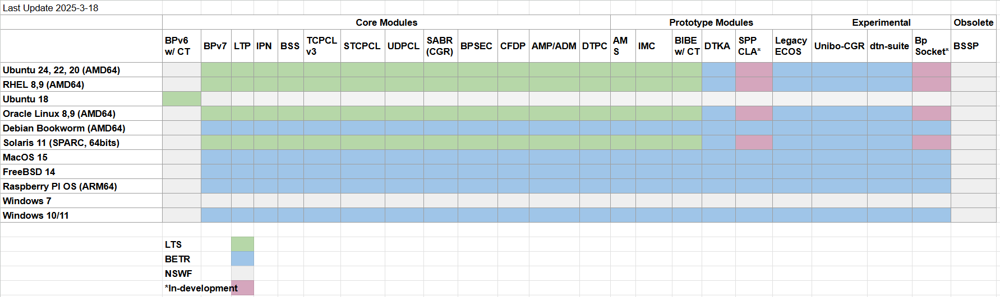

# ION Open Source Development & Support Model

## NASA ION-DTN Software Repository Policy Regarding Public Contribution

The NASA Operational ION DTN software will not add features/capabilities in the future unless:

1. There is a demonstrable near-term or anticipated operational need (meaning users/missions) as identified and agreed-upon by SCaN and/or NASA,
2. Rigorous code testing is performed by a NASA-endorsed entity to ensure that the new features are robust enough for use in space operations with human spaceflight as the top-level requirement,
3. Rigorous interoperability testing is performed by a NASA-endorsed entity to ensure that the new features are compatible with existing operational systems using ION, and with systems under development for which use of ION is committed (e.g., flight systems where software updates may not be possible), and
4. Funding is available to ensure items (1), (2), and (3) are performed adequately.

Since DTN software for LunaNet and deep space missions to Mars may well have to be treated as Class-A software in human-rated missions, testing and infusion of public contributions into the NASA Operational ION implementation will be strictly vetted.

We welcome contributions from the public for submissions for bug fixes, issue reporting, recommendation, and code contributions through the issue tracking system or Pull Request (PR). NASA’s ION team will review these submissions and try to give you feedback in a timely manner. If an issue or PR resulted in actions being taken (e.g., assigned issue tracking for follow-up or internal testing/modification to the PR), we will provide the author with status information. Our ability to review your contribution depends on resources available and may not be immediately available.

Thank you for your contributions!

## ION Support Levels

NASA's ION Development Team provides three levels of support:

1. Long-Term Support (LTS) - ION development team will ensure all related regression tests passed before issuing stable releases; bug and security vulnerabilities will be address at high priority. This level of support typically applies to existing operational capabilities and required/planned capabilities for DTN operations.
2. Best Effort Testing & Reporting (BETR) - ION development team will execute regression tests and report resolved issues/idiosyncrasies under the “Known Issues” section of this online documentation if issues/patches cannot be issued due resource constraints. This support level applies to capabilities under development for future infusion.
3. Not Supported, Won’t Fix (NSWF) - ION development team will take note of these issues but general take no action. This level is typical for highly experimental features or obsolete features.

### Module Types

ION distinguishes four types of modules based on mission needs, requirements, and maturity.

1. Core Modules - these are currently operational DTNl capabilities in flight and/or ground stations: BPv6 (with custody transfer, only ION 4.1.3s or earlier), BPv7, LTP, IPN, BSS, TCPCL v3, STCPCL, UDPCL, SABR (CGR), BPSEC, CFDP, AMP/ADM, DTPC
2. Prototype Modules - these planned capabilities under prototype testing and development. IMC, BIBE w/CT, AMS/DGR, AMP/ADM, DTKA , SPP CLA (under development)
3. Experimental Modules - these are experimental modules UNIBO-CGR, dtn-suite (unified API), BP Socket (in development)
4. Deprecated Modules - these are deprecated capabilities, e.g., BSSP.

### Operating Systems & Testing

For LTS or BETR levels of support, the following operating system/architectures are covered:

  1. Linux - Ubuntu 24, 22, 20, RHEL 8,9, Oracle Linux 8,9, Debian Bookworm (AMD64)
  2. Solaris - Solaris 11 (SPARC, 64bits)
  3. Darwin - MacOS 14 (Intel, ARM64)
  4. FreeBSD - FreeBSD 14 (AMD64)
  5. Raspberry Pi OS (ARM64)

### Support Level Map for Modules and OS

## If you plan to submit code to ION-DTN

### Expectations

If you plan to contribute code to the ION project, please

- Submit code that adheres to the [ION Coding Guide](../ION-Coding-Guide.md) as much as possible,
- Document software design in a markdown file with as much detail possible to facilitate a easier review process,
- Provide a canned unit test (with ION configuration files and launch and test scripts) that can be executed on a single host to verify the proper functioning of the feature or bugfix.
- Due to resource constraints, we cannot make any commitment as to response time and whether to accept the submission or not. We will do our best to review them and let you know.

### To submit code

1. Fork or clone the nasa-jpl/ion-dtn repository.
2. Createa a new branch from the latest release tag and add your update.
3. Generate a pull request.
4. Please create an issue ticket if applicable.
