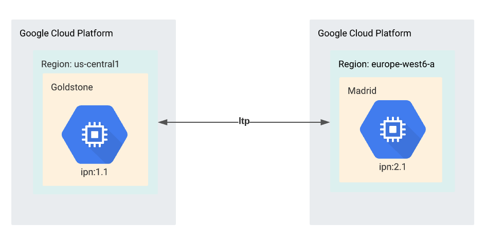
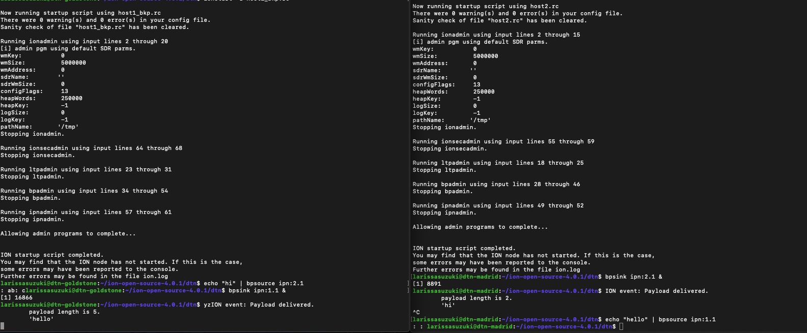

# Running DTN on Cloud VM using a Two-Node Ring

This project has been developed by Dr Lara Suzuki, a Visiting Researcher at NASA JPL.


## Introduction

In this project we demonstrate how to run DTN on two nodes on Cloud VM using NASA's implementation of the bundle protocol - ION.


**Two-Node Topology**

The ION (interplanetary overlay network) software is a suite of communication protocol implementations designed to support mission operation communications across an end-to-end interplanetary network, which might include on-board (flight) subnets, in-situ planetary or lunar networks, proximity links, deep space links, and terrestrial internets.

## DTN on Cloud Linux VMs 101

We strongly recommend that you firstly get familiar with the Loopback communication of ION running on a single node on Google Cloud Platform.

## Getting Started with Two Linux Cloud VMs

On your preferred Cloud provider dashboard, create a Linux VM instance (e.g. for instance Debian). In this tutorial we have created one instance named `Golstone` in `Zone: us-central1` and the another instance named `Madrid` in `Zone: europe-west2-c`. The diagram below illustrates the two node communication that we will be developing in this tutorial.

## The configuration files

In this section we will walk you through the creation of the `host1.rc` file. Follow the same steps to create the same file for `host2.rc`.

### The `ionadmin` configuration

The `ionadmin` configuration assigns an identity (node number) to the node, optionally configures the resources that will be made available to the node, and specifies contact bandwidths and one-way transmission times.
````
## begin ionadmin 
# Initialization command (command 1). 
# Set this node to be node 1 (as in ipn:1).
# Use default sdr configuration (empty configuration file name '').
1 1 ''

# Start ion node
s

# Add a contact.
# It will start at +1 seconds from now, ending +3600 seconds from now.
# It will connect node 1 to itself.
# It will transmit 100000 bytes/second.
a contact +1 +3600 1 1 100000

# Add more contacts.
# The network goes 1--2
# Note that contacts are unidirectional, so order matters.
a contact +1 +3600 1 2 100000
a contact +1 +3600 2 1 100000
a contact +1 +3600 2 2 100000

# Add a range. This is the physical distance between nodes.
# It will start at +1 seconds from now, ending +3600 seconds from now.
# It will connect node 1 to itself.
# Data on the link is expected to take 1 second to reach the other
# end (One Way Light Time).
a range +1 +3600 1 1 1

# Add more ranges.
# We will assume every range is one second.
# Note that ranges cover both directions, so you 
#only need define one range for any combination of nodes.
a range +1 +3600 1 2 1
a range +1 +3600 2 2 1

# Set this node to consume and produce a mean of 1000000 bytes/second.
m production 1000000
m consumption 1000000
## end ionadmin 
````
### The `ltpadmin` configuration

The `ltpadmin` configuration specifies spans, transmission speeds, and resources for the Licklider Transfer Protocol convergence layer

````
# Initialization command (command 1).
1 32

# Add a span. (a connection)
a span 1 10 10 1400 10000 1 'udplso `external_IP_of_node_1`:1113'

# Add another span. (to host2) 
# Identify the span as engine number 2.
# Use the command 'udplso 10.1.1.2:1113' to implement the link itself.  
a span 2 10 10 1400 10000 1 'udplso `external_IP_of_node_2`:1113'

# Start command.
# This command actually runs the link service output commands.
# It also starts the link service INPUT task 'udplsi `internal_IP_of_node_1`:1113' 
# to listen locally on UDP port 1113 for incoming LTP traffic.
s 'udplsi `internal_IP_of_node_1`:1113'
## end ltpadmin 
````

### The `bpadmin` configuration
The `bpadmin` configuration specifies all of the open endpoints for delivery on your local end and specifies which convergence layer protocol(s) you intend to use. 

````
## begin bpadmin 
# Initialization command (command 1).
1

# Add an EID scheme.
# The scheme's name is ipn.
# This scheme's forwarding engine is handled by the program 'ipnfw.'
# This scheme's administration program (acting as the custodian
# daemon) is 'ipnadminep.'
a scheme ipn 'ipnfw' 'ipnadminep'

# Add endpoints.
# Establish endpoints ipn:1.0, ipn:1.1, and ipn:1.2 on the local node.
# ipn:1.0 is expected for custodian traffic.  The rest are usually
# used for specific applications (such as bpsink).
# The behavior for receiving a bundle when there is no application
# currently accepting bundles, is to queue them 'q', as opposed to
# immediately and silently discarding them (use 'x' instead of 'q' to
# discard).
a endpoint ipn:1.0 q
a endpoint ipn:1.1 q
a endpoint ipn:1.2 q

# Add a protocol. 
# Add the protocol named ltp.
# Estimate transmission capacity assuming 1400 bytes of each frame (in
# this case, udp on ethernet) for payload, and 100 bytes for overhead.
a protocol ltp 1400 100

# Add an induct. (listen)
# Add an induct to accept bundles using the ltp protocol.
# The duct's name is 1 (this is for future changing/deletion of the
# induct). 
# The induct itself is implemented by the 'ltpcli' command.
a induct ltp 1 ltpcli

# Add an outduct (send to yourself).
# Add an outduct to send bundles using the ltp protocol.
a outduct ltp 1 ltpclo

# Add an outduct. (send to host2)
# Add an outduct to send bundles using the ltp protocol.
a outduct ltp 2 ltpclo

# Start bundle protocol engine, also running all of the induct, outduct,
# and administration programs defined above
s
## end bpadmin 
````

## The `ipnadmin` configuration
The `ipnadmin` configuration maps endpoints at "neighboring" (topologically adjacent, directly reachable) nodes to convergence-layer addresses.
````
## begin ipnadmin 
# ipnrc configuration file for host1 in a 3node ltp/tcp test. 
# Essentially, this is the IPN scheme's routing table.

# Add an egress plan.
# Bundles to be transmitted to node number 1 (that is, yourself).
# The plan is to queue for transmission on protocol 'ltp' using
# the outduct identified as '1.'
a plan 1 ltp/1

# Add other egress plans.
# Bundles for elemetn 2 can be transmitted directly to host2 using
# ltp outduct identified as '2.' 
a plan 2 ltp/2
## end ipnadmin
````
## The `ionsecadmin` configuration
The `ionsecadmin` enables bundle security (also avoid error messages in ion.log).
````
## begin ionsecadmin
# Enable bundle security and avoid error messages in ion.log
1
## end ionsecadmin
````
# Executing the configuration files

On the terminal of `host 1` execute the command
````
$ ionstart -I host1.rc
````
Simmilarly, on the terminal of `host 2` execute the command
````
$ ionstart -I host2.rc
````
To send a message from `host 1` to `host 2`, you must firstly start `bpsink` in `host 2` by executing the command below
````
$ bpsink ipn:2.1 &
```` 
On the terminal of `host 1`, enter the following command and hit enter
````
$ echo "hi" | bpsource ipn:2.1
````
After the execution of the command above you should see in the terminal of `host 2` the following message
````
$ ION event: Payload delivered.
$ 	payload length is 2.
$	'hi'

````
The image below illustrates the above scenario plus `host 2` sending a `hello` message to `host 1`.



