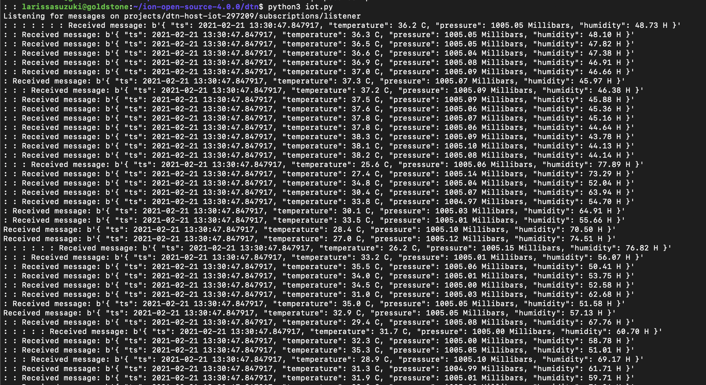
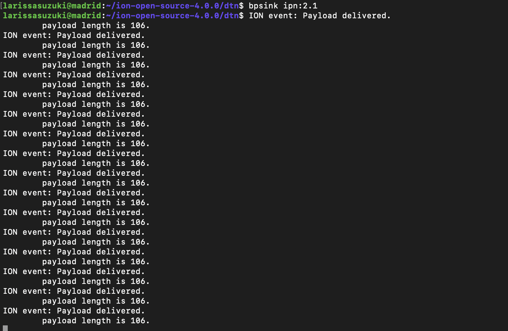

# Telemetry Data on Cloud Vms using Pub/Sub and DTN
This project has been developed by Dr Lara Suzuki, a visiting Researcher at NASA JPL.

In this tutorial we will demonstrate how to connect a Raspberry Pi and Sensor Hat onto Google Cloud using cloud Pub/Sub on `host 1` and serving the messages over DTN to `host 2`. This tutorial follows the [Running DTN on Google Cloud using a Two-Node Ring] tutorial and uses the configurations of `host 1` and `host 2` as described in the tutorial.

# Setting up Raspbberry Pi and the Sense Hat
In this tutorial we use **Raspberry Pi 4 model B (2018)** and **Sense Hat Version 1.0**. 

The first step is to be sure your Pi can connect to the Internet. You can either plug in an ethernet cable, or if you’re using WiFi, scan for networks your Pi can see. Plug your Pi in a monitor, and when it starts, at the top right corner you can find the wifi logo. Select the network you want to connect to. Once that is connected open your browser to check whether you can access the Internet.

## Library dependency setup
The first thing to do is to make sure that the places where Raspberry Pi will be getting its libraries from is current. For this, on your Pi's terminal, run the following command:
````
$ sudo apt-get update
````
The next step is to securely connect to a Pub Sub service running locally or on a cloud provider service. For this we will use JWT to handle authentication (library `pyjwt`). The meta-model for communication  used on the cloud Pub/Sub is based on publish/subscribe messaging technology provided by the **MQTT (MQ Telemetry Transport) protocol** (library paho-mqtt). MQTT is a topic-based publish/subscribe communications protocol that is designed to be open, simple, lightweight, easy-to-implement, and  efficient in terms of processor, memory, and network resources.   

On your Pi's terminal run the following commands
````
$ sudo apt-get install build-essential
$ sudo apt-get install libssl-dev
$ sudo apt-get install python-dev
$ sudo apt-get install libffi-dev
$ sudo pip install paho-mqtt
````
For encryption, run the install the `pyjwt` library and its dependency, the `cryptography` library .
````
$ sudo pip install pyjwt
$ sudo pip install cryptography
````
For telemetry data we are using Sense Hat. Sense Hat is composed by telemetry sensors such as temperature, accelerometer, humidity and pressure. To install the library for Sense Hat, run the command:
````
$ sudo apt get install sense-hat
````
## SSL Certificate - RSA with X509 wrapper
In order to authenticate in Google Cloud IoT Core, we need a SSL certificate. We will create an RSA with X509 wrapper. For this, execute the following command on your Pi's terminal:

````
$ openssl req -x509 -newkey rsa:2048 -keyout sensing_private.pem -nodes -out demo.pub -subj “/CN=unused”
````

# Setting up a Pub/Sub servide on Cloud 

Once your Raspberry Pi is fully set up, follow the instructions of your Cloud provider to create a Registry of your new Pub/Sub service. For your Pub/Sub 'topic', create a topic named: `sensing`

To connect your device on your cloud provider, you will likely to need to use an authentication method. In our case we use authentication using a Public Key in the format `RS256_X509`. 

To copy the content of your Pi's public key, on the Pi's terminal run:
````
$ cat demo.pub
````

Copy everything, including the tages, between 
````
-----BEGIN PUBLIC KEY-----
-----END PUBLIC KEY-----
````
and paste it in the `Public Key Value` textbox.

## Create a Subscription to listen to the Pub/Sub Topic

On your cloud provide  Console, create a 'Subscription' to listen to the topic `sensing` we created in the previous steps. Now you should have all the pieces needed to send telemetry data from your Pi to a Pub/Sub service on a VM instance running on the cloud!

# Send telemetry data from Raspberry Pi to Linux VM on the Cloud

The code on this repository named `sense.py` is based on the implementation of [GabeWeiss](https://github.com/GabeWeiss/GCP_Quick_Starts). 

In the code, edit the following fields:

```python
ssl_private_key_filepath = '/home/pi/sensing_private.pem'
ssl_algorithm = 'RS256'
root_cert_filepath = '/home/pi/roots.pem'
project_id = 'if you have to use a project ID identifier in your cloud service'
registry_id = 'name of your registry'
device_id = 'name of your device'
```
Once you have configured the above parameters in the file sense.py, on your Raspberry Pi run the command:
````
$ python3 sense.py
````
# Send telemetry data to from host 1 to host 2 via DTN

Log into the VM `host 1`. In the VM go to the base directory of ION and create a folder named `dtn`
````
$ mkdir dtn
````
CD into dtn directory, and clone the file named `iot.py`. In this file configure the following parameters:
```python
subscription_path = subscriber.subscription_path(
  'ID_OF_YOUR_CLOUD_PROJECT', 'ID_OF_YOUR_SUBSCRIPTION')
```
And add `host 2` as the receiver of the telemetry data:
```python
os.system(f'echo "{value}" | bpsource ipn:2.1')
```
On the terminal of `host 1` and `host 2`, start ion:
````
$ ionstart -I hostX.rc #where X is the number of the host
````
On the terminal of `host 2`, start `bpsink`
````
$ bpsink ipn:2.1 &
````
On the terminal of `host 1`, start `iot.py`
````
$ python3 iot.py
````
On the terminal of `host 1` you should see the print out of the telemetry data received as below:




On the terminal of `host 2` you should see the payloads delivered. Please note that messages beyond 80 characters are not shown on `bpsink`:



