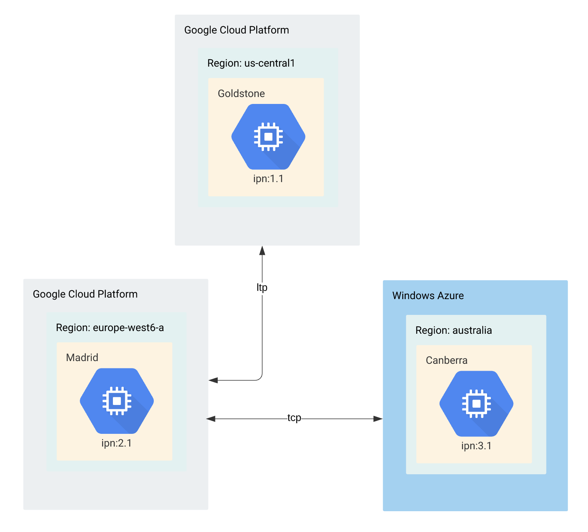
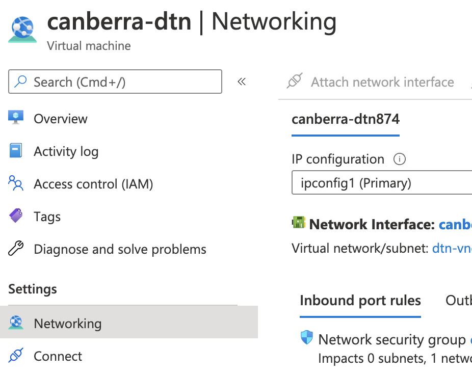

# Three-Node Network communication via DTN on Google Cloud Platform and Windows Azure

This project has been developed by Dr Lara Suzuki, a Visiting Researcher at NASA JPL.

# Introduction
This is the third tutorial on a series of DTN on Google Cloud tutorials. In this tutorial we will introduce you to Windows Azure, and how to configure a 3-node network using ION. The figure below shows the network we will be building. Note that this example network uses two different convergence layers: TCP and LTP. This can illustrates the case of a terrestrial connection with two interplanetary internet nodes.




# Getting Started on Windows Azure
Sign up for a free account on [Windows Azure](http://www.azure.microsoft.com). Once your free account is set up, log into the [Azure Portal](https://portal.azure.com/). Under `Azure Services`, click `Virtual Machines`. In the Virtual Machines window, click `Add` and follow the steps below.
1. Click `Add` then `Virtual Machine`
2. Subscription `free trial`
3. In `Resource Group` select `Create New` and name it `dtn`
4. In `Virtual Machine name` give it a name. In our example it is named `Canberra`
5. In Region select the region closest to you or of your choice. In our example it is `Australia Central`
6. In `Image` select `Debian 10 "Buster" Gen 1`
7. `Size` leave it as `Standard`
8. Under `Administrator Account` select either the use of SSH public key or Password
9. For `Select inbound ports` leave SSH(22)
10. Click `Review and Create`, then click `Create`

To get ION working you must enable the inbound traffic to port 1113 and port 4556 - IANA assigned default DTN TCP port. To enable inbound traffic in those ports, at the top right of your window, hit `Home`, then `Virtual Machines`. Click on the Virtual Machine you have just created. On the new loaded page, under `Settings` click `Networking` as shown in the image below. 




On the networking page, click `Add inbound port rule`. Select Source as `Any`, on `Source port ranges` add the port numbers you want to allow inbound traffic, select the Protocol, the Action (Allow), and add a high `Priority` (e.g. 380). Give it a name and hit `Add`. You now can execute ION and the induct and outducts will work.

# Three-Node Network

In this section, we assume that `host 3` has an IP address of `10.0.0.3`. Please modify this for your uses. Please note that in this tutorial we are not covering routing, therefore, `host2` cannot communicate with `host3`. The routing tutorial can be found here.

This network is created by running the following command on `host 1`
````
ionstart -I host1.rc
````
This command is run on `host 2`:
````
ionstart -I host2.rc
````
Finally, this command is run on `host 3`
````
ionstart -I host3.rc
````

# The host3.rc configuration file - TCP
For the configuration files `host 1` and `host 2`, follow the examples given in the tutorial [Running DTN on Google Cloud using a Two-Node Ring](../dtn-gcp-2nodes/ION-Two-Node-on-Cloud-Linux-VMs.md)

. Remember to add `contact`, `range`, `span`, `outduct` and a `plan` for `host 3`. Below is the configuration file `host3.rc`.

The `ionadmin` configuration uses tcp from `host 2` to `host 3`
````
## begin ionadmin 
# ionrc configuration file for host3 in a 3node tcp/ltp test.
# This uses tcp from 1 to 3.
# 
# Initialization command (command 1). 
# Set this node to be node 3 (as in ipn:3).
# Use default sdr configuration (empty configuration file name '').
1 3 ''
# start ion node
s
# Add a contact.
# It will start at +1 seconds from now, ending +3600 seconds from now.
# It will connect node 3 to itself
# It will transmit 100000 bytes/second.
a contact +1 +3600 3 3 100000

# Add more contacts.
# They will connect 2 to 3, 3 to 2, and 3 to itself
# Note that contacts are unidirectional, so order matters.
a contact +1 +3600 3 2 100000
a contact +1 +3600 2 3 100000
a contact +1 +3600 2 2 100000

# Add a range. This is the physical distance between nodes.
a range +1 +3600 3 3 1

# Add more ranges.
a range +1 +3600 2 2 1
a range +1 +3600 2 3 1

# set this node to consume and produce a mean of 1000000 bytes/second.
m production 1000000
m consumption 1000000
## end ionadmin 
````

The `bpadmin` configuration uses adds the endpoints and the protocol `tcp`. In the protocol section, it estimates transmission capacity assuming 1400 bytes of each frame (in this case, tcp on ethernet) for payload, and 100 bytes for overhead. The induct and outduct will listen on `port 4556`, the IANA assigned default DTN TCP convergence layer port. The induct itself is implemented by the `tcpcli` command and the outduct is implemented by the `tcpclo`
````
## begin bpadmin 
# bprc configuration file for host3 in a 3node test.
# Initialization command (command 1).
1

# Add an EID scheme.
a scheme ipn 'ipnfw' 'ipnadminep'

# Add endpoints.
a endpoint ipn:3.0 q
a endpoint ipn:3.1 q
a endpoint ipn:3.2 q

# Add a protocol. 
# Add the protocol named tcp.
a protocol tcp 1400 100

# Add an induct. (listen)
a induct tcp 10.0.0.3:4556 tcpcli

# Add an outduct (send to yourself).
a outduct tcp 10.0.0.3:4556 tcpclo

# Add an outduct. (send to host2)
a outduct tcp external_ip_of_host_2:4556 tcpclo

# Start bundle protocol engine, also running all of the induct, outduct,
# and administration programs defined above.
s
## end bpadmin 
````

The `ipnadmin` configuration adds the egress plans (to host 3 itself and to host 2) using `tcp`.
````
## begin ipnadmin 
# ipnrc configuration file for host1 in the 3node tcp network.
# Add an egress plan (to yourself).
a plan 2 tcp/10.0.0.3:4556
# Add an egress plan (to the host 2).
a plan 2 tcp/external_IP_of_node_2:4556
## end ipnadmin
````

The `ionsecadmin` configuration enables bundle security
````
## begin ionsecadmin
1
## end ionsecadmin

````
