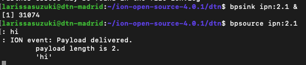

# Testing your connection 

A script has been created which allows a more streamlined configuration and startup of an ION node. This script is called `ionstart`, and it has the following syntax. Don't run it yet; we still have to configure it!

````
ionstart -I <rc filename >
````

- `filename`: This is the name for configuration file which the script will attempt to use for the various configuration commands. The script will perform a sanity check on the file, splitting it into command sections appropriate for each of the administration programs.  
- Configuration information (such as routes, connections, etc) can be specified one of two ways for any of the individual administration programs:

- (Recommended) Creating a configuration file and passing it to ionadmin, bpadmin, ipnadmin, ltpadmin, etc. either directly or via the ionstart helper script.
- Manually typing configuration commands into the terminal for each administration program.

# Loopback communication

Assuming no errors occur with the configuration above, we are now ready to test loopback communications. In one terminal, we have to run the start script alongside the configuration files. 

````
ionstart -i host1.ionrc -l host1.ltprc -b host1.bprc -p host1.ipnrc
````

This command will run the appropriate administration programs, in order, with the appropriate configuration files. Don't worry that the command is lengthy and unwieldly; we will show you how to make a more clean single configuration file later. The image below illustrates the start of the administration programs.


Once the daemon is started, run:

````
bpsink ipn:1.1 &
````

This will begin constantly listening on the Endpoint ID with the endpoint_number 1 on service_number 1, which is used for testing.

Now run the command:

````
bpsource ipn:1.1
```` 

This will begin sending messages you type to the Endpoint ID ipn:1.1, which is currently being listened to by bpsink. Type messages into bpsource, press enter, and see if they are reported by bpsink. In the example below I am using the Endpoint ID ipn:2.1.




# Stopping the Daemon

As the daemon launches many ducts and helper applications, it can be complicated to turn it all off. The script similar to `ionstart` exists called `ionstop`, which tears down the ion node in one step. You can call it like so:

````
ionstop
````
The commands part of the `ionstop` script is shown below.

````
# shell script to stop node
#!/bin/bash
bpadmin         .
sleep 1
ltpadmin        .
sleep 1
ionadmin        .
````

After stopping the daemon, you can start fresh with a brand-new node.  To do that, you first need to run the `killm` script (to destroy all of the persistent state objects in shared memory); after that, you can run your `ionstart` script again, whether with changes or not. Do remember that the `ion.log` file is still present, and will just keep growing as you experiment with ION. You can of course periodically delete entries out of the ion.log file.


# Creating a single configuration file

To create a single file host1.rc out of the various configuration files defined in the previous section, run this command:

````
ionscript -i host1.ionrc -p host1.ipnrc -l host1.ltprc -b host1.bprc -O host1.rc
````

Once you have a single configuration file, starting the ION node is a single command:

````
ionstart -I host1.rc
````

# Loopback testing using LTP
Assuming no errors occur with the configuration files above, we are now ready to test a `Loopback` communication, and also learn how to properly stop the ION node. The single rc file for `host 1` can be found [here](./host1.rc).

The execution of the host should be performed using the command

````
$ ionstart -I host1.rc
````

The image below illustrates the loopback communication using `bpsink` and `bpsource`.


To stop ION in the VM instance, use the command 

```
$ ionstop. 
```

